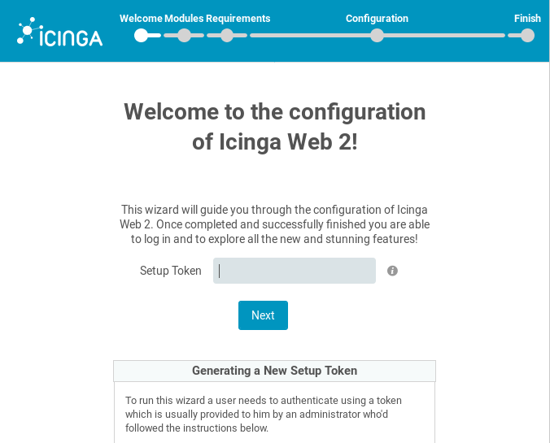
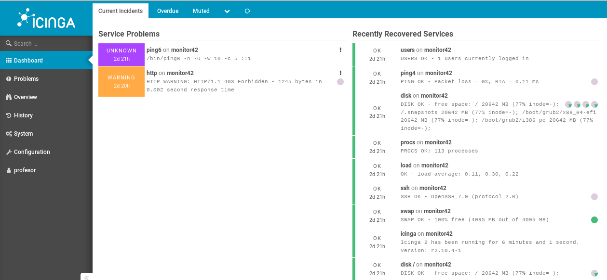

```
Curso           : 201920, 201819
Area            : Sistemas Operativos , redes, Hardware(CPD), seguridad
                  monitorización software/hardware/redes.
Descripción     : Monitorización de red con la herramienta Icinga2
Requisitos      : GNU/Linux y Windows
Tiempo estimado : 8 horas
```

---
# Icinga2 : OpenSUSE + Windows

Propuesta de rúbrica:

| ID | Criterio | Bien(2) | Regular(1) | Poco adecuado(0) |
| -- | -------- | ------- | ---------- | ---------------- |
| 01 | Abrir IcingaWeb2 en el navegador ||||
| 02 | IcingaWeb2 -> Overview -> Hosts ||||
| 03 | IcingaWeb2 -> Overview -> Services ||||
| 04 | Contenido de los ficheros de configuración |||.|

---
# 1. Preparativos

## 1.1 Preparar las máquinas

Para esta actividad vamos a necesitar los siguientes MV's:

| ID  | Hostname  | IP           | SSOO |
| --- | --------- | ------------ | ---- |
| MV1 | monitorXX | 172.AA.XX.31 |[OpenSUSE](../../global/configuracion/opensuse.md)|
| MV2 | clientXXg | 172.AA.XX.32 |[OpenSUSE](../../global/configuracion/opensuse.md)|
| MV3 | clientXXw | 172.AA.XX.11 |[Windows](../../global/configuracion/windows.md)|

Supongamos que tenemos el siguiente esquema de red:


## 1.2 Configurar DNS local

* Incluir en el `/etc/hosts` todas las máquinas de la práctica.
* Incluir en el fichero `c:\Windows\System32\drivers\etc\hosts` todas las máquinas de la práctica.

## 1.3 Script de instalación

A fecha de 2-4-2020 se ha creado un script de instalación para automatizar los pasos:
2.X, 3.1, 3.2, 3.3, 3.5 y 3.6. Por tanto, si se utiliza el script. Después de ejecutarlo podemos saltar directamente al paso 3.7.

* Descargar los siguientes ficheros en `/root` de la máquina monitor.
    1. Script de instalación: [icinga-instalar.sh](files/icinga-instalar.sh)
    1. Fichero SQL: [icinga-crear-bd.sql](files/icinga-crear-bd.sql)
* `cd /root`
* `chmod +x icinga-instalar.sh`, dar permisos de ejecución al fichero.
* `./icinga-instalar.sh`, ejecutar el script.
* Esperar a que termine el script.

---
# 2. Monitor: Instalación

> Enlaces de interés:
> * EN - [Getting Started](https://icinga.com/docs/icinga2/latest/doc/02-getting-started/)
> * EN - [Install IcingaWeb2](https://www.2daygeek.com/install-icinga-web2-on-centos-rhel-fedora-opensuse-ubuntu-debian-mint/)
> * ES - Vídeo sobre [Instalar Icinga2 e IcingaWeb2 en Centos 7](https://youtu.be/eVFqyFJN9nk)
> * ES - [Monitorizar sistemas y redes con Icinga2](https://www.ochobitshacenunbyte.com/2015/10/30/monitoriza-sistemas-redes-icinga2/)

## 2.1 Instalar el software principal

Instalar software:
* `zypper install icinga2 monitoring-plugins`, instalar Icinga2 y los plugins para monitorizar.
* `systemctl enable icinga2`, activar el servicio al iniciar la máquina.
* `systemctl start icinga2`, iniciar el servicio.

> Comprobar el servicio:
> * `systemctl status icinga2`, ver el estado actual del servicio.

## 2.2 Configurar los editores

Configurar el editor nano para faciliar el su uso con icinga2:
* Abrir sesión con el usuario root.
* `zypper install nano-icinga2`
* `nano ~/.nanorc`, crear este archivo de configuración de nano, para incluir lo siguiente:
```
## Icinga 2
include "/usr/share/nano/icinga2.nanorc"
```

> Comprobamos: `nano /etc/icinga2/conf.d/templates.conf`

## 2.3 INFO: Rutas de la instalación

Por defecto Icinga2 usa los siguientes ficheros y directorios:

| Path	                 | Descripción                            |
| ---------------------- | -------------------------------------- |
| /etc/icinga2           | Contiene los ficheros de configuración |
| /usr/sbin/icinga2	     | Shell wrapper for the Icinga 2 binary |
| /var/log/icinga2       | Ficheros de log |

---
# 3 Instalar el panel web

No es estrictamente necesario tener un panel web para monitorizar los equipos de la red, pero entendemos que visualmente es más cómodo tenerlo, así que seguimos.

## 3.1 Base de datos

Podemos elegir entre la base de datos MySQL o PosgreSQL. En nuestro caso, elegimos MySQL (por ser la misma que se usa ya en BBDD).

**Instalar y configurar MySQL**

* `zypper install mysql mysql-client icinga2-ido-mysql`, instalación de MySQL y el módulo que comunicará icinga2 con mysql.
* `systemctl enable mysql`, activar servicio al iniciar la máquina.
* `systemctl start mysql`, iniciar el servicio.
* Creamos la base de datos y el usuario. NOTA: El usuario root de mysql NO tiene clave:

```
# mysql -u root -p

CREATE DATABASE icinga;
GRANT SELECT, INSERT, UPDATE, DELETE, DROP, CREATE VIEW, INDEX, EXECUTE ON icinga.* TO 'icinga'@'localhost' IDENTIFIED BY 'icinga';
quit
```

* `mysql -u root -p icinga < /usr/share/icinga2-ido-mysql/schema/mysql.sql`. Este script SQL crea todas las tablas necesarias en la BBDD. Sólo se muestrarán mensajes si hay problemas.

**Activar el módulo IDO MySQL**

* `icinga2 featur´e enable ido-mysql`, habilitamos la característica "ido-mysql".
* `systemctl restart icinga2`, reiniciamos el servicio.

> Comprobamos `icinga2 feature list`.

## 3.2 Servidor Web

Podríamos usar como servidor web: Apache2 o Nginx. En nuestro ejemplo elegimos Apache2.

* `zypper in apache2`, instalar Apache.
* `a2enmod rewrite`, activar módulo "rewrite" de Apache.
* `a2enmod php7`, activar módulo "php7" de Apache.
* `systemctl enable apache2`, activamos Apache al iniciar la máquina.
* `systemctl start apache2`, iniciar servicio.

> Comprobamos el estado del servicio: `systemctl status apache2`,

## 3.3 Cortafuegos

El cortafuegos filtra las comunicaciones entrantes y salientes, así que debemos configurarlo también. Vamos a permitir el puerto 80 (http) en las reglas del cortafuegos.

* Abrir el puerto http(80) en el cortafuegos:
    * `firewall-cmd --add-service=http`
    * `firewall-cmd --permanent --add-service=http`

> Las buenas prácticas aconsejan permitir únicamente el puerto 443 (https) y usar certificados TLS. Pero tendríamos que usar certificados. De momento vamos a seguir la práctica usando el puerto 80 (http).
>
> También podemos usar Yast para abrir los puertos en el cortafuegos: `Yast -> Cortafuegos -> Abrir servicio http(80) y https(443)`.

* `nmap -Pn localhost`, comprobar que el puerto 80(http) está abierto.
```
PORT     STATE SERVICE
22/tcp   open  ssh
80/tcp   open  http
3306/tcp open  mysql
```

> Recordar que los siguientes servicios ya deben estar en ejecución: icinga2, mysql, apache2 y firewalld.

## 3.4 Configurar API REST de Icinga 2

Icinga Web 2 y otras interfaces Web requieren API REST para enviar acciones y consultar el detalle de los objetos.

* `icinga2 api setup`, para habilitar la característica API.
* `systemctl restart icinga2`, reiniciar el servicio para activar los cambios.

## 3.5 Instalar icingaweb2

* `zypper install icingaweb2`, para instalar el software IcingaWeb2 y sus dependencias (Como por ejemplo php7).
* `zypper install php7-imagick php7-curl`, Instalar varios paquetes PHP que nos harán faltan.

## 3.6 Preparando la configuración Web.
´
* `icingacli module enable setup`, activar el módulo setup. Comprobamos `icingacli module list`.
* `icingacli setup token create`, para generar un "token" para "icingacli". Usaremos el "token" cuando usemos la configuración Web y se nos requiera autenticación. **IMPORTANTE: Apuntar este token** para usarlo más adelante.
* `chgrp icingaweb2 -R /etc/icingaweb2/`, nos aseguramos de que el grupo "icingaweb2" tiene acceso a todos los ficheros de configuración.
* `chmod 770 /etc/icingaweb2/enabledModules`, el grupo icingaweb2 requiere acceso de escritura en dicha carpeta para poder habilitar módulos.
* `systemctl restart apache2`

## 3.7 Usar navegador para acceder a Icingaweb2

> Si hemos usado el script de instalación del punto 1.3, entonces podemos continuar la práctica desde este punto.

Vamos a configurar IcingaWeb2 por el navegador.
* Abrimos un navegador y ponemos el URL `http://localhost/icingaweb2/`. Se nos muestra la ventana de autenticación del panel web de la herramienta.



* Ponemos el token de autenticación y siguiente.
    * Si hemos ejecutado el script de instalación del punto 1.3, entonces consultar el token con `cat /root/icinga-token.txt`.
    * Si hemos hecho el proceso manualmente, entonces tenemos el token apuntado de apartados anteriores.
    * Si no recordamos el "token", lo podemos consultar con el siguiente comando, `icingacli setup token show`.

Estamos en la ventana "Modules".
* Nos aseguramos de tener `Monitoring` en `ENABLE`. Siguiente.

Estamos en la ventana **Requirements**.
* Se nos muestra una lista de los paquetes PHP que son necesarios para continuar. Los paquetes en verde significan que están bien. Los paquetes en amarillo indican que se recomienda su instalación.

> Si por ejemplo, nos aparece en amarillo el mensaje "The PHP module Imagick is missing", entonces:
> * Instalamos el paquete que faltan `zypper install php7-imagick`.
> * Reiniciamos el servidor web Apache2. Consultar la página web y refrescar (F5).
> * Ahora deben aparecer los módulos en verde. Eso indica que están correctamente instalados. Seguimos.

Ventanas de **Configuration**:

* Estamos en la ventana de **Configuration / Autentificación**. Elegimos `Database` y siguiente.
* Estamos en la ventana de **Configuration / Database Resource**. Completamos el formulario con los siguientes valores:

| Campo         | Valor        |
| ------------- | ------------ |
| Resource name | icingaweb_db |
| Database type | MySQL        |
| Host          | localhost    |
| Database name | icingaweb2   |
| Username      | profesor     |
| Password      | profesor     |

* Validar y siguiente.
* Estamos en la ventana **Configuration / Database setup**. Ahora se nos pide un usuario/clave con privilegios para crear la base de datos y usuario en la Base de datos MySQL. Esto es, usaremos el usuario `root` de MySQL sin clave que ya teníamos del apartado 3.1.
* Estamos en la ventana **Configuration / Authentication backend**. Dejamos Backend name = `icingaweb2`, y siguiente.
* Estamos en la ventana **Configuration / Administration**. En este punto vamos a crear usuario para usar icingaweb2. Por ejemplo usuario `profesor` con clave `profesor`.
* Estamos en la ventana **Configuration / Application configuration**. Dejamos los valores como están y siguiente.
* Vemos un resumen y siguiente.
* Estamos en la ventana **Configuration / Module** y siguiente.

Ventanas de Monitorig:
* Estamos en la ventana **Monitoring backend** y siguiente.
* Estamos en la ventana **Monitoring IDO resource**. Añadimos los siguientes valores al formulario:
    * BBDD: icinga
    * Usuario: icinga
    * Clave: icinga
* Validamos la configuración. Y si es correcta seguimos.
* Estamos en la ventana **Command transport**. Ponemos los siguientes valores:
    * Host = `localhost`
    * API Username = `root`
    * Consultar el contenido del fichero `/etc/icinga2/conf.d/api-users.conf`, para poder completar el valor de API Password.
* Estamos en la ventana **Monitoring security** y siguiente.

Fin del proceso:
* Ventana de resumen y fin.
* Estamos en la ventana **Congratulations! Icinga Web 2 has been successfully set up**.
* Vamos a "login" para entrar, y veremos la imagen siguiente:


* El usuario/clave para entrar es `profesor/profesor`.



Por defecto, nos aparecen unas primeros datos de monitorización, correspondientes a nuestro equipo local. Pero en los siguiente apartados vamos a ampliarla los dispositivos a monitorizar.

---
# 4. Configurar objetos para monitorizar

Nos vamos a plantear como objetivo monitorizar los siguientes Hosts:

| Grupo   | Hosts     | IP           | Comprobar           |
| ------- | --------- | ------------ | ------------------- |
| routers | benderXX  | 172.AA.0.1   | Host activo         |
| routers | caronteXX | 192.168.1.1  | Host activo         |
| servers | leelaXX   | 172.20.1.2   | Servicio HTTP y SSH |
| clients | clientXXg | 172.AA.XX.32 | Host activo         |
| clients | clientXXw | 172.AA.XX.11 | Host activo         |

* Abrir sesión como usuario `root`.

> A partir de ahora ALUMNODIR = `/etc/icinga2/conf.d/nombre-del-alumno.d`.

* Crear directorio ALUMNODIR. Este directorio nos servirá para guardar nuestros ficheros de configuración.
* Asegurarse de que el usuario `icinga` tiene permisos sobre dicha carpeta.

## 4.1 Configurar HOST servidores

* Abrir sesión como usuario `root`.
* Crear fichero `ALUMNODIR/servers.conf`.

```
object Host "leelaXX" {
  address = "172.20.1.2"
  vars.os = "Linux"
  check_command = "hostalive"
}

object Service "http_leela" {
  host_name = "leelaXX"
  check_command = "http"
}
```

> Nos fijarmos los parámetros anteriores (preguntar las dudas):
> * Host: Nombre del host
> * address: Dirección IP del host
> * vars.os: Sistema Operativo
> * check_command: Comando usado para verificar el host (hostalive = ping, http = comprueba el servicio web)
>
> Por ejemplo probar los siguientes comandos (plugins):
> * `/usr/lib/nagios/plugins/check_host IP`
> * `/usr/lib/nagios/plugins/check_http IP`

**Comprobamos los cambios.** Vamos a comprobar que vamos por el buen camino haciendo lo siguiente:
* Guardar el archivo de configuración.
* `systemctl restart icinga2`, reiniciar Icinga2 para que coja los nuevos cambios.  

> **Si aparecen mensajes de error**, entonces es que hemos escrito algo mal en la configuración anterior. Volver a revisarlo bien. Les recuerdo que hemos configurado el editor "nano" para que nos ayude a colorear la sintaxis y poder detectar más facilmente los fallos en la escritura.

* Cuando lo anterior esté correcto hacemos `systemctl restart apache2` para reiniciar el servidor web. Vamos al navegador y entramos a IcingaWeb2 para ver los cambios que hemos añadido.
* Cuando todo esté correcto... seguimos al siguiente punto.

## 4.2 Configurar HOSTS routers

* Crear fichero `ALUMNODIR/routers.conf`.

```
object Host "benderXX" {
  address = "ip-del-host"
  check_command = "hostalive"
}

object Host "caronteXX" {
  address = "ip-del-host"
  check_command = "hostalive"
}
```

* Comprobamos: `systemctl restart icinga2`. Si hay errores debemos revisar el fichero que acabamos de crear.

## 4.3 Configurar HOSTS clientes

* Crear fichero `ALUMNODIR/clients-gnulinux.conf`. Este fichero lo usaremos para configurar las máquinas con GNU/Linux.

```
object Host "clientXXg" {
  address = "ip-del-host"
  vars.os = "Linux"
  check_command = "hostalive"
}

object Service "ssh_clientXXg" {
  host_name = "clientXXg"
  check_command = "ssh"
}
```

* Crear fichero `ALUMNODIR/clients-windows.conf`. Este fichero lo usaremos para configurar las máquinas con Windows.

```
object Host "clientXXw" {
  address = "ip-del-host"
  vars.os = "Windows"
  check_command = "hostalive"
}

object Service "ssh_clientXXw" {
  host_name = "clientXXw"
  check_command = "ssh"
}
```

* Crear fichero `ALUMNODIR/clients-dummy.conf`. Este fichero lo usaremos para configurar unas máquinas "virtuales" que no existen en la realidad. Una de ellas siempre dará buenos resultados("up") y la otra siempre dará malos resultados ("down"). Estas másquina "dummy" sirven sólo para hacer pruebas.

```
object Host "dummyXXup" {
  check_command = "dummy"
  vars.dummy_state = 0 //Up
  vars.dummy_text = "Everything OK."
}

object Host "dummyXXdown" {
  check_command = "dummy"
  vars.dummy_state = 2 //Down
  vars.dummy_text = "Down and critical!!!"
}
```

> **¡OJO!**: Asegurarse de que el usuario `icinga` es el propietario de los archivos que acabamos de crear en la ruta ALUMNODIR. Si no tiene permisos de lectura sobre dichas configuraciones, éstas no tendrán efecto.

* `systemctl restart icinga2`, reiniciar el servicio para forzar la lectura de los nuevos ficheros de configuración. En caso de error:
    * Revisar los últimos cambios realizados.
    * Consultar log `/var/log/icinga2.log`.
* Comprobar los cambios por IcingaWeb2.

---
# 5. Agent-based monitoring (cliente GNU/Linux)

> Enlaces de interés:
> * https://stackoverflow.com/questions/42167778/icinga2-disk-space-check-or-with-three-arguments
> * https://icinga.com/docs/icinga2/latest/doc/03-monitoring-basics/

Por ahora el monitor, sólo puede obtener la información que los equipos dejan ver desde el exterior. Cuando queremos obtener información del interior de los Hosts,  tenemos que acceder dentro de la máquina remota. En nuestro caso, usaremos SSH para acceder a esta información interna de la máquina: Consumo CPU, consumo de memoria, consumo de disco, etc.

## 5.1 INFO: Teoría sobre agentes SSH de Icinga

Podemos usar varios protocolos de comunicación diferente con el nodo (Agente). En nuestro caso vamos a usar el protocolo SSH.

Calling a plugin using the SSH protocol to execute a plugin on the remote server fetching its return code and output. The by_ssh command object is part of the built-in templates and requires the check_by_ssh check plugin which is available in the Monitoring Plugins package.

> En el directorio `/usr/lib/nagios/plugins/`, tenemos muchos "check commands" para usar.
>
> Por ejemplo probar lo siguiente:
> * `/usr/lib/nagios/plugins/check_ssh IP`

## 5.2 Cliente GNULinux

* Crear fichero `ALUMNODIR/agents-gnulinux.conf` para incluir monitorización del disco duro de la siguiente forma:
* Primero vamos a definir un nuevo comando llamado `by_ssh_disk`:

```
object CheckCommand "by_ssh_disk" {
  import "by_ssh"
  vars.by_ssh_command = "/usr/lib/nagios/plugins/check_disk -W $by_ssh_disk_warn$"
  vars.by_ssh_disk_warn = "75%"
}
```

* Luego seguimos creando un servicio `disk_clientXXg` que usa el comando anterior para monitorizar el disco del cliente:

```
object Service "disk_clientXXg" {
  import "generic-service"
  host_name = "clientXXg"
  check_command = "by_ssh_disk"
  vars.by_ssh_username = "root"
  vars.by_ssh_password = "CLAVE-DE-ROOT"
}
```

> **Recordar**:
> * Sustituir CLAVE-DE-ROOT, por el password del usuario root.
> * Es necesario tener el servicio SSH funcionando en la máquina que se quiere monitorizar.

* Consultar el estado del servicio en `IcingaWeb2 -> Overview -> Services`. Podemos esperar a que pasen los segundos (timeout) y salte la comprobación automática, o bien podemos pulsar en `Check now` para forzar la comprobación de forma manual.
* Si tenemos un error de permisos en la carpeta `/var/run/icinga2/cmd`, podemos cambiar los permisos `chmod 777 /var/run/icinga2/cmd`, para eludir el problema de acceso denegado (Esta es una solución temporal).

## 5.3 Cliente Window (Apartado OPCIONAL)

* Modificar fichero `ALUMNODIR/agents-windows.conf` para incluir monitorización del disco duro del cliente Windows.

---
# ANEXO A

## A.1 Configurar el editor vi para Icinga2

* `icinga2 feature list`, verificar las características habilitadas o deshabilitadas.

Configurar el editor vim (con usuario root):
* `zypper install vim-icinga2`
* `vim ~/.vimrc`
* `syntax on` (ESC : wq)
* Comprobarlo: `vim /etc/icinga2/conf.d/templates.conf` (ESC : q)

---
## A.2 INFO backup Icinga2

Ensure to include the following in your backups:
* Configuration files in /etc/icinga2
* Certificate files in /var/lib/icinga2/ca (Master CA key pair) and /var/lib/icinga2/certs (node certificates)
* Runtime files in /var/lib/icinga2
* Optional: IDO database backup
* Backup: Database

---
## A.3 Problema con la versión de PHP

Hemos comprobado que la versión actual de IcingaWeb2 no funciona correctamente con php7.2.5.

**SOLUCIÓN A**

Solución propuesta por Aarón Rodríguez Pérez. Esto es, cambiar la versión de "php7.2.5" por "php7.1.27". Foro: https://forums.opensuse.org/showthread.php/530164-php7-is-only-available-whith-version-7-2-and-i-don-t-find-way-to-install-7-1-version

Proceso para instalar la versión php7.1.27.
* `zypper ar http://download.opensuse.org/repositories/devel:/languages:/php:/php71/openSUSE_Leap_15.0/ devel:languages:php:php71`
* `zypper install --oldpackage php7-7.1.27`
* Si hay errores instalar php-Icinga
* Reiniciar la máquina.
* Comprobamos el cambio de versión `php -v`.

**SOLUCIÓN B**

Otra forma de cambiar la versión de PHP es cambiando los paquetes rpm:
* Primero los descargamos y luego lo instalamos con `rpm -i PACKAGENAME.rpm`
* Enlace de interés para cambiar paquetes de php7.2.5 a php7.1.27 (https://software.opensuse.org/package/php7). Buscar `php7-7.1.27-lp150.1.1.x86_64.rpm`.
* Reiniciamos el equipo.
* Comprobamos el cambio de versión `php -v`.

---
# A.4 Problemas con los paquetes PHP 7.1.27
Debemos instalar los paquetes que faltan (paquetes en color amarillo).     Para [descargar paquetes PHP versión 7.1.27](https://software.opensuse.org/package/php7) o también se pondrán en el Moodle para descargar:
    * Ejemplo para localizar los nombres de los paquetes: `zypper se php |grep ldap` => `php7-ldap`
    * En nuestro caso necesitaremos los siguientes:
        * php7-curl-7.1.27-lp150.1.1.x86_64.rpm
        * php7-ldap-7.1.27-lp150.1.1.x86_64.rpm
        * php7-mysql-7.1.27-lp150.1.1.x86_64.rpm
        * php7-pgsql-7.1.27-lp150.1.1.x86_64.rpm
        * ERROR: No hemos podido instalar `php-imagick` para php 7.1.27 en OpenSUSE Leap 15.0. Para nuestra práctica no es necesario y podemos seguir.

---
# A.5 Problemas con ApiUser

API User/API Password: Poner lo que tenemos en `/etc/icinga2/conf.d/api-users.conf` como ApiUser object.

> **NOTA**
>
> Si en la fase final del proceso de configuración de IcingaWeb2, aparece un error al habilitar Módulos por falta de permisos, entonces es necesario revisar los permisos que tiene la carpeta `/etc/icingaweb2/enableModules` para el usuario `wwwrun` (Este es el usuario que utiliza el servidor Web Apache2 en OpenSUSE).
>
> * `chown -R wwwrun:icingaweb2 /etc/icingaweb2/enabledModules`
