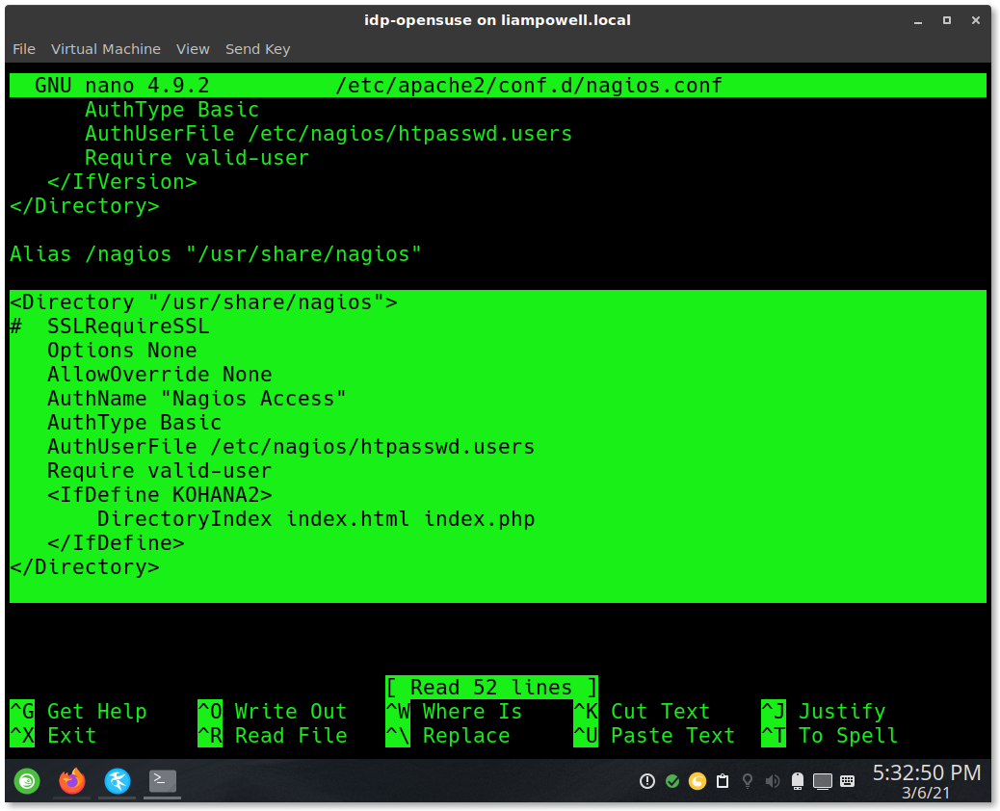
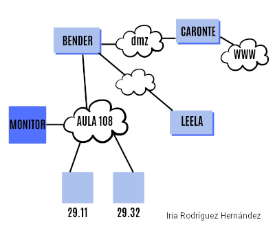
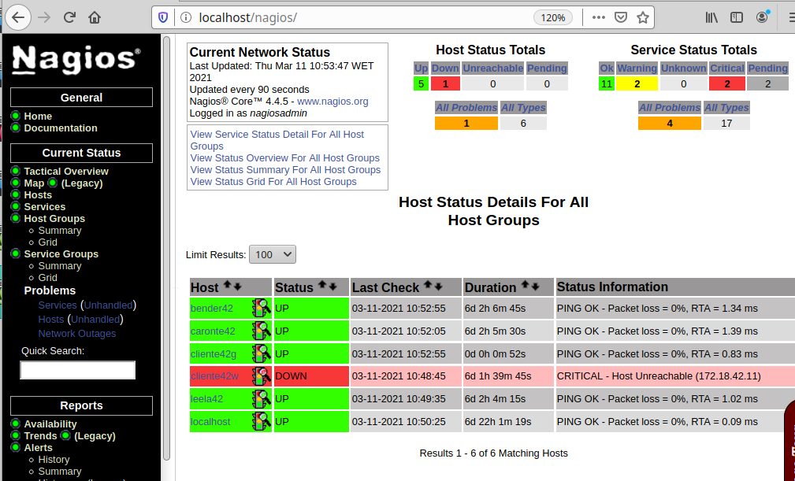
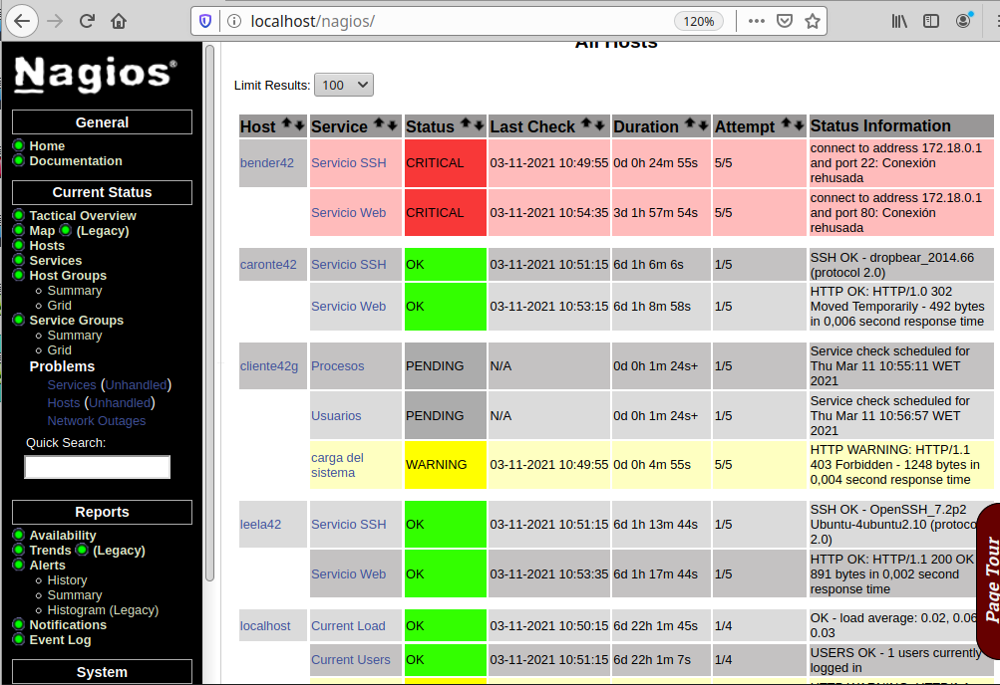

```
Curso           : 202021
Area            : Sistemas Operativos , redes, Hardware(CPD), seguridad
                  monitorización software/hardware/redes.
Descripción     : Monitorización de red con la herramienta Nagios
Requisitos      : GNU/Linux y Windows
Tiempo estimado : 8 horas
```

# 1. Preparativos

## 1.1 Preparar las máquinas

## 1.1 Preparar las máquinas

Para esta actividad vamos a necesitar los siguientes MV's:

| ID  | Hostname  | IP           | SSOO |
| --- | --------- | ------------ | ---- |
| MV1 | monitorXX | 172.AA.XX.31 |[OpenSUSE](../../global/configuracion/opensuse.md)|
| MV2 | clientXXg | 172.AA.XX.32 |[OpenSUSE](../../global/configuracion/opensuse.md)|
| MV3 | clientXXw | 172.AA.XX.11 |[Windows](../../global/configuracion/windows.md)|

# 2. Instalar el monitorizador Nagios

* Instalar Apache2:
    * `zypper in apache2`
    * `systemctl start apache2`
    * `systemctl enable apache2`
* `zypper install nagios monitoring-plugins-nagios perl-Nagios-Plugin`
* `htpasswd -c /etc/nagios/htpasswd.users nagiosadmin`, crear usuario/clave para acceder a Nagios.
    * Usuario: nagiosadmin
    * Clave: Constraseña del usuario
* `systemctl status nagios`, comprobar que el servicio Nagios está en ejecución.
* `systemctl start nagios`, iniciar e servicio Nagios.
* `systemctl enable nagios`, iniciar Nagios automáticamente al iniciar el sistema.
* Abrimos un navegador y ponemos el URL `http://localhost/nagios`.
* Ponemos el usuario/clave, y ya podemos interactuar con el programa de monitorización.
* Si vamos a las opciones del menú izquierdo *"Hosts"* y *"Services"*, podemos comporbar que ya estamos monitorizando nuestro propio equipo *"localhost"*.

## OJO: En caso de Error "Access Forbidden"

En caso de que nos haya dado Access Forbidden - error 403 (acceso denegado) hacemos lo siguiente:

* Instalamos el paquete kohana2 con este comando (requiere permisos de administrador):

```
su -c "zypper addrepo https://download.opensuse.org/repositories/server:monitoring/openSUSE_Leap_15.2/server:monitoring.repo; zypper refresh; zypper install kohana2"
```

* Editamos el archivo "/etc/apache2/conf.d/nagios.conf" y buscamos las líneas <Directory "/usr/share/nagios"> y </Directory>, una vez encontradas, modificamos el contenido entre éstas para que quede así:



* Nos aseguramos de que Nagios y Apache2 estén activados y el módulo PHP esté activo: `su -c "chkconfig nagios on; chkconfig apache2 on; a2enmod php7"`
* `systemctl restart apache2`

# 3. Configurar el monitorizador

Nos vamos a plantear como objetivo configurar Nagios para monitorizar varios
routers, un servidor y varios clientes.

| Host       | IP           | Grupo        | Descripción |
| ---------- | ------------ | ------------ | ----------- |
| leelaXX    | 172.20.1.2   | servidoresXX | |
| benderXX   | 172.18.0.1   | routersXX    | |
| caronteXX  | 192.168.1.1  | routersXX    | |
| clienteXXg | 172.AA.XX.31 | clientesXX   | MV2 Linux   |
| clienteXXw | 172.AA.XX.11 | clientesXX   | MV3 Windows |

Supongamos que tenemos el siguiente esquema de red:



## 3.1 Directorio personal

* Creamos el directorio `/etc/nagios/nombre-del-alumno.d`, para
guardar nuestras configuraciones.
* Modificamos fichero de configuración principal `/etc/nagios/nagios.cfg`,
y añadiremos la siguiente línea: `cfg_dir=/etc/nagios/nombre-del-alumno.d`,
para que Nagios tenga en cuenta también estos ficheros al iniciarse.
* `systemctl reload nagios`, para que Nagios vuelva a leer los ficheros de configuración.

## 3.2 Grupos

Cuando se tienen muchos *hosts* es más cómodo agruparlos.
Los grupos los definimos con `hostgroup`.

Vamos crear varios `hostgroup`:
* Sustituir XX por el identificador del alumno.
* Creamos el fichero `/etc/nagios/nombre-del-alumno.d/gruposXX.cfg`.
* Hay que definir 3 grupos de equipos: `routersXX`, `servidoresXX` y `clientesXX`.
* Veamos un ejemplo (no sirve copiarlo) para definir un grupo:

```
define hostgroup {
  hostgroup_name   NOMBRE_DEL_GRUPO
  alias            NOMBRE_DEL_GRUPO
}
```

## 3.3 Hosts

### Servidores

* Crear el fichero `/etc/nagios/nombre-del-alumno.d/servidoresXX.cfg`.
* Definir el Host Leela usando la plantilla siguiente (Es una platilla de ejemplo que hay que adaptar a las necesidades de cada uno):

```
define host{
  host_name          NOMBRE_DEL_HOST
  alias              NOMBRE_LARGO_DEL_HOST
  address            IP_DEL_HOST
  hostgroups         GRUPO_AL_QUE_PERTENECE, OTRO_GRUPO, OTRO_MAS

  check_command      check-host-alive
  check_interval     5
  retry_interval     1
  max_check_attempts 1
  check_period       24x7
}
```

> **Significado de algunos parámetros que vamos a usar**
>
> * host_name: Nombre del host
> * alias: Nombre largo asociado al host
> * address: Dirección IP
> * hostgroups: Grupos a los que pertenece separados por comas.
> * parents: Nombre del equipo padre o anterior.

Comprobamos:
* `systemctl reload nagios`
* Consultar la lista de `hosts` monitorizados por Nagios.
* **SI TENEMOS PROBLEMAS** al iniciar Nagios, entonces casi seguro tenemos un error en
la configuración que acabamos de añadir:
    * `/usr/sbin/nagios -v /etc/nagios/nagios.cfg`, Comando para verificar el fichero de configuración de Nagios.
    * También podemos consultar el fichero de log `/var/log/nagios/nagios.log` para averiguar qué está pasando.

### Routers

* Crear el fichero `/etc/nagios/nombre-del-alumno.d/routersXX.cfg`.
* Definir los hosts benderXX y caronteXX.
* `systemctl reload nagios`
* Consultar la lista de `hosts` monitorizados por Nagios.

### Clientes

* Crear el fichero `/etc/nagios/nombre-del-alumno.d/clientesXX.cfg`.
* Definir los hosts clienteXXg y clienteXXw.
* `systemctl reload nagios`
* Consultar la lista de `hosts` monitorizados por Nagios.

Ejemplo:



## OJO: Si los host no se muestran en verde

Si los hosts no se muestran en verde (Esto es equipos encendidos y con conectividad),
entonces debemos revisar si se han instalado los plugins correctamente:

* `vdir /usr/lib/nagios/plugins`, deben aparecer ficheros "check_".
* En caso contrario debemos instalar:
    * monitoring-plugins-nagios
    * monitoring-plugins-ping
    * monitoring-plugins-http
    * monitoring-plugins-ssh
    * monitoring-plugins-load
    * monitoring-plugins-users
    * monitoring-plugins-procs
    * monitoring-plugins-disks
    * monitoring-plugins-swap

---
# 4. Configurar servicios

> Enlace de interés:
> * https://assets.nagios.com/downloads/nagioscore/docs/nagioscore/3/en/objectdefinitions.html
> * https://assets.nagios.com/downloads/nagioscore/docs/nagioscore/3/en/monitoring-publicservices.html

Para monitorizar los servicios, necesitamos usar los "Comandos" de Nagios que a su vez invocan a los plugins (`/usr/lib/nagios/plugins`).

**Servicios para los servidores:**

* Añadir al fichero de `servidoresXX.cfg` la configuración del servicio HTTP (check_command = check_http) y SSH (check_command = check_ssh). Consultar la plantilla que se muestra a continuación:

```
define service{
  host_name            leelaXX
  service_description  Servidor Web
  check_command        check_http
  max_check_attempts   5
  check_interval       5
  retry_interval       3
  check_period         24x7
}
```

* Añadir al fichero de `servidoresXX.cfg` la configuración necesaria para monitorizar el "Servicio SSH" (check_command = check_ssh).
* `systemctl reload nagios`
* Consultar la lista de `Services` monitorizados por Nagios.

**Servicios para los routers:**

* Añadir al fichero de `routersXX.cfg` la configuración necesaria para monitorizar el "Servicio Web" (check_command = check_http).
    * Para simplificar, se puede crear un mismo servicio asociado para varios Host con `host_name benderXX, caronteXX`.
* Añadir al fichero de `routersXX.cfg` la configuración necesaria para monitorizar el "Servicio SSH" (check_command = check_ssh).
   * Para simplificar, se puede crear un mismo servicio asociado para varios Host con `host_name benderXX, caronteXX`.
* `systemctl reload nagios`
* Consultar la lista de `Services` monitorizados por Nagios.

# 5. Agente Nagios GNU/Linux

## 5.1 Documentación

Por ahora el servidor Nagios sólo puede obtener la información que los
equipos dejan ver desde el exterior. Cuando queremos obtener más información del interior los hosts,
tenemos que instalar una utilidad llamada "Agente Nagios" en cada uno. El agente
es una especie de "chivato" que nos puede dar datos de: Consumo CPU, consumo de memoria, consumo de disco, etc.

## 5.2 Instalar y configurar el Agente1 en el cliente GNU/Linux

> Enlaces de interés:
> * https://assets.nagios.com/downloads/nagioscore/docs/nagioscore/4/en/monitoring-linux.html
> * [instalacion-de-nagios-como-cliente-en-windows-y-linux](http://www.nettix.com.pe/documentacion/administracion/114-instalacion-de-nagios-como-cliente-en-windows-y-linux)
> * [monitoring-linux](http://nagios.sourceforge.net/docs/3_0/monitoring-linux.html)

En el agente1 (cliente GNU/Linux):
* `zypper install nrpe`, instalamos el agente Nagios en la máquina cliente (Paquete NRPE server).
* Editar el fichero `/etc/nrpe.cfg` del cliente y modificar lo siguiente:
    * `allowed_hosts=127.0.0.1,::1,IP-DE-NUESTRO-EQUIPO-NAGIOS`
* `systemctl start nrpe`, iniciar el servicio.
* `systemctl enable nrpe`
* Abrir el puerto nrpe en el cortafuegos usando `Yast -> Cortafuegos`, o los comandos siguientes:
    * `firewall-cmd --zone=public --permanent --add-service=nrpe`
    * `firewall-cmd --reload`

Comprobamos la conectividad NRPE entre monitor y cliente:
* Ir a la MV del monitor Nagios.
* Instalamos los Plugins NRPE `zypper install monitoring-plugins-nrpe`.
* Vamos a comprobar desde el monitor lo siguiente:
    * `/usr/lib/nagios/plugins/check_nrpe -H IP-DEL-AGENTE1`, para comprobar la versión NRPE del equipo cliente.
    * `/usr/lib/nagios/plugins/check_nrpe -H IP-DEL-AGENTE1 -c check_load`, para comprobar que el comando check_load devuelve información desde el agente remoto.

## 5.3 Configurar servicios internos en el monitorizador

A continuación, vamos a definir varios servicios del host clienteXXg que queremos monitorizar.
* Crear el fichero `/etc/nagios/nombre-del-alumno.d/servicios-remotos-linuxXX.cfg`
* Añadir las siguientes líneas, teniendo en cuenta que las tenemos que personalizar:
    * OJO: Los parámetros `$USER1$` y `$HOSTADDRESS$` se escriben tal cual. No hay que personalizarlos porque son parámetros específicos de Nagios.

```
define command {
  command_name   david_check_load
  command_line   $USER1$/check_nrpe -H $HOSTADDRESS$ -c check_load
}
define service {
  use                  generic-service
  host_name            NOMBRE_DEL_HOST
  service_description  Carga actual
  check_command        david_check_load
}

define command {
  command_name   david_check_users
  command_line   $USER1$/check_nrpe -H $HOSTADDRESS$ -c check_users
}
define service {
  use                 generic-service
  host_name           NOMBRE_DEL_HOST
  service_description Usuarios actuales
  check_command       david_check_users
}

define command {
  command_name   david_check_procs
  command_line   $USER1$/check_nrpe -H $HOSTADDRESS$ -c check_total_procs
}
define service{
  use                 generic-service
  host_name           NOMBRE_DEL_HOST
  service_description Procesos totales
  check_command       david_check_procs
}
```

* `systemctl reload nagios`
* Consultar el estado de los `servicios` monitorizados por Nagios.

Ejemplo:



# ----------------------------
# A partir de aquí es OPCIONAL
# -----------------------
# PENDIENTE DE ACTUALIZAR

# 6. Agente Nagios en Windows

> Enlaces de interés:
> * https://assets.nagios.com/downloads/nagioscore/docs/nagioscore/4/en/monitoring-windows.html
> * [instalacion-de-nagios-como-cliente-en-windows-y-linux](http://www.nettix.com.pe/documentacion/administracion/114-instalacion-de-nagios-como-cliente-en-windows-y-linux)

## 6.1 Instalar en el Agente 2 (Cliente Windows)

* Descargar el programa Agente Windows (NSCLient++)
    * Recomendado [http://nsclient.org/downloads](http://nsclient.org/downloads).
    * [http://www.nagios.org/download/addons](http://www.nagios.org/download/addons).
* Instalar el programa nsclient.
    * Activar las opciones `common check plugins`, `nsclient server` y `NRPE server`
    * En este caso hemos elegido NRPE como protocolo de comunicación entre el agente
Windows y el servidor Nagios.

> Si tuviéramos un fichero de instalación MSI, al ejecutarlo nos hará la
instalación del programa con las opciones por defecto sin preguntarnos.

Iniciamos el servicio `Agente Nagios` en el cliente por entorno gráfico o por comandos:
    * Por entorno gráfico:
        * Ir a `Equipo -> Administrar -> Servicios -> NSClient++ -> Reiniciar`.
    * Por comandos:
        * `net stop nscp` para parar el servicio del agente.
        * `net start nscp` para iniciar el servicio del agente.

# -----------------------
# PENDIENTE DE ACTUALIZAR
# -----------------------

## 6.2 Configurar el Agente 2 (cliente Windows)

Toda la configuración se guarda en el archivo `C:\Program Files\NSClient++\nsclient.ini`
 (o `C:\Archivos de Programas\NSClient++\nsclient.ini`).

NSClient no utiliza el mismo formato de configuración que el visto en el host Linux.
Para empezar, la configuración se divide en secciones.

Por otra parte, los plugins se deben habilitar antes de ser utilizados. Los plugins se llaman con nombres de ejecutables diferentes (CheckCpu. CheckDriveSize, etc), y los alias se definen de otra manera.

* Enlaces de interés:
    * [Instalación y configuración del servidor Nagios, y de los agentes para Linux y Windows](http://itfreekzone.blogspot.com.es/2013/03/nagios-monitoreo-remoto-de-dispositivos.html)

> Para estandarizar la configuración utilizaremos los mismos alias que en el host Linux
> Así es posible realizar grupos de hosts que incluyan tanto servidores
GNU/Linux como Windows, y ejecutar los mismos comandos en ambos.

* Hacer una copia de seguridad del fichero `C:\Program Files\NSClient++\nsclient.ini` (o `C:\Archivos de Programas\NSClient++\nsclient.ini`) antes de continuar.
* Iniciar `Notepad` como administrador. Ahora abrir el fichero que vamos a editar `C:\Program Files\NSClient++\nsclient.ini` (o `C:\Archivos de Programas\NSClient++\nsclient.ini`).
* Incluir los siguientes cambios en la configuración:

```
[/settings/default]
;Desactivar el password
;password=

; permitimos el acceso al servidor Nagios para las consultas.
allowed hosts=IP-DEL-MONITORIZADOR-NAGIOS

[/settings/NRPE/server]
ssl options = no-sslv2, no-sslv3
verify mode = none
insecure = true

[/modules]
; habilitamos el uso de NRPE
NRPEServer=1

; habilitamos plugins a utilizar
CheckSystem=1
CheckDisk=1
CheckExternalScripts=1

[/settings/external scripts/alias]

; alias para chequear la carga de CPU. Si sobrepasa el 80% en un intervalo de 5 minutos, nos alertará.
check_load=CheckCpu MaxWarn=80 time=5m

; Alias para chequear el espacio en todos los discos
;check_disk=CheckDriveSize ShowAll MinWarnFree=30% MinCritFree=10%
; Alias para chequear el espacio en el disco C:
check_disk=check_drivesize "crit=free<10%" "warn=free<30%" drive=c:

; alias para chequear el servicio del firewall de Windows (llamado MpsSvc).
check_firewall_service=CheckServiceState MpsSvc

```

> **IMPORTANTE**: Asegurarse de no repetir las definiciones de los parámetros.

## 6.3 Configurar en el monitorizador

* Vamos a la MV del monitorizador Nagios.
* `/usr/lib/nagios/plugins/check_nrpe -H IP-DEL-AGENTE2`, para comprobar la conexión NRPE hacia el cliente.
* `/usr/lib/nagios/plugins/check_nrpe -H IP-DEL-AGENTE2 -c check_disk`, para comprobar que el comando check_disk devuelve información desde el agente remoto.

> [Consultar documentación](http://nagios.sourceforge.net/docs/3_0/monitoring-windows.html) sobre cómo configurar los servicios del host Windows en Nagios Master

* A continuación, vamos a definir servicios a monitorizar
   * Crear el fichero `/etc/nagios/nombre-del-alumno.d/servicios-windowsXX.cfg`
   * Veamos un ejemplo.

```
define service {
  use                  generic-service
  host_name            NOMBRE_DEL_HOST
  service_description  Carga media
  check_command        check_nrpe_1arg!check_load
}

define service{
  use                  generic-service
  host_name            NOMBRE_DEL_HOST
  service_description  Espacio en disco
  check_command        check_nrpe_1arg!check_disk
}

define service{
  use                  generic-service
  host_name            NOMBRE_DEL_HOST
  service_description  Firewall
  check_command        check_nrpe_1arg!check_firewall_service
}

```

* Reiniciar el servicio.
* Consultar los `servicios` monitorizados por Nagios. Esto es, ir al panel de Nagios3 -> Sección de servicios.


# ANEXO

## A.1 Agente Windows

Configuración del servidor para acceder usando comandos check_nt al agente Windows:

```
define service{
  use                 generic-service
  host_name           client1-windows
  service_description Disk Space
  check_command       check_nt!USEDDISKSPACE!-l c -w 80 -c 90
}

define service{
  use                 generic-service
  host_name           client1-windows
  service_description Mem Use
  check_command       check_nt!MEMUSE!-w 80 -c 90
}

define service{
  use                 generic-service
  host_name           client1-windows
  service_description Proc State Explorer
  check_command       check_nt!PROCSTATE!-d SHOWALL -l Explorer.exe
}

define service{
  use                 generic-service
  host_name           client1-windows
  service_description NSClient++ Version
  check_command       check_nt!CLIENTVERSION
}

define service{
  use                 generic-service
  host_name           client1-windows
  service_description Uptime
  check_command       check_nt!UPTIME
}
```
