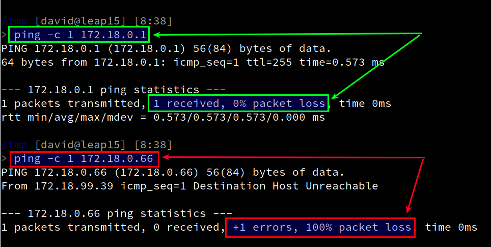

```
Curso       : 201920
Area        : Sistemas operativos, monitorización, devops
Descripción : Practicar test de infraestructura
Requisitos  : Varias máquinas. Una al menos con GNU/Linux
Tiempo      : 3 sesiones instalar y configurar las máquinas con acceso remoto
              4 sesiones realizar la práctica
```

---
# 1.Test de infrastructura

Propuesta de rúbrica:

| Criterio        | Muy bien(2) | Regular(1) | Poco adecuado(0) |
| --------------- | ----------- | ---------- | ---------------- |
| (2.2) Comprobar ||||
| (3.2) Comprobar ||||
| (4.2) Comprobar ||||
| (5.2) Comprobar ||||
| (6.2) Comprobar |||.|

## 1.1 Introducción

* ¿Qué son los test de infraestructura?
* Ver la infraestructura como código (IaC).

* Comparativa

| Features | Teuton | Testinfra | Goss |
| -------- | ------ | --------- | ---- |
| URL      | https://github.com/teuton-software/teuton | https://testinfra.readthedocs.io/en/latest/index.html | https://github.com/aelsabbahy/goss |
| License  | GPL v.3 | Apache license 2.0 | Apache license 2.0 |
| Programming language | Ruby | Python | Go |
| Platforms | Multiplatform | Multiplatform | GNU/Linux |
| Remote connections | SSH, Telnet | SSH | ? |
| Installed on | Master | Slave |  |
| Test Units Lenguage definition | Teuton DSL | Python | YAML |
| Configuration input files | YAML, JSON | Python | YAML |
| Output formats      | Documentation, TXT, YAML, JSON, silent | ? | rspecish, documentation, JSON, TAP, JUnit, nagios, silent |
| Builtin functions | Yes | Yes | ... |
| Function creation | Yes | ?   | ? |

## 1.2 Preparativos

Listado de las máquinas que necesitamos:

| ID | Sistema  | Hostname     | IP           |
| -- | -------- | ------------ | ------------ |
|  1 | [OpenSUSE](../../global/configuracion/opensuse.md) | apellidoXXg  | 172.AA.XX.31 |
|  2 | [OpenSUSE](../../global/configuracion/opensuse.md) | apellidoXXg2 | 172.AA.XX.32 |
|  3 | [RbPI](../../global/configuracion/rbpi.md)     | apellidoXXrb | 172.AA.XX.51 |
|  4 | [Windows](../../global/configuracion/windows.md)  | apellidoXXw  | 172.AA.XX.11 |

En todas las máquinas:
* Configurar IP estática.
* Activar servicio SSH.
* Habilitar acceso SSH a root.
* Comprobar acceso remoto con `ssh root@ip-mv`.

## 1.3 Modos de trabajo

> Enlaces de interés:
> * [Modos de uso](https://github.com/teuton-software/teuton/blob/devel/docs/install/modes_of_use.md)

* Entender los modos de trabajo de Teuton: T-NODE y S-NODE.
* T-NODE: Máquina con Teuton.
* S-NODE: Máquina con el servicio SSH.

## 1.4 Instalación

> Enlace de interés:
> * [Instalación](https://github.com/teuton-software/teuton/blob/devel/docs/install/install.md)

Vamos a ver el proceso de instalación de "teuton" (T-NODE).

Entrar como superusuario.
* `ruby -v` para comprobar la versión de ruby ( >= 2.3.0). En caso contrario instalar ruby.
* `gem install teuton`, instalar Teuton.

> En OpenSUSE es necesario además es necesario hacer los siguiente:
> * `find / -name teuton`, para localizar el ejecutable.
> * `ln -s PATH/TO/FILE/teuton /usr/local/bin/teuton`, crear un enlace al ejecutable.

Entrar como nuestro usuario normal:
* `teuton version`, comprobar versión.

---
# 2. Test: conectividad

## 2.1 Crear el test

Ir a la MV1:
* Ir al directorio `Documentos` para trabajar ahí.
* `teuton create castleXX/test2`, para crear los ficheros para nuestro test. Los ficheros principales son:
    * `config.yaml`, fichero de configuración de las máquinas
    * `start.rb`, definición de las unidades de prueba.
* Modificar `config.yaml` para incluir todas las máquinas que queremos monitorizar:

```
---
:alias:
:global:
:cases:
- :tt_members: T-NODE-XX
  :host_ip: localhost
- :tt_members: S-NODE-XX GNU/Linux
  :host_ip: 172.19.XX.32
- :tt_members: S-NODE-XX Raspberry PI
  :host_ip: 172.19.XX.51
- :tt_members: S-NODE-XX Windows
  :host_ip: 172.19.XX.11
```

* Vamos a modificar `start.rb` para comprobar que hay conectividad con las máquinas:

```
group "alumnoXX - test2" do

  target "Hay conectividad con la Máquina #{get(:host_ip)}"
  run "ping -c 1 #{get(:host_ip)}"
  expect " 0% packet loss"
end

play do
  show
  export
end
```

Explicación:
* [target](https://github.com/teuton-software/teuton/blob/devel/docs/dsl/definition/target.md): se usa para iniciar la definición de un "objetivo" de motnitorización. Debemos poner una descripción que nos ayude a identificar cuál es ese objetivo.
* [run](https://github.com/teuton-software/teuton/blob/devel/docs/dsl/definition/run.md): Indica el comando queremos ejecutar en la máquina local. Esta será la máquina T-Node, donde tenemos instalado Teutón.
* [expect](https://github.com/teuton-software/teuton/blob/devel/docs/dsl/definition/expect.md): Comprueba que la salida del comando anterior (run) contenga el texto que esperamos.

A continuación vemos una imagen de ejemplo, donde tenemos:
1. En verde la salida de un comando que se ejecuta dando la salida que esperamos (`expect " 0% packet loss"`).
1. En rojo la salida de un comando que se ejecuta dando una salida que NO esperamos.



* `teuton test castleXX/test2`, nos hace una revisión de la sintaxis de los ficheros `config.yaml` y `start.rb` por si hemos escrito algo mal.

## 2.2 Comprobar

* `teuton castleXX/test2`, ejecutar el test.
* Tenemos los resultados en el directorio `var/test2`.
* Comprobar que los resultados son los correctos.

**Entregar** los ficheros de los directorios:
* `castleXX/test2/*`
* `var/test2/*`

---
# 3. Test: Configuración de red

## 3.1 Crear el test

* Crear el test `castleXX/test3`.
* Personalizar el fichero de configuración (`config.yaml`):

```
---
:alias:
:global:
  :host_username: root
:cases:
- :tt_members: T-NODE-XX
  :host_ip: localhost
  :host_password: clave-secreta
- :tt_members: S-NODE-XX GNU/Linux
  :host_ip: 172.19.XX.32
  :host_password: clave-secreta
- :tt_members: S-NODE-XX Raspberry PI
  :host_ip: 172.19.XX.51
  :host_password: clave-secreta
- :tt_members: S-NODE-XX Windows
  :tt_skip: true
  :host_ip: 172.19.XX.11
  :host_password: clave-secreta
```

> Fijarse que hemos añadido los siguientes parámetros:
> * `host_username`: será el nombre del usuario que usaremos para conectarnos de forma remota a las máquinas vía SSH.
> * `host_ip`: será valor de IP de la máquina a la que vamos a conectarnos de forma remota vía SSH.
> * `tt_skip`: si se pone a true estamos indicando que esta máquina no la vamos a comprobar por ahora. De momento vamos a excluir (skip==true) la máquina Windows de la monitorización, porque los comandos son diferentes. Lo arreglaremos más adelante.

* Vamos a modificar `start.rb` para comprobar lo siguiente en las máquinas remotas:
    * Puerta de enlace: `ping -c 1 8.8.4.4`
    * Servidor DNS: `host www.nba.com`

```
group "alumnoXX - test3" do

  target "La puerta de enlace funciona correctamente"
  goto :host, :exec => "ping -c 1 8.8.4.4"
  expect " 0% packet loss"

  target "Servidor DNS funciona corectamente"
  goto :host, :exec => "host www.nba.com"
  expect "has address"

end

play do
  show
  export
end
```

Explicación:
* [goto](https://github.com/teuton-software/teuton/blob/devel/docs/dsl/definition/goto.md): La sentencia "goto" inicia una conexión SSH con el equipo "host" y ejecuta el comando indicado por "exec".
* Cuando ejecutamos el comando `host www.nba.com` de forma correcta, obtenemos una salida como la siguiente, donde se obtiene al menos una línea con el texto `has address`:
```    
> host www.nba.com

www.nba.com has address 104.126.107.194
www.nba.com has IPv6 address 2a02:26f0:13c:396::2e1
www.nba.com has IPv6 address 2a02:26f0:13c:38b::2e1
www.nba.com is an alias for nbaevsecure.edgekey.net.
nbaevsecure.edgekey.net is an alias for e737.dscg.akamaiedge.net.
```
* Cuando ejecutamos el comando `host www.enebea66.com` y es incorrecto, comprobamos que la salida no muestra ninguna línea del tipo `has address`:
```
> host www.enebea66.com

Host www.enebea66.com not found: 3(NXDOMAIN)
```

* `teuton test castleXX/test3`, nos hace una revisión de la sintaxis de los ficheros `config.yaml` y `start.rb` por si hemos escrito algo mal.

## 3.2 Comprobar

* `teuton castleXX/test3`, ejecutar el test.
* Tenemos los resultados en el directorio `var/test3`.
* Comprobar que los resultados son los correctos.

**Entregar**

* Ficheros `castleXX/test3/*`
* Ficheros `var/test3/*`

---
# 4. Test: configuración básica

## 4.1 Modificar el test

* Copiar test3 en `castleXX/test4`.
* Ampliar los targets para comprobar lo siguiente en las máquinas remotas:
    * Nombre de equipo: `hostname`
    * Usuario alumno: `id nombre-alumno`
* Modificar el fichero de configuración para incluir nuevos parámetros (hostname y username):

```
---
:alias:
:global:
  :host_username: root
  :username: nombre-del-alumno
:cases:
- :tt_members: alumnoXX MV1
  :host_ip: localhost
  :host_password: clave-secreta
  :hostname: apellidoXXg
- :tt_members: alumnoXX MV2 GNU/Linux
  :host_ip: 172.19.XX.32
  :host_password: clave-secreta
  :hostname: apellidoXXg2
- :tt_members: alumnoXX MV3 Raspberry PI
  :host_ip: 172.19.XX.51
  :host_password: clave-secreta
  :hostname: apellidoXXrb
- :tt_members: alumnoXX MV4 Windows
  :tt_skip: true
  :host_ip: 172.19.XX.11
  :host_password: clave-secreta
  :hostname: apellidoXXw
```

Ver ejemplo de monitorización del nombre del equipo:
```
  target "Configurar nombre de equipo con #{get(:hostname)}"
  goto :host, :exec => "hostname"
  expect get(:hostname)
```

* `teuton test castleXX/test4`, nos hace una revisión de la sintaxis de los ficheros `config.yaml` y `start.rb` por si hemos escrito algo mal.

## 4.2 Comprobar

* `teuton castleXX/test4`, ejecutar el test.
* Tenemos los resultados en el directorio `var/test4`.
* Comprobar que los resultados son los correctos.

**Entregar**

* Ficheros `castleXX/test4/*`
* Ficheros `var/test4/*`

---
# 5. Test: directorios y permisos

* Crear un nuevo test `castleXX/test5`.
* Definir las comprobaciones necesarias en `start.rb`para:
    * Comprobar que existe el grupo `jedis`.
    * Comprobar que existe el usuario `obiwan`.
    * Comprobar que `obiwan`es miembro del grupo `jedis`.
    * Comprobar que existe el directorio `/home/obiwan/private`.
    * Comprobar que existe el directorio `/home/obiwan/group`.
    * Comprobar que existe el directorio `/home/obiwan/public`.
    * Comprobar `/home/obiwan/private` tiene los permisos `700`.
    * Comprobar `/home/obiwan/group` tiene los permisos `750`.
    * Comprobar `/home/obiwan/public` tiene los permisos `755`.

## 5.2 Comprobar

* `teuton castleXX/test5`, ejecutar el test.
* Tenemos los resultados en el directorio `var/test5`.
* Comprobar que los resultados son los correctos.

**Entregar**

* Ficheros `castleXX/test5/*`
* Ficheros `var/test5/*`

---
# 6. Test: Otros sistemas

## 6.1 Crear el test

* Copiar el contenido del test3 en `castleXX/test6`.
* Modificar `config.yaml` para monitorizar únicamente a la máquina Windows.
    * Poner `:tt_skip: true` o `:tt_skip: false` según convenga.
* Adaptar los comandos de comprobación al sistema operativo Windows. Por ejemplo, cambiar `id nombre-alumno` por `net user alumno`.

## 6.2 Comprobar

* `teuton castleXX/test6`, ejecutar el test.
* Tenemos los resultados en el directorio `var/test6`.
* Comprobar que los resultados son los correctos.

**Entregar**

* Ficheros `castleXX/test6/*`
* Ficheros `var/test6/*`
