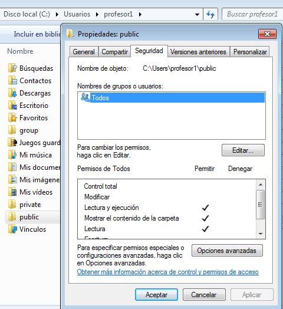
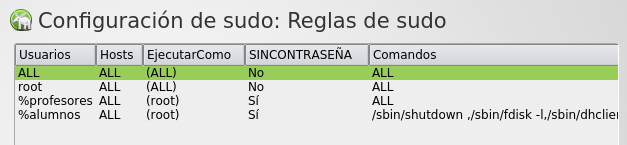
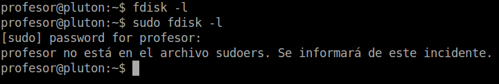
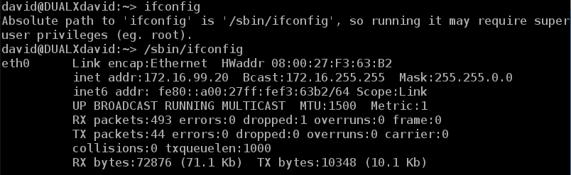

```
Cursos      : 202122, 202021, 201920, 201817, 201716
Área        : Sistemas operativos
Descripción : Crear usuarios y asignar permisos
Requisitos  : Windows y GNU/Linux
Tiempo      :
```

# Usuarios y permisos

Ejemplo de rúbrica:

| Sección                  | Muy bien (2) | Regular (1) | Poco adecuado (0) |
| ------------------------ | ------------ | ----------- | ----------------- |
| (W) Usuarios y grupos    | | | |
| (W) Permisos de carpetas | | | |
| (G) Usuarios y grupos    | | | |
| (G) Permisos de carpetas | | | .|


* Entregar documento en formato ODT o PDF, con el informe de la actividad. Incluir las acciones realizadas y las capturas solicitadas.

---

# 1. SO Windows

* [Configurar la MV](../../global/configuracion/windows.md).
* Para la creación de usuarios podemos ir por `Panel de Control`, pero esa
herramienta está limitada. Nosotros vamos a ir a
`miPC -> Botón derecho administrar -> Gestión de usuarios`.
* ¿Cuántos usuarios hay en el sistema que no aparecen en la ventana de inicio? ¿Por qué?

## 1.1 Usando el GUI Windows

**Crear usuarios**

* Crear el grupo `jedis`.
* Crear los usuarios `jedi1` y `jedi2` dentro del grupo anterior.
* Los miembros del grupo `jedis` incluirlos además en el grupo
administradores, para que puedan actuar como superusuarios.
* Para comprobar que los usuarios y grupos se han creado correctamente vamos a
`Equipo -> Botón Derecho -> Administrar -> Usuarios y grupos`.
* Capturar imagen.

**Asignar permisos**

> **OJO** Cuando se agreguen los permisos de lectura en NFTS, nos vamos a referir a los 3 permisos de lectura/mostrar que hay disponibles.

* Entrar como el usuario `jedi1`.
* Crear la carpeta `C:\Users\jedi1\privateXX` (Sustituir XX por el número asignado a cada alumno)
* Crear la carpeta `C:\Users\jedi1\groupXX`
* Crear la carpeta `C:\Users\jedi1\publicXX`

> **INFORMACIÓN sobre Permisos NTFS**
>
> En Windows las carpetas HEREDAN los permisos de su carpeta padre. Para desactivar esta función
en una carpeta determinada, haremos lo siguiente:
>
> * Botón derecho sobre la carpeta -> propiedades -> seguridad.
> * Opciones avanzadas -> cambiar permisos.
> * Desactivar herencia `Incluir permisos heredables -> Quitar -> Aceptar`.
> * Aplicar y Aceptar.
>
> Para modificar los permisos de una carpeta vamos a `Botón derecho -> Propiedades -> Seguridad -> Editar`.

Vamos a modificar los permisos de la siguiente forma:
* `privateXX`: El usuario propietario tendrá control total y nadie más tendrá permisos.
* `groupXX`: grupo `jedis` permisos de lectura, y el usuario propietario control total.
* `publicXX`: todos tienen permiso de lectura, y el usuario propietario control total.
* Capturar imagen del resultado de la asignación de permisos.

Veamos un ejemplo de permisos para la carpeta public:



## 1.2 Usando los comandos Windows

**Crear usuarios**

* Buscar la herramienta PowerShell. Botón derecho y ejecutar como Administrador.
* `net localgroup`, para ver los grupos.
* `net localgroup siths /add`, crear el grupo `siths`.
* Pondremos a los usuarios `sith1` y `sith2`, dentro de los grupos `siths` y `usuarios`.
    * `net user USERNAME /add`, para crear usuarios.
    * `net localgroup GROUPNAME USERNAME /add`, para incluir un usuario dentro de un grupo.

> Al incluir a un usuario como miembro del grupo Usuarios conseguimos que aparezca como icono de la ventana de inicio de sesión del sistema.

**Asignar permisos**

* Entrar con el usuario `sith2`.
* Crear la carpeta `C:\Users\sith2\privateXX`
* Crear la carpeta `C:\Users\sith2\groupXX`
* Crear la carpeta `C:\Users\sith2\publicXX`

> Veamos un ejemplo de permisos por comandos:
>
> * `icacls /?`, Ver la ayuda del comando icacls
> * `icacls public /inheritance:r`, Quitar los permisos heredados a la carpeta public
> * `icacls public`,  Consultar los permisos actuales de public
> * `icacls public /grant todos:R`, Dar permisos de lecturas al grupo todos
> * `icacls public /grant alumno1:F`, Dar permisos control total al usuario alumno1
> * `icacls directorio /remove USERNAME`, Para quitar el acceso al usuario USERNAME

Modificar los permisos de la siguiente forma:
* `privateXX`: Sólo el usuario propietario tendrá control total.
* `groupXX`: grupo `siths` permisos de lectura, y usuario propietario permisos de control total.
* `publicXX`: todos tienen permiso de lectura, y el usuario propietario tiene permisos de control total.

# 2. SO GNU/Linux OpenSUSE

## 2.1 Preparar la MV

* [Configurar la MV](../../global/configuracion/opensuse.md).
* Ir al gestor de usuarios de OpenSUSE: `Ir a Yast -> Gestión de Usuarios`.
* ¿Cuántos usuarios hay que no aparecen en la ventana de inicio al sistema? ¿Por qué?

## 2.2 Usando el GUI GNU/Linux

> Veamos un ejemplo de permisos por el entorno GUI, donde:
> * Permiso R = Ver contenido
> * Permiso W = Cambiar contenido
> * Permido X = Access content
>
> 

Entrar como usuario root:
* Crear el grupo `jedis`.
* Crear los usuarios `jedi3` y `jedi4` dentro de los grupo `jedis` y `users`.

Entrar como el usuario `jedi3`
* Crear la carpeta `/home/jedi3/privateXX`
* Crear la carpeta `/home/jedi3/groupXX`
* Crear la carpeta `/home/jedi3/publicXX`
* Capturar imagen del resultado final de cada carpeta.

Modificar los permisos de las carpetas de la siguiente forma:
* `privateXX`: Sólo el usuario propietario tendrá todos los permisos.
* `groupXX`: grupo `jedis` permisos de lectura/ejecución, y usuario propietario todos los permisos.
* `publicXX`: todos tienen permiso de lectura/ejecución, y el usuario propietario tiene todos los permisos.

## 2.3 Sudoers (Grupo privilegiado)

> El comando `sudo` nos permite ejecutar comandos como si fuéramos el administrador del equipo.
Pero dicho comando sólo lo pueden ejecutar algunos elegidos.



Vamos a usar Yast por entorno gráfico (Ver ejemplo en la imagen anterior) para la siguiente configuración de permisos.
* Ir a `Yast -> Sudo`. Si no nos aparece esta opción en Yast, entonces la podemos instalar con `sudo zypper in yast2-sudo`.
* Añadir la línea siguiente `%jedis ALL = (root) NOPASSWD:ALL` al fichero de configuración de sudoers, para permitir que los usuarios del grupo `jedis` puedan usar el comando sudo.

Los campos de la configuración anterior significan lo siguiente:

| Campo          | Valor  | Descripción |
| -------------- | ------ | ----------- |
| Usuarios       | %jedis | Todos los usuarios del grupo jedis |
| Host           | ALL    | En todos los hosts |
| Ejecutar como  | (root) | Cuando se use sudo nos convertiremos en root |
| Sin contraseña | Si     | Solicitará nuestra contraseña |
| Comandos       | ALL    | Se permite ejecutar todos los comandos con sudo |

* Guardar y salir. Ahora los usuarios del grupo anterior ya pueden ejecutar el comando sudo, para realizar todas las tareas administrativas (de superusuario).
* Entrar al sistema con el usuario `jedi3` y ejecutar `sudo -l` para consultar la configuración de sudoers.

> Veamos un ejemplo de un usuario sin privilegios que intenta usar el comando sudo:
>
> 

## 2.4 Usando los comandos

> Enlace de interés:
> * Vídeo sobre [permisos en GNU/Linux](https://www.youtube.com/embed/Lq0UMXujGyc)

**Crear el grupo**

> Pista: Podemos usar el comando `groupadd`, para crear nuevo grupo.

* Crear el grupo `siths`.

**Crear los usuarios**

> Información de comandos:
> * `useradd`, Crear usuario. Podemos usar los siguientes parámetros:
>     * -m para crear carpeta home del usuario. Ejemplo: `useradd obiwan -m`. La opcion "-m" es para crear el HOME del usuario al crear el usuario. **¡OJO!** Un error típico es crear a los usuarios sin su carpeta HOME.
>     * -g para definir el grupo principal del usuario. Podemos usar el comando "useradd USUARIO -m -g GRUPOPRINCIPAL -G OTROSGRUPOS".
>     * -G para incluir el usuario en otros grupos.
>     * -p para definir una constraseña/password al nuevo usuario.
> * `passwd`, establecer la contraseña del usuario. Ejemplo: `passwd USUARIO`.
> * `userdel`, para borrar usuario.
> * `usermod`, para modificar un usuario. Se puede usar el comando "usermod USUARIO -a -G GRUPO", para añadir un usuario que ya existe a un grupo determinado.

* Crear los usuarios `sith3` y `sith4` dentro de los grupos `siths` y `users`.
* Para poner la clave al usuario podemos hacer.

Comprobaciones:
* `id sith4` para comprobar que el usuario existe.
* `vdir /home`, para comprobar si existe la carpeta HOME del usuario.
* `cat /etc/passwd | grep sith4`, para consultar la información del usuario dentro del fichero /etc/passwd.
* Ejecutar el comando `cat /etc/passwd`. Así vemos todos los usuarios definidos el el sistema. Algunos son usados por personas físicas, y otros son internos para uso de aplicaciones o del sistema operativo.

> Información de comandos:
> * `chown`, cambiar propietario.
> * `chgrp`, cambiar grupo propietario.
> * `chmod`, cambiar permisos de acceso.

**Crear las carpetas y modificar los permisos**
* Entrar como el usuario `sith4`
    * Crear la carpeta `/home/sith4/privateXX`
    * Crear la carpeta `/home/sith4/groupXX`
    * Crear la carpeta `/home/sith4/publicXX`
* Cambiar los permisos de la siguiente forma:
    * `privateXX`: Sólo el usuario propietario tendrá todos los permisos.
    * `groupXX`: grupo `siths` permisos de lectura/ejecución, y usuario propietario todos los permisos.
    * `publicXX`: todos tienen permiso de lectura/ejecución, y el usuario propietario tiene todos los permisos.
* Comprobamos con "vdir".

## 2.5 Configurar `sudoers` para el otro grupo

Vamos a configurar los permisos "sudo" por comandos.
* Editar el fichero de configuración `/etc/sudoers` directamente con nano  (o usando el comando `visudo`).
* Añadir la siguiente información para configurar el grupo `siths` en el fichero `/etc/sudoers`:
```
%siths ALL = (root) NOPASSWD:/sbin/shutdown, /sbin/fdisk -l
```
* Entrar al sistema con el usuario `sith4` y ejecutar `sudo -l`, para consultar la información de permisos sudoers que tenemos asignados.
* Comprobar los nuevos permisos asignados:
    * No tenemos permitido el uso del comando privilegiado `fdisk -l` sin sudo.
    * Tenemos permitido usar el comando privilegiado `sudo fdisk -l` a través de sudo.

---

# ANEXO

El anexo contiene información complementaria. No hay que hacerlo.

## A.1 Ejemplo/Información sobre PowerShell

Vamos a usar los comandos del SO Windows. Para ello buscamos en el
`menú -> PowerShell -> (botón derecho) -> Iniciar como Administrador`.

Si no lo hacemos como administrador, no tendremos los privilegios necesarios,
y no podremos crear los usuarios.

Veamos un ejemplo para **crear grupo**:
* Cambiar nombre-pc por el nombre del PC de cada uno.
* Cambiar "alumnos" por el nombre del grupo que deseamos crear.

```
PS C:\> [ADSI]$equipo="WinNT://nombre-pc"
PS C:\> $grupo=$equipo.Create("Group","alumnos")
PS C:\> $grupo
PS C:\> $grupo.SetInfo()
```

Veamos un ejemplo de **creación de usuarios** en PowerShell:
* Cambiar nombre-pc por el nombre del PC de cada uno.
* Cambiar "alumno1" por el nombre del usuario que deseamos crear.
* Cambiar "123456" por el valor de password que querramos.

```
PS C:\> [ADSI]$equipo="WinNT://nombre-pc"
PS C:\> $usuario=$equipo.Create("User","alumno1")
PS C:\> $usuario
distinguishedName :
Path : WinNT://AULA109/nombre-pc/alumno1
PS C:\> $usuario.SetPassword("123456")
PS C:\> $usuario.SetInfo()
```

Veamos un ejemplo para **añadir usuario a un grupo ya existente**:
```
PS> $grupo = [adsi]"WinNT://nombre-pc/nombre-del-grupo,group"
PS> $grupo
PS> $usuario = [adsi]"WinNT://nombre-PC/nombre-del-usuario,user"
PS> $grupo.Add($usuario.path)
```
> [Más información sobre la creación de usuarios con PowerShell](https://www.petri.com/create-local-accounts-with-powershell)

## A.2 Personalización de usuarios GNU/Linux

En OpenSUSE vemos que cuando queremos invocar el comando `ifconfig` con
un usuario normal debemos hacerlo con la ruta absoluta `/sbin/ifconfig`.



Existe una variable llamada PATH, configurada para cada usuario de forma difierente.
Dicha variable de entorno contiene las rutas de los ejecutables/comandos.

No es necesario escribir la ruta completa para invocar a los comandos/programas
que estén en alguna de estas rutas.

Para cambiarlo añadimos las siguientes líneas al final del fichero `/home/nombre-de-usuario/.profile`:
```
PATH=$PATH:/sbin
export PATH
```

Para que los cambios tengan efecto debemos cerrar la sesión.

En otras distribuciones se usa el fichero de configuración `/home/nombre-de-usuario/.bashrc`.

## A.3 Emulador de consola portable para Windows

Cmder (http://bliker.github.io/cmder/) is a software package created out of pure frustration over the absence of nice console emulators on Windows.

It is based on amazing software, and spiced up with the Monokai color scheme and a custom prompt layout. Looking sexy from the start.
