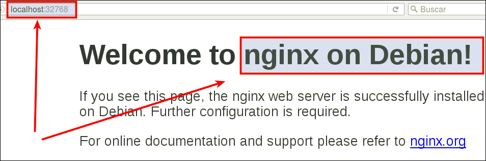

```
Curso       : 201920
Area        : Sistemas operativos, automatización, devops
Descripción : Introducción básica a los contenedores con Docker
Requisitos  : Se recomienda usar Docker con SSOO GNU/Linux
Tiempo      : 6 sesiones
```

---
# 1. Contenedores con Docker

> Enlaces de interés
> * [Docker for beginners](http://prakhar.me/docker-curriculum/)
> * [getting-started-with-docker](http://www.linux.com/news/enterprise/systems-management/873287-getting-started-with-docker)

Es muy común que nos encontremos desarrollando una aplicación, y llegue el momento que decidamos tomar todos sus archivos y migrarlos, ya sea al ambiente de producción, de prueba, o simplemente probar su comportamiento en diferentes plataformas y servicios.

Para situaciones de este estilo existen herramientas que, entre otras cosas, nos facilitan el embalaje y despliegue de la aplicación, es aquí donde entra en juego los contenedores (Por ejemplo Docker o Podman).

Esta herramienta nos permite crear "contenedores", que son aplicaciones empaquetadas auto-suficientes, muy livianas, capaces de funcionar en prácticamente cualquier ambiente, ya que tiene su propio sistema de archivos, librerías, terminal, etc.

Docker es una tecnología contenedor de aplicaciones construida sobre LXC.

Propuesta de rúbrica:
| ID  | Criterio      | Muy bien(2) | Regular(1) | Poco adecuado(0) |
| --- | ------------- | ----------- | ---------- | ---------------- |
| 3.2 | Comprobar     ||||
| 3.3 | Migrar imagen ||||
| 4.2 | Crear imagen Dockerfile ||||
| 4.3 | Crear contenedor        ||||
| 4.4 | Usar imagen de nginx    ||||
| 5   | Hola Mundo              ||||

## 1.1 Instalación

> Enlaces de interés:
> * [EN - Docker installation on SUSE](https://docs.docker.com/engine/installation/linux/SUSE)
> * [ES - Curso de Docker en vídeos](jgaitpro.com/cursos/docker/)

Ejecutar como superusuario:
* `zypper in docker`, instalar docker.
* `systemctl start docker`, iniciar el servicio. NOTA: El comando `docker daemon` hace el mismo efecto.
* Incluir a nuestro usuario (nombre-del-alumno) como miembro del grupo `docker`.

Iniciar sesión como usuario normal.
* `docker version`, comprobamos que se muestra la información de las versiones cliente y servidor.
* OJO: A partir de ahora todo lo haremos con nuestro usuario, sin usar `sudo`.

## 1.1 Habilitar el acceso a la red externa a los contenedores

Si queremos que nuestro contenedor tenga acceso a la red exterior, debemos activar tener activada la opción IP_FORWARD (`net.ipv4.ip_forward`). ¿Recuerdas lo que implica `forwarding` en los dispositivos de red?

* `cat /proc/sys/net/ipv4/ip_forward` para consultar el estado de IP_FORWARD (desactivado=0, activo=1). Para activarlo podemos hacer lo siguiente:
    * Poner el valor 1 en el fichero de texto indicado o también podemos usar Yast.
    * O ejecutar el siguiente comando `sysctl -w net.ipv4.ip_forward=1`
    * También podemos crear el fichero `/etc/sysctl.d/alumnoXX.conf` y poner dentro lo siguiente:
    ```
    ## Configuración para docker de alumnoXX
    net.ipv4.ip_forward = 1
    ```
* También podemos **Usar YAST para activar IP_FORWARD**:

| Sistema operativo | Activar "forwarding" |
| ----------------- | -------------------- |
| OpenSUSE Leap (configuración de red es Wicked) | Yast -> Dispositivos de red -> Encaminamiento -> Habilitar reenvío IPv4 |
| Cuando la red está gestionada por Network Manager | En lugar de usar YaST debemos editar el fichero "/etc/sysconfig/SuSEfirewall2" y poner FW_ROUTE="yes" |
| OpenSUSE Tumbleweed  | Yast -> Sistema -> Configuración de red -> Menú de encaminamiento |

* Reiniciar el equipo para que se aplique el cambio de configuración.

## 1.3 Primera prueba

* `docker run hello-world`:
    * Descarga una imagen "hello-world"
    * Crea un contenedor y
    * ejecuta la aplicación que hay dentro.
* `docker images`, ahora vemos la nueva imagen "hello-world" descargada.
* `docker ps -a`, vemos que hay un contenedor en estado 'Exited'.
* `docker stop IDContainer`, parar el conteneder.
* `docker rm IDContainer`, eliminar el contenedor.

## 1.4 Sólo para LEER

Veamos un poco de teoría.

Tabla de referencia para no perderse:

| Software   | Base   | Sirve para crear   | Aplicaciones |
| ---------- | ------ | ------------------ | ------------ |
| VirtualBox | ISO    | Máquinas virtuales | N |
| Vagrant    | Box    | Máquinas virtuales | N |
| Docker     | Imagen | Contenedores       | 1 |


Información sobre otros comandos útiles:

| Comando                   | Descripción           |
| ------------------------- | --------------------- |
| docker stop CONTAINERID   | Parar un contenedor   |
| docker start CONTAINERID  | Iniciar un contenedor |
| docker attach CONTAINERID | Conectar el terminal actual con el contenedor |
| docker ps                 | mostrar los contenedores en ejecución |
| docker ps -a              | mostrar todos los contenedores (en ejecución o no) |
| docker rm CONTAINERID     | Eliminar un contenedor |
| docker rmi IMAGENAME      | Eliminar una imagen    |

## 1.5 Alias

Para ayudarnos a trabajar de forma más rápida con la línea de comandos podemos agregar los siguientes alias al fichero `/home/nombre-alumno/.alias`:

```
alias di='docker images'
alias dp='docker ps'
alias dpa='docker ps -a'
alias drm='docker rm '
alias drmi='docker rmi '
alias ds='docker stop '
```

---
# 2. Creación manual de nuestra imagen

Nuestro SO base es OpenSUSE, pero vamos a crear un contenedor Debian,
y dentro instalaremos Nginx.

## 2.1 Crear un contenedor manualmente

**Descargar una imagen**
* `docker search debian`, buscamos en los repositorios de Docker Hub contenedores con la etiqueta `debian`.
* `docker pull debian`, descargamos una imagen en local.
* `docker images`, comprobamos.

**Crear un contenedor**: Vamos a crear un contenedor con nombre `con_debian` a partir de la imagen `debian`, y ejecutaremos el programa `/bin/bash` dentro del contendor:
* `docker run --name=app1debian -i -t debian /bin/bash`

## 2.2 Personalizar el contenedor

Ahora dentro del contenedor, vamos a personalizarlo a nuestro gusto:

**Instalar aplicaciones dentro del contenedor**

```
root@IDContenedor:/# cat /etc/motd            # Comprobamos que estamos en Debian
root@IDContenedor:/# apt-get update
root@IDContenedor:/# apt-get install -y nginx # Instalamos nginx en el contenedor
root@IDContenedor:/# apt-get install -y vim   # Instalamos editor vi en el contenedor
```

**Crear un fichero HTML** `holamundo.html`.

```
root@IDContenedor:/# echo "<p>Hola nombre-del-alumno</p>" > /var/www/html/holamundo.html
```

**Crear un script** `/root/server.sh` con el siguiente contenido:

```
#!/bin/bash
echo "Booting Nginx!"
/usr/sbin/nginx &

echo "Waiting..."
while(true) do
  sleep 60
done
```

Recordatorio:
* Hay que poner permisos de ejecución al script para que se pueda ejecutar.
* La primera línea de un script, siempre debe comenzar por `#!/`, sin espacios.
* Este script inicia el programa/servicio y entra en un bucle, para permanecer activo y que no se cierre el contenedor.

## 2.3 Crear una imagen a partir del contenedor

Ya tenemos nuestro contenedor auto-suficiente de Nginx, ahora debemos vamos a crear una nueva imagen que incluya los cambios que hemos hecho.

* Abrir otra ventana de terminal.
* `docker commit app1debian nombre-del-alumno/nginx1`, a partir del CONTAINERID vamos a crear la nueva imagen que se llamará "nombre-del-alumno/nginx1".

> NOTA:
>
> * Los estándares de Docker estipulan que los nombres de las imágenes deben seguir el formato `nombreusuario/nombreimagen`.
> * Todo cambio que se haga en la imagen, y no se le haga commit se perderá en cuanto se cierre el contenedor.

* `docker images`, comprobamos.

---
# 3. Crear contenedor a partir de nuestra imagen

## 3.1 Crear contenedor con Nginx

Ya tenemos una imagen "dvarrui/nginx" con Nginx instalado.
* `docker run --name=app2nginx1 -p 80 -t dvarrui/nginx1 /root/server.sh`, iniciar el contenedor a partir de la imagen anterior.

> El argumento `-p 80` le indica a Docker que debe mapear el puerto especificado del contenedor, en nuestro caso el puerto 80 es el puerto por defecto sobre el cual se levanta Nginx.

## 3.2 Comprobamos

* Abrimos una nueva terminal.
* `docker ps`, nos muestra los contenedores en ejecución. Podemos apreciar que la última columna nos indica que el puerto 80 del contenedor está redireccionado a un puerto local `0.0.0.0.:PORT -> 80/tcp`.
* Abrir navegador web y poner URL `0.0.0.0.:PORT`. De esta forma nos
conectaremos con el servidor Nginx que se está ejecutando dentro del contenedor.



* Comprobar el acceso a `holamundo.html`.
* Paramos el contenedor `app2nginx1` y lo eliminamos.

Como ya tenemos una imagen docker con Nginx, podremos crear nuevos contenedores cuando lo necesitemos.

## 3.3 Migrar la imagen a otra máquina

¿Cómo puedo llevar los contenedores Docker a un nuevo servidor?

> Enlaces de interés
>
> * https://www.odooargentina.com/forum/ayuda-1/question/migrar-todo-a-otro-servidor-imagenes-docker-397
> * http://linoxide.com/linux-how-to/backup-restore-migrate-containers-docker/

**Exportar** imagen Docker a fichero tar:
* `docker save -o ~/alumnoXX.tar nombre-alumno/nginx1`, guardamos la imagen
"nombre-alumno/server" en un fichero tar.

Intercambiar nuestra imagen exportada con la de un compañero de clase.

**Importar** imagen Docker desde fichero:
* Coger la imagen de un compañero de clase.
* Nos llevamos el tar a otra máquina con docker instalado, y restauramos.
* `docker load -i ~/alumnoXX.tar`, cargamos la imagen docker a partir del fichero tar. Cuando se importa una imagen se muestra en pantalla las capas que tiene. Las capas las veremos en un momento.
* `docker images`, comprobamos que la nueva imagen está disponible.
* Probar a crear un contenedor (`app3alumno`), a partir de la nueva imagen.

## 3.4 Capas

**Teoría sobre las capas**. Las imágenes de docker están creadas a partir de capas que van definidas en el fichero Dockerfile. Una de las ventajas de este sistema es que esas capas son cacheadas y se pueden compartir entre distintas imágenes, esto es que si por ejemplo la creación de nuestra imagen consta de 10 capas, y modificamos una de esas capas, a la hora de volver a construir la imagen solo se debe ejecutar esta nueva capa, el resto permanecen igual.

Estas capas a parte de ahorrarnos peticiones de red al bajarnos una nueva versión de una imagen también ahorra espacio en disco, ya que las capas que no se hayan cambiado entre versiones no se descargarán.

* `docker image history nombre_imagen:version`, para consultar las capas de la imagen del compañero.

---
# 4. Dockerfile

Ahora vamos a conseguir el mismo resultado del apartado anterior, pero
usando un fichero de configuración. Esto es, vamos a crear un contenedor a partir de un fichero `Dockerfile`.

## 4.1 Preparar ficheros

* Crear directorio `/home/nombre-alumno/dockerXXa`.
* Entrar el directorio anterior.
* Crear fichero `holamundo2.html` con:
    * Proyecto: dockerXXa
    * Autor: Nombre del alumno
    * Fecha: Fecha actual
* Poner copia del fichero `server.sh` anterior.
* Crear el fichero `Dockerfile` con el siguiente contenido:

```
FROM debian

MAINTAINER nombre-del-alumnoXX 1.0

RUN apt-get update
RUN apt-get install -y apt-utils
RUN apt-get install -y nginx

COPY holamundo2.html /var/www/html
RUN chmod 666 /var/www/html/holamundo2.html

COPY server.sh /root/server.sh
RUN chmod 755 /root/server.sh

EXPOSE 80

CMD ["/root/server.sh"]
```

> Probar con CMD ["/usr/sbin/nginx","-g"]

## 4.2 Crear imagen a partir del `Dockerfile`

El fichero Dockerfile contiene toda la información necesaria para construir el contenedor, veamos:

* `cd dockerXXa`, entramos al directorio con el Dockerfile.
* `docker build -t nombre-alumno/nginx2 .`, construye una nueva imagen a partir del Dockerfile. OJO: el punto final es necesario.
* `docker images`, ahora debe aparecer nuestra nueva imagen.

## 4.3 Crear contenedor y comprobar

A continuación vamos a crear un contenedor con el nombre `app4nginx2`, a partir de la imagen `nombre-alumno/nginx2`. Probaremos con:

```
docker run --name=app4nginx2 -p 8082:80 -t nombre-alumno/nginx2
```

Desde otra terminal:
* `docker...`, para averiguar el puerto de escucha del servidor Nginx.
* Comprobar en el navegador:
    * URL `http://localhost:PORTNUMBER`
    * URL `http://localhost:PORTNUMBER/holamundo.html`

Ahora que sabemos usar los ficheros Dockerfile, nos damos cuenta que es más sencillo usar estos ficheros para intercambiar con nuestros compañeros que las herramientas de exportar/importar que usamos anteriormente.

## 4.4 Usar imágenes ya creadas

El ejemplo anterior donde creábamos una imagen Docker con Nginx se puede simplificar aún más aprovechando imágenes oficiales que ya existen.

> Enlace de interés:
> * [nginx - Docker Official Images] https://hub.docker.com/_/nginx

* Crea el directorio `dockerXXb`. Entrar al directorio.
* Crear fichero `holamundo3.html` con:
    * Proyecto: dockerXXb
    * Autor: Nombre del alumno
    * Fecha: Fecha actual
* Crea el siguiente `Dockerfile`

```
FROM nginx

COPY holamundo3.html /usr/share/nginx/html
RUN chmod 666 /usr/share/nginx/html/holamundo3.html
```

* Poner el el directorio `dockerXXb` los ficheros que se requieran para construir el contenedor.
* `docker build -t nombre-alumno/nginx3 .`, crear la imagen.
* `docker run --name=app5nginx3 -d -p 8083:80 nombre-alumno/nginx3`, crear contenedor.
* Comprobar el acceso a "holamundo.html".

---
# 5. Crear un hola mundo

* Crear un contenedor en la carpeta `dockerXXc` usando Dockerfile.
* Al ejecutar este comando `docker run nombre-alumno/holamundo` se mostrará en pantalla el mensaje:
```
Hola Mundo!
nombre-del-alumnoXX
Proyecto dockerXXc
```

---
# 6. Limpiar contenedores e imágenes

Cuando terminamos con los contenedores, y ya no lo necesitamos, es buena idea pararlos y/o destruirlos.
* `docker ps -a`
* `docker stop ...`
* `docker rm ...`
Lo mismo con las imágenes:
* `docker images`
* `docker rmi ...`
