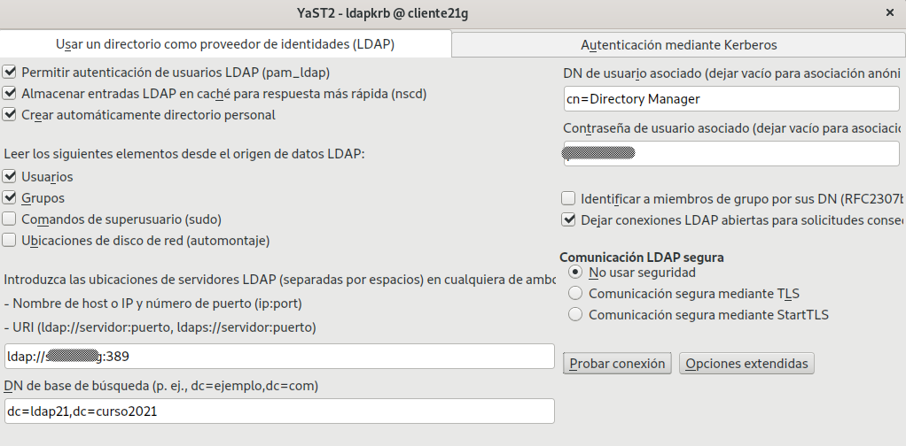

```
Curso           : EN CONSTRUCCIÓN!!!
Software        : Partimos de 389-DS en OpenSUSE
Tiempo estimado :
Comentarios     : Revisar autenticación con FreeIPA+389-DS
```

---

# Cliente para autenticación LDAP

En esta actividad, vamos a configurar otra MV (GNU/Linux OpenSUSE) para que podamos hacer autenticación en ella, pero usando los usuarios y grupos definidos en el servidor de directorios LDAP de la MV1.

# 1. Requisitos

Supondremos que tenemos una MV1 (serverXX) con DS-389 instalado, y con varios usuarios dentro del DS.

En caso contrario podemos elegir entre:
* (A) Ir a la actividad anterior para instalar DS-389 y usar los comandos para crear usuarios dentro del servicio de directorio, o
* (B) Vamos a crear el servicio de directorio en la MV1 (GNU/Linux OpenSUSE) usando Yast.

## 1.1 [PENDIENTE] Usar Yast para montar el DS

* Instalar `patterns-server-directory_server`.
* Ir a `Yast -> Servicios de Red -> Create New Directory Server`.
* Configurar:

```
Nombre de dominio           : serverXX.curso1920
Nombre de la instancia LDAP : ldapXX
Sufijo del directorio       : dc=ldapXX,dc=curso1920
Directory Manager DN        : cn=root
Directory Manager password  : ESCRIBIR LA CLAVE
Repetir la clave            : ESCRIBIR LA CLAVE
Autoridad certificadora     : (vacío)
Server TLS certificate      : (vacío)
```

> **[PENDIENTE] de completar la información sobre los certificados.**
>
> Esto no funciona, pero es un intento de crear certificado y firma para LDAPS.
>
> * Crear certificado autofirmado: `openssl req -newkey rsa:1024 -x509 -nodes -out server.pem -keyout server.pem - days 265`.
> * Export firma PKCS12: `openssl pkcs12 -export -out server.pfx -in server.pem`.

---
# 2. Preparativos

## 2.1 Preparar la MV2

Necesitamos MV2 con:
* SO OpenSUSE ([Configuración MV](../../global/configuracion/opensuse.md))
* Nombre equipo: `1er-apellido-alumnoXXg2`
* Dominio: `curso1920`
* Asegurarse que tenemos definido en el fichero `/etc/hosts` del cliente, el par DNS-IP del servidor. Ver ejemplo:

```
172.19.XX.31   serverXX.curso1920   serverXX   
127.0.0.2      1er-apellidoXXg2.curso1920   1er-apellidoXXg2
```

## 2.2 Comprobación

* `nmap -Pn serverXX | grep -P '389|636'`, para comprobar que el servidor LDAP es accesible desde la MV2 cliente.
* `ldapsearch -H ldap://serverXX:389 -W -D "cn=Directory Manager" -b "dc=ldapXX,dc=curso1920" "(uid=*)"`, comprobamos que los usuarios del LDAP remoto son visibles en el cliente.

---
# 3. Configurar autenticación LDAP

## 3.1 Configurar cliente de autenticación por Yast
Vamos a configurar de la conexión del cliente con el servidor LDAP.

* Ir a `Yast -> Cliente LDAP y Kerberos`.
* Configurar como:
```
* Permitir autenticación      : SI
* Almacenar entradas en caché : SI
* Crear directorio personal   : SI
* Leer -> Usuarios            : SI
* Leer -> Grupos              : NO
* Leer -> Sudo                : NO
* Leer -> Discos              : NO
* Ubicaciones de servidores   : IP-serverXX:389
* DN de la base               : dc=ldapXX,dc=curso1920
* DN usuario                  : (Vacío)
* Contraseña usuario          : (Vacío)
* Miembros de grupo por DN    : SI
* Dejar conexines abiertas    : SI
* Comunicación LDAP segura    : No usar seguridad
```

Imagen de ejemplo:



* Al final usar la opción de `Probar conexión`

## 3.2. Comprobamos desde el cliente con comandos

* Vamos a la consola con nuestro usuario normal, y probamos lo siguiente:
```
id drinfierno
su -l drinfierno   # Entramos con el usuario definido en LDAP

getent group villanos           # Comprobamos los datos del grupo
cat /etc/group | grep villanos  # El grupo NO es local

getent passwd baron             # Comprobamos los datos del usuario
cat /etc/passwd | grep baron    # El usuario NO es local
```

---
# 4. Autenticación por entorno gráfico

Con autenticacion LDAP prentendemos usar la máquina servidor LDAP, como repositorio centralizado de la información de grupos, usuarios, claves, etc. Desde otras máquinas conseguiremos autenticarnos (entrar al sistema) con los usuarios definidos no en la máquina local, sino en la máquina remota con LDAP. Una especie de *Domain Controller*.

Ejemplo que muestra la plataforma de autenticación gobcan:

```
Página Principal / ► Entrar al sitio
El módulo LDAP no puede conectarse a ninguno de los servidores:
Server: 'ldap://directorio.gobiernodecanarias.net/',
Connection: 'Resource id #29', Bind result: ''
```

## 4.1 Comprobar autenticación desde el cliente

* Ir a la MV cliente.
* Iniciar sesión gráfica con algún usuario LDAP.
* Iniciar sesión con usuario local.
* Abrir una consola y hacer lo siguiente:
```
id drinfierno
su -l drinfierno   # Entramos con el usuario definido en LDAP
```
