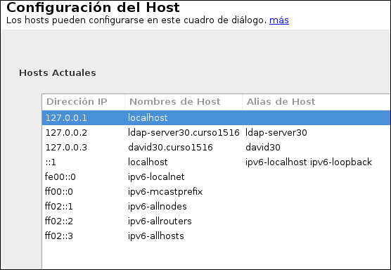

```
Curso           : 201920, 201819
Software        : 389-DS, OpenSUSE
Tiempo estimado :
Comentarios     : REVISAR la parte de autenticación con FreeIPA+389-DS
```

---

# Servidor 389-DS - OpenSUSE

> Enlaces de interés:
>
> * VÍDEO Teoría [¿Qué es LDAP?](http://www.youtube.com/watch?v=CXe0Wxqep_g)
> * VÍDEO Teoría [Los ficheros LDIF](http://www.youtube.com/watch?v=ccFT94M-c4Y)


## Introducción

Hay varias herramientas que implementan el servidor de directorios LDAP (389-DS, OpenLDAP, Active Directory, etc).

Según la siguiente noticia [Red Hat y Suse retiran su apoyo a OpenLDAP2](https://www.ostechnix.com/redhat-and-suse-announced-to-withdraw-support-for-openldap/). or este motivo hemos decido a partir de noviembre de 2018 cambiar OpenLDAP2 por 389-DS. En esta guía vamos a instalar y configurar del servidor LDAP con 389-DS.

## Entrega

Ejemplo de rúbrica:

| Sección               | Muy bien (2) | Regular (1) | Poco adecuado (0) |
| --------------------- | ------------ | ----------- | ----------------- |
| (2.3) Comprobar el servicio           | | | |
| (3.3) Browser LDAP: Usuarios y grupos | | | |

---

# 1. Prerequisitos

> Enlaces de interés sobre 389-DS:
>
> * [389 Directory Server Documentation](http://directory.fedoraproject.org/docs/389ds/documentation.html)
> * [389-DS installation](https://access.redhat.com/documentation/en-us/red_hat_directory_server/10/html/installation_guide/)

## 1.1 Nombre de equipo FQDN

* Vamos a usar una MV OpenSUSE para montar nuestro servidor LDAP con:
    * [Configuración MV](../../global/configuracion/opensuse.md)
* Nuestra máquina debe tener un FQDN.
    * Nombre equipo: `ldapXX.curso1920` en `/etc/hostname`
    * Además en `/etc/hosts` añadiremos:

```
172.19.XX.31   ldapXX.curso1920   ldapXX
```

> Veamos imagen de ejemplo:
>
> 

* Comprobar con `hostname -a`, `hostname -d` y `hostname -f`

## 1.2 Opening the Required Ports in the Firewall

* `systemctl status firewalld`, comprobar el estado del cortafuegos. Debe estar en ejecución.
* `systemctl enable firewalld`, activar contafuegos en el inicio del sistema.
* `systemctl start firewalld`, iniciar el cortafuegos.  
* `firewall-cmd --permanent --add-port={389/tcp,636/tcp,9830/tcp}
`, abrir determinados puertos en el cortafuegos usando la herramienta  "firewall-cmd"
* `firewall-cmd --reload`, recargar la configuración del cortafuegos para asegurarnos de que se han leído los nuevos cambios.

---

# 2. Instalar el Servidor LDAP

Enlaces de interés:
* https://directory.fedoraproject.org/docs/389ds/howto/quickstart.html#installing-the-software

## 2.1 Script de Perl

* Abrir una consola como root.
* Instalar `zypper in 389-ds`
* Ahora debemos tener un script en `/usr/sbin/setup-ds.pl`.
    * `find / -name setup-ds.pl`, para buscar el script en el sistema.

Veamos un resumen de la salida del script:
```
==================================================
Choose a setup type:
   1. Express
   2. Typical
   3. Custom

Choose a setup type [2]:

==================================================
Enter the fully qualified domain name of the computer

Computer name [ldap42]: ldap42.curso1920

==================================================
System User [dirsrv]:
System Group [dirsrv]:

==================================================
The standard directory server network port number is 389.

Directory server network port [389]:

==================================================
Each instance of a directory server requires a unique identifier.

Directory server identifier [ldap42]:

==================================================
The suffix is the root of your directory tree.  The suffix must be a valid DN.

Suffix [dc=curso1920]: dc=ldap42,dc=curso1920

===================================================
Certain directory server operations require an administrative user.

Directory Manager DN [cn=Directory Manager]: cn=admin

ImportError: No module named selinux
Your new DS instance 'ldap-server42' was successfully created.
Exiting . . .
Log file is '/tmp/setupuofQkd.log'
```

> **IMPORTANTE**: Recordar el nombre y clave de nuestro usuario administrador del servidor de directorios LDAP

## 2.2 Comprobamos el servicio

* `systemctl status dirsrv@ldapXX`, comprobar si el servicio está en ejecución.
* `ps -ef |grep ldap`, para comprobar si el demonio está en ejecución.
* `nmap -Pn ldapXX | grep -P '389|636'`, para comprobar que el servidor LDAP es accesible desde la red.

> * `systemctl enable dirsrv@ldapXX`, activar al inicio.
> * `systemctl start dirsrv@ldapXX`, iniciar el servicio.

* `ldapsearch -x -b "dc=ldap42,dc=curso1920"`, muestra el contenido de nuestra base de datos LDAP.

---

# 3. Browser LDAP

## 3.1 Instalar browser LDAP

Hay varias herramientas que pueden servir como browser LDAP:
* [ldapadmin](http://www.ldapadmin.org/).
* [phpLDAPadmin](http://phpldapadmin.sourceforge.net/wiki/index.php/Main_Page)
* gq
* mozldap-tools
* etc

Podemos usar cualquiera. Aunque suele ser recomendable usar la que venga por defecto con nuestra distribución.
* Instalar un browser LDAP.

## 3.2 Browser LDAP

* Usar un browser LDAP para comprobar el contenido del servidor de directorios LDAP:
    * `File -> Preferencias -> Servidor -> Nuevo`
    * URI = `ldap://ldapXX`
    * Base DN = `dc=ldapXX, dc=curso1920`
    * Admin user = `cn=admin, dc=ldapXX, dc=curso1920`.
* ¿Tenemos creadas las unidades organizativas: `groups` y `people`?

## 3.3 Crear usuarios y grupos dentro del LDAP

> Enlaces de interés:
>
> * [How To Set Up Centralized Linux Authentication with FreeIPA on CentOS 7](https://www.digitalocean.com/community/tutorials/how-to-set-up-centralized-linux-authentication-with-freeipa-on-centos-7)
> * [ Crear usuarios y grupos LDAP ](https://es.opensuse.org/Ingreso_de_usuarios_y_grupos_en_LDAP_usando_YaST)
> * VIDEO [LPIC-2 202 LDAP Client Usage](http://www.youtube.com/embed/ZAHj93YWY84).

En este punto vamos a escribir información dentro del servidor de directorios LDAP.
* `Yast -> Usuarios Grupos -> Filtro -> LDAP`.
* Crear el grupo `villanos` (Estos se crearán dentro de la `ou=groups`).
* Crear los usuarios `drinfierno`, `baron` (Estos se crearán dentro de la `ou=people`).
* Usar el browser LDAP para consultar/comprobar el contenido de la base de datos LDAP.
* `ldapsearch -x -L -u -t "(uid=nombre-del-usuario)"`, comando para consultar en la base de datos LDAP la información del usuario con uid concreto.

---
# 4. Cliente para autenticación LDAP

Ahora vamos a configurar otra MV GNU/Linux para que podamos hacer autenticación en ella, pero usando los usuarios y grupos definidos en el servidor de directorios LDAP.

## 4.1 Preparativos

Vamos a otra MV.
* SO OpenSUSE.
* [Configuración MV](../../global/configuracion/opensuse.md)
* Nombre equipo: `1er-apellido-alumnoXXg2`
* Dominio: `curso1920`
* Asegurarse que tenemos definido en el fichero `/etc/hosts` del cliente, el nombre DNS con su IP correspondiente:

```
172.19.XX.31   ldapXX.curso1920   ldapXX   
127.0.0.2      1er-apellidoXXg2.curso1920   1er-apellidoXXg2
```

## 4.2 Comprobación

* `nmap -Pn ldapXX | grep -P '389|636'`, para comprobar que el servidor LDAP es accesible desde la MV cliente.
* Usar un browser LDAP en el cliente para comprobar que se han creado bien los usuarios.
    * `File -> Preferencias -> Servidor -> Nuevo`
    * URI = `ldap://ldapXX`
    * Base DN = `dc=ldapXX, dc=curso1920`

## 4.3 Instalar y configurar la autenticación

Vamos a configurar de la conexión del cliente con el servidor LDAP.

* Debemos instalar el paquete `yast2-auth-client`, que nos ayudará a configurar la máquina para autenticación.
* Ir a `Yast -> LDAP y cliente Kerberos`.
* Configurar como la imagen de ejemplo. Al final usar la opción de `Probar conexión`


## 4.4 Comprobamos desde el cliente

* Vamos a la consola con nuestro usuario normal, y probamos lo siguiente:
```
getent group villanos           # Comprobamos los datos del grupo
cat /etc/group | grep villanos  # El grupo NO es local

getent passwd baron             # Comprobamos los datos del usuario
cat /etc/passwd | grep baron    # El usuario NO es local
```

---

# 5. Autenticación

Con autenticacion LDAP prentendemos usar la máquina servidor LDAP, como repositorio centralizado de la información de grupos, usuarios, claves, etc. Desde otras máquinas conseguiremos autenticarnos (entrar al sistema) con los usuarios definidos no en la máquina local, sino en la máquina remota con LDAP. Una especie de *Domain Controller*.

* Ir a la MV cliente.
* Iniciar sesión gráfica con algún usuario LDAP.
* Iniciar sesión con usuario local.
* Abrir una consola y hacer lo siguiente:
```
id drinfierno
finger drinfierno
su -l drinfierno   # Entramos con el usuario definido en LDAP
```

> **Si tenemos problemas al reiniciar la MV cliente**
>
> Hacer lo siguiente:
> * Iniciar MV con Knoppix
> * Deshacer los cambios ldap en el fichero `/etc/nsswitch.conf`
>     * `passwd: files nis ldap`
>     * `shadow: files nis`
>     * `group: files nis ldap`
> * Reiniciar MV cliente
> * Repetir configuración Yast.

---

# ANEXO

## Plataforma de autenticación gobcan

```
Página Principal / ► Entrar al sitio
El módulo LDAP no puede conectarse a ninguno de los servidores:
Server: 'ldap://directorio.gobiernodecanarias.net/',
Connection: 'Resource id #29', Bind result: ''

Más información sobre este error
```

## 2.3 Comprobar contenido con ldapsearch

Para obtener todos los objetos en un directorio a partir de cierta base (dc=ldap42, dc=curso1920):

```
ldapsearch -z 0 -H ldap://localhost:389 -W -D "cn=admin,dc=ldap42, dc=curso1920" -b "dc=ldap42, dc=curso1920" "(objectclass=*)
```

| Campo | Descripción |
| ----- | ----------- |
| -z 0  | evita cortar la respuesta una vez alcanzado cierto límite (cantidad de entradas) |
| -H ldap://localhost:389 | Consulta el servidor LDAP en el puerto 389 del host local.|
| -W    | Se solicita la contraseña para el método de autenticación simple de manera interactiva |
| -D "cn=admin, dc=ldap42, dc=curso1920" | El usuario con el cual se autentica en el servidor LDAP |
| -b "dc=ldap42, dc=curso1920" | base desde donde comenzar la búsqueda|
| "(objectclass=*)" | Filtro para la búsqueda (en este ejemplo todos los objetos, este a su vez es el filtro por defecto). |
