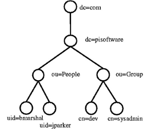

```
Curso       : 202122, 202021
Area        : Sistemas operativos, Servicio de Directorio LDAP
Descripción : Montar un servicio de directorio 389-DS
              Usar comandos LDAP para crear registros y consultar los datos
Requisitos  : Servidor 389-DS y SO OpenSUSE
Tiempo      : 5 horas
Ult.Cambios : Se quita browser ldap por fallos de las app
              Se pasa autenticación desde cliente a otra actividad
              Se añaden comandos ldap para creación de usuarios
```

# Servicio de Directorio con comandos

> Enlaces de interés: VÍDEO Teoría [¿Qué es LDAP?](http://www.youtube.com/watch?v=CXe0Wxqep_g)



### ¿Que es LDAP?

> Extraído de:
> * [Curso de LDAP en GNU/Linux](https://docplayer.es/1981696-Curso-de-ldap-en-gnu-linux-60-horas.html) Página 7.

LDAP en inglés Lightweight Directory Access Protocol. Traducido   al   español su significado es: Protocolo Ligero para Acceder al Servicio de Directorio, ésta implementación se basa en un conjunto de estándares de redes de computadoras (X.500) sobre el servicio de directorios.  

LDAP se ejecuta sobre TCP/IP o sobre otros servicios de transferencia   orientado a conexión; que permite el acceso a los datos de un directorio ordenado y distribuido para buscar información.

Habitualmente se almacena información de los usuarios que conforman
una red de computadores, como por ejemplo el nombre de usuario, contraseña, directorio hogar, etc. Es posible almacenar otro tipo de información tal como, bebida preferida, número de teléfono celular, fecha de cumpleaños, etc.

En  conclusión, LDAP es un protocolo de acceso unificado a un conjunto  de información sobre los usuarios de una red de computadores

### ¿Qué tipo de información se puede almacenar en un directorio?

En principio en un servicio de directorio se puede almacenar cualquier tipo de información. Como por ejemplo, nombre, dirección de habitación, nombre de la mascota, música preferida, bebida favorita, etc. Sin embargo, la información que se almacena es aquella que permita organizar de manera jerárquica todos los usuarios de la red. Estructurar la información de los usuarios de la red es de utilidad a la hora de restringir el acceso a los servicios y recursos de la red; Permitiendo gestionar con mayor facilidad la red.

## Entrega

Ejemplo de rúbrica:

| Sección | Muy bien (2) | Regular (1) | Poco adecuado (0) |
| ------- | ------------ | ----------- | ----------------- |
| (2.4) Comprobar contenido del DS LDAP | | | |
| (3.3) Comprobar nuevo usuario | | | |
| (4.3) Comprobar los usuarios creados | | | .|

# 1. Prerequisitos

> Enlaces de interés:
>
> * https://doc.opensuse.org/documentation/leap/archive/15.3/security/html/book-security/cha-security-ldap.html
> * [Configuración básica 389-DS](https://www.javieranto.com/kb/GNU-Linux/pr%C3%A1cticas/Administraci%C3%B3n%20b%C3%A1sica%20389DS/)
> * https://directory.fedoraproject.org/docs/389ds/howto/quickstart.html

## 1.1 Nombre de equipo FQDN

* Vamos a usar una MV OpenSUSE para montar nuestro servidor LDAP ([Configuración MV](../../global/configuracion/opensuse.md)).
* Revisar `/etc/hostname`. Nuestra máquina debe tener un FQDN=`serverXXg.curso2021`.
* Revisar `/etc/hosts`

```
127.0.0.2   serverXXg.curso2021   serverXXg
```

* Comprobar salida de: `hostname -a`, `hostname -d` y `hostname -f`.

# 2. Instalar el Servidor LDAP

Hay varias herramientas que implementan el servidor de directorios LDAP (389-DS, OpenLDAP, Active Directory, etc). Según parece [Red Hat y Suse retiran su apoyo a OpenLDAP2](https://www.ostechnix.com/redhat-and-suse-announced-to-withdraw-support-for-openldap/), por este motivo, hemos decido a partir de noviembre de 2018 cambiar OpenLDAP2 por 389-DS.

En esta guía vamos a instalar y configurar del servidor LDAP con 389-DS usando comandos.

## 2.1 Instalación del paquete

* Abrir una consola como root.
* `zypper in 389-ds`, instalar el script de instalación.
* `rpm -qa | grep 389-ds`, comprobar que la versión es >= 1.4.*

## 2.2 Configurar la instancia

* Crear el fichero `/root/instance.inf` con el siguiente contenido. Este fichero sirve para configurar el servidor:

```
# /root/instance.inf
[general]
config_version = 2

[slapd]
# Por defecto el administrador LDAP será "cn=Directory Manager"
# root_dn = cn=admin
root_password = YOUR_ADMIN_PASSWORD_HERE

# Por defecto el nombre de la instancia es "localhost"
# instance_name = nombre-alumnoXX

[backend-userroot]
sample_entries = yes
suffix = dc=ldapXX,dc=curso2021
```

* `dscreate from-file /root/instance.inf`, creamos una nueva instancia.
* `dsctl localhost status`, comprobar el estado actual de la instancia de la base de datos LDAP

> NOTA: Si queremos eliminar una instancia de LDAP que ya tenemos creada haremos lo siguiente:
> * `dsctl -l`, muestra los nombres de todas las instancias.
> * `dsctl localhost stop`, para parar la instancia.
> * `dsctl localhost remove --do-it`,para eliminar la instancia.

* Creamos el fichero `/root/.dsrc` con el siguiente contenido. Este fichero sirve para configurar los permisos para acceder a la base de datos como administrador:

```
[localhost]
# Note that '/' is replaced to '%%2f'.
# uri = ldapi://%%2fvar%%2frun%%2fslapd-NOMBREDELAINSTANCIA.socket
uri = ldapi://%%2fvar%%2frun%%2fslapd-localhost.socket
basedn = dc=ldapXX,dc=curso2021
binddn = cn=Directory Manager
```

> NOTA:
>
> * Cada vez que aparece ldapXX, hay que cambiar XX por el identificador de cada alumno.
> * Recordar el nombre y clave de nuestro usuario administrador del servidor de directorios LDAP.
> * Los ficheros de configuración de nuestro servicio/instancia los tenemos en `/etc/dirsrv/slapd-localhost`
> * El fichero de configuración `/etc/dirsrv/slapd-localhost/dse.ldif` contiene los parámetros principales del servicio de directorio. Como el DN de la Base, del usuario administrador, clave, etc.

## 2.3 Abrir los puertos del cortafuegos

Podemos abrir los puertos "ldap" y "ldaps" por el cortafuegos de Yast, o usar los comandos:

```
sudo firewall-cmd --add-service=ldap --zone=public
sudo firewall-cmd --add-service=ldaps --zone=public
sudo firewall-cmd --runtime-to-permanent
```

## 2.4 Comprobamos el servicio

* `systemctl status dirsrv@localhost`, comprobar si el servicio está en ejecución.
* `nmap -Pn serverXX | grep -P '389|636'`, para comprobar que el servidor LDAP es accesible desde la red. En caso contrario, comprobar cortafuegos.

## 2.5 Comprobamos el acceso al contenido del LDAP

* `ldapsearch -b "dc=ldapXX,dc=curso2021" -x | grep dn`, muestra el contenido de nuestra base de datos LDAP. "dn" significa nombre distiguido, es un identificador que tiene cada nodo dentro del árbol LDAP.
* `ldapsearch -H ldap://localhost -b "dc=ldapXX,dc=curso2021" -W -D "cn=Directory Manager" | grep dn`, en este caso hacemos la consulta usando usuario/clave.

| Parámetro                   | Descripción                |
| --------------------------- | -------------------------- |
| -x                          | No se valida usuario/clave |
| -b "dc=ldap42,dc=curso2021" | Base/sufijo del contenido  |
| -H ldap://localhost:389     | IP:puerto del servidor     |
| -W                          | Se solicita contraseña     |
| -D "cn=Directory Manager"   | Usuario del LDAP           |

# 3. Usuarios LDAP

> Enlaces de interés: [Consultas a directorios LDAP utilizando ldapsearch](https://www.linuxito.com/gnu-linux/nivel-alto/1023-consultas-a-directorios-ldap-utilizando-ldapsearch)

## 3.1 Buscar Unidades Organizativas

Deberían estar creadas las OU People y Groups, es caso contrario hay que crearlas (Consultar ANEXO). Ejemplo para buscar las OU:

```
ldapsearch -H ldap://localhost:389 \
           -W -D "cn=Directory Manager" \
           -b "dc=ldapXX,dc=curso2021" "(ou=*)" | grep dn
```

> * Importante: No olvidar especificar la base (-b). De lo contrario probablemente no haya resultados en la búsqueda.
> * `"(ou=*)"` es un filtro de búsqueda de todas las unidades organizativas.
> * `"(uid=*)"` es un filtro de búsqueda de todos los usuarios.

## 3.2 Agregar usuarios

> Enlaces de interés: VÍDEO Teoría [Los ficheros LDIF](http://www.youtube.com/watch?v=ccFT94M-c4Y)

Uno de los usos más frecuentes para el directorio LDAP es para la administración de usuarios. Vamos a utilizar ficheros **ldif** para agregar usuarios.

* Fichero `mazinger-add.ldif` con la información para crear el usuario `mazinger` (Cambiar el valor de dn por el nuestro):

```
# mazinger, people, ldapXX.curso2122
dn: uid=mazinger,ou=people,dc=ldapXX,dc=curso2122
objectClass: top
objectClass: nsPerson
objectClass: nsAccount
objectClass: nsOrgPerson
objectClass: posixAccount
uid: mazinger
cn: mazinger
displayName: mazinger
uidNumber: 2001
gidNumber: 100
homeDirectory: /home/mazinger
loginShell: /bin/bash
userPassword: ESCRIBIR LA CONTRASEÑA EN TEXTO PLANO
```

> WARNING: Los valores de cada parámetro no deben tener espacios extra al final de la línea, porque provoca un error de sintáxis.

* `ldapadd -x -W -D "cn=Directory Manager" -f mazinger-add.ldif`, para escribir los datos del fichero **ldif** anterior dentro de LDAP.

## 3.3 Comprobar el nuevo usuario

Estamos usando la clase `posixAccount`, para almacenar usuarios dentro de un directorio LDAP. Dicha clase posee el atributo `uid`. Por tanto, para listar los usuarios de un directorio, podemos filtrar por `"(uid=*)"`.

* `ldapsearch -W -D "cn=Directory Manager" -b "dc=ldapXX,dc=curso2021" "(uid=mazinger)"`, para comprobar si se ha creado el usuario correctamente en el LDAP.

> INFO: Para **eliminar usuario del árbol del directorio** hacemos lo siguiente:
> * Crear un archivo `mazinger-delete.ldif`:
>
> ```
> dn: uid=mazinger,ou=people,dc=ldapXX,dc=curso2021
> changetype: delete
> ```
>
> * Ejecutamos el siguiente comando para eliminar un usuario del árbol LDAP: `ldapmodify -x -D "cn=Directory Manager" -W -f mazinger-delete.ldif`

# 4. Agregar más usuarios

## 4.1 Agregar los siguientes usuarios

| Full name       | Account(uid) | uidNumber | Clave encriptada SHA  |
| --------------- | ------------ | --------- | --------------------- |
| Koji Kabuto     | koji         | 2002      | Contraseña encriptada |
| Boss            | boss         | 2003      | Contraseña encriptada |
| Doctor Infierno | drinfierno   | 2004      | Contraseña encriptada |

Vamos a agregar al LDAP los usuarios de la tabla, pero en este caso vamos usar
la herramienta **pwdhash** para generar las claves encriptadas dentro de los ficheros "ldif".

## 4.2 Comprobar desde el cliente

* Ir a la MV cliente LDAP.
* `nmap -Pn IP-LDAP-SERVER`, comprobar que el puerto LDAP del servidor está abierto.
Si no aparecen los puertos abiertos, entonces revisar el cortafuegos.
* `ldapsearch -H ldap://IP-LDAP-SERVER -W -D "cn=Directory Manager" -b "dc=ldapXX,dc=curso2021" "(uid=*)" | grep dn` para consultar los usuarios LDAP que tenemos en el servicio de directorio remoto.

---
# ANEXO

## Crear unidades organizativas (OU)

* Fichero `ou_people.ldif` para la crear la OU "people":

```bash
dn: ou=people,dc=apellidoXX,dc=asir
ou: people
objectclass: organizationalUnit
```

* Ejecutar : `ldapadd -x -W -D "cn=admin,dc=apellidoXX,dc=asir" -f ou_people.ldif`
* Fichero `ou_group.ldif`, para crear la UO "group":

```bash
dn: ou=group,dc=apellidoXX,dc=asir
ou: group
objectclass: organizationalUnit
```

* Ejecutar `ldapadd -x -W -D "cn=admin,dc=apellidoXX,dc=asir" -f ou_group.ldif`

## Crear los grupos

* Fichero `g_users.ldif`, para crear el grupo "users":

```bash
dn: cn=users,ou=group,dc=apellidoXX,dc=asir
objectclass: posixGroup
objectclass: top
cn: users
userPassword: {crypt}*
gidNumber: 100
```

* Ejecutar los comandos:

```bash
ldapadd -x -W -D "cn=admin,dc=apellidoXX,dc=asir" -f users.ldif  # Agregar registro
ldapsearch -x -b "dc=apellidoXX,dc=asir" # Comprobar los resultados.
```

## Formato LDIF antiguo

En noviembre de 2021 se decide dejar de usar este fichero LDIF porque provocaba
problemas en el momento de realizar la autenticación.

```
dn: uid=mazinger,ou=people,dc=ldapXX,dc=curso2021
uid: mazinger
cn: Mazinger Z
objectClass: account
objectClass: posixAccount
objectClass: top
objectClass: shadowAccount
userPassword: {CLEARTEXT}escribir la clave secreta
shadowLastChange: 14001
shadowMax: 99999
shadowWarning: 7
loginShell: /bin/bash
uidNumber: 2001
gidNumber: 100
homeDirectory: /home/mazinger
gecos: Mazinger Z
```
