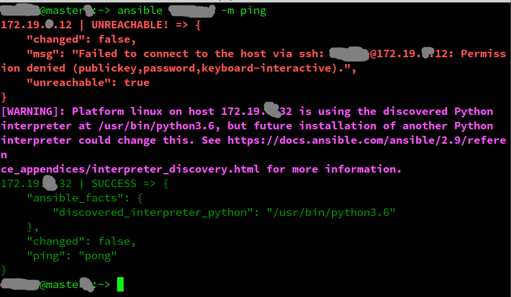
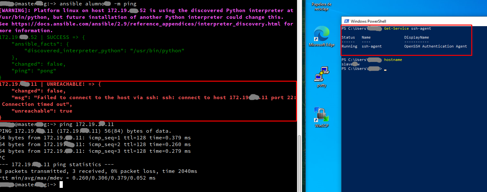

# Problemas con Ansible

# 1. Fallo SSH en MV Windows

**Descripción:** Ando haciendo la practica de ansible, y el servidor SSH (de windows) me deniega el acceso y no se si me falta algo.

# 2. Fallo SSH en MV Windows

**Descripción:** Tengo un problema en el punto 3 de la actividad de Ansible.

Tengo conectividad en las máquinas y el servicio SSH está en funcionamiento en la MV Slave de Linux como la de Windows.
El problema solo me ocurre con la máquina de Windows.

