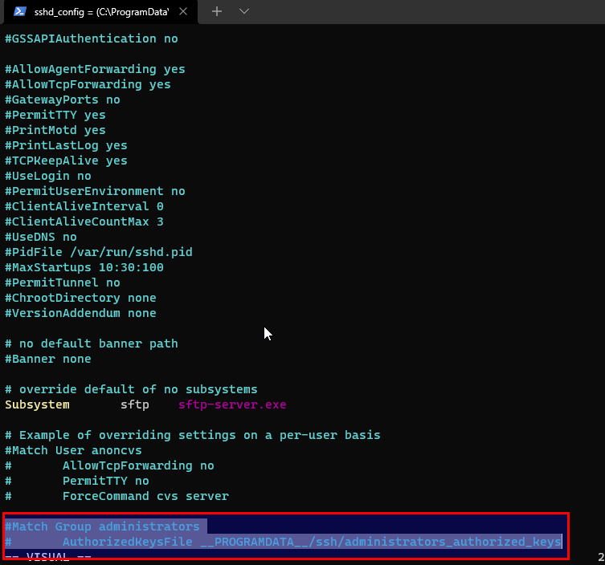
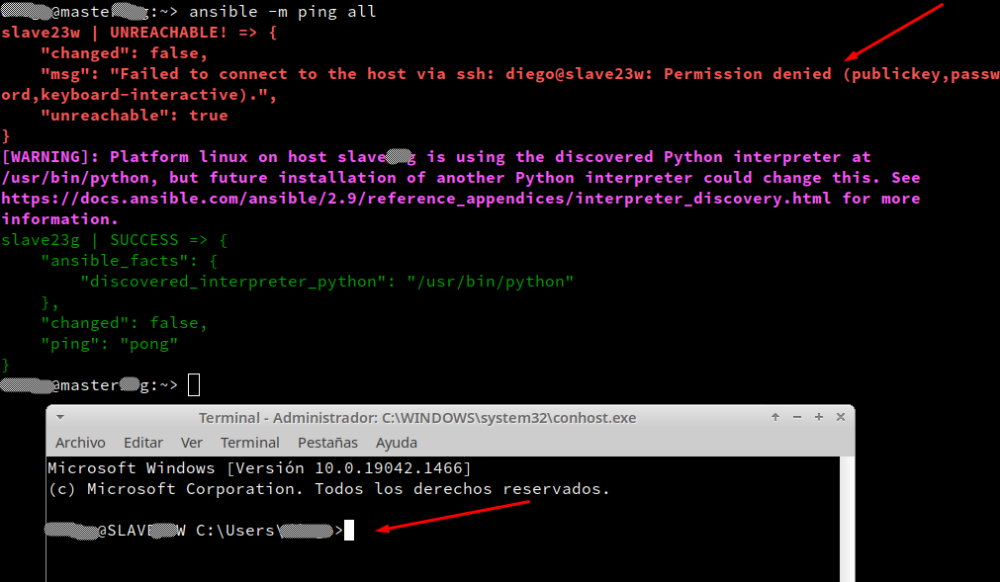
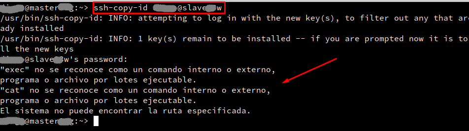
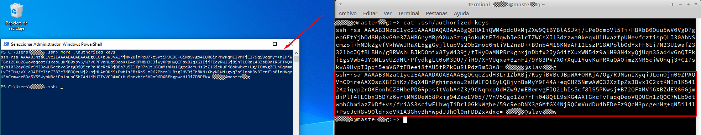
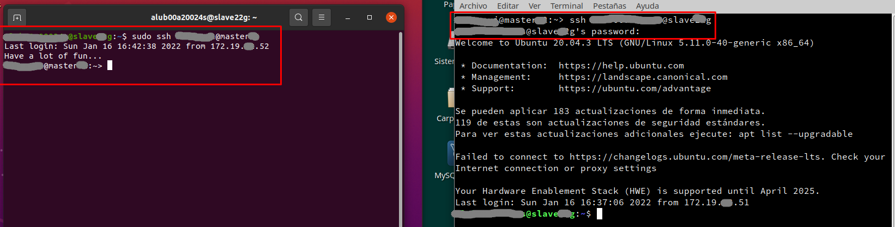

# Problemas con Ansible

# 1. Fallo SSH en MV Windows

**Descripción:** Ando haciendo la practica de ansible, y el servidor SSH (de windows) me deniega el acceso y no se si me falta algo.


**Alumno**: En versiones actuales, las claves públicas no funcionan ya que ahora, si el usuario forma parte del grupo de administradores, se almacenan por defecto en `C:\ProgramData\ssh\administrators_authorized_keys`, en lugar de `C:\Users\nombreusuario\.ssh\authorized_keys`.

Aun así, poniendo las claves públicas en `C:\ProgramData\ssh\administrators_authorized_key`, siendo administrador, no funciona.

Para que funcione, hay que ir al archivo de configuración en `C:\ProgramData\ssh\sshd_config` y comentar las dos últimas líneas:

```
# Match Group administrators
#     AuthorizedKeysFile __PROGRAMDATA__/ssh/administrators_authorized_keys
```

Después reiniciamos el servicio, abriendo una terminal y ejecutando este comando PowerShell: `Restart-Service -Name "sshd"`

> En CMD sería: `sc stop sshd` y `sc start sshd`

En esta imagen vemos las líneas (resaltadas) que hay que comentar.




# 2. Fallo SSH en MV Windows

**Descripción:** Tengo un problema en el punto 3 de la actividad de Ansible.

Tengo conectividad en las máquinas y el servicio SSH está en funcionamiento en la MV Slave de Linux como la de Windows.
El problema solo me ocurre con la máquina de Windows.


**Alumno**: Desde GNU/Linux a Windows no me deja, pero desde Windows a GNU/Linux si. Puse una regla del firewall de Windows para el servicio SSH y tampoco.

Lo arreglé. Me instalé el OpenSSH Server y ya me va perfecto.



Ahora hay un problema de SSH permisso denegado por las claves SSH.

**Profesor**: El error te está indicando un problema con las claves SSH.
Hay que poder entrar al SSH de Windows desde GNU/Linux sin poner la clave o usar ansible desde GNU/Linux... con el parámetro adecuado... que nos pregunte la clave SSH de Windows como muestra el vídeo.

**Alumno**: cuando intento hacer el "ssh-copy-id" de master a slaveXXw tengo un problema y no me deja.



**Alumno2:** Ese comando solo funciona para GNU/Linux. "exec" y "cat" son comandos exclusivos de Unix.

**Alumno1:** Si vale, pero entonces ¿se ha hecho bien el comando ssh-copy-id?.
Es que me sigue pidiendo la contraseña cuando accedo desde OpenSuse a Windows pero si es al revés no me pide nada.



**Profesor**:
* MasterXXg: tiene la clave pública en /home/alumno/.ssh/id_rsa.pub
* ClientXXg: tiene la clave pública del usuario del master en /home/alumno/.ssh/authorized_keys
* ClientXXw: tiene la clave pública del usuario de master en C:\Users\alumno\.ssh\authorized_keys

La imagen de clientXXw tiene sentido pero la del masterXXg no porque tienes que mirar en el id_rsa.pub.

# 3. Acceso SSH sin clave a Windows

**Descripción**: No me deja entrar a la máquina slaveXXg por SSH sin pedirme la contraseña, pero al revés si me deja y he hecho lo mismo en ambos casos.



**Profesor**:
* En la primera imagen vemos a clientXXg accediendo vía SSH a masterXXg sin clave... esto NO hace falta para la práctica.
* En la segunda imagen vemos a masterXXg accediendo vía SSH a clientXXg... pero solicita la clave. Aquí es donde hace falta. Desde el masterXXg tienes que copiar la clave pública hacia clientXXg. Igual que hiciste en Ubuntu... debes hacerlo en OpenSUSE. El SSH funciona igual en ambos sistemas.

**PLAN B**
Se puede usar ansible sin tener configuradas las claves públicas en el cliente. En los vídeos que les pasé está indicado cómo se hace. ¿Vieron los vídeos?

Existe un parámetro que se añade al comando "ansible" para que nos solicite la clave SSH antes de intentar la conexión. Con esto NO es necesario tener la clave pública en los clientes... sólo que si la ponen todo va más rápido.
