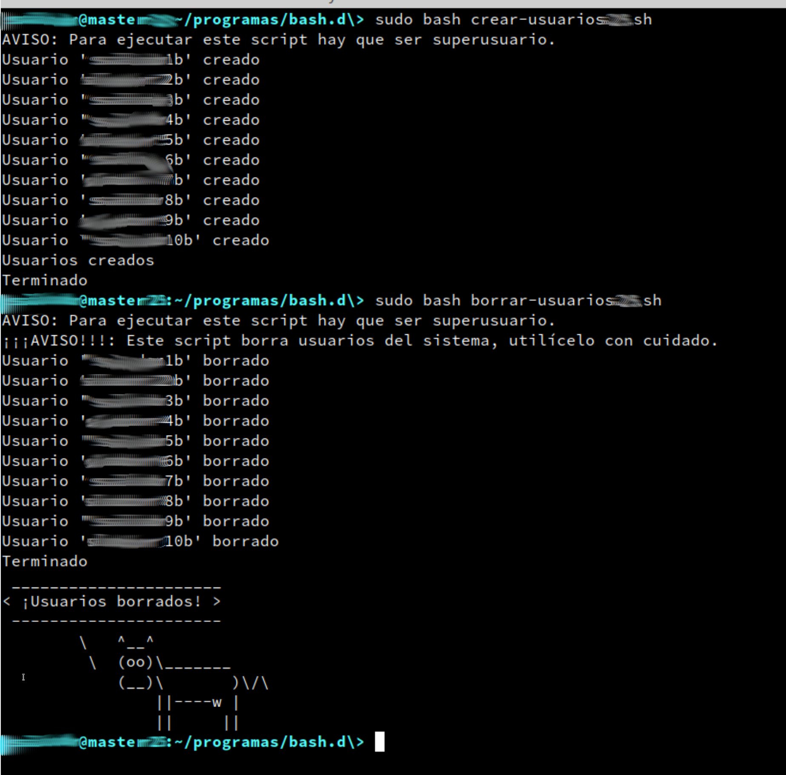
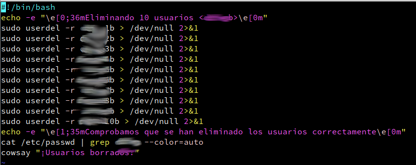

```
Curso : 202122
FAQ   : Scripting, comandos
```

# Preguntas frecuentes asociadas a problemas de Scripting


## 1. Pero secuencial, ¿qué significa exactamente?

**Alumno**: Pero secuencial, ¿qué significa exactamente?
Como si lo tuviera que hacer 10 veces lo de crear usuarios, ¿te refieres a eso?

**Profesor**: En un script sólo secuencial:
1) No puedes usar condicionales.
2) No puedes usar bucles, ni iteradores.
3) Sólo instrucciones en secuencia.... una detrás de otra.

Ahora ¿hazme la pregunta que te viene a la cabeza? :-)

## 2. Comprobar si existe un usuario X

**Profesor**: Hay varias formas de comprobar si existe un usuario X. Las pongo de "mejor" a "peor"
* Usar el comando `getent`. El comando "getent passwd" devuelve la información de passwd, y el comando "getent shadow" la información de shadow, de usuarios locales o del dominio. ¿Recuerdas lo que era dominio?
* Usar el comando `id`.
* [REGULAR] Usar el comando `cat | grep XXX` sobre los ficheros de passwd o shadow.
* [MALA IDEA]: Comprobar si existe el HOME. Esto NO es buena idea porque puedes tener HOME sin existir el usuario.

## 3. Uso de colores

**Profesor**

El uso de colores esn Bash... es un poco "raro" pero funciona. En Ruby se puede usar el mismo sistema que Bash pero... mejor usaremos alguna de las siguientes gemas:
* colorize (https://rubygems.org/gems/colorize)
* rainbow (https://rubygems.org/gems/rainbow)

## 4. Warning de xcowsay (xhost)

**Alumno**: Quisiera solucionar un posible error que le pueda pasar a los demás.
Al eliminar ejecutar "xcowsay", aparece la siguiente advertencia:

```
(xcowsay:12979): Gtk-WARNING **: 10:23:35.419: cannot open display:
```

Al parecer, creo que es un problema de pantalla, ya que el comando no puede mostrarlo. Para solucionar el problema hacemos lo siguiente:

* Accedemos al usuario root con el comando su -.
* Accedemos al directorio donde tenemos los scripts con el comando cd /home/user/scripts.
* Ejecutamos el comando export DISPLAY=:0.0.
* Ejecutamos el comando xhost +.
* Ejecutamos el comando xhost +IP.DE.LA.MAQUINA.
* Volvemos a ejecutar el script.

Con esto debería funcionar... Me ha servido, así que si a alguien más le falla, prueben con esto.


**Profesor**: Me quedé pensando en la "solución" anterior. Creo que:
1) Solucionó el problema del Warning... pero creo que NO sabes bien por qué.
Te pido que me digas Si sabes lo que has hecho. ... quiero saber si entiendes lo que has hecho. Y si otros han hecho lo mismo... DEBEN EXPLICARLO.
2) Si entendiste el punto 1... entonces sabrás lo que pasó y se resuelve SIN HACER NADA. ¿Me siguen? En caso contrario, lo hablamos.

## 5. Warining "no crontab for user"

**Alumno**: Solución para el Warning "no crontab for user" que se muestra al borrar usuarios en OpenSUSE:

> Fuente: https://stackoverflow.com/questions/4880290/how-do-i-create-a-crontab-through-a-script

* Añadir la siguiente línea al script, sin las comillas dobles del inicio y el final, además hay que sustituir "USUARIO" por el usuario que estemos creando en ese momento. Para Bash hay que escribir la línea tal cual:

```
(crontab -u USUARIO -l 2>/dev/null; echo "*/5 * * * * /home/USUARIO") | crontab -u USUARIO -
```

> NOTA: La línea la creé a partir de varias soluciones del foro anterior, ya que ninguna de ellas funciona por separado, al menos las que probé

* Para Ruby hay que escribirla dentro de un `system(...)`.

Adjunto capturas utilizando el script en bash, antes (devel-crear-usuarios25.sh)


* y después (crear-usuarios25.sh) de añadir la línea.



**Profesor**: ¿Por qué funciona? ¿Lo sabes?

**Alumno2**: Yo lo hice de otra manera y más corta, poniendo en el comando la siguiente línea: `> /dev/null 2>&1`. Adjunto la captura.



**Profesor**: ¿Sabes por qué funciona? ¿Pero no es una buena idea?
Es una idea para "escapar temporalmente"

**Alumno2**: El '>' sirve para redireccionar la salida, '/dev/null' es un archivo pseudodispositivo que acepta y descarta todas las entradas, o sea no produce salidas. Y el apartado b) es un descriptor de archivo,ya que simplemente dice de redirigir el errór estándar a la salida estándar.

**Profesor**: Explícame:
1. ¿Qué es redireccionar la salida. ¿Qué salida?
2. ¿Qué es un pseudodispositivo?
3. ¿Qué entradas y salida son esas?
4. ¿Qué es un descriptor de archivo.
5. ¿Qué son salida estándar y error estándar?

¡Con tus palabras please!
