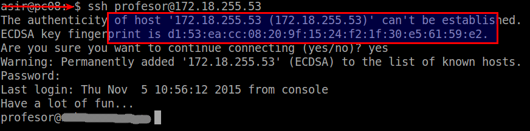
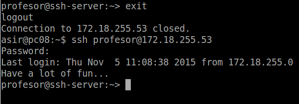

```
Cursos      : 202021, 201920, 201819, 201718, etc.
Area        : Sistemas operativos, acceso remoto
Descripción : Practicar con la herramienta de acceso remoto SSH
Requisitos  : SO GNU/Linux y SO Windows
Tiempo      : 8 sesiones
```

---
# Acceso remoto SSH

Ejemplo de rúbrica:

| Criterios             | Muy bien (2) | Regular (1) | Poco adecuado (0) |
| --------------------- | ------------ | ----------- | ----------------- |
| (2.2) Primera conexión SSH GNU/Linux       | | | |
| (3.2) Comprobar cambio clave servidor SSH  | | | |
| (5  ) Autenticación mediante clave pública | | | |
| (6  ) Uso de SSH como túnel para X         | | | |
| (8.1) Restricción sobre un usuario         | | |. |
| (9) Servidor SSH en Windows                | | |. |

## Introducción

* Atender a la explicación del profesor.
* Leer documentación proporcionada por el profesor.

Enlaces de interés:
* [Aumentar la seguridad servidor SSH](http://rm-rf.es/como-securizar-un-servidor-ssh/)
* [Hardening SSH](https://linux-audit.com/audit-and-harden-your-ssh-configuration)
* http://en.wikipedia.org/wiki/: Secure_Shell,VNC, NX_technology, Remote_Desktop_Protocol, Remote_Desktop_Services, X_Window_System_protocols_and_architecture, Comparison_of_remote_desktop_software

Entrega:
* Añadir informe al repositorio git. Etiqueta `ssh`.
* Incluir capturas de pantalla de cada apartado para confirmar que está funcionando.
* Además se mostrará al profesor la práctica funcionando en clase y se responderá a las preguntas que pudieran hacerse en dicho instante.

---
# 1. Preparativos

Vamos a necesitar las siguientes MVs:

| Función | Sistema Operativo    | IP        | Hostname |
| ------- |--------------------- | --------- | -------- |
| Un servidor SSH | GNU/Linux OpenSUSE | 172.AA.XX.31 | serverXXg |
| Un cliente SSH  | GNU/Linux OpenSUSE | 172.AA.XX.32 | clientXXg |
| Un servidor SSH | Windows Server     | 172.AA.XX.11 | serverXXs |
| Un cliente SSH  | Windows            | 172.AA.XX.12 | clientXXw |

## 1.1 Servidor SSH

* Configurar el servidor GNU/Linux con siguientes valores:
    * SO GNU/Linux: OpenSUSE - Sin entorno gráfico.
    * Nombre de equipo: `serverXXg`
    * [Configuración de las MV's](../../global/configuracion/opensuse.md)
    * Poner clave compleja al usuario root.
* Añadir en `/etc/hosts` los equipos `clientXXg` y `clientXXw` (Donde XX es el puesto del alumno).
* Para comprobar los cambios ejecutamos varios comandos. Capturar imagen:
```
ip a               # Comprobar IP, máscara y nombre interfaz de red
ip route           # Comprobar puerta de enlace
ping 8.8.4.4 -i 2  # Comprobar conectividad externa
host www.nba.com   # Comprobar el servidor DNS
ping clientXXg     # Comprobar conectividad con cliente GNU/Linux
ping clientXXw     # Comprobar conectividad con cliente Windows
lsblk              # Consultar particiones
blkid              # Consultar UUID de la instalación
```

Crear los siguientes usuarios en `serverXXg`:
* primer-apellido-del-alumno1
* primer-apellido-del-alumno2
* primer-apellido-del-alumno3
* primer-apellido-del-alumno4

## 1.2 Cliente GNU/Linux

* Configurar el cliente1 GNU/Linux con los siguientes valores:
    * SO OpenSUSE
    * [Configuración de las MV's](../global/configuracion/opensuse.md)
    * Nombre de equipo: `clientXXg`
* Añadir en `/etc/hosts` los equipos serverXXg, y clientXXw.
* Comprobar haciendo ping a ambos equipos.

## 1.3 Cliente Windows

* Instalar software cliente SSH en Windows. Para este ejemplo usaremos [PuTTY](http://www.putty.org/).
* Configurar el cliente2 Windows con los siguientes valores:
    * SO Windows
    * Nombre de equipo: `clientXXw`
    * [Configuración de las MV's](../../global/configuracion/windows.md)
* Añadir en `C:\Windows\System32\drivers\etc\hosts` los equipos serverXXg y clientXXg.
* Comprobar haciendo `ping` a ambos equipos.

---
# 2 Instalación del servicio SSH en GNU/Linux

* Instalar el servicio SSH en la máquina serverXXg. Por comandos o entorno gráfico.

> Instalación de SSH:
>
> * Desde la herramienta `yast -> Instalar Software`
> * Desde terminal `zypper search openssh` muestra los paquetes instalados o no con nombre openssh*.
> * Desde terminal `zypper install openssh`, instala el paquete OpenSSH.
>
> Los ficheros de configuración del servicio SSH se guardan en /etc/ssh.

## 2.1 Comprobación

* Desde el propio servidor, verificar que el servicio está en ejecución.
    * `systemctl status sshd`, esta es la forma habitual de comprobar los servicios.
    * `ps -ef|grep sshd`, esta es otra forma de comprobarlo mirando los procesos del sistema.


> Para poner el servicio enable, si no lo estuviera.:
>  * `systemctl enable sshd` por comandos
>  * `Yast -> servicios` por entorno gráfico

* `sudo lsof -i:22 -Pn`, comprobar que el servicio está escuchando por el puerto 22.

## 2.2 Primera conexión SSH desde cliente GNU/Linux

* Ir al cliente `clientXXg`.
* `ping serverXXg`, comprobar la conectividad con el servidor.
* `nmap -Pn serverXXg`, comprobar los puertos abiertos en el servidor (SSH debe estar open). Debe mostrarnos que el puerto 22 está abierto. Debe aparecer una línea como  "22/tcp open ssh". Si esto falla, debemos comprobar en el servidor la configuración del cortafuegos.


> Existe una herramienta gráfica para nmap, llamada nmapfe

Vamos a comprobar el funcionamiento de la conexión SSH desde cada cliente usando el usuario *1er-apellido-alumno1*.
* Desde el cliente GNU/Linux nos conectamos mediante `ssh 1er-apellido-alumno1@serverXXg`. Capturar imagen del intercambio de claves que se produce en el primer proceso de conexión SSH.



* A partir de ahora cuando nos volvamos a conectar sólo nos pide la contraseña:



* Comprobar contenido del fichero `$HOME/.ssh/known_hosts` en el equipo cliente. OJO el prompt nos indica en qué equipo estamos.
* ¿Te suena la clave que aparece? Es la clave de pública de la máquina del servidor.

Una vez llegados a este punto deben de funcionar correctamente las conexiones SSH desde el cliente. Comprobarlo.

## 2.3 Primera conexión SSH desde cliente Windows

* Desde el cliente Windows (usando `PuTTY`) nos conectamos al servidor SSH de GNU/Linux.
* Podremos ver el intercambio de claves que se produce en el primer proceso de conexión SSH. * ¿Te suena la clave que aparece? Es la clave de identificación de la máquina del servidor.
* Guardar la identificación del servidor.
* La siguiente vez que volvamos a usar PuTTY ya no debe aparecer el mensaje de advertencia porque hemos memorizado la identificación del servidor SSH. Comprobarlo.

---
# 3. Cambiamos la identidad del servidor

¿Qué pasaría si cambiamos la identidad del servidor?
Esto es, ¿Y si cambiamos las claves del servidor? ¿Qué pasa?

* Los ficheros `ssh_host*key` y `ssh_host*key.pub`, son ficheros de clave pública/privada
que identifican a nuestro servidor frente a nuestros clientes. Confirmar que existen
el en `/etc/ssh`,:

```
david@server42g:~> cd /etc/ssh/
david@server42g:/etc/ssh> vdir
total 576
-rw-r--r-- 1 root root   2375 oct  1 08:15 ldap.conf
-rw------- 1 root root 535929 oct  1 08:15 moduli
-rw-r--r-- 1 root root   2586 oct  1 08:15 ssh_config
-rw-r----- 1 root root   3776 oct  1 08:15 sshd_config
-rw------- 1 root root    668 jun 28 09:55 ssh_host_dsa_key
-rw-r--r-- 1 root root    610 jun 28 09:55 ssh_host_dsa_key.pub
-rw------- 1 root root    227 jun 28 09:55 ssh_host_ecdsa_key
-rw-r--r-- 1 root root    182 jun 28 09:55 ssh_host_ecdsa_key.pub
-rw------- 1 root root    411 jun 28 09:55 ssh_host_ed25519_key
-rw-r--r-- 1 root root    102 jun 28 09:55 ssh_host_ed25519_key.pub
-rw------- 1 root root    985 jun 28 09:55 ssh_host_key
-rw-r--r-- 1 root root    650 jun 28 09:55 ssh_host_key.pub
-rw------- 1 root root   1679 jun 28 09:55 ssh_host_rsa_key
-rw-r--r-- 1 root root    402 jun 28 09:55 ssh_host_rsa_key.pub
```

* Modificar el fichero de configuración SSH (`/etc/ssh/sshd_config`) para dejar una única línea: `HostKey /etc/ssh/ssh_host_rsa_key`. Comentar el resto de líneas con configuración HostKey.
Este parámetro define los ficheros de clave publica/privada que van a identificar a nuestro servidor. Con este cambio decimos que sólo se van a utilizar las claves del tipo RSA.

## 3.1 Regenerar certificados

Vamos a cambiar o volver a generar nuevas claves públicas/privadas que identifican nuestro servidor.
* Ir al servidor.
* Como usuario root ejecutamos: `ssh-keygen -t rsa -f /etc/ssh/ssh_host_rsa_key`. ¡OJO! No poner password al certificado.
* Reiniciar el servicio SSH: `systemctl restart sshd`.
* Comprobar que el servicio está en ejecución correctamente: `systemctl status sshd`

## 3.2 Comprobamos

* Comprobar qué sucede al volver a conectarnos desde los dos clientes, usando los  usuarios `1er-apellido-alumno2` y `1er-apellido-alumno1`. ¿Qué sucede?

> **Enlaces de interés**
>
> Cliente SSH para Windows:
>
> * [Learning Linux : Lesson 14 Using Public key Authentication with PuTTY ](https://youtu.be/xe599gD4b5E?list=PL3E447E094F7E3EBB)
>
> Servicio SSH en Windows:
>
> * [Tutorial FreeSShd](http://www.redeszone.net/windows/freesshd-para-windows-instalacion-y-manual-de-configuracion-de-freesshd-para-windows-servidor-ssh-y-sftp/)
> * [Configuración de OpenSSH para Windows7 con SSH Cygwin +Putty](http://www.taringa.net/post/linux/15562479/Configuracion-de-OpenSSH-en-Windows-7-SSH-Cygwin-Putty.html)
> * [Installing Cygwin and Starting the SSH Daemon](http://docs.oracle.com/cd/E24628_01/install.121/e22624/preinstall_req_cygwin_ssh.htm#EMBSC150)
> * En Windows, la información relativa a los know_hosts, se almacena en el registro. En la ruta `HKEY_CURRENT_USER/Software/SimonTaham/Putty/SSHHostKeys`. Para acceder al registro ejecutamos el comando `regedit`.

* Para solucionarlo... lee los mensajes de advertencia. ¡Ahí está todo lo que necesitas!

---
# 4. Personalización del prompt Bash

* Por ejemplo, podemos añadir las siguientes líneas al fichero de configuración del `1er-apellido-alumno1` en la máquina servidor (Fichero `/home/1er-apellido-alumno1/.bashrc`)

```
# Se cambia el prompt al conectarse vía SSH

if [ -n "$SSH_CLIENT" ]; then
   PS1="AccesoRemoto_\e[32m\u@\h:\e[0m \w\a\$ "
else
   PS1="\[$(pwd)\]\u@\h:\w>"
fi
```

* Además, crear el fichero el fichero `/home/1er-apellido-alumno1/.alias`,
donde pondremos el siguiente contenido:

```
alias c='clear'
alias g='geany'
alias p='ping'
alias v='vdir -cFl'
alias s='ssh'
```

* Comprobar funcionamiento de la conexión SSH desde cada cliente.

---
# 5. Autenticación mediante claves públicas

**Explicación:**

El objetivo de este apartado es el de configurar SSH para poder acceder desde el `clientXXg` sin necesidad de escribir la clave. Usaremos un par de claves pública/privada.

Para ello, vamos a configurar la autenticación mediante clave pública para acceder con nuestro usuario personal desde el equipo cliente al servidor con el usuario `1er-apellido-alumno4`. Vamos a verlo.

**Práctica**

Capturar imágenes de los siguientes pasos:
* Vamos a la máquina `clientXXg`.
* **¡OJO! No usar el usuario root**.
* Iniciamos sesión con nuestro el usuario **nombre-alumno** de la máquina `clientXXg`.
* `ssh-keygen -t rsa` para generar un nuevo par de claves para el usuario en:
    * `/home/nombre-alumno/.ssh/id_rsa`
    * `/home/nombre-alumno/.ssh/id_rsa.pub`
* Ahora vamos a copiar la clave pública (`id_rsa.pub`), al fichero "authorized_keys" del usuario remoto *1er-apellido-alumno4* que está definido en el servidor. Hay varias formas de hacerlo.
    * El modo recomendado es usando el comando `ssh-copy-id`. Ejemplo para copiar la clave pública del usuario actual al usuario remoto en la máquina remota: `ssh-copy-id 1er-apellido-alumno4@serverXXg`.

> Otra forma de hacerlo sería usando el programa de copia segura `scp`.
>
> * Comprobar que existe el directorio `/home/1er-apellido-alumno4/.ssh` en el servidor.
> * Copiamos el fichero `.ssh/id_rsa.pub` local al fichero `.ssh/authorized_keys` del usuario remoto en la máquina remota.

* Comprobar que ahora al acceder remotamente vía SSH
    * Desde `clientXXg`, NO se pide password.
    * Desde `clientXXw`, SI se pide el password.

---
# 6. Uso de SSH como túnel para X


> Enlaces de interés:
>
> * http://dustwell.com/how-x-over-ssh-really-works.html
> * http://www.vanemery.com/Linux/XoverSSH/X-over-SSH2.html

* Instalar en el servidor una aplicación de entorno gráfico (APP1) que no esté en los clientes. Por ejemplo Geany. Si estuviera en el cliente entonces buscar otra aplicación o desinstalarla en el cliente.
* Modificar servidor SSH para permitir la ejecución de aplicaciones gráficas, desde los clientes. Consultar fichero de configuración `/etc/ssh/sshd_config` (Opción `X11Forwarding yes`)
* Reiniciar el servicio SSH para que se lean los cambios de configuración.

Vamos a clientXXg.
* `zypper se geany`,comprobar que no está instalado el programa.
* Vamos a comprobar desde clientXXg, que funciona "geany" (del servidor).
    * `ssh -X primer-apellido-alumno1@serverXXg`, nos conectamos de forma remota al servidor, y ahora ejecutamos "geany" de forma remota.
    * **¡OJO!** El parámetro es `-X` en mayúsculas, no minúsculas.

---
# 7. Aplicaciones Windows nativas

Podemos tener aplicaciones Windows nativas instaladas en ssh-server mediante el emulador WINE.
* Instalar emulador Wine en el `serverXXg`.
* Ahora podríamos instalar alguna aplicación de Windows en el servidor SSH usando el emulador Wine. O podemos usar el Block de Notas que viene con Wine: wine notepad.
* Comprobar el funcionamiento del programa en serverXXg.
* Comprobar funcionamiento del programa, accediendo desde clientXXg.

> En este caso hemos conseguido implementar una solución similar a RemoteApps usando SSH.

---
# 8. Restricciones de uso

Vamos a modificar los usuarios del servidor SSH para añadir algunas restricciones de uso del servicio.

## 8.1 Restricción sobre un usuario

Vamos a crear una restricción de uso del SSH para un usuario:

* En el servidor tenemos el usuario `primer-apellido2`. Desde local en el servidor podemos usar sin problemas el usuario.
* Vamos a modificar SSH de modo que al usar el usuario por SSH desde los clientes tendremos permiso denegado.

Capturar imagen de los siguientes pasos:
* Consultar/modificar fichero de configuración del servidor SSH (`/etc/ssh/sshd_config`) para restringir el acceso a determinados usuarios. Consultar las opciones `AllowUsers`, `DenyUsers` (Más información en: `man sshd_config`)
* `/usr/sbin/sshd -t; echo $?`, comprobar si la sintaxis del fichero de configuración del servicio SSH es correcta (Respuesta 0 => OK, 1 => ERROR).
* Comprobarlo la restricción al acceder desde los clientes.

## 8.2 Restricción sobre una aplicación

Vamos a crear una restricción de permisos sobre determinadas aplicaciones.

* Crear grupo `remoteapps`
* Incluir al usuario `1er-apellido-alumno4` en el grupo `remoteapps`.
* Localizar un programa (Por ejemplo "geany"). Posiblemente tenga permisos 755.
* Poner al programa el grupo propietario "remoteapps".
* Poner los permisos del ejecutable del programa a 750. Para impedir que los usuarios que no pertenezcan al grupo puedan ejecutar el programa.
* Comprobamos el funcionamiento en el servidor en local.
* Comprobamos el funcionamiento desde el cliente en remoto (Recordar `ssh -X ...`).

---
# 9. Servidor SSH en Windows

* Configurar el servidor Windows con los siguientes valores:
    * SO Windows Server
    * Nombre de equipo: `serverXXs`
    * [Configuración de las MV's](../../global/configuracion/windows-server.md)
* Añadir en `C:\Windows\System32\drivers\etc\hosts` el equipo clientXXg y clientXXw.
* Comprobar haciendo ping a ambos equipos.
* [Instalar y configurar el servidor SSH en Windows](../../global/acceso-remoto/windows-ssh.md).
    * Elegir la opción que se quiera: OpenSSH o integrado.
    * Documentar el proceso de instalación y configuración.
* Comprobar acceso SSH desde los clientes Windows y GNU/Linux al servidor SSH Windows.
    * `netstat -n` en Windows.
    * `lsof -i -nP` en GNU/Linux.

> Enlaces de interés:
>
> * [Vídeo: Instalación y configuración de un servidor SSH en Windows Server](http://www.youtube.com/embed/QlqokjKt69I)

---
# ANEXO A

# Setup Passwordless SSH Login for Multiple Remote Servers Using Script

https://www.tecmint.com/passwordless-ssh-login-for-multiple-remote-servers/

## SSH cipher

https://answers.launchpad.net/ubuntu/+source/openssh/+question/669164

## Túnel Inverso SSH - mundohackers

* [Cómo hacer un túnel inverso SSH](https://mundo-hackers.weebly.com/tuacutenel-inverso-ssh.html#)
* [Un bruto con Debian: Tunel inverso SSH](https://unbrutocondebian.blogspot.com/2013/08/tunel-inverso-ssh.html?m=1)

## Trabajo colaborativo usando SSH

Podemos seguir esta recomendación para que varias personas trabajen en la misma máquina.

Supongamos que tenemos 2 máquinas llamadas MV1 y MV2.
* En MV1 instalamos el servidor SSH.
* En MV1 tenemos los usuarios usu1 y usu2.
* Desde MV2 para conectarse a MV1 debemos hacer: ssh usu2@ip-mv1. Con esto abrimos sesión en MV1 desde MV2 y podemos trabajar desde MV2.

Si queremos abrir una sesión remota pero gráfica podemos hacer en MV2:
* ssh -X usu2@ip-mv1 (Es es para abrir la sesión. Establecer contacto)
* nautilus (Con esto abrimos un explorador en MV1 pero desde MV2)
* Si tenemos el programa LibreOffice instalado en MV1, pero no en MV2... podemos conectarnos con ssh -X, y luego ejecutar... /usr/lib/libreoffice/program/soffice.bin, y ya está. Esto es trabajo remoto.

Si queremos copiar archivo de MV2 hacia MV1 hacemos:
* scp file usu2@ip-m1:/home/usu2, Ya está!
* Si además queremos iniciar una sesión sftp hacemos: sftp usu2@ip-m1
