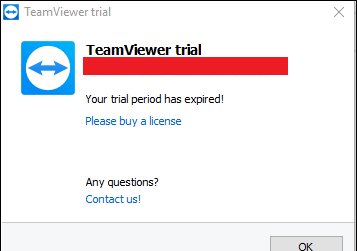

# ¿Cómo cambiar el ID de TeamViewer?

Cuando iniciamos **TeamViewer**, éste genera un **número de identificación único (ID)**. Este identificador es el que permite a los usuarios remotos conectarse a este PC. Si estamos usando TeamViewer para uso no comercial, y hacemos un uso excesivo del mismo (o algo que el servidor de TeamViewer interprete como uso comercial), nos indica que **nuestro periodo de prueba ha expirado** y que **la conexión se cerrará en 5 minutos** (*Your trial period has expired*!).



Reinstalar TeamViewer no resolverá este problema, pues el ID seguirá siendo el mismo, puesto que se genera en base a varios parámetros únicos de nuestro PC:

- **Dirección MAC** de la tarjeta de red
- **VolumeID** de la unidad de disco
- **Fecha de creación** de la carpeta **Program Files.**

La única solución es o bien comprar una licencia :smile:,​ o cambiar el ID de Teamviewer,  que podemos hacerlo alterarando estos tres parámetros en nuestro sistema.

## Cambiar el ID de TeamViewer en Windows

Para resetear el ID seguimos los siguientes pasos:

### Eliminar las entradas de TeamViewer del Registro de Windows

1. Abrir **PowerShell** como **Administrador**.

2. Detener el proceso de **TeamViewer**, en caso de que este iniciado.

   ```powershell
   Stop-Process -Name teamviewer
   ```

3. Eliminar la entradas de TeamViewer del registro de Windows:

   ```powershell
   Remove-Item -Path "HKCU:\Software\TeamViewer" -Recurse
   Remove-Item -Path "HKLM:\SOFTWARE\Wow6432Node\TeamViewer" -Recurse
   ```

### Cambiar la fecha de creación de "Program Files"

Para esto necesitamos la utilidad **NirCMD** que podemos descargar de este [enlace](https://www.nirsoft.net/utils/nircmd-x64.zip) o instalarla con el gestor de paquetes Chocolatey:

```powershell
choco install -y nircmd
```

Luego ejecutamos el siguiente comando desde **PowerShell** como **Administrador**:

```
nircmdc.exe setfilefoldertime "C:\Program Files" now now
```

### Cambiar la dirección MAC de la tarjeta de red

Para cambiar la dirección MAC de la interfaz de red, primero debemos identificar la tarjeta de red que estamos utilizando con el siguiente comando en **PowerShell**:

```powershell
Get-NetAdapter
```


De la salida del comando anterior nos interesa:

- **Name** (nombre de la interfaz de red): en mi caso la interfaz que me interesa se llama `Wi-Fi`.
- **MacAddress** (dirección MAC de la interfaz): que para la interfaz `Wi-Fi` es `90-78-41-45-2F-9F`.

A continuación, ejecutamos el siguiente comando desde **PowerShell** como Administrador:

```powershell
Set-NetAdapter -Name "Wi-Fi" -MacAddress XX-XX-XX-XX-XX-XX
```

Donde `XX-XX-XX-XX-XX-XX` es la nueva dirección MAC que queremos poner a la interfaz.

> En principio, cambiando sólo uno de los dígitos de la dirección MAC de la interfaz de red sería suficiente. Debemos asegurarnos de que esa nueva MAC sea única en la red a la que estemos conectados o ambos sistemas tendrán problemas de conectividad.

### Cambiar el identificador de volumen de la partición del sistema (C:)

El identificador del volumen es un valor que se establece cuando se formatea una partición. Para poder cambiarlo necesitamos la utilidad **VolumeID** que podemos descargar de este [enlace](https://technet.microsoft.com/en-us/sysinternals/bb897436.aspx) o instalarla con el gestor de paquetes Chocolatey:

```powershell
choco install -y volumeid
```

Consultamos el identificador de volumen actual con el siguiente comando desde **PowerShell**:

```powershell
cmd /c vol
```

A continuación ejecutamos el siguiente comando desde **PowerShell** como **Administrador**:

```
volumeid.exe c: XXXX-XXXX
```

Donde **XXXX-XXXX** es el nuevo identificador del volumen (cada "X" corresponde a un dígito hexadecimal).

Una vez que hemos actualizado el número de serie del volumen del sistema, reiniciamos el PC, lo que podemos hacer desde **PowerShell** con el siguiente comando:

```powershell
Restart-Computer
```

Tras reiniciar, abrimos TeamViewer y se le asignará un nuevo ID.

## Cambiar el ID de TeamViewer en Linux

En el caso de que usemos TeamViewer desde una distribución de GNU/Linux, podemos seguir los siguientes pasos para cambiar el ID.

En un **LinuxMint** los pasos serían los siguientes:

1. Desinstalar TeamViewer:

   ```bash
   sudo dpkg -r teamviewer
   ```

2. Eliminar el fichero de vinculación (si existe):

   ```bash
   sudo rm /var/lib/dbus/machine-id
   ```

3. Cambiar la dirección MAC de la tarjeta de red.

4. Instalar el paquete de TeamViewer otra vez:

   ```bash
   sudo dpkg -i teamviewer_x.y.z_amd64.deb
   ```

5. Si hay indica un error de que faltan paquetes, ejecuta el siguiente comando:

   ```bash
   sudo apt-get install -f
   ```

## Referencias

- [How to reset TeamViewer ID?](https://theitbros.com/reset-teamviewer-id/)