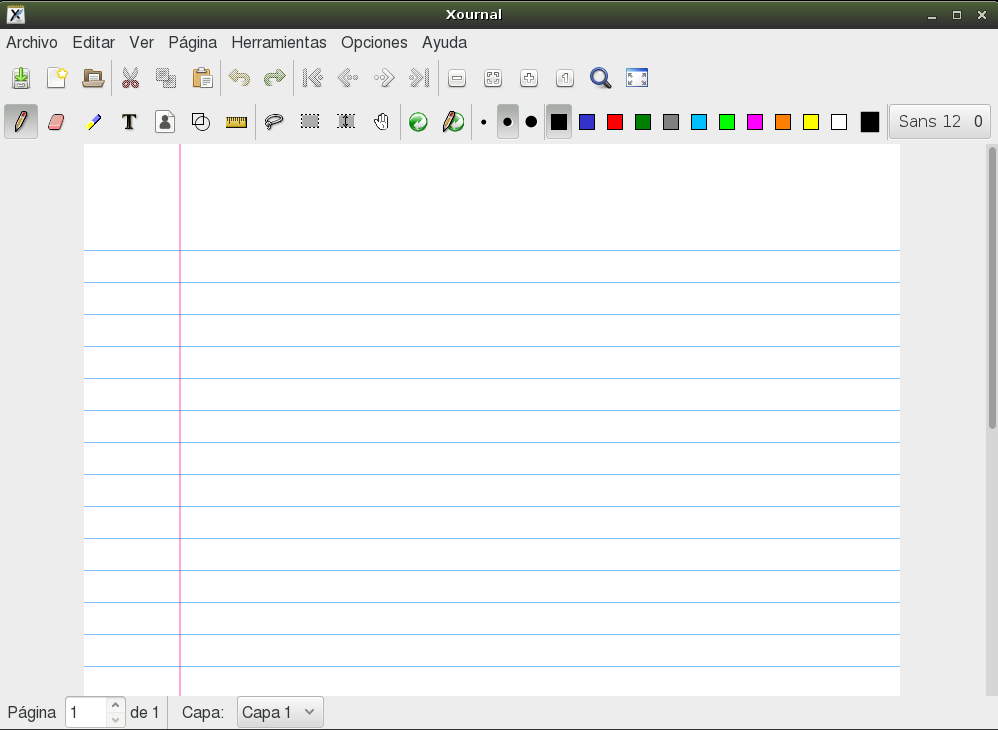
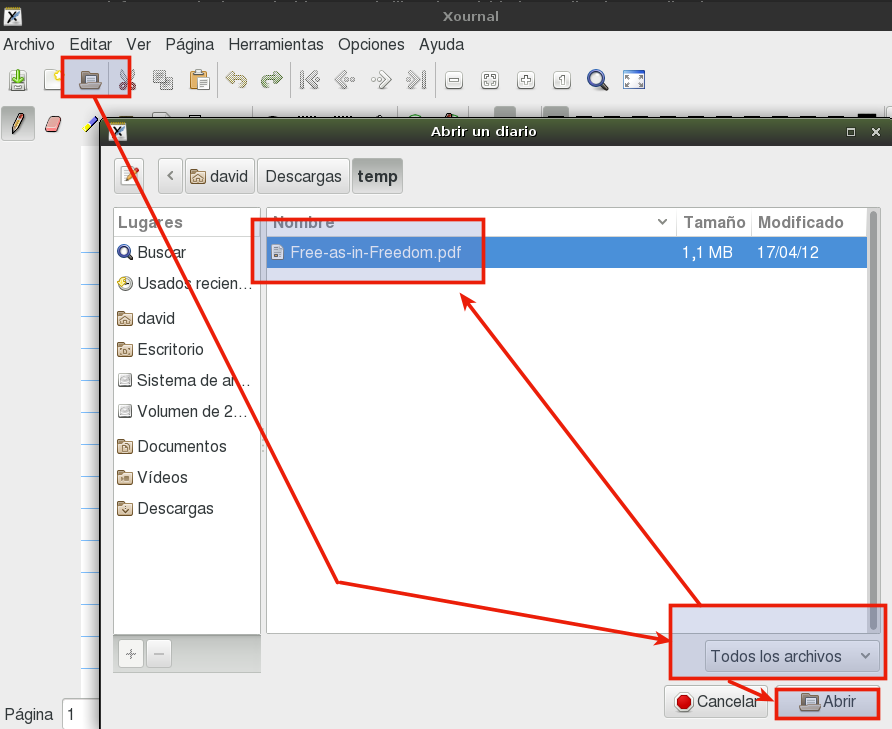

# Anotaciones en PDF con Xournal

**Xournal** es un programa que sirve para hacer anotaciones a un documento
en formato PDF. Al terminar podemos grabar un PDF con las anotaciones.

* Iniciamos el programa *Xournal*.

* Abrimos un pdf, para trabajar las anotaciones.

* Hacemos algunas anotaciones.

* `Archivo -> Exportar a PDF` para guardar el resultado en PDF.
