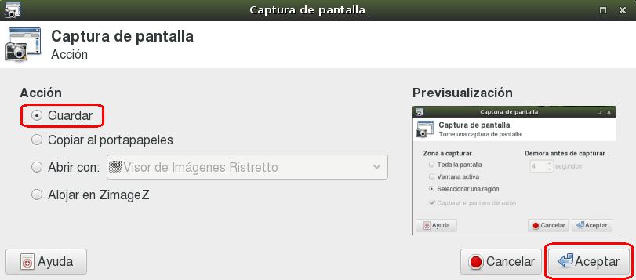

#Capturas de pantalla

**Captura de pantalla** es un programa que nos permite hacer una *foto* de
la pantalla, y grabarla en un fichero. Esta imagen la podemos
usar, por ejemplo, para incluirla en un informe y demostrar cómo se hace
alguna tarea.

Es muy útil para crear nuestros apuntes, y/o para los trabajos que nos
entregan nuestros alumnos.

##Funcionamiento

El programa es muy sencillo de usar, y funciona en 3 pasos:

1. Iniciamos el programa para capturar la pantalla.
1. Seleccionamos el área de pantalla que queremos capturar.
1. Guardamos la imagen con el nombre que elijamos.

##Ejemplo

Veamos unas imágenes de ejemplo.
* Seleccionamos el área a capturar

* Guardamos el resultado en un fichero.

> Otro capturador de pantalla muy fácil de usar es *Shutter*
