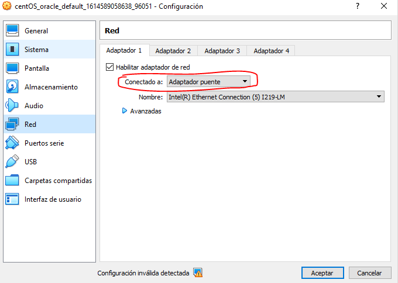
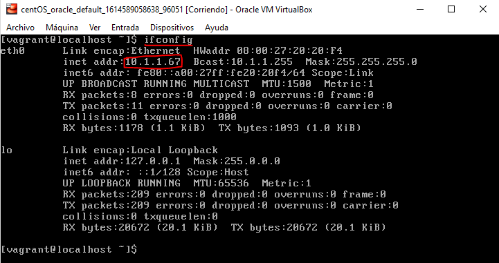
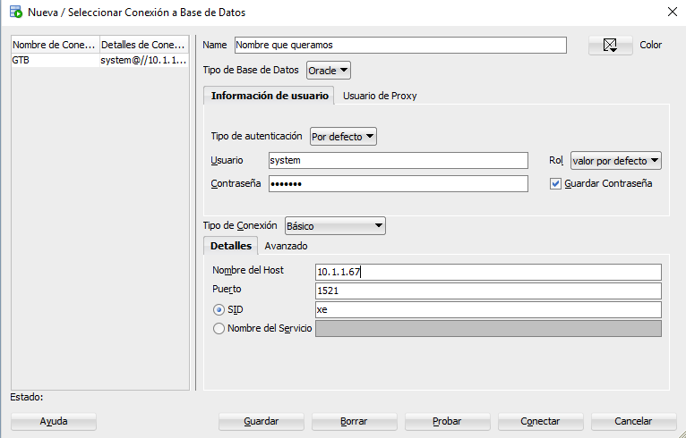

author: fvarrui

# ¿Cómo instalar de forma sencilla de Oracle Database 11g?

## Video de instalación

[](https://youtu.be/7h0cx0Qk_Bo)

## Instalación de Vagrant

Primero debemos instalar la herramienta [**Vagrant**](https://www.vagrantup.com/):

### En Windows

La forma más sencilla de instalar Vagrant es utilizando el gestor de paquetes [Chocolatey](https://chocolatey.org/):

1. Ejecutamos el siguiente comando en PowerShell como Administrador (si aún no lo tenemos instalado el Chocolatey):

	```powershell
	Set-ExecutionPolicy Bypass -Scope Process -Force; 	[System.Net.ServicePointManager]::SecurityProtocol = 	[System.Net.ServicePointManager]::SecurityProtocol -bor 3072; iex ((New-Object System.Net.WebClient).DownloadString('https://chocolatey.org/install.ps1'))
	```

2. Y ahora podemos instalar **vagrant** con el siguiente comando, también desde PowerShell como Administrador:

    ```powershell
    choco install -y Vagrant
    ```

### En GNU/Linux

Abrimos un terminal y ejecutamos uno de los siguientes comandos, dependiendo de cuál sea nuestro sistema:

#### Basado en Debian (Ubuntu, LinuxMint, ...)

```bash
sudo apt install -y vagrant
```

#### Basado en RedHat (Fedora)

```bash
sudo yum install -y vagrant
```

## Descargar la máquina virtual con CentOS 6 + Oracle Database 11g

Una vez instalado Vagrant, abrimos un terminal , nos desplazamos a la ruta donde queramos que se guarde la máquina virtual (en adelante, MV) y ahí creamos creamos un directorio con el nombre `centos6-oracle-11g` , donde instalará la MV:

```bash
mkdir centos6-oracle-11g
```

Nos movemos dentro de esa carpeta:

```bash
cd centos6-oracle-11g
```

Ejecutamos los siguientes comandos:

```powershell
vagrant init neko-neko/centos6-oracle-11g-XE
vagrant up
```

> Este proceso puede tardar unos minutos.

Con esto se nos descargará una MV con un CentOS 6 (distribución de GNU/Linux basada en RedHat) sin interfaz gráfica, que ya trae **Oracle Database 11g** instalado. Una vez haya terminada la descarga, la máquina estará iniciada y podremos controlarla desde **VirtualBox**.

Si queremos detener la MV desde el mismo terminal, en el directorio `centos6-oracle-11g` ejecutamos el siguiente comando:

```bash
vagrant halt
```

Podemos usar las siguientes credenciales para iniciar sesión en la MV (si fuese necesario):

- Usuario: `vagrant`
- Contraseña: `vagrant`

## Configurar la máquina virtual

Debemos cambiar la configuración de red de la máquina virtual para poder conectar a Oracle Database desde la máquina real, estableciendo la configuración de su interfaz de red en **Adaptador puente**:

1. Apagamos la máquina. Para ello iniciamos sesión en la MV con las credenciales que se indicaron antes y ejecutamos el siguiente comando:

    ```bash
    sudo shutdown -h now
    ```

    > Es recomendable hacer un apagado correcto de la MV.

2. Vamos a la configuración de la MV en VirtualBox y la establecemos en **Adaptador puente**.

	

3. Finalmente, volvemos a iniciar la MV, iniciamos sesión nuevamente con las mismas credenciales y ejecutamos el siguiente comando para conocer la dirección IP que se le ha asignado (necesaria para poder conectarnos a Oracle Database desde el exterior):

    ```bash
    ifconfig
    ```

    Este comando nos devolverá la dirección IP (resaltada en la siguiente imagen) de nuestra MV, necesaria para hacer la conexión.

    

	> **NOTA:** Si a la hora de hacer la conexión, esta no funciona, pruebe a reiniciar la máquina y volver a ejecutar el comando `ifconfig` para verificar si la dirección IP ha cambiado.

## Instalación de SQL Developer

Ahora vamos a instalar **SQL Developer** en la máquina real (anfitriona):

1. Descargamos la herramienta Oracle SQL Developer del siguiente [enlace](https://www.oracle.com/tools/downloads/sqldev-downloads.html), y la instalamos.

	> Nos pedirá que iniciemos sesión con una **cuenta de Oracle**. Debemos realizar este paso y en caso de no tener una, crearla. Los pasos son muy sencillos siguiendo el formulario y tras rellenarlo, habrá que hacer una verificación por correo. Una vez hecho esto, podremos descargar el instalador.

1. Iniciamos SQL Developer y configuramos la conexión al gestor de bases de datos, usando los siguientes parámetros:

- Nombre de la conexión: `El que queramos darle`.
- Usuario: `system`.
- Contraseña: `vagrant`.
- Nombre del host: `dirección ip de la máquina virtual` (en este caso sería 10.1.1.67).
- SID: `xe`



> Es recomendable marcar la pestaña de “Guardar Contraseña”.

Una vez hecho esto, hemos finalizado el proceso y podremos hacer uso del gestor de base de datos. Ahora, cuando necesitemos usar este servicio, sólo tendremos que iniciar la MV y detenerla cuando ya no sea necesario, liberando a nuestro PC de la sobrecarga que esto supone.

## Cambio de expiración de las contraseñas

Por defecto, las políticas de Oracle Database determinan que la caducidad de las contraseñas sea cada 180 días. Si esto nos supone un problema, podemos cambiar lo de la siguiente forma:

1. Abrimos el **Oracle SQL Developer** y conectamos al gestor de base de datos (Oracle Database 11g virtualizado).

2. Conectamos a la MV mediante

3. Ejecutamos la siguiente sentencia SQL para cambiar la caducidad a ilimitada:

    ```sql
    ALTER PROFILE DEFAULT LIMIT PASSWORD_LIFE_TIME UNLIMITED;
    ```

4. Verificamos que se han aplicado el cambio:

    ```sql
    Select * from DBA_PROFILES where RESOURCE_NAME like'PASSWORD_LIFE_TIME';
    ```

## Créditos

- [Omar Domínguez Fuentes](https://github.com/Omardf00)
