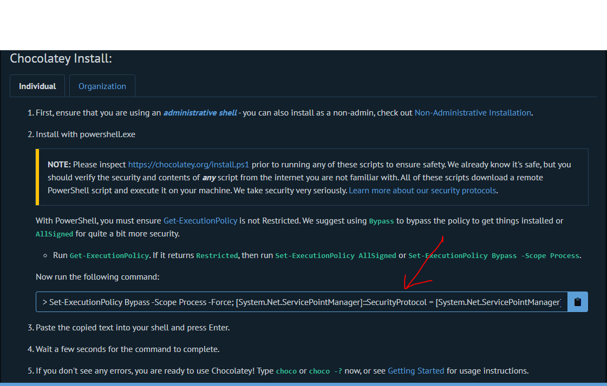
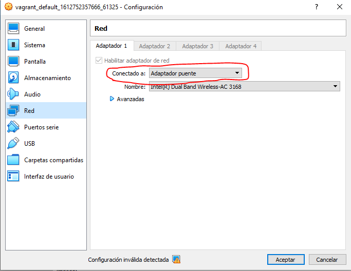
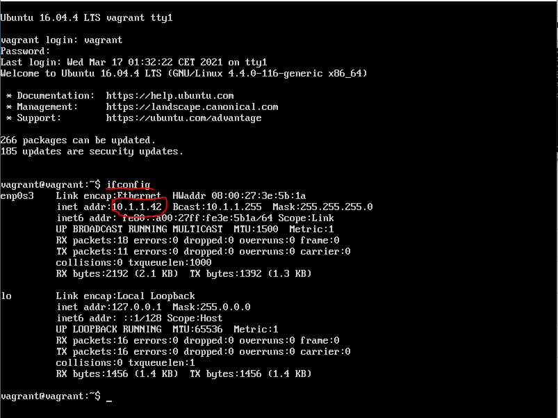
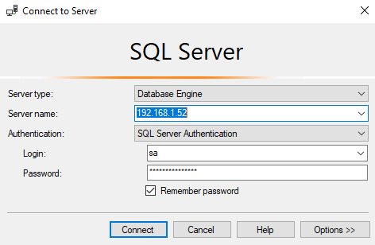

autohr: fvarrui

# Instalación optimizada de SQL Server


##  Vídeo

[](https://youtu.be/Qy98Mgz3wMQ)

## Instalación de Vagrant.

1. Primero debe instalar la herramienta de **Vagrant** del siguiente [enlace](https://www.vagrantup.com/). También es posible mediante la herramienta [chocolatey](https://chocolatey.org/), para la cual deberá ejecutar el siguiente comando en powershell en modo administrador, que encontraremos en el siguiente [enlace](https://chocolatey.org/install).




2. Tras ejecutar el comando, Vagrant se puede instalar con el siguiente comando en powershell:

```powershell
choco install -y Vagrant
```
## Descargar la máquina virtual ya configurada.
1. Una vez instalado Vagrant, nos moveremos a un cmd, y nos situaremos en la ruta donde queramos que se guarden las máquinas virtuales. Ahí, creará una carpeta con el nombre que quiera donde instalará la máquina virtual. Muévase dentro una vez creada y ejecute los siguientes comandos
desde el cmd:

```cmd
vagrant init janobono/xenial64-sqlserver2017
vagrant up
```

Esta es una distribución de Linux muy ligera ya que no viene con interfaz gráfica (aunque se le puede instalar desde línea de comandos muy fácilmente), la cual viene con SQL Server preinstalado.

## Configuración de la máquina virtual
1. Iniciar sesión en la máquina virtual.

- Usuario: `vagrant`

- Contraseña: `vagrant`

2. Una vez dentro debemos apagar la máquina para aplicar un cambio. Esto lo haremos con el siguiente comando:

```bash
sudo shutdown -h now
```

> El teclado de la máquina está en inglés, por lo que será más cómodo poner el '-' con el teclado numérico.

3. Tras haberla apagado, iremos a la configuración de la máquina en VirtualBox y la configuraremos en adaptador puente.



4. Lanzaremos el siguiente comando para averiguar la IP del equipo (la cual nos servirá para
acceder al SQL Server).

```bash
ifconfig
```



## Instalación de SQL server en la máquina anfitriona.

1. Una vez la conozcamos, minimizaremos la máquina y, en el sistema anfitrión, instalaremos el SQL server Management Studio, bien por instalación normal desde el siguiente enlace o bien por chocolatey mediante el siguiente comando:

```powershell
choco install -y sql-server-management-studio
```

2. Tras instalarlo, lo abriremos y configuraremos el arranque de la siguiente manera:

- Server Type: `Database Engine`

- Server name: `Ip de la máquina virtual que apuntamos antes`

- Authentication: `SQL Server Authentication`

- Login: `sa`

- Password: `Passw0rd`



De esta manera podremos utilizar toda le gestión desde el equipo original, mientras que tanto la carga de los archivos y las bases de datos se están almacenando y ejecutando en la máquina virtual. Al ser esta mucho más ligera, la carga total del equipo es muchísimo menor y debería ir más fluido, el consumo total de RAM para la base de datos es de 2 GB y el Management Studio en la real, por su parte, es un servicio ligero, pues todo el cálculo se hace en la virtual.


## Créditos

- [Omar Domínguez Fuentes](https://github.com/Omardf00)
