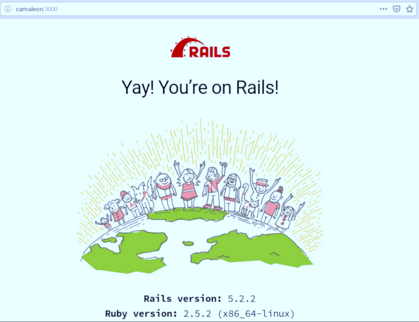

# RAILSINGER-Z


[Volver](README.md)

---

# Crear el esqueleto

Al crear el esqueleto, vamos a crear una estructura con sus ficheros para no empezar el nuevo proyecto desde cero absoluto, sino más bien con una base ya preparada.

> Ejemplos:
>
> * `rails new demo` (usará base de datos sqlite)
> * `rails new demo -d=mysql` (usará base de datos mysql)
> * `rails new demo --database=postgresql` (usará base de datos PostGreSQL.)

* `rails new messenger`, crear un nuevo proyecto llamado messenger.
* `tree messenger`, ver las carpetas/ficheros que se han creado:
    * `messenger/app/models`, modelos.
    * `messenger/app/views`, vistas.
    * `messenger/app/controllers`, controladores.
    * `messenger/config`, ficheros de configuración.
    * `messenger/db`, esquema de la base de datos.

_(¿Tiene sentido verdad?)_

---

# Bases de datos

Podemos usar muchas bases de datos. Para practicar usamos la que viene por defecto (sqlite3).

> Comandos útiles:
>
> * `rails db:drop`, elimina las base de datos.
> * `rails db:migrate`, hace una modificación/migración del esquema de la base de datos.
> * `rails db:drop db:create db:migrate`, ¡todo en uno!

* `cd messenger`
* `rails db:create`, crear la base de datos.    

```
messenger> rails db:create
Created database 'db/development.sqlite3'
Created database 'db/test.sqlite3'
```
> NOTA: Tendremos dos entornos de trabajo: develoment y test.

_¡Que buena idea!_

---

# Servidor

* `rails s`, iniciar el servidor de la aplicación.
```
messenger> rails s
=> Booting Puma
=> Rails 5.2.2 application starting in development
=> Run `rails server -h` for more startup options
Puma starting in single mode...
* Version 3.12.0 (ruby 2.5.2-p104), codename: Llamas in Pajamas
* Min threads: 5, max threads: 5
* Environment: development
* Listening on tcp://camaleon:3000
Use Ctrl-C to stop

```

> Podremos ver las peticiones que se produzcan a nuestra aplicación directamente en el terminal.

* Abrir navegador con URL `http://localhost:3000`



_¡Ya está! Nuestro proyecto en ejecución._

---

# Resumen

* `rails new messenger`, crear un nuevo proyecto llamado messenger.
* `cd messenger`
* `rails db:create`, crear la base de datos.    
* `rails s`, iniciar el servidor de la aplicación.
* Abrir navegador con URL `http://localhost:3000`
