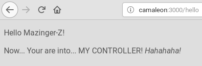

# Rails


[Volver](README.md)

---

# Controlando al controlador

> Recordemos que estamos dentro de un MVC

* Modificar el controlador `app/controllers/welcome_controller.rb`:
```
  def greet
    @name = 'Mazinger-Z'
  end
```

> Recordar que los atributos de una clase en ruby se escriben con la @ delante. De modo que @name es una variable, atributo de la clase WelcomeController.
>
> Todo en Ruby... son objetos.

* Modificar la vista `app/views/welcome/greet.html.erb`:
```
<p>Hello <%= @name %>!</p>
<p>Now. Your are into... MY CONTROLLER! <i>Hahahaha!</i></p>
```
* Probamos:
    * `rails s`
    * URL `camaleon:3000/hello`



* Prueba `rails routes` ¿Qué ves?

---

Ir a [comandos](99-commands.md) para ver el resumen de órdenes de rails.
