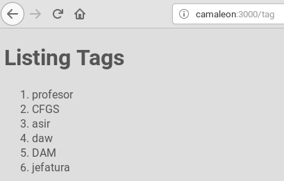

# Rails


[Volver](README.md)

---

# Rutas

```
messenger> rails routes

      Prefix   Verb   URI Pattern        Controller#Action
      ------   ----   ----------------   -----------------
      hello    GET    /hello(.:format)   welcome#greet

```
* Modificar `config/routes.rb`
```
Rails.application.routes.draw do
  # For details see http://guides.rubyonrails.org/routing.html
  get '/hello', to: 'welcome#greet'
  resources :tag
end
```
* Consultamos las rutas...
```
messenger> rails routes

    Prefix     Verb     URI Pattern              Controller#Action
    --------   ----     ----------------------   -----------------
    hello      GET      /hello(.:format)         welcome#greet

    tag        GET      /tag(.:format)           tag#index         
               POST     /tag(.:format)           tag#create
    new_tag    GET      /tag/new(.:format)       tag#new
    edit_tag   GET      /tag/:id/edit(.:format)  tag#edit
    tag        GET      /tag/:id(.:format)       tag#show
               PATCH    /tag/:id(.:format)       tag#update
               PUT      /tag/:id(.:format)       tag#update  
               DELETE   /tag/:id(.:format)       tag#destroy
```

---

# Index

* `rails g controller tag`
* Editar `app/controller/tag_controller.rb`
```
class TagController < ApplicationController
  def index
    @tags = Tag.all
  end
end
```

> Erb es el motor de plantillas que usa Rail

* Crear `app/views/tag/index.html.erb`
```
<h1>Listing Tags</h1>

<ol>
<% @tags.each do |i| %>
  <li><%= i.name %></li>
<% end %>
</ol>
```



---

Ir a [comandos](99-commands.md) para ver el resumen de órdenes de rails.
