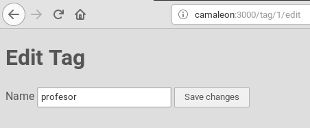
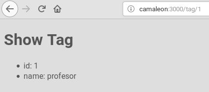

# RAILSINGER-Z


# CRUD

Ahora tendríamos que rellenar la tabla `tags` con contenido. Pero no lo vamos a hacer con SQL, o con `rails console`. No. Ahora vamos a montar un CRUD (Create-Read-Update-Delete functions) en la aplicación web para hacerlo.

Enlace de interés:
* [CRUD](https://www.railstutorial.org/book/updating_and_deleting_users)
* [How to Write Rails Forms](https://launchacademy.com/codecabulary/learn-rails/writing-forms)
* [Building your first form](http://simple-form-bootstrap.plataformatec.com.br/documentation)

* Vamos a completar los métodos en el controlador:
```
class TagController < ApplicationController

  def show
    @tag = Tag.find(params[:id])
  end

  def new
    @tag = Tag.new
  end

  def create
    @tag = Tag.new(tag_params)
    if @tag.save
      flash[:success] = "Tag #{@tag.name} created!"
      redirect_to @tag
    else
      render 'new'
    end
  end

  def edit
    @tag = Tag.find(params[:id])
  end

  def update
    @tag = Tag.new(tag_params)
    if @tag.save
      flash[:success] = "Tag #{@tag.name} updated!"
      redirect_to @tag
    else
      render 'new'
    end
  end

  private

    def tag_params
      params.require(:tag).permit(:name)
    end
end
```

---

# View

* `app/views/tag/_form.html.erb`
```
<%= form_for(@tag) do |f| %>
  <%= f.label :name %>
  <%= f.text_field :name %>

  <%= f.submit "Save changes" %>
<% end %>
```

* `app/views/tag/edit.html.erb`
```
h1>Edit Tag</h1>
<%= render 'form' %>
```



* `app/views/tag/show.html.erb`
```
<h1>Show Tag</h1>
<ul>
  <li>id: <%= @tag.id %></li>
  <li>name: <%= @tag.name %></li>
</ul>
```



* `app/views/tag/new.html.erb`
```
<h1>New Tag</h1>
<%= render 'form' %>
```

---

Ir a [comandos](99-commands.md) para ver el resumen de órdenes de rails.
