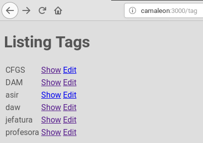

# RAILSINGER-Z


# El camino

El camino que hemos seguido hasta ahora es:
1. Crear las bases de datos.
1. Crear rutas.
1. Generar controladores.
1. Generar modelos.
1. Crear algún contenido en la BBDD.
1. Crear método index y su vista.
1. Crear métodos y vistas para un CRUD.

# Links

```
<h1>Listing Tags</h1>

<table>

<% @tags.each do |i| %>
  <tr>
    <td><%= i.name %></td>
    <td><%= link_to "Show", tag_path(i) %></td>
    <td><%= link_to "Edit", edit_tag_path(i) %></td>
  </tr>
<% end %>
</table>
```



---

Ir a [comandos](99-commands.md) para ver el resumen de órdenes de rails.
