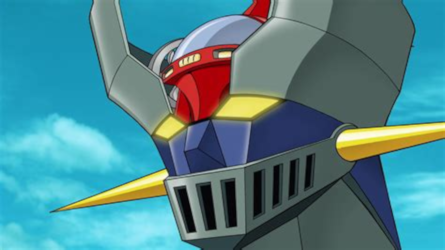

# Rails

# Resumen de órdenes

| Comando                 | Descripción                 |
| ----------------------- | --------------------------- |
| rails -v                | Muestra la version de Rails |
| rails -h                | Muestra la ayuda        |
| rails new NAME          | Crear un nuevo proyecto |
| rails db:drop           | Elimina la BBDD |
| rails db:create         | Crear la BBDD |
| rails db:migrate        | Migración de la BBDD |
| rails s, rails server   | Iniciar la aplicación |
| rails g, rails generate | Muestra los generadores |
| rails g controller NAME | Generar un controlador |
| rails d, rails destroy  | Muestra los destructores |
| rails d controller NAME | Destruye un controlador |
