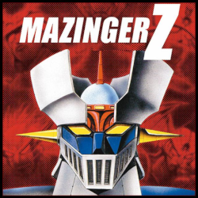

# RAILSINGER-Z

## Mazinger-Z

Mazinger Z es una serie de manga y anime japonesa.

En la ficción, Mazinger Z fue el primer robot gigante tripulado por un protagonista, marcando las bases del género.

La historia de la serie trata sobre un grupo de científicos que disponen de un robot gigante en su lucha contra las fuerzas malignas del Dr. Hell (también conocido como Dr. Infierno en algunos países de habla hispana).

El manga fue publicado por primera vez el 12 de septiembre de 1972 en el semanario.​ En 2009, la serie se reeditó en un nuevo manga titulado Shin Mazinger Shōgeki! Z hen que incluyó novedades en la historia.

El anime de Mazinger Z, por su parte, se estrenó en el canal Fuji TV el 3 de diciembre de 1972.8​

En enero de 2001, la revista Animage publicó una lista sobre los animes más populares de todos los tiempos, en la que Mazinger Z se colocó en el número 11.

---

## Ruby on Rails (RoR)

Ruby on Rails, también conocido como RoR o Rails, es un framework de aplicaciones web de código abierto escrito en el lenguaje de programación Ruby, siguiendo el paradigma del patrón Modelo Vista Controlador (MVC).

Trata de combinar la simplicidad con la posibilidad de desarrollar aplicaciones del mundo real escribiendo menos código que con otros frameworks y con un mínimo de configuración.

El lenguaje de programación Ruby permite la metaprogramación, de la cual Rails hace uso, lo que resulta en una sintaxis que muchos de sus usuarios encuentran muy legible. Rails se distribuye a través de RubyGems, que es el formato oficial de paquete y canal de distribución de bibliotecas y aplicaciones Ruby.
