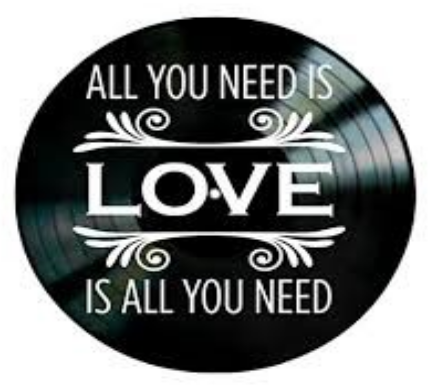

# I Love Ruby


---

# Presentación

```
me = {
  :name    => “David Vargas Ruiz”,
  :studies => “Ing. Informático ULPGC”,
  :job     = > “Profesor FP Informática”,
  :twitter => @dvarrui,
  :github  => dvarrui,
  :email   => dvarrui@protonmail.com
}
```

# Who am I

```
> whoami
Ruby
Software Libre
Starwars and
Rock and Roll
```

---

# ¿Por qué?



* Dar a conocer a Ruby.
* Para entender mejor _Ruby on Rails_.
* Crear comunidad.
* Compartir.
* Debatir y aprender.

> _“El amor es lo que nos mueve...”_
> 
> ¡Ah! ¡Y que la música mola también!
