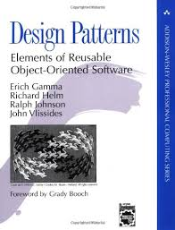

# I Love Ruby



---

# Estrategias para programar

* Estructuras de control (Secuencial, condicional, repetitiva)
* Programación Estructurada: Subrutinas y 3 estructuras básicas.
* Programación modular: dividir en subprogramas.
* POO (Programación Orientada a Objetos)
* Diseño de Patrones

---

# POO: Clases, instancias, atributos

Ejemplo 1:

```
class Persona

  def initialize(name)
    @name = name
  end

  def saludar
    puts “Hola, me llamo ” + @name
  end
end

jedi = Persona.new("Obiwan")
jedi.saludar # => Hola, me llamo Obiwan
```

---

# Con Ruby salgo a todos lados...

* GUI, CLI, Web (Cliente y Server), Scripting, Etc

> Veamos más ejemplos...
