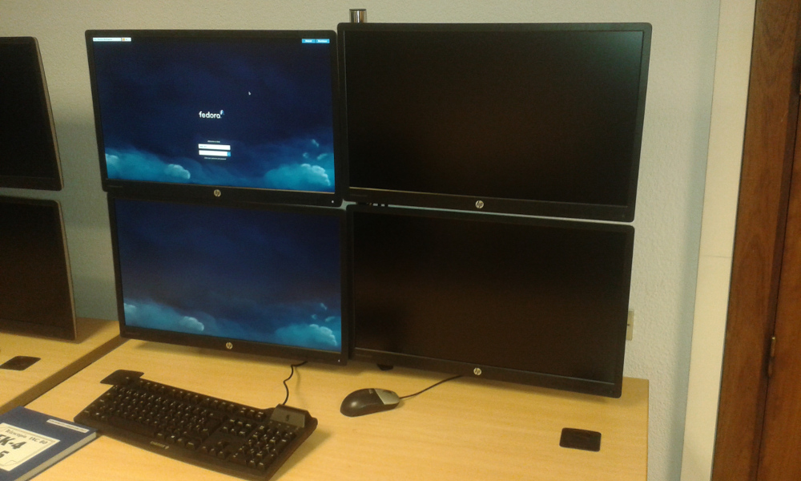
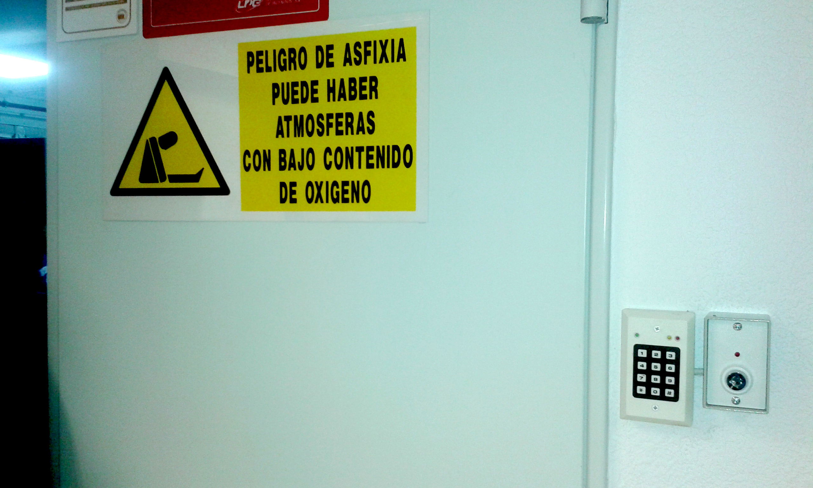
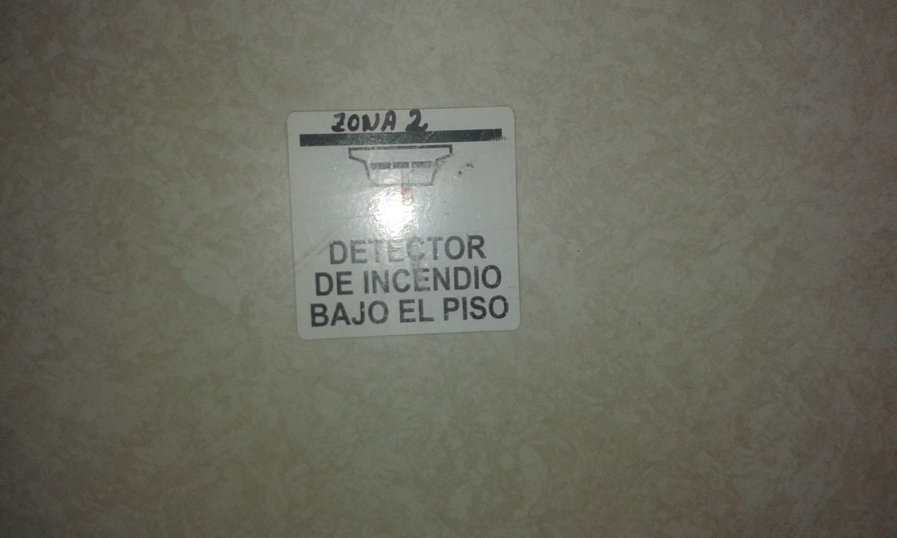
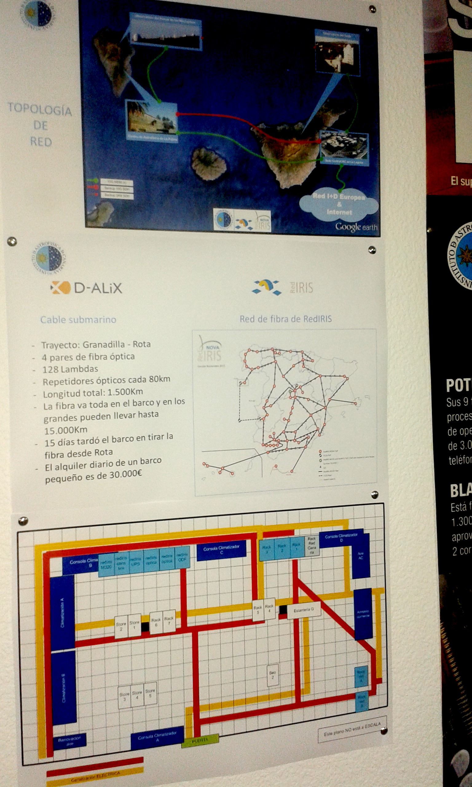
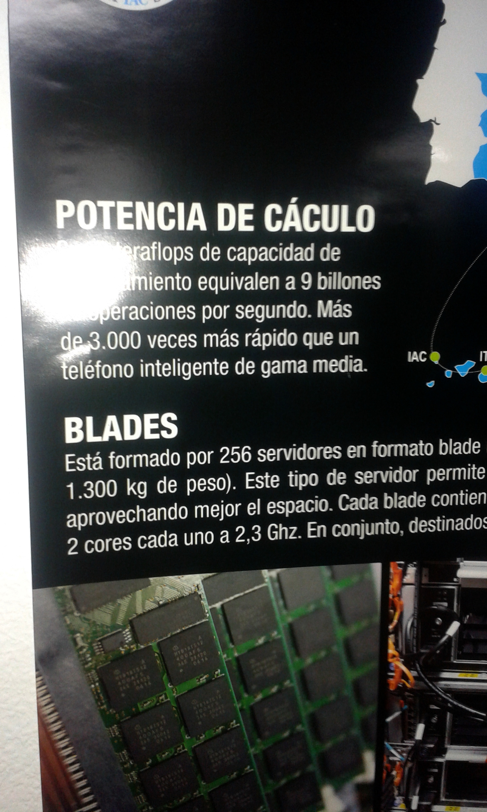
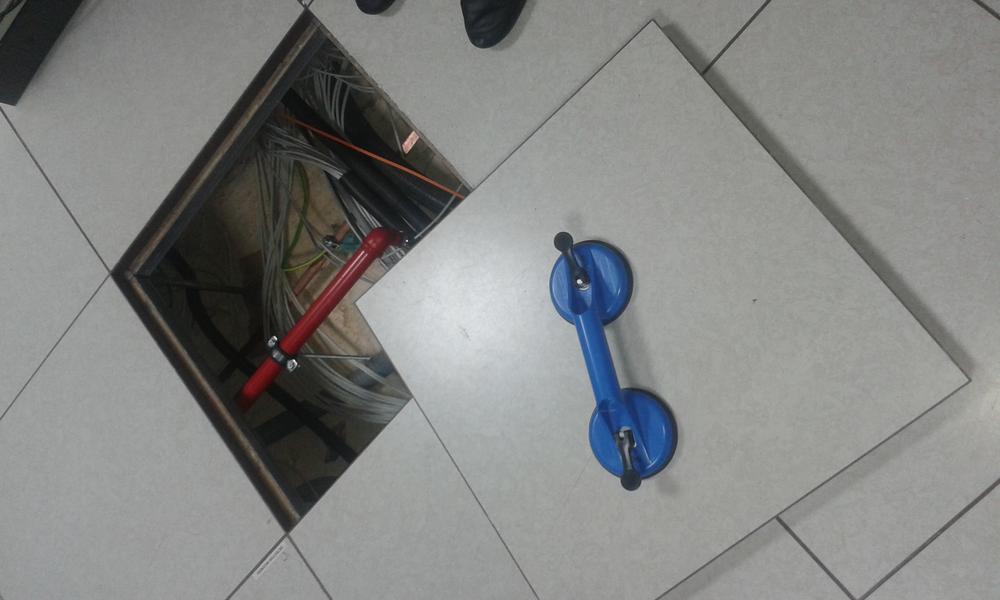
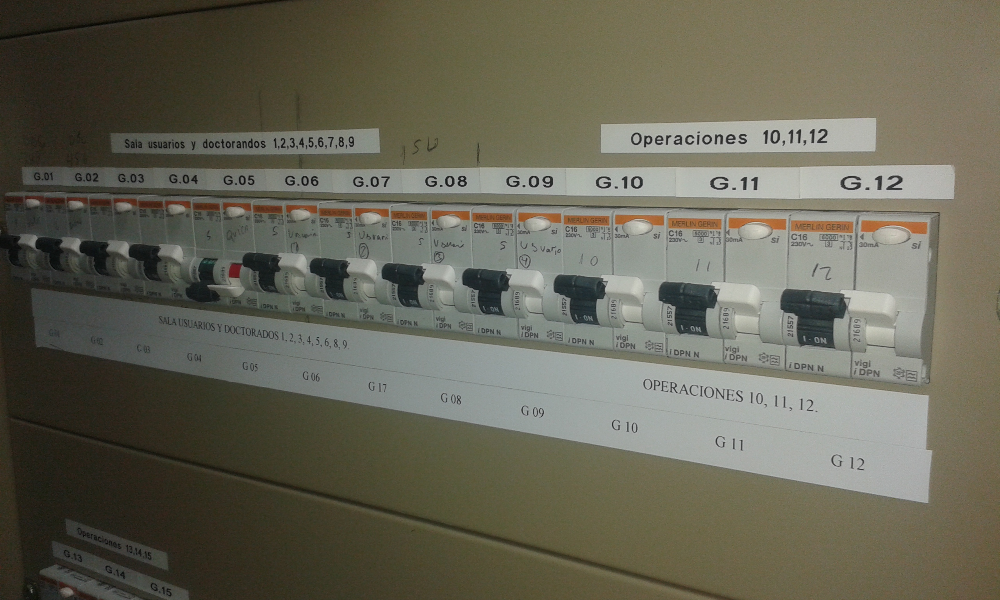
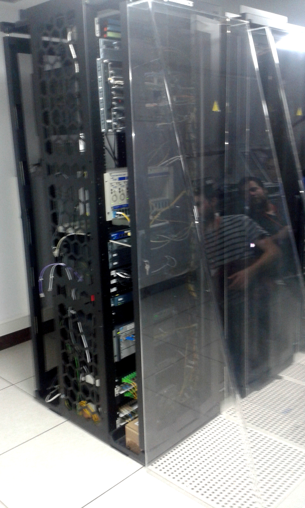
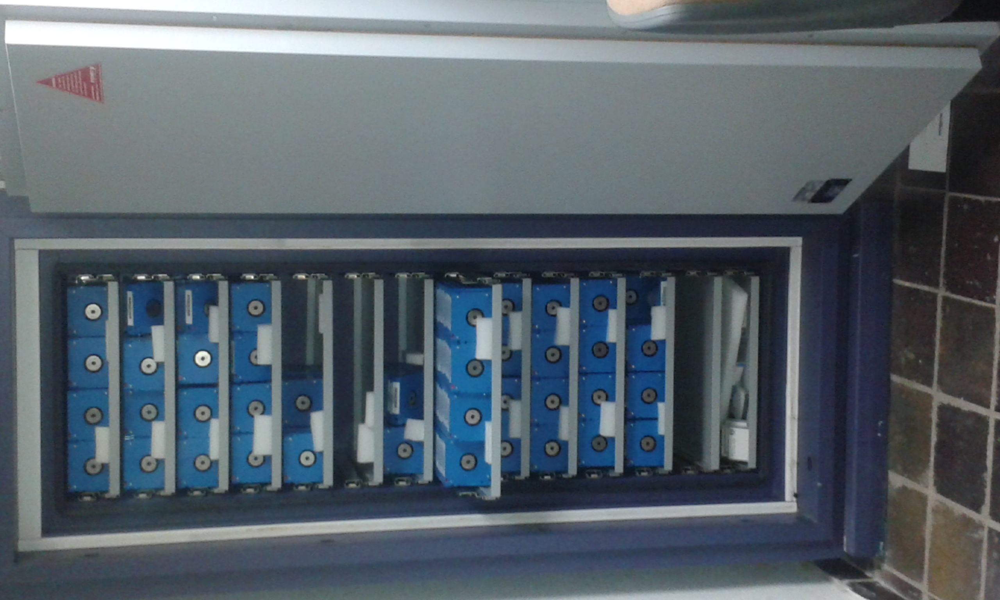
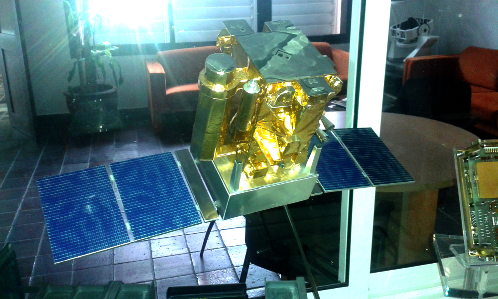

```
Visita al CPD del IAC
Fecha 26 de mayo de 2016
```

#Visita al IAC

El 26 de mayo de 2016, el grupo de alumnos de CFGS de 1ASIR del IES Puerto de la Cruz
realizó una visita al CPD del IAC (Instituto de Astrofísica de Canarias)

Allí nos atendieron Carlos, Antonio y Paco, del área de Sistemas Informáticos.


#Fotografías

Entramos en una sala de ordenadores de uso compartido. Vemos que los puestos
tienen 4 monitores, porque se conectan a las 4 sedes del IAC. El sistema
operativo de estos PC's es GNU/Linux Fedora.



Al entrar al CPD vemos las medidas de seguridad en la puerta de entrada.



Dentro del CPD hay detectores de incendio en techos y suelos, como se
aprecia en la foto.



Aquí vemos un plano del CPD del IAC.



El CPD del IAC es miembro de una red de CPDs por toda España.




Este CPD tiene un falso suelo para el cableado de red, corriente, etc.



Todo el cableado debe estar correctamente colocado, etiquetado y en orden.
En la imagen vemos un ejemplo de la forma correcta de cablear la red.


Aunque parezca una tontería, es muy importante tenerlo todo perfectamente
etiquetado para evitar problemas en el futuro.



Para que la salida de aire frío desde el suelo pueda enfriar por igual
los dispositivos que están a baja altura como los que están más arriba
en los armarios, se han colocado unos paneles de metacritalo transparantes
que ayudan a guiar el aire hasta las posiciones más elevadas del armario.



Las copias de seguridad son muy importantes. Se guardan los datos en cintas
porque ha día de hoy son los dispositivos que a menor coste guardan la mayor
cantidad de datos. Además dichas cintas se guardan en una caja fuerte, 
inhífuga (No fue fácil meter la caja fuerte en dicha habitación).



Esta es una maqueta de un satélite real en el que alguno de los miembros 
del departamento de informática estuvo trabajando.


