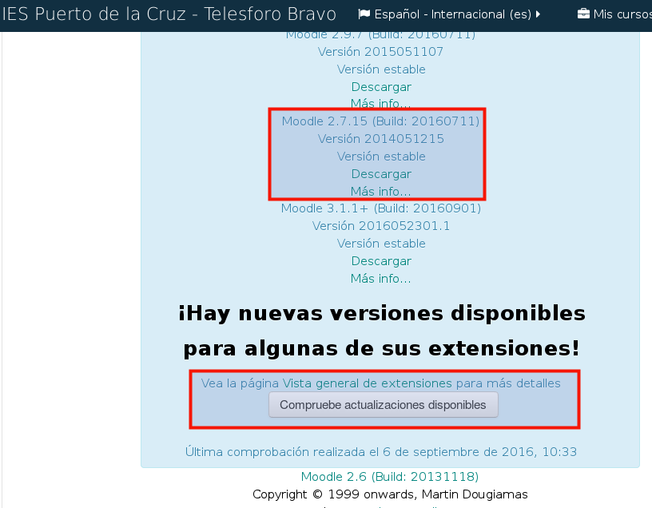

# Migración Moodle 2.6.x a la versión 2.7.x

* [Enlace de interés](http://blog.webinnova.es/actualizar-manualmente-de-moodle-2-6-x-a-2-7-x-etc/)

## Pasos realizados

* `Administración del sitio -> Servidor -> Entorno`, para asegurarse
de que el servidor cumple con todos los requisitos para la versión que va a actualizar.
    * `Actualiza componente`
    * Elegir la `versión de Moodle` a comprobar. Estado OK hasta la versión 3.0.
* Moodle necesita de PHP 5.4 o superior para funcionar. Se verifica la versión de PHP:
```
$ php -v
PHP 5.4.45-0+deb7u1 (cli) (built: Sep 10 2015 08:34:47)
Copyright (c) 1997-2014 The PHP Group
Zend Engine v2.4.0, Copyright (c) 1998-2014 Zend Technologies
```
* Se hace *copia de seguridad* de:
    * Instalación de Moodle `/usr/share/nginx/www/moodle26`.
    * Carpeta de datos `/var/local/moodle26data`.
    * Base de datos MySQL `moodle26`.
* `Administración del sitio -> Servidor -> Notificaciones de actualización`,
y nos aseguramos de tener habilitadas las notificaciones en.

> Lo normal en versiones estables es poder actualizar previa verificación de
la existencia de nuevas versiones si se tiene habilitada está opción.

* `Administración del sitio -> Notificaciones`, y hacemos clic en el botón
`Compruebe actualizaciones disponibles`. Con esto comprobamos si hay actualizaciones
automáticas disponibles. Veremos algo similar a lo mostrado en la siguiente captura:



> Estamos en la versión 2.6 (Build: 20131118) y podemos pasar a:
>
> * Moodle 2.6.11+ (Build: 20150619) Versión 2013111811.01
> * Moodle 2.7.15 (Build: 20160711) Versión 2014051215
>
> Elegimos la segunda opción.

* Descargamos [moodle-2.7.15.zip](https://download.moodle.org/download.php/direct/stable27/moodle-2.7.15.zip)
en carpeta para uso temporal.
* `Administración del Sitio -> Servidor -> Modo Mantenimiento -> Habilitar`.

> Para deshacer el modo mantenimiento poner "URL_moodle/admin" y entramos como
administrador.

* Movemos
    * `/usr/share/nginx/www/moodle26` a `/usr/share/nginx/www/moodle26.20160906`
    * `moodle27` a `/usr/share/nginx/www/moodle26`
* Usar el fichero antiguo `config.php` para la nueva versión.
* `service nginx reload`
* URL moodle /admin
Comienzo a las 12:50...13:48...

#Error
La actualización tardó horas y se quedó la pantalla en blanco.
El proceso había salido mal.
Busqué en los ficheros de log a ver si entontraba pistas del fallo, pero nada.

Pistas para seguir indagando:
* Buscar dónde se registran los fallos.
* Pasar de la 2.6.N a la 2.6.N+1 antes de intentar la 2.7
* Repetir y revisar un warning sobre el formato de las tablas.
* Mantener el entorno de producción y reproducir un entorno de pruebas.
* Eliminar Moodle22 que no se está usando.

#Deshacer
Tuve que deshacer el proceso y volver a las copias de seguridad.
