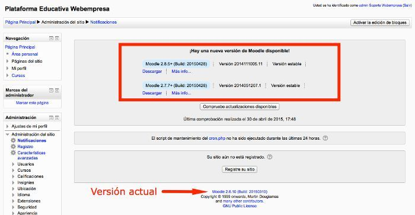

# Actualizar manualmente de Moodle 2.6.x a 2.7.x

* [Enlace de interés](http://blog.webinnova.es/actualizar-manualmente-de-moodle-2-6-x-a-2-7-x-etc/)

## Requisitos

* **Las nuevas versiones de Moodle necesitan de PHP 5.4 o superior** para funcionar,
* Los usuarios que aún se mantienen en versiones no estables, 2.5 y
principalmente 2.6 deben plantearse, previa copia de seguridad,
actualizar a 2.7.7 estable (a fecha de abril de 2015) para
posteriormente poder pasar a Moodle 2.8.5 o versiones superiores.
* Como medida de precaución siempre recomendamos probar la actualización
primeramente en una **COPIA** de tu sitio Moodle en producción, para
asegurarte de que funciona como esperas.
* Lo normal en versiones estables es poder actualizar previa
verificación de la existencia de nuevas versiones si se tiene habilitada
 está opción en la `Administración del sitio -> Servidor -> Notificaciones de actualización`
* Al acceder a desde el menú **Administración del sitio** al apartado **Notificaciones**
podemos ver si hay actualizaciones disponibles automáticas haciendo clic
en el botón **Compruebe actualizaciones disponibles** y si las hay veremos
algo similar a lo mostrado en la siguiente captura:

> Para actualizaciones desde la versión 2.6.x (en este caso la 2.6.10) es
recomendable *pasar primero por la versión 2.7.7* antes de subir a la
estable del momento, actualmente la 2.8.5+.

##¿Qué copia de seguridad tengo que realizar antes de actualizar?

* Los archivos de la instalación, por ejemplo **/public_html/moodle**
* Los archivos de datos generados y subidos a la instalación de Moodle, por ejemplo **/moodledata**
* La **base de datos** de Moodle desde phpMyAdmin.
* El procedimiento de actualización es **manual**, ya que
implica pasar de usar una versión de PHP 5.2/5.3 a usar PHP 5.4 o 5.5 y
este cambio de versiones de PHP puede afectar a las actualizaciones
automáticas.

* La actualización manual no se ve afectada porque se tenga determinada
versión de PHP activa, ya que es una escritura manual de archivos.

## Pasos para actualizar manualmente de Moodle 2.6.x a 2.7.x

* Se hace *copia de seguridad* de:
    * la instalación de Moodle `/usr/share/nginx/www/moodle26`.
    * la carpeta `/var/local/moodle26data` con datos de Moodle.
    * la base de datos MySQL `moodle26`.

* Activar en la administración de Moodle el **"Modo Mantenimiento"**.
* Renombrar el archivo `config.php` a `config.php_seg` (por seguridad).
* Descargar la versión estable de Moodle 2.7.7.
* Extraer el archivo descargado **moodle-latest-27.zip** en el ordenador.
* Acceder a la carpeta del archivo zip descomprimido y **comprimir los archivos**
 contenidos (desde dentro de la carpeta) (1).

> Con el fin de evitar que al extraer el archivo original descargado `moodle-latest-27.zip`
en el servidor, se extraigan los contenidos en una nueva carpeta llamada `/moodle`.

* Subir el archivo .zip creado, de la actualización, a la carpeta de Moodle en el servidor.
* Extraer el archivo .zip una vez subido.
* Renombrar el archivo `config.php_seg` a `config.php` nuevamente.
* Mover la carpeta `/public_html/moodle/moodledata` fuera de `/public_html` por seguridad, si no lo estuviese.
* Deshabilitar el **Modo de Mantenimiento**.
* Verificar que ya disponemos de la nueva versión accediendo al /admin de Moodle, **Notificaciones**.
