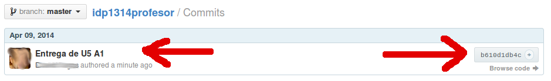

# 1. Trabajando con GIT

## 1.1. La primera vez

Enlace de interés:
* [Presentación Git](https://control-versiones-git.netlify.com/)
* [git - la guía sencilla](http://rogerdudler.github.io/git-guide/index.es.html)
* [Instalación, Configuración y uso básico de Git y GitHub. (Linux / Mac / Windows)](https://github.com/omorest/Guides/tree/master/github)

### Servidor GIT en Internet:

* Crear una cuenta en GitHub.
* Crear un repositorio "curso-nombre-del-alumno". Por ejemplo, si el alumno se llama David Vargas,
nombrar el repositorio como add1516-david-vargas. En minúsculas y usando los guiones (-).

> **ATENCIÓN:** Marcar la opción "Initialize this repository with a README", para crear un repositorio que contenga al menos un fichero.
> La creación del repositorio remoto alojado en GitHub, sólo hay que hacerla una vez.

### En el equipo local (La primera vez)

* Instalar GIT:
    * Debian/Ubuntu: `apt-get install git`
    * OpenSUSE: `zypper install git`
    * Windows: https://git-scm.com/downloads
* Establecer algunas configuraciones:

```
git config --global user.email "email-del-alumno"
git config --global user.name "nombre-del-alumno"
git config --global push.default simple
```

* `ssh-keygen`: Generar par de claves pública/privada
* Copiar la clave pública en GitHub (Configuración -> SSH Keys).

> Para ver la clave pública puedo hacer `geany /ruta-al-home-del-usuario/.ssh/id_rsa.pub`:

* `git clone git@github.com:usuario-git/curso-nombre-del-alumno.git`: Clonar el repositorio remoto en el equipo local.
* `cd curso-nombre-del-alumno`: Nos movemos al directorio controlado por git
* Ya podemos a trabajar, creando ficheros/carpetas en el directorio del proyecto git.

En el equipo local, al terminar de trabajar para subir los cambios al servidor GitHub:

```
cd idp1314-nombre-del-alumno
git status
git add nombre-de-fichero-o-carpeta
git commit -m "Mensaje informativo"
git push
```

> **RECORDATORIO**
>
> Cada vez que vayamos a trabajar en un equipo local por primera vez hay que:
> * Instalar git y configurar el usuario
> * Crear el par de claves y subir la clave pública al servidor
> * Clonar el repositorio en el nuevo equipo local

## 1.2. Cada día de trabajo

En el equipo local cada día de trabajo haremos la siguiente secuencia:
* `git pull`: Antes de empezar a trabajar para obtener los cambios del repositorio remoto.
* A continuación nos ponemos a trabajar con los ficheros del directorio controlado por git.
Y cuando terminemos de trabajar y vayamos a irnos seguimos con lo siguiente.
* `git status`: Para consultar y comprobar los nuevos cambios locales.
* `git add nombre-de-fichero-o-carpeta`: Para añadir un fichero al control de git.

> **DESHACER**
>
> * `git checkout -- nombre-de-fichero`: Para deshacer los últimos cambios realizados a un fichero y devolverlo a su estado anterior.
> * `git reset HEAD nombre-de-fichero`: Para deshacer la acción `git add nombre-de-fichero`
> * `git reset --hard HEAD-1`: Para deshacer el último `git commit ...`
> * `git rm nombre-de-fichero-o-carpeta`: Para eliminar un fichero que está controlado por git
> * `git mv nombre-actul nombre-nuevo`: Para renombrar un fichero que está controlado por git
>

* `git commit -m "Mensaje informativo"`: Grabar los cambios en este instante.
* `git push`: Subir los cambios al repositorio remoto.

Vídeo: [GIT 02 - Trabajando cada día con git] (https://youtu.be/_IFpfdeUor0)

## 1.3. Entregas

Cuando se vaya a realizar la entrega del trabajo vía repositorio GIT, y cuando hayamos completado
el último *commit*, vamos a crear un identificador (etiqueta) asociado a dicho *commit*.
Esto ¿cómo lo haremos?:
* Cada actividad tendrá asociada una etiqueta que vendrá definida en el enunciado de la misma.
* `git tag -a etiqueta -m "Entrega de la Actividad XX"`: para crear una etiqueta.
* `git tag -d etiqueta`: Para eliminar la etiqueta en local.
* `git push --tags`: Para enviar las etiquetas al servidor remoto.

> `git tag`: Para consultar las etiquetas.
> `git show etiqueta`: Para ver el detalle de una etiqueta concreta.
> `git log --pretty=oneline` Para consultar en pantalla todos los textos de los commits.

En el Moodle es conveniente indicar la URL del trabajo entregado vía Git.
Que debe ser algo como *"usuario-git/add1516-nombrealumno/trim.3/unit.5/actividad1/README.md*".

Imagen que muestra el texto del *commit* asociado a la entrega:



Imagen que muestra la ruta del trabajo/actividad dentro del repositorio GIT:


El árbol de directorios creado en el repositorio debe ser como el siguiente:
El árbol de directorios creado en el repositorio debe ser como el siguiente:

```
├── u1
│   ├── vnc
│   │   ├── images
│   │   └── README.md
│   └── ssh
│       ├── images
│       └── README.md
├── u2
└── u3   
```

---

# ANEXO

* [Instalar y usar Git en Windows por Rubén González Sabina](https://www.youtube.com/watch?v=7qzV04C5S-k)
