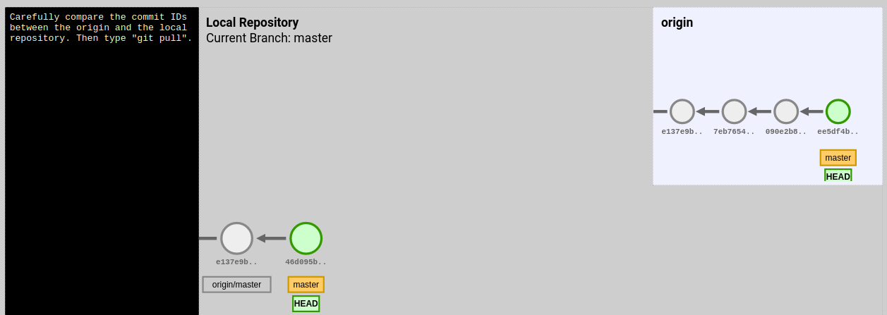
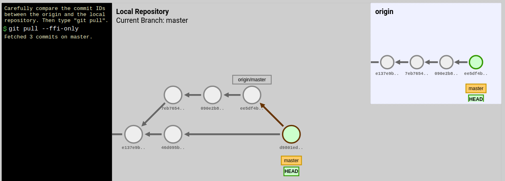

# Dudas

## Reconciliar las ramas

```
ayuda: Las ramas se han divergido y hay que especificar cómo reconciliarlas.
ayuda: Se puede hacerlo ejecutando uno de los comandos siguiente antes del
ayuda: próximo pull:
ayuda:
ayuda:   git config pull.rebase false  # fusionar
ayuda:   git config pull.rebase true   # rebasar
ayuda:   git config pull.ff only       # solo avance rápido
ayuda:
ayuda: Se puede reemplazar "git config" con "git config --global" para aplicar
ayuda: la preferencia en todos los repositorios. También se puede pasar
ayuda: --rebase, --no-rebase o --ff-only en el comando para sobrescribir la
ayuda: configuración por defecto en cada invocación.
fatal: Necesita especificar cómo reconciliar las ramas divergentes.
```

¿Qué significa esto?


**Definamos mejor lo que es un pull**
"git pull" es la combinación de "git fetch" más "git merge". Esto es, podríamos hacer fetch y merge por separado y el resultado es lo mismo que un pull.
* Con el "fetch" nos traemos del servidor las novedades que no tenemos en local pero sin fusionar.
* Revisamos las novedades y hacemos los cambios que necesitemos.
* Finalmente con "merge" fusionamos las novedades con nuestro espacio de trabajo local.

**Tipos de pull**
¿Qué implica cada una de las formas de reconciliación: rebase, no rebase y ff only?

A partir de este estado inicial vamos a ver los efectos de cada `git pull`:



* `git pull`, se mantienen las 2 líneas históricas de commits y se crear un nuevo commit con el resultado final de la fusión.


* `git pull --no-rebase`.


* `git pull --rebase`. Se obtiene una única línea histórica de commits.


* `git pull --ffi-only`


