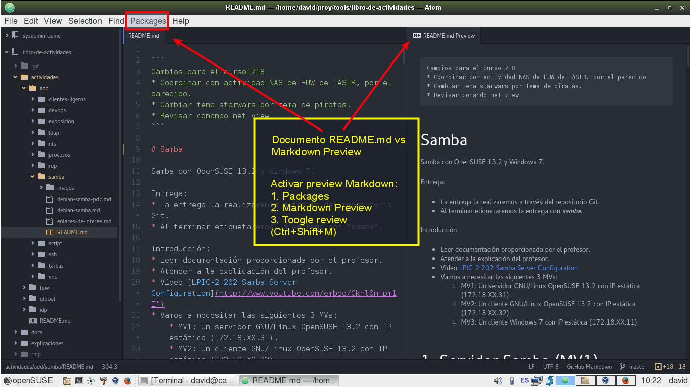

# Editor Markdown

Podemos usar cualquier editor de texto para editar documentos en formato Markdown.

Si usamos el editor atom, podemos activar la previsualización Markdown, tal y como se muestra en
la siguiente imagen.

En Windows podemos usar Atom o Haropad.

# Enlaces de interés

* [Guía básica de Markdown](https://github.com/oscarmoreira11/Guides/blob/master/Markdown/Comandos_Markdown.md)
* [Manipular imágenes desde terminal](http://blog.desdelinux.net/como-manipular-imagenes-desde-el-terminal/)
* [Brackets](http://brackets.io/) es otro editor libre para HTML.
