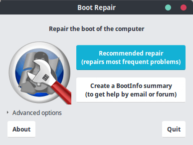
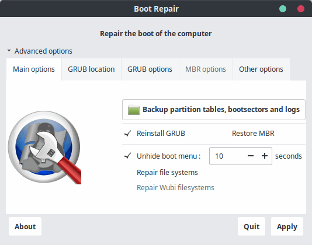
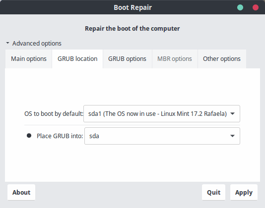
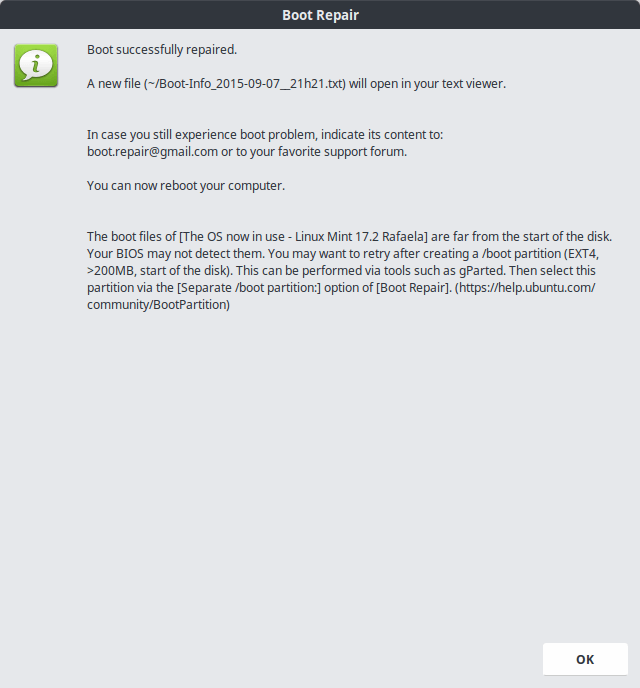

# Cómo recuperar el gestor de arranque GRUB en GNU/Linux con Boot Repair

Boot-Repair es una herramienta que se utiliza para reparar los problemas de arranque de sistemas GNU/Linux. Se suele utilizar desde un Live-CD. **Con un Live de Ubuntu (por ejemplo) es posible recuperar el grub de cualquier distribución.** Con unos cuantos clics es posible reparar la configuración de arranque de nuestro equipo. Por supuesto, también existen muchas configuraciones avanzadas, pero no vamos a entrar en ellas.

## Instalación 

Debemos iniciar nuestro equipo desde un Live CD de GNU/Linux, y si no dispone de Boot-Repair, tendremos que intalarlo.

Para instalar Boot-Repair añadimos el repositorio mediante PPA y luego actualizamos el sistema. Esto se realiza con los siguientes comandos:

```bash
sudo add-apt-repository ppa:yannubuntu/boot-repair
sudo apt-get update
sudo apt-get install boot-repair
```

Y a continuación podemos iniciar el programa con este otro comando:

```bash
sudo boot-repair
```

## Utilización

**El funcionamiento básico de Boot-Repair es muy sencillo**. Al abrirlo, veremos una ventana como la siguiente y simplemente haremos click en **reparación recomendada**. El programa se pondrá a funcionar y solucionará nuestros problemas.



Por lo general, esto suele funcionar, pero si no lo hace es posible realizar una configuración avanzada:



Aquí podemos cambiar el tiempo de espera de arranque o reparar el sistema de archivos, además de reinstalar el *grub*. En la siguiente pestaña es posible seleccionar el sistema operativo que queremos que arranque por defecto:



A menos que se le especifique lo contrario en la última pestaña, al acabar de reparar el arranque se generará un log con el resultado, que suele ser satisfactorio.



## Referencias

- [Cómo recuperar el grub de Linux con Boot-Repair](https://geekytheory.com/como-recuperar-el-grub-de-linux-con-boot-repair)