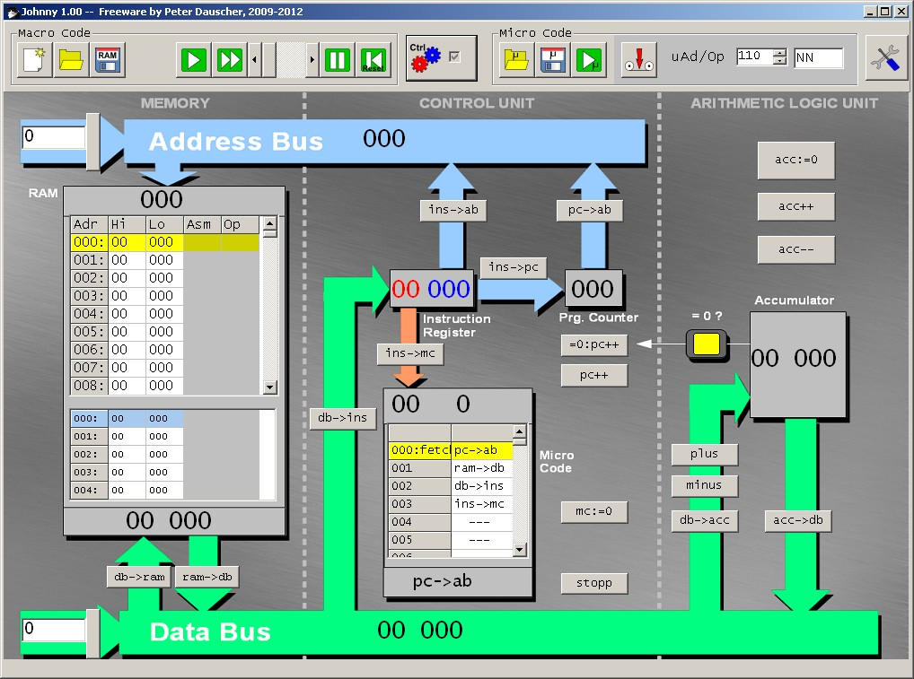

#4. El procesador
El procesador consta de tre partes: La Unidad Aritmético Lógica,
la memoria (RAM) y la Unidad de Control. Estas unidades están
interconectadas por los buses.

A continuación se explica cada unidad en detalle.

##4.1 La memoria (RAM)
La memoria de acceso aleatorio (RAM) consta de 1000 posiciones,
cada una con la posibilidad de almacenar números de 0 a 19999.
De modo qie tres dígitos decimales son suficientes para direccionar
cada posición de memoria.

La posición 10000 y la 1000 están separadas un bit de otras posiciones
puesto que representan el código de operación de las macro instrucciones.

Hay dos botones que se usan (disparando las microinstrucciones `ram->db` y `db->ram`)
para mover los datos desde la localización direccionada al bus y viceversa.

The locations are editable using the GUI; macro instructions can be chosen using a pull-
down menu. In the GUI, two sections of the RAM (which can overlap) are shown. Thus,
the instructions and the affected data can be shown simulta-
neously.
