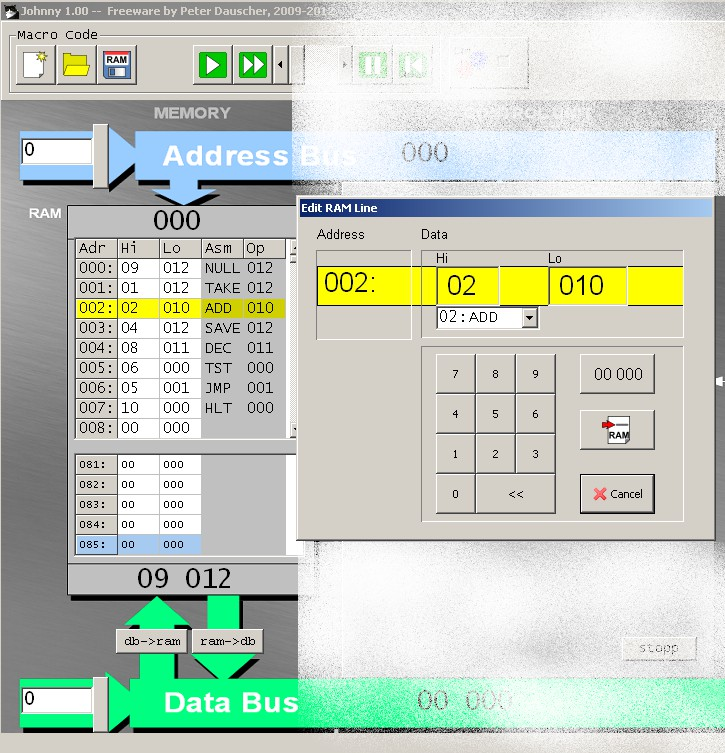
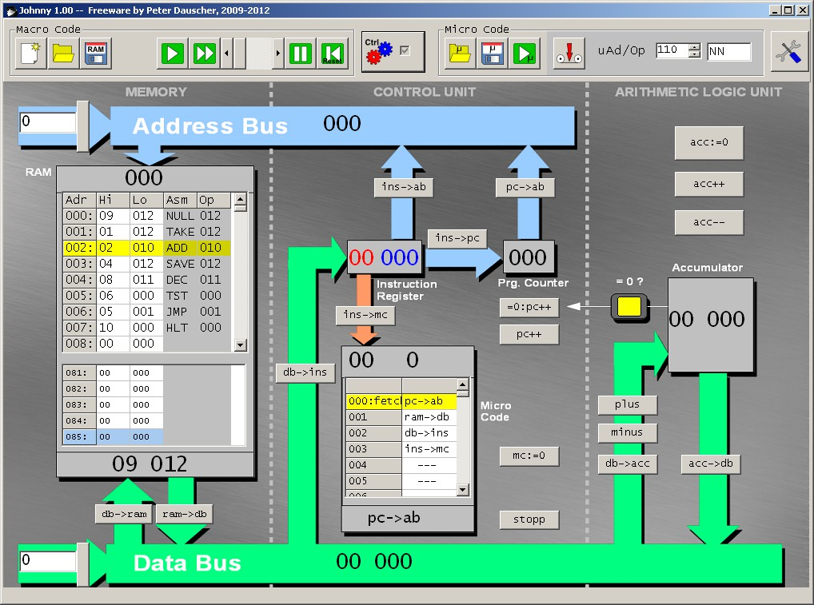

[INDICE](./README.md)

# 4. El procesador

El procesador consta de tres partes: La Unidad Aritmético Lógica,
la memoria (RAM) y la Unidad de Control. Estas unidades están
interconectadas por los buses.

A continuación se explica cada unidad en detalle.

## 4.1 La memoria (RAM)

La memoria de acceso aleatorio (RAM) consta de 1000 posiciones,
cada una con la posibilidad de almacenar números de 0 a 19999.
De modo qie tres dígitos decimales son suficientes para direccionar
cada posición de memoria.

La posición 10000 y la 1000 están separadas un bit de otras posiciones
puesto que representan el código de operación de las macro instrucciones.

Hay dos botones que se usan (disparando las microinstrucciones `ram->db` y `db->ram`)
para mover los datos desde la localización direccionada al bus y viceversa.

Las posiciones se pueden editar usado en GUI; mediante el menú desplegable se pueden
elegir las macro intrucciones. En el GUI, se muestran dos secciones de memoria RAM
(Las cuales se pueden superponer). De esta forma se pueden mostrar simultáneamente
las instrucciones y los datos afectados.

## 4.2. La Unidad Aritmético Lógica

La Unidad Aritmético Lógica consta simplemente del acumulador.
El acumulador puede resetearse ( acc:=0 ), incrementarse ( acc++ ), y
reducirse ( acc-- ). `db->acc` mueve la palabra de datos desde el
bus al acumulador; `acc->db` hace la acción opuesta.
Se puede sumar ( plus ) un valor desde el bus o restarlo ( minus ).

En el modo BONSAI (Que se explica en la sección  9) se han eliminado
algunas de estas micro instrucciones.

## 4.3. La Unidad de Control

La parte más compleja del procesador es la unidad de control.
Consta de el registro de intrucción,el contador de programa y el micro
código. Mediante `db->ins`, el contenido del bus de datos se transfiere
al registro de instrucción. La parte de direccionamiento de la instrucción
puede pasar directamente al bus de direcciones ( `ins->ab` ) o al
contador de programa ( `ins->pc` ), lo cual es necesario para implementar
la instrucción JUMP. El contenido del contador de programa puede copiarse
al bus de direcciones mediante `pc->ab`.

La micro instruccion `pc++`incrementa el contador; `=0:pc++` hace lo mismo,
pero solamente si el acumulador contiene zero. `ins->mc` pone el valor de
las centenas y el de las decenas del contador de micro instrucción (encima
del micro código) en el OP-Code del registro de instruccion (y resetea el
valor de las unidades a zero). La micro instrucción `mc:=0`resetea el contador
de micro instrucciones; `stopp` no es una instrucción en el sentido estricto:
sólo fuerza al simulador a mostrar un mensaje indicando que el programa ha
terminado.

Como se comentó antes, la Unidad de Control puede enmascararse para hacer
las cosas más simples.

