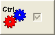
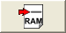
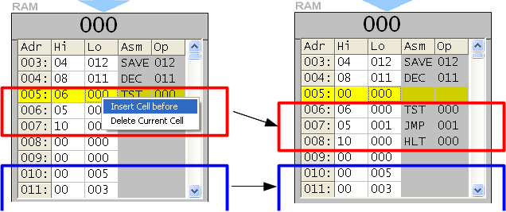

[INDICE](./README.md)

# 7. El interfaz de usuario

Los botones se organizan en dos grupos (Macro código y Micro código),
el último de los cuales sólo están visibles si la Unidad de Control
se muestra en detalle.

|Imagen   | Significado de los botones del grupo de Macro Código|
|-------- | -----------|
|  | Pone la RAM completamente a zero (00 000 para cada dirección) |
| | Abre un programa del disco duro |
| | Graba un programa en el disco duro |
| | Ejecuta la siguiente macro instrucción de la RAM |
|      | Ejecuta el programa de forma automática (la velocidad puede controlarse mediante la barra de scroll y el botón derecho) |
| | Detiene la ejecución del programa |
| | Pone a cero al contador de programa y a el resto de registros |
| | Muestra la ventana de opciones |

El botón  se usa para mostrar todos los detalles de la
Unidad de Control. Si está activo se verán los siguientes botones:

|Imagen   | Significado de los botones del grupo de Micro Código|
|-------- | -----------|
|  | Abrir in fichero con micro código desde el disco duro |
|  | Guarda el micro código actual en un fichero del disco duro |
|  | Ejecuta una micro instrucción |
|  | Graba una secuencia de micro instrucciones para formar una nueva macro instrucción |

Si haces click sobre una dirección de la RAM, aparece una ventana donde se
puede modificar el valor, o se puede elegir una de las macro instrucciones desde
un menú de selección. La direcciñon se puede escribir usando el teclado real
o el virtual. Un doble click sobre la dirección establece el valor a cero.

|Imagen   | Significado de los botones|
|-------- | -----------|
|  | El contenido de la dirección se pone a cero |
|  | Los cambio se escriben en la direccion respectiva |
|  | El valor de la dirección permanece sin cambios |

Usando el botón derecho del ratón aparece un menú conextual. Este menú permite
la inserción y el borrado de la RAM.

Con una inserción, el bloque de la siguiente dirección con valor no cero
se desplaza hacia abajo una posición; se elimina una dirección con valor cero
al final del bloque. De forma similar, con un borrado el bloque con valor no cero
se desplaza hacia arriba y una dirección con valor cero se inserta
debajo del bloque.
