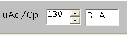

[INDICE](./README.md)

# 8. Crear tus propias macro instrucciones

Para crear una nueva macro instrucción (o para cambiar una existente)
primero se debe elegir un código de operación (OP-Code) y un mnemotécnico.
El último se puede elegit en el menú desplagable anterior cuando se
modifica el contenido de la RAM.

Entonces se presiona el botón para comenzar a grabar: 

Al principio la parte correspondiente al micro código se pone a cero.
Presionando los botones de las microinstrucciones se graba la secuencia respectiva.
La grabación se indica por un parpadeo en el interfaz de usuario.
Presionando el botón anterior se para la grabación.
El nuevo microcódigo se puede grabar en disco y abrir nuevamente mediante

La grabacion del micro código crea dos ficheros: El fichero .mpc que
contiene el micro código en sí, y el fichero .nam con los Mnemotécnicos de
las instrucciones.
