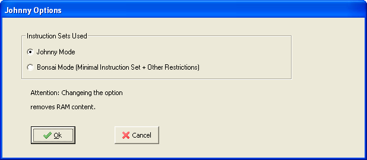

[INDICE](./README.md)

# 9. El modo BONSAI

En los 90, Klaus Merkert y Walter Zimmer implementaron un simulador similar, BONSAI.
Johnny se puede cambiar al modo BONSAI, para poder usar el conjunto de
instrucciones BONSAI (el cual consiste de sólo cinco instrucciones
llamadas INC , DEC , TST , JMP y HLT ).
El menú desplagable se adapta a estas instrucciones, algunas microinstrucciones
(que no se necesitan en este modo) son suprimidas.

# 9.1. Cambiando al modo Bonsai

Usando 

Se muestra una ventana que permite al usuario cambiar el modo. Atención:
El cambio de modo elimina completamente el contenido de la RAM.

# 9.2. Cargar y grabar programas

Se pueden abrir y escribir programas de la máquina BONSAI (Ficheros `.bma`)
del simulador BONSAI original. Además es posible crear programas de máquina
BONSAI usando JOHNNY y luego trasladarlos al simulador original (El cual
es más complejo pero también más realista).

Además hay tres tipos de formatos de ficheros para el contenido de la RAM:

|Extensión| Descripción del fichero           |
|---------|-----------------------------------|
| `.ram`  | Contenido de la RAM estándar JOHNNY |
| `.bma`  | Programas estándar de la máquina BONSAI |
| `.bij`  | Programas Bonsai grabados en el formato estándar de JOHNNY |
