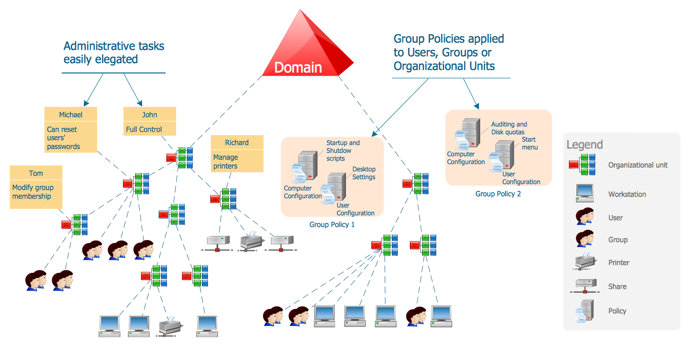
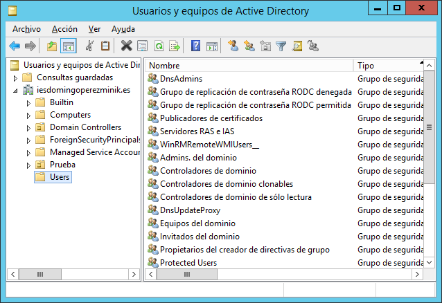
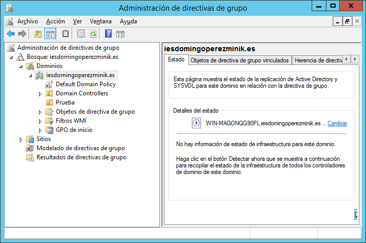
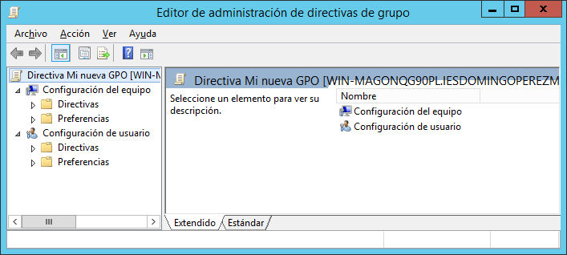
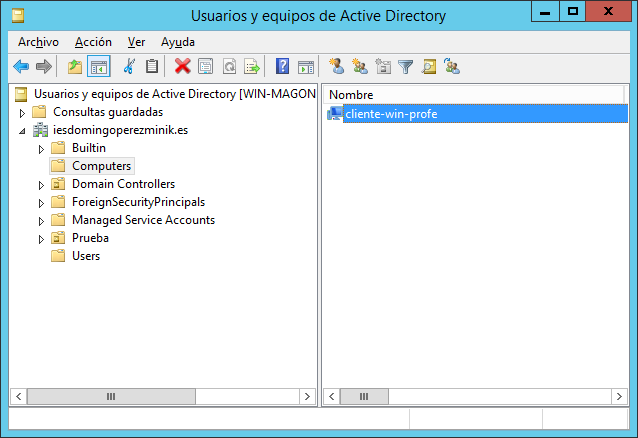

# **Dominios en Windows**

## **Directorio Activo**

El Directorio Activo (Active Directory) es un servicio de directorio que ofrece Microsoft en los Windows Server. Utiliza distintos protocolos, entre los que destacan LDAP, DNS y Kerberos. 


El servidor que ofrece el servicio de directorio se denomina "controlador de dominio", y es posible que haya más de un controlador de dominio, entre los cuales se replica la información contenida en el directorio. Toda la información almacenada en el Directorio Activo.

Un **dominio** puede estar gestionado por uno o más controladores de dominio.

Un **bosque** estará formado por uno o más controladores de dominio que comparten parte del espacio de nombres (nombre de dominio).

Entre ellos se establecen **relaciones de confianza** de forma que pueden compartir información.

Así mismo, es posible establecer relaciones de confianza entre controladores de distintos bosques (unidireccionales o bidireccionales), de forma que entre distintos bosques se pueda compartir información. Los bosques no comparten un espacio de nombres común.

Este servicio cumple con el protocolo LDAP, por lo que podemos consultar/modificar su información con cualquier cliente. 

## **Instalación del Directorio Activo**

**NOTA**: El siguiente procedimiento se ha llevado a cabo en un Windows Server 2012 R2.*

### **Instalación del rol Servicios de dominio del Directorio Activo**

Para instalar el Servicio de directorio Active Directory en seguimos los siguientes pasos:

1. Iniciamos la aplicación "Administrador del servidor".
2. Seleccionamos la opción "Agregar roles y características" del menú "Administrar", y se inicia el "Asistente para agregar roles y características".
3. Saltamos el primer paso del asistente titulado "Antes de comenzar" pulsando "Siguiente".
4. En el paso "Seleccionar tipo de instalación" seleccionamos "Instalación basada en características y roles".
5. En el paso "Seleccionar servidor de destino" seleccionamos el servidor donde queremos instalar el Directorio Activo.
6. En el paso "Seleccionar roles de servidor" seleccionamos "Servicios de dominio de Active Directory" de la lista de "Roles" y agregamos las características requeridas.
7. En el paso "Seleccionar características" lo dejamos como está y continuamos.
8. En el paso "Servicios de dominio de Active Directory" nos avisa que este servicio necesita disponer de un servicio de DNS entre otros servicios para funcionar. Continuamos.
9. En último el paso, "Confirmar selecciones de instalación", marcamos la casilla "Reiniciar automáticamente el servidor de destino en caso necesario" y pulsamos "Instalar".
10. Cuando termine, cerramos el asistente.

Con esto ya hemos instalado el rol en el servidor elegido.

### **Promover un servidor a controlador de dominio**

Una vez completado el proceso anterior de instalación del rol, debemos promover el servidor a controlador de dominio. 

**NOTA: El Servicio de dominio de Active Directory necesita un servidor DNS para funcionar. Si vamos a instalar el servicio de DNS en este mismo servidor (el que vamos a promocionar a controlador de dominio), es conveniente que las interfaces de red a través de las cuáles dará servicio dispongan de IP estática, pues será usado por todo el dominio para la resolución de nombres.**

Seguimos los siguientes pasos:

1. Desplegamos el menú del icono de "Notificaciones" en el "Administrador del servidor" y seleccionamos la opción "Promover este servidor a controlador de dominio".

	

	Esto iniciará el "Asistente para configuración de Servicios de dominio de Active Directory".

2. En el paso "Configuración de implementación" seleccionamos "Agregar un nuevo bosque", pues partimos de la situación en la que no tenemos ningún aún dominio, y especificamos el nombre de dominio raíz de nuestro bosque. Por ejemplo: 

   ```powershell
   iesdomingoperezminik.es
   ```

3. En el paso "Opciones del controlador de dominio", mediante las opciones "Nivel funcional del bosque" y "Nivel funcional del dominio" podemos bajarlo anterior para mantener compatibilidad con otros Windows Server que pueden actuar como controladores de dominio. En nuestro caso, dejamos en ambos "Windows Server 2012 R2". 

	También dejamos seleccionada la opción "Servidor de sistema de nombres de dominio (DNS)" para que se instale el servicio de DNS necesario.

4. Nos saltamos el paso "Opciones de DNS".

5. En el paso "Opciones adicionales" indicamos el nombre NetBIOS para el dominio (el nombre debe cumplir los requisitos de nombre NetBIOS y no debe superar los 15 caracteres). Por lo tanto, si el nombre para el dominio fue "iesdomingoperezminik.es", el nombre NetBIOS podría ser:

   ```powershell
   IESDPM
   ```

6. En el paso "Rutas de acceso" configuramos las carpetas donde el servicio almacenará su información. Lo dejamos como está y continuamos.

7. En el paso "Revisar opciones" disponemos del botón "Ver script" que nos muestra el script PowerShell que podemos utilizar para añadir otros controladores al dominio. En nuestro caso es el siguiente:

   ```powershell
   # Script de Windows PowerShell para implementación de AD DS
   Import-Module ADDSDeployment
   Install-ADDSForest `
   	-CreateDnsDelegation:$false `
       -DatabasePath "C:\Windows\NTDS" `
       -DomainMode "Win2012R2" `
       -DomainName "iesdomingoperezminik.es" `
       -DomainNetbiosName "IESDPM" `
       -ForestMode "Win2012R2" `
       -InstallDns:$true `
       -LogPath "C:\Windows\NTDS" `
       -NoRebootOnCompletion:$false `
       -SysvolPath "C:\Windows\SYSVOL" `
       -Force:$true
   ```
   
   Si está todo correcto, continuamos.
   
8. En el paso "Comprobación de requisitos previos" se realizan varias comprobaciones a ver si el servidor cumple los requisitos para ser promocionado a controlador de dominio. En nuestro caso recibimos varias advertencias, pero aún así cumplimos los requisitos para ser controlador de dominio, así que pulsamos "Instalar".

Cuando termine la instalación se reiniciará el servidor y ya formará parte del dominio como controlador de dominio (y servidor DNS).

Si ejecutamos el siguiente comando en el servidor desde PowerShell:

```powershell
PS> Get-NetTCPConnection –State Listen
```

Podremos comprobar que los siguientes puertos están ahora levantados:

- 53, puerto del servicio de DNS
- 389, puerto LDAP
- 636, puerto LDAP con encriptación TLS

También podemos comprobar desde PowerShell con el siguiente comando que el Servicio de dominio de AD y el DNS están ejecutándose:

```powershell
PS> Get-Service NTDS,DNS
```

## **Administración del Directorio Activo**

Una vez hemos instalado el Directorio Activo, la siguiente tarea es administrar el dominio: unidades organizativas, usuarios, grupos, …




## **Herramientas de Windows Server**

Cuando instalamos el rol de Servicios de directorio de AD, se instalan en el servidor una serie de consolas que permiten administrar distintos aspectos del dominio.

- Administración de directivas de grupo
- Centro de administración de Active Directory
- Dominios y confianzas de Active Directory
- Sitios y servicios de Active Directory
- Usuarios y equipos de Active Directory

Todas las consolas de administración anteriores se encuentran en "Panel de control" > "Herramientas administrativas".

También se instala el módulo de comandos PowerShell para el Directorio Activo.

### **Usuarios y equipos de Active Directory**

Esta es la consola que permite administrar las entradas del directorio (usuarios, grupos, unidades organizativas, equipos, impresoras,…).



### **Administración de directivas de grupo**

Para gestionar los Objetos de Directivas de Grupo (GPO, Group Policy Object) disponemos de esta herramienta.



Una GPO es un objeto que contiene directivas de configuración, y podemos crear tantas como necesitemos. Las directivas de cada GPO se dividen en dos grupos, según los objetos a los que afectan o se aplican:

- **De equipos**: se aplican a los equipos (estaciones de trabajo, servidores, controladores de dominio,…) integrados en el dominio.
- **De usuarios**: se aplican a los usuarios del dominio.



Luego, también mediante esta consola, podemos aplicar dichas GPO a las unidades organizativas, aplicándose de este modo a los objetos contenidos por dichas unidades.

### **Comandos PowerShell**

Es posible administrar el Directorio Activo mediante cmdlets de PowerShell.

Para obtener más información consultar el siguiente enlace: [https://technet.microsoft.com/en-us/library/hh852274](https://technet.microsoft.com/en-us/library/hh852274)

## **Otras herramientas de administración**

Puesto que el Directorio Activo entre otras cosas es un servicio LDAP, es posible utilizar cualquier explorador de directorios LDAP (LDAP browser). 

### **Apache Directory Studio**

Administrador LDAP libre y gratuito con el soporte de la comunidad Apache. Es una de las mejores alternativas, ya que se encuentra disponible para distintas plataformas: GNU/Linux, Windows y MacOsX.

Podemos Descargar ADS desde el siguiente enlace:

[http://directory.apache.org/studio/](http://directory.apache.org/studio/)

## **Integración de un equipo en el dominio**

Si queremos que un equipo forme parte de nuestro dominio, debemos integrarlo en el mismo. Esto sólo lo puede hacer un usuario con privilegios de administración del AD.

Para integrar un equipo en el dominio seguimos los siguientes pasos desde el equipo que queremos integrar:

1. Abrimos la ventana "Propiedades del sistema". Una forma de abrir esta ventana sería:
   - Pulsamos WIN+PAUSA, y en el panel de izquierda seleccionamos "Configuración avanzada del sistema".

2. Seleccionamos la pestaña "Nombre de equipo".
3. Pulsamos el botón "Cambiar…" y se abre el diálogo "Cambios en el dominio o nombre del equipo".
4. Seleccionamos "Dominio" en el panel "Miembro del" y escribimos el nombre del dominio en el que lo queremos integrar. 

Por ejemplo: iesdomingoperezminik.es

**Es necesario que este equipo use el mismo servidor DNS que el controlador del dominio, para poder localizar el dominio.**

5. Introducimos las credenciales de un usuario con privilegios de administración en el dominio.

Y listo, el equipo ya estaría integrado en el dominio. Ahora aparecerá una entrada nueva para este equipo en la carpeta "Computers" de nuestro dominio en la consola "Usuarios y equipos de AD", que podremos mover a la unidad organizativa que queramos.



## **Referencias**

- [Connecting Apache Directory Studio to Active Directory](https://standalone-sysadmin.com/connecting-apache-directory-studio-to-active-directory-ac2758d0236e).
