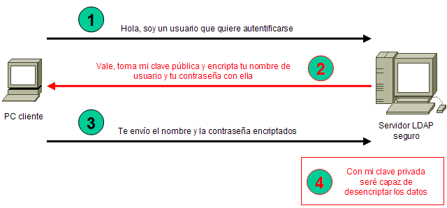
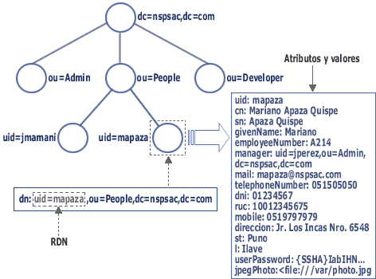

# **Dominios en GNU/Linux**

## **Instalación y configuración de OpenLDAP**

### **Instalación de OpenLDAP**

El servidor OpenLDAP está disponible en el paquete slapd, y lo podemos instalar utilizando apt:

```bash
# apt install slapd
```

Durante la instalación, nos pedirá que introduzcamos la contraseña del administrador del servidor LDAP.

### **Configuración de OpenLDAP**

La configuración del servidor LDAP se almacena en el archivo /etc/ldap/slapd.conf. Podemos editar manualmente dicho archivo, pero es mejor lanzar el asistente de configuración de slapd. 

Para ello debemos ejecutar el siguiente comando:

```bash
# dpkg-reconfigure slapd
```

Y seguir los siguientes pasos en el asistente:

1. El asistente nos pregunta si deseamos omitir la configuración del servidor LDAP. Debemos seleccionar que "No", ya que lo que queremos es precisamente configurar el servidor.

2. Indicamos el nombre de nuestro dominio (DNS) para crear base (raíz) del directorio LDAP. 

   Por ejemplo, si indicamos que nuestro dominio es "iesdomingoperezminik.es", configurará la base del directorio LDAP como "dc=iesdomingoperezmiminik,dc=es", que será el nombre distinguido (dn) de la entrada correspondiente a nuestro dominio. Dentro del dominio irán las cuentas de los usuarios, los grupos, y otro tipo de entradas relacionadas con ese dominio.

   >  **NOTA: dc = Domain Component y dn = Distinguished Name**

3. Indicamos el nombre descriptivo de nuestra organización.

Por ejemplo: "IES Domingo Pérez Minik".

4. Establecemos la contraseña del usuario "admin" (administrador) del servidor LDAP. Nos la pedirá 2 veces para evitar errores.
5. Especificamos el motor de base de datos que utilizará el servicio de directorio. Se recomienda "MDB".
6. Indicamos si queremos o no que se elimine la base de datos del servidor LDAP al purgar el paquete "slapd". Dejamos la opción por defecto.
7. Si detecta que hay una base de datos antigua, debemos indicar si queremos moverla a otra ubicación. Dejamos la opción por defecto.
8. Indicamos si queremos que el servidor LDAP soporte la versión LDAPv2, para compatibilidad con aplicaciones antiguas. Dejamos la opción por defecto.

Una vez completado el proceso de configuración, se reinicia automáticamente el servicio slapd.

Para comprobar que el servicio LDAP está a la espera de peticiones de los clientes, podemos comprobar si se encuentra escuchando en el puerto 389:

```bash
# netstat -ntap tcp
```

### **Directorios de interés**

Los ficheros de configuración del servicio LDAP están en esta ruta:

```bash
/etc/ldap
```

La base de datos del servidor LDAP se almacena en la siguiente ruta:

```bash
/var/lib/slapd
```

Si indicamos que la base de datos antigua se mueva a otra ubicación, será a la siguiente ruta:

```bash
/var/backups
```

### **Arranque y parada manual del servidor OpenLDAP**

Arrancar el servidor:

```bash
# service slapd start
```

Detener el servidor:

```bash
# service slapd stop
```

### **Encriptar las conexiones al servidor OpenLDAP con TLS**



## **Administración de OpenLDAP**

Una vez instalado y configurado el servidor LDAP, la siguiente tarea es la del diseño de la estructura y la introducción de datos en el directorio.



Puesto que la finalidad de nuestro servidor LDAP es que sirva de almacén de usuarios y grupos para autentificar sistemas y servicios como FTP y Web, deberemos crear una estructura que parta de la base de nuestro directorio, para almacenar dicha información. 

Para acceder al directorio LDAP y poder crear y modificar elementos en dicho directorio, es necesario disponer de un administrador/explorador de directorios LDAP. Existen muchas herramientas tanto de pago como libres, como podemos ver a continuación.

**OJO: para autenticarnos en un servidor LDAP, cuando nos pide el nombre de usuario, es necesario especificar el DN completo del usuario.** 

**Por ejemplo, en la imagen anterior, si queremos acceder como el usuario  "<u>mapaza</u>", usamos su DN que es "<u>uid=mapaza,ou=People,dc=nspsac,dc=com</u>" y su contraseña.**

## **Administrar LDAP desde la interfaz gráfica (GUI)**

### **Apache Directory Studio (ADS)**

Administrador LDAP libre y gratuito con el soporte de la comunidad Apache. Es una de las mejores alternativas, ya que se encuentra disponible para distintas plataformas: GNU/Linux, Windows y MacOsX.

Podemos Descargar ADS desde el siguiente enlace:

[http://directory.apache.org/studio/](http://directory.apache.org/studio/)

Es necesario tener Java instalado para poder usar ADS. Ejecutando los siguientes comandos instalamos Java 11.0.10:

```bash
$ curl -s "https://get.sdkman.io" | bash
$ sdk install java 11.0.10.j9-adpt
```

### **LDAP Administration Tool (LAT)**

Para instalar "lat" podemos utilizar "apt":

```bash 
# apt install lat
```

Una vez instalada, para ejecutarlo podemos hacerlo con la siguiente orden:

```bash
$ lat &
```

Una vez iniciado, en "Hostname" indicamos el nombre o la dirección IP del servidor LDAP al que queremos conectar, en "Username" el nombre del usuario con el que queremos conectarnos (en nuestro caso, el administrador del servidor, "admin"), y la contraseña. Ahora podremos explorar y manipular los elementos existentes en nuestro directorio LDAP con esta herramienta.

### **phpLdapAdmin**

Consiste en una aplicación web desarrollada en PHP. Es muy útil para poder administrar el servidor LDAP de forma remota con interfaz gráfica sin tener que instalar nada en el equipo local, ya que lo haríamos a través de esta aplicación web. Para instalarla es necesario un servidor Web con soporte para PHP (por ejemplo, Apache). 

Podemos instalarlo con "apt" (nos instalará un servidor Web completo con PHP incluido):

```bash
# apt install phpldapadmin
```

Los ficheros de la aplicación se almacenarán en el directorio "/usr/share/phpldapadmin/htdocs/", y los archivos de configuración en "/etc/phpldapadmin".

Para configurar la aplicación debemos hacer los siguientes cambios en el fichero "/etc/phpldapadmin/config.php":

- Dirección IP o nombre del servidor LDAP que se quiere administrar (cambiamos este parámetro sólo si el servidor está en una máquina distinta al PhpLdapAdmin):

  ```bash
  $servers->setValue('server','host','<ip_o_nombre_servidor_LDAP>');
  ```

- BaseDN del servidor LDAP:

  ```bash
  $servers->setValue('server','base',array('dc=iesdomingoperezminik,dc=es'));
  ```

  Suponiendo que nuestro dominio fuera "iesdomingoperezminik.es".

- Usuario con el que se va a conectar al servidor LDAP:

  ```bash
  $servers->setValue('login','bind_id','cn=admin,dc=iesdomingoperezminik,dc=es');
  ```

Ahora, para acceder a la aplicación debemos acceder con un navegador:

```bash
http://<nombre_o_ip_del_servidor_web>/phpldapadmin/
```

Una vez que hayamos iniciado la sesión en **phpLdapAdmin**, podremos explorar y manipular el contenido del directorio LDAP.

### **Softerra LDAP Administrator & LDAP Browser**

Se trata de dos aplicaciones para Windows que podemos descargar del siguiente enlace:

[http://www.ldapbrowser.com/download.htm](http://www.ldapbrowser.com/download.htm)

**LDAP Administrator** es una aplicación de pago que nos permite explorar y manipular el contenido del servidor LDAP al que nos conectemos. Podemos descargar una versión de prueba de 30 días (trial).

**LDAP Browser** sólo nos permite explorar el contenido del servidor LDAP, tratándose en este caso de una aplicación gratuita.

### **JXplorer**

Explorador LDAP desarrollado en Java, por lo que es una aplicación multiplataforma. Es necesario disponer de una Máquina Virtual Java (JVM), por lo que al instalar el paquete "jxplorer", si no disponemos de una, se instalará junto con JXplorer.

Para su instalación:

```bash
# apt install jxplorer
```

Para iniciar la aplicación una vez instalada:

```bash
$ jexplorer &
```

## **Administrar LDAP desde la línea de comandos**

Para instalar los comandos necesarios para consultar y administrar un servidor LDAP debemos instalar el paquete "ldap-utils":

```bash
# apt install ldap-utils
```

Los comandos instalados son los siguientes:

- **ldapmodify**
- **ldapexop**
- **ldapurl**
- **ldapsearch**
- **ldapwhoami**
- **ldapcompare**
- **ldappasswd**
- **ldapmodrdn**
- **ldapdelete**

Las OPCIONES comunes a todos los comandos anteriores son:

| Opción        | Descripción                                                  | Valor por defecto |
| ------------- | ------------------------------------------------------------ | ----------------- |
| -H url        | Indica la URL de acceso al servidor LDAP. Formato de URL: *ldap://ip_o_nombre:puerto* ó *ldaps://ip_o_nombre:puerto*. En vez de esto podemos usar las opciones "-h" y "-p". |                   |
| -h servidor   | Indica el nombre o IP del servidor LDAP.                     | localhost         |
| -p puerto     | Indica el puerto del servidor.                               | 389               |
| -x            | Utiliza autenticación simple.                                |                   |
| -D binddn     | DN del usuario con el que se va a conectar.                  |                   |
| -W            | Al utilizar autenticación simple, para que nos pida la contraseña. |                   |
| -w contraseña | Al utilizar autenticación simple, indicamos la contraseña.   |                   |

**NOTA: En los siguientes ejemplos se supone que el dominio de nuestro directorio es "iesdomingoperezminik.es", y usamos el usuario "admin".**

### **Añadir una entrada al directorio**

La sintaxis del comando para añadir una entrada al directorio es la siguiente:

```bash
$ ldapadd [OPCIONES] -f fichero.ldif
```

Donde:

| Opción          | Descripción                                                 |
| --------------- | ----------------------------------------------------------- |
| -f fichero.ldif | Indica que la información la cargará desde el fichero LDIF. |

Por ejemplo:

```bash
$ ldapadd -x -D cn=admin,dc=iesdomingoperezminik,dc=es -W -f nuevo-usuario.ldif
```

Donde el fichero "nuevo-usuario.ldif" podría ser el siguiente:

```
# ENTRADA DE USUARIO
dn: cn=Fran Vargas,ou=profesores,dc=iesdomingoperezminik,dc=es
cn: Fran Vargas
objectClass: person
sn: Vargas
```

Donde a su vez:

- <u>#</u>: Las líneas que empiezan por almohadilla son comentarios. Ponemos donde queramos y tantos como necesitemos.

- <u>dn</u>: nombre distinguido de la nueva entrada. Es obligatorio y debe ser primera línea.

- <u>cn</u>: nombre común (common name); ponemos el nombre del usuario

- <u>objectClass</u>: tipo de entrada (clase de objeto). Al menos hay que poner uno de tipo "estructural" (structural).

- <u>sn</u>: apellidos (surname)

Es posible especificar tantos atributos como requiera nuestra entrada, incluso algunos pueden repetirse con distintos valores.

Es posible añadir muchas entradas al directorio a la vez desde un mismo fichero LDIF; por ejemplo:

```
# ENTRADA DE UNIDAD ORGANIZATIVA
dn: ou=profesores,dc=iesdomingoperezminik,dc=es
ou: profesores
objectClass: organizationalUnit
description: Unidad organizativa para los profesores

# ENTRADA DE USUARIO
dn: cn=Chuck Norris,ou=profesores,dc=iesdomingoperezminik,dc=es
cn: Chuck Norris
objectClass: person
sn: Norris
description: Cuidado con su patada voladora.

# ENTRADA DE USUARIO
dn: cn=Charles Bronson,ou=profesores,dc=iesdomingoperezminik,dc=es
cn: Charles Bronson
objectClass: person
sn: Bronson
```

El ejemplo anterior añade una unidad organizativa y dos usuarios.

**IMPORTANTE: El fichero no debe contener líneas en blanco al final.**

### **Cifrar las contraseñas de los usuarios**

Para generar contraseñas cifradas utilizamos el comando "slappasswd" de la siguiente forma:

```bash
$ slapdpasswd [-h esquema] [-s contraseña]
```

Donde:

| Opción        | Descripción                                                  | Valor por defecto |
| ------------- | ------------------------------------------------------------ | ----------------- |
| -h esquema    | Indica el algoritmo de encriptado utilizado. Posibles valores: {SSHA}, {SHA}, {MD5}, {SMD5}, {CLEARTEXT } (para texto plano, inseguro), … | {SSHA}            |
| -s contraseña | Indica la contraseña a encriptar. Si se omite, nos la pide.  |                   |

Algunos ejemplos:

```bash
$ slappasswd
New password: ****
Re-enter new password: ****
{SSHA}7IhHOTmtJ2gntcutrAZP2XPyiUvcvKWG

$ slappasswd -s 1234
{SSHA}pBbpnndVobICHI5kciLpL2CdhpWLJ4Um

$ slappasswd -h {SSHA} -s 1234
{SSHA}vQ8qMNAsFts88BKbe8R9HznLoTuMBzad

$ slappasswd -h {SMD5} -s 1234
{SMD5}jsj1Hf9R4thfvW12c6FXeYKmXUU=

$ slappasswd -h {SMD5}
New password: ****
Re-enter new password: ****
{SMD5}x1WErGooJV57nePCM4pnv6j4JQI=
```

El valor devuelto por el comando "slapdpasswd" lo utilizamos como valor para el atributo "userPassword" a la hora de crear usuarios. Por ejemplo:

```
# ENTRADA DE USUARIO
dn: cn=Fran Vargas,ou=profesores,dc=iesdomingoperezminik,dc=es
cn: Fran Vargas
objectClass: person
sn: Vargas
userPassword: {SSHA}pBbpnndVobICHI5kciLpL2CdhpWLJ4Um
```

> **NOTA**: la cadena "pBbpnndVobICHI5kciLpL2CdhpWLJ4Um" se corresponde con la contraseña "1234" cifrada con SHA-1.

### **Cambiar la contraseña de nuestro propio usuario**

Cualquier usuario registrado en el directorio LDAP puede cambiar su propia contraseña. Sólo necesita saber su DN y su antigua contraseña.

La sintaxis del comando sería la siguiente:

```bash
$ ldappasswd [OPCIONES] [-S | -s newpassword] 
```

Donde las opciones son:

| Opción         | Descripción                                    |
| -------------- | ---------------------------------------------- |
| -S             | Pregunta por la nueva contraseña.              |
| -s newpassword | Le indicamos la nueva contraseña directamente. |

Por ejemplo, si el usuario "Fran Vargas" quisiera cambiar su contraseña:

```bash
$ ldappasswd -x -D "cn=Fran Vargas,ou=profesores,dc=iesdomingoperezminik,dc=es" -W -S
```

Se le pedirá la contraseña nueva 2 veces, luego la contraseña actual y se actualizará la contraseña del usuario "Fran Vargas" en el directorio.

### **Cambiar la contraseña de otro usuario (sólo administrador)**

Sólo un usuario con permisos de administración en el directorio podrá cambiar las contraseñas de otros usuarios.

La sintaxis del comando sería la siguiente:

```bash
$ ldappasswd [OPCIONES] [-S | -s newpassword] dn_usuario
```

Donde las opciones son:

| Opción         | Descripción                                                  |
| -------------- | ------------------------------------------------------------ |
| -S             | Pregunta por la nueva contraseña                             |
| -s newpassword | Le indicamos la nueva contraseña.                            |
| dn_usuario     | Nombre distinguido del usuario al que queremos cambiarle la contraseña. |

Por ejemplo, si el administrador (admin) va a cambiar la contraseña del usuario "Fran Vargas":

```bash
$ ldappasswd -x -D "cn=admin,dc=iesdomingoperezminik,dc=es" -W -S "cn=Fran Vargas,ou=profesores,dc=iesdomingoperezminik,dc=es"
```

Se le pedirá la nueva contraseña para "Fran Vargas" 2 veces (-S), luego la contraseña del administrador (-W) y se actualizará la contraseña del usuario "Fran Vargas" en el directorio.

### **Comprobar un usuario**

Para comprobar si un usuario es válido (si está registrado en el directorio LDAP) podemos utilizar el comando "ldapwhoami":

```bash
$ ldapwhoami [OPCIONES]
```

Nos devolverá el DN del usuario en caso de que se autentique de forma correcta o error si las credenciales (usuario y/o contraseña) no son correctas.

Por ejemplo:

```bash
$ ldapwhoami -x -D "cn=Fran Vargas,ou=profesores,dc=iesdomingoperezminik,dc=es" -W
Enter LDAP Password: ******
dn:cn=Fran Vargas,ou=profesores,dc=iesdomingoperezminik,dc=es
```

### Modificar una entrada del directorio

La sintaxis del comando para modificar una entrada del directorio es la siguiente:

```bash
$ ldapmodify [OPCIONES] -f fichero.ldif
```

Al igual que para añadir, debemos crear un fichero con formato LDIF para realizar modificaciones a las entradas del directorio.

**Modificar el valor de un atributo de una entrada**

Si queremos modificar un atributo de una entrada, por ejemplo el atributo "sn" del usuario "Fran Vargas", usaríamos el siguiente fichero:

```
dn: cn=Francisco Vargas,ou=profesores,dc=iesdomingoperezminik,dc=es
changetype: modify
replace: sn
sn: Vargas Ruiz
```

Donde:

| Opción     | Descripción                                                  |
| ---------- | ------------------------------------------------------------ |
| dn         | Nombre distinguido de la entrada a modificar. Es obligatorio y debe ser la primera línea. |
| changetype | Tipo de cambio que se va a realizar sobre la entrada. “modify” indica que se va a modificar la entrada. |
| replace    | Indica el atributo que se va a modificar. En el ejemplo anterior es “sn” (surname = apellido). |
| sn         | Nuevo valor del atributo.                                    |

**Añadir un nuevo atributo a una entrada**

Si queremos añadir un nuevo atributo, por ejemplo "telephoneNumber" al usuario "Fran Vargas", usaríamos el siguiente fichero:

```
dn: cn=Francisco Vargas,ou=profesores,dc=iesdomingoperezminik,dc=es
changetype: modify
add: telephoneNumber
telephoneNumber: +34922631444
```

Donde:

| Opción          | Descripción                                                  |
| --------------- | ------------------------------------------------------------ |
| dn              | Nombre distinguido de la entrada a modificar. Es obligatorio y debe ser la primera línea. |
| changetype      | Tipo de cambio que se va a realizar sobre la entrada: “modify” indica que se va a modificar la entrada. |
| add             | Indica el atributo que se va a añadir. En el ejemplo anterior es “telephoneNumber”. |
| telephoneNumber | Nuevo valor del atributo.                                    |

**Eliminar un atributo de una entrada**

Si queremos eliminar un atributo, por ejemplo "telephoneNumber" del usuario "Fran Vargas", usaríamos el siguiente fichero:

```
dn: cn=Francisco Vargas,ou=profesores,dc=iesdomingoperezminik,dc=es
changetype: modify
add: telephoneNumber
telephoneNumber: +34922631444
```

Donde:

| Opción     | Descripción                                                  |
| ---------- | ------------------------------------------------------------ |
| dn         | Nombre distinguido de la entrada a modificar. Es obligatorio y debe ser la primera línea. |
| changetype | Tipo de cambio que se va a realizar sobre la entrada. “modify” indica que se va a modificar la entrada. |
| delete     | Indica el atributo que se va a modificar. En el ejemplo anterior es “telephonmeNumber”. |

**Modificar el RDN de una entrada**

Si por ejemplo quisiéramos modificar el RDN (Relative Distinguished Name) del usuario "Fran Vargas", emplearíamos un fichero LDIF como el siguiente:

```
dn: cn=Fran Vargas,ou=profesores,dc=iesdomingoperezminik,dc=es
changetype: moddn
newrdn: cn=Francisco Vargas Ruiz
deleteoldrdn: 1
```

Donde:

| Opción       | Descripción                                                  |
| ------------ | ------------------------------------------------------------ |
| dn           | Nombre distinguido de la entrada a modificar. Es obligatorio y debe ser la primera línea. |
| changetype   | El tipo de cambio “moddn” indica que se va a modificar el DN de la entrada.**** |
| newrdn       | Atributo que se corresponde con el RDN de la entrada y su nuevo valor. En este caso “cn=…”. |
| deleteoldrdn | Número de elementos que se eliminan del DN del usuario. En este caso 1. |

**Mover una entrada**

Si por ejemplo quisiéramos mover la entrada del usuario "Fran Vargas" de la unidad organizativa "profesores" a "alumnos", emplearíamos un fichero LDIF como el siguiente:

```
dn: cn=Fran Vargas,ou=profesores,dc=iesdomingoperezminik,dc=es
changetype: moddn
newrdn: cn=Fran Vargas
deleteoldrdn: 1
newsuperior: ou=alumnos,dc=iesdomingoperezminik,dc=es
```

Donde:

| Opción       | Descripción                                                  |
| ------------ | ------------------------------------------------------------ |
| dn           | Nombre distinguido de la entrada a modificar. Es obligatorio y debe ser la primera línea. |
| changetype   | El tipo de cambio “moddn” indica que se va a modificar el DN de la entrada. |
| newrdn       | Atributo que se corresponde con el RDN de la entrada y su nuevo valor. En este caso “cn=…”. |
| deleteoldrdn | Número de elementos que se eliminan del DN del usuario. En este caso 1. |
| newsuperior  | DN de la nueva ubicación de la entrada (debe existir).       |

**Realizar varias modificaciones en una entrada**

Es posible hacer varios cambios en una entrada desde un mismo fichero LDIF; por ejemplo, para modificar el atributo "sn" y añadir el atributo "telephoneNumber" al usuario "Fran Vargas":

```
dn: cn=Francisco Vargas,ou=profesores,dc=iesdomingoperezminik,dc=es
changetype: modify
replace: sn
sn: Vargas Ruiz
-
add: telephoneNumber
telephoneNumber: +34922631444
telephoneNumber: +34600123456
-
```

Se usa el guión "-" como separador de los cambios. También posible repetir atributos, en este caso se añaden dos números de teléfono al usuario.

**Eliminar una entrada del directorio**

La sintaxis del comando para eliminar una entrada del directorio es la siguiente:

```bash
$ ldapdelete [OPCIONES] dn
```

Donde las opciones pueden ser:

- dn		Nombre distinguido (DN) de la entrada a eliminar.

Por ejemplo, para eliminar al usuario "Fran Vargas":

```bash
$ ldapdelete -x -D "cn=admin,dc=iesdomingoperezminik,dc=es" -W "cn=Fran Vargas,ou=profesores,dc=iesdomingoperezminik,dc=es"
```

**Consultar el directorio**

La sintaxis del comando para realizar una búsqueda/consulta en el directorio es la siguiente:

```bash
$ ldapsearch [OPCIONES] [-b basedn] [filtro] [atributos...]
```

Donde:

| Opción    | Descripción                                                  |
| --------- | ------------------------------------------------------------ |
| -b basedn | DN de la entrada desde la que se realizará la búsqueda.      |
| filtro    | Criterios que deben cumplir las entradas para aparecer en el resultado de la búsqueda. Más información 		en los enlaces del apartado “Referencias”. |
| atributos | Lista de atributos separada por espacios que mostrarán para cada entrada del resultado junto con su DN. |

Ejemplos:

- Mostrar todas las entradas dentro de "uo=marketing,dc=acme,dc=es" que sean de la clase de objeto "person":

```bash
$ ldapsearch -x -b "uo=marketing,dc=acme,dc=es" "(objectClass=person)"
```

- Mostrar todas las entradas dentro de "dc=acme,dc=es" que tengan nombre común (cn) que empiece por "F":

```bash
$ ldapsearch -x -b "dc=acme,dc=es" "(cn=F*)"
```

- Mostrar el atributo "sn" de las entradas dentro de "dc=acme,dc=es" que tengan nombre de usuario "fvarrui" (uid):

```bash
$ ldapsearch -x -b "dc=acme,dc=es" "(uid=fvarrui)" sn
```

## Autenticación de usuarios GNU/Linux basada en LDAP

Como ya comentamos, una de las utilidades más importantes de un servidor LDAP es como servidor de autentificación. Autentificarse es necesario para entrar en un sistema GNU/Linux. También para acceder a algunos servicios como un servidor FTP o a páginas privadas en un servidor Web. 

A continuación veremos las modificaciones que hay que realizar en un sistema GNU/Linux para autentificar a los usuarios contra un servidor LDAP cuando se inicie sesión en el equipo.

### Librerías de autenticación pam-ldap y nss-ldap

La librería **pam-ldap** permite que las aplicaciones que utilizan PAM (Pluggable Authentication Module) para autentificarse, puedan hacerlo mediante un servidor LDAP. Para que el sistema GNU/Linux se autentifique mediante un servidor LDAP es necesario instalar esta librería ya que utiliza PAM. Hay otras aplicaciones o servicios que utilizan PAM para la autentificación y por tanto podrían, gracias a la librería **pam-ldap**, autentificarse ante un servidor LDAP.

Para especificar el modo de autentificación de cada servicio es necesario configurar los archivos que se encuentran en la carpeta /etc/pam.d/. Al final de este documento se indican los cambios necesarios en éstos archivos.

La librería **nss-ldap** permite que un servidor LDAP suplante a los archivos /etc/passwd, /etc/group y /etc/shadow como bases de datos del sistema. Posteriormente deberemos configurar el archivo /etc/nsswitch.conf para que se utilice LDAP como base de datos del sistema en lugar de los archivos passwd, group y shadow.

### Instalación de los paquetes necesarios

La instalación de los paquetes libpam-ldap y libnss-ldap se puede realizar ejecutando el siguiente comando:

```bash
# apt install libpam-ldap
```

El paquete libnss-ldap es una dependencia de libpam-ldap, por lo que se instalará automáticamente al este último.

Durante el proceso de instalación se abrirá un asistente que nos permitirá configurar las librerías:

1. Indicamos la URI o dirección para acceder al servidor LDAP; el formato es ldap://dirección:puerto ó ldaps://dirección:puerto. Si no especificamos el puerto, cogerá el puerto por defecto que es el 389 en ldap:// y el 636 en ldaps://.

   Por ejemplo: ldap://192.168.1.108:389

2. Especificamos el DN que se usará como base del directorio LDAP (baseDN). Es decir, la entrada a partir de la cuál buscará los usuarios.

   Por ejemplo: dc=iesdomingperezminik,dc=es

3. Establecemos la versión del protocolo LDAP que utilizará la librería (LDAPv2 ó LDAPv3).

4. Indicamos "Sí" para que el usuario "root" pueda cambiar las contraseñas de los usuarios del directorio LDAP del mismo modo en que cambia las contraseñas de los usuarios locales.

5. Seleccionamos que "No", indicando en este caso que no es necesario autenticarse (login) para consultar el directorio LDAP (esto es, que permite el acceso anónimo).

6. Indicamos el DN de la cuenta del administrador del servidor LDAP, de forma que los cambios de contraseña realizados por el administrador (root) se puedan actualizar en el directorio LDAP.

   Por ejemplo: cn=admin,dc=iesdomingperezminik,dc=es

7. Indicamos la contraseña del administrador del directorio LDAP (esta contraseña se almacena en el fichero /etc/ldap.secret en texto plano).

Y con esto termina el proceso de configuración de las librerías libpam-ldap y libnss-ldap.

Todos los parámetros que se acaban de establecer se pueden modificar editando el fichero /etc/ldap.conf, tal y como se explica en el siguiente apartado.

También podemos volver a iniciar este asistente de configuración ejecutando la siguiente orden:

```bash
# dpkg-reconfigure ldap-auth-config
```

**OJO: Si hemos hecho cambios manualmente en el fichero /etc/ldap.conf se perderán dichos cambios tras ejecutar el asistente.**

### Configuración de las librerías

El archivo de configuración de ambas librerías es /etc/ldap.conf y la contraseña del administrador del servidor LDAP se guarda como texto plano (sin encriptar) en el fichero /etc/ldap.secret.

Entre los parámetros a configurar en /etc/ldap.conf, destacamos los siguientes:

| Parámetro       | Descripción                                                  | Ejemplo                                                   |
| :-------------- | ------------------------------------------------------------ | --------------------------------------------------------- |
| host            | Nombre o IP del servidor LDAP.                               | host 192.168.1.112                                        |
| port            | Puerto del servidor LDAP (por defecto es 389).               | port 389                                                  |
| base            | Base del directorio LDAP (base DN).                          | base dc=iesdomingoperezminik,dc=es                        |
| ldap_version    | Versión de LDAP a utilizar.                                  | ldap_version 3                                            |
| rootbinddn      | Administrador del directorio LDAP.                           | rootbinddn cn=admin,dc=iesdomingoperezminik,dc=es         |
| nss_base_passwd | Unidad organizativa donde están las cuentas de los usuarios (sustituto de /etc/passwd). | nss_base_passwd ou=usuarios,dc=iesdomingoperezminik,dc=es |
| nss_base_shadow | Unidad organizativa donde encontrar las contraseñas (sustituto de /etc/shadow). | nss_base_shadow ou=usuarios,dc=iesdomingoperezminik,dc=es |
| nss_base_group  | Unidad organizativa donde encontrar los grupos (sustituto de /etc/group). | nss_base_group ou=grupos,dc=iesdomingoperezminik,dc=es    |

Para que sólo busque en parte de los usuarios y grupos de nuestro directorio LDAP (y no en todo el directorio), debemos añadir al final del fichero /etc/ldap.conf las siguientes líneas:

```bash
nss_base_passwd ou=usuarios,dc=iesdomingoperezminik,dc=es
nss_base_shadow ou=usuarios,dc=iesdomingoperezminik,dc=es
nss_base_group ou=grupos,dc=iesdomingoperezminik,dc=es
```

Así las búsquedas de usuarios y grupos sólo se harán en las ramas del directorio LDAP indicadas; en el ejemplo anterior, se buscarán usuarios (passwd) y contraseñas (shadow) en la rama ou=usuarios,dc=iesdomingoperezminik,dc=es del directorio, y los grupos en la rama ou=grupos,dc=iesdomingoperezminik,dc=es.

Ya hemos instalado y configurado las librerías necesarias para que nuestro sistema GNU/Linux autentique los usuarios contra un servidor LDAP concreto. Ahora falta configurar el módulo PAM para que utilice estas librerías ya configuradas.

### Configurar el fichero nsswitch.conf

Para que el servidor LDAP actúe como si se tratara de los archivos /etc/passwd, /etc/group y /etc/shadow, además de instalar las librerías anteriores, debemos indicar que se utilice LDAP como alternativa para autentificar usuarios. Para ello hay que añadir en el archivo /etc/nsswitch.conf, exactamente en las líneas que hacen referencia a "passwd", "group" y "shadow", la palabra ldap tras la palabra compat quedando el archivo /etc/nsswitch.conf así:

```
# /etc/nsswitch.conf
#
# Example configuration of GNU Name Service Switch functionality.
# If you have the `glibc-doc-reference' and `info' packages installed, try:
# `info libc "Name Service Switch"' for information about this file.

passwd:         compat ldap
group:          compat ldap
shadow:         compat ldap

hosts:          files mdns4_minimal [NOTFOUND=return] dns mdns4
networks:       files

protocols:      db files
services:       db files
ethers:         db files
rpc:            db files

netgroup:       nis
```

### Configurar servicios PAM

Nuestro sistema ya estaría preparado para autentificarse por LDAP. Editando los archivos que hay en el directorio /etc/pam.d, podemos configurar la forma en la que se autentifica cada uno de los servicios que requieren autentificación.

Para no tener que configurar cada uno de los servicios, existen unos archivos comunes cuyo nombre empieza por common que afectan a la mayoría de ellos y sus ficheros de configuración referencian mediante una línea @include a los ficheros comunes, causando el mismo el efecto que si el contenido de los ficheros comunes estuviera copiado en el lugar de la línea @include. Los archivos comunes son:

| Archivo                    | Descripción                       |
| -------------------------- | --------------------------------- |
| /etc/pam.d/common-auth     | Para autenticarse.                |
| /etc/pam.d/common-account  | Para disponer de una cuenta.      |
| /etc/pam.d/common-session  | Para poder iniciar sesión.        |
| /etc/pam.d/common-password | Para poder cambiar la contraseña. |

Estos ficheros contienen una línea que hace referencia a la librería pam_unix.so que corresponde a la autentificación contra los archivos UNIX (passwd, shadow y group). Para que los servicios de nuestro sistema utilicen primero las librerías pam_ldap.so para autentificar al usuario, debemos añadir la línea correspondiente a pam_ldap.so por encima de la línea correspondiente a la librería pam_unix.so en los archivos common. Así, autentificará primero contra el servidor LDAP, y si la autentificación falla, probará después con los ficheros UNIX.

Si queremos que compruebe primero con la base de datos de usuarios local y luego con el directorio LDAP, sólo tenemos que alterar el orden de las líneas donde aparecen pam_unix.so y pam_ldap.so.

### **Configuración del archivo common-auth**

Para que los servicios de nuestro sistema utilicen las librerías pam-ldap para autenticar al usuario, debemos añadir en el archivo /etc/pam.d/common-auth la siguiente línea debajo de la línea pam_unix.so:

```
auth [success=1 default=ignore] pam_ldap.so use_first_pass
```

Si la línea ya existe, no es necesario tocar el fichero.

El archivo /etc/pam.d/common-auth quedaría de la siguiente forma:

```
#
# /etc/pam.d/common-auth - authentication settings common to all services
#
# This file is included from other service-specific PAM config files,
# and should contain a list of the authentication modules that define
# the central authentication scheme for use on the system
# (e.g., /etc/shadow, LDAP, Kerberos, etc.).  The default is to use the
# traditional Unix authentication mechanisms.
#
# As of pam 1.0.1-6, this file is managed by pam-auth-update by default.
# To take advantage of this, it is recommended that you configure any
# local modules either before or after the default block, and use
# pam-auth-update to manage selection of other modules.  See
# pam-auth-update(8) for details.

# here are the per-package modules (the "Primary" block)
auth	[success=2 default=ignore]	pam_unix.so nullok_secure
auth	[success=1 default=ignore]	pam_ldap.so use_first_pass  	← Nuestra línea
# here's the fallback if no module succeeds
auth	requisite			pam_deny.so
# prime the stack with a positive return value if there isn't one already;
# this avoids us returning an error just because nothing sets a success code
# since the modules above will each just jump around
auth	required			pam_permit.so
# and here are more per-package modules (the "Additional" block)
auth	optional			pam_cap.so 
# end of pam-auth-update config
```

### **Configuración del archivo common-account**

Para permitir que los servicios de nuestro sistema comprueben la cuenta del usuario mediante las librerías pam-ldap, debemos añadir en el archivo /etc/pam.d/common-account la siguiente línea debajo de la línea pam_unix.so:

```
account [success=1 default=ignore] pam_ldap.so
```

Si la línea ya existe, no es necesario tocar el fichero.

El archivo /etc/pam.d/common-account quedaría de la siguiente forma:

```
#
# /etc/pam.d/common-account - authorization settings common to all services
#
# This file is included from other service-specific PAM config files,
# and should contain a list of the authorization modules that define
# the central access policy for use on the system.  The default is to
# only deny service to users whose accounts are expired in /etc/shadow.
#
# As of pam 1.0.1-6, this file is managed by pam-auth-update by default.
# To take advantage of this, it is recommended that you configure any
# local modules either before or after the default block, and use
# pam-auth-update to manage selection of other modules.  See
# pam-auth-update(8) for details.
#

# here are the per-package modules (the "Primary" block)
account	[success=2 new_authtok_reqd=done default=ignore]	pam_unix.so 
account	[success=1 default=ignore]	 pam_ldap.so 	        ← Nuestra línea
# here's the fallback if no module succeeds
account	requisite			pam_deny.so
# prime the stack with a positive return value if there isn't one already;
# this avoids us returning an error just because nothing sets a success code
# since the modules above will each just jump around
account	required			pam_permit.so
# and here are more per-package modules (the "Additional" block)
# end of pam-auth-update config
```

### Configuración del archivo common-session

Para permitir que los servicios de nuestro sistema obtengan los parámetros de la sesión de usuario mediante las librerías pam-ldap, debemos añadir en el archivo /etc/pam.d/common-session la siguiente línea debajo de la línea pam_unix.so:

```
session optional pam_ldap.so
```

Si la línea ya existe, no es necesario tocar el fichero.

El archivo /etc/pam.d/common-session quedaría de la siguiente forma:

```
#
# /etc/pam.d/common-session - session-related modules common to all services
#
# This file is included from other service-specific PAM config files,
# and should contain a list of modules that define tasks to be performed
# at the start and end of sessions of *any* kind (both interactive and
# non-interactive).
#
# As of pam 1.0.1-6, this file is managed by pam-auth-update by default.
# To take advantage of this, it is recommended that you configure any
# local modules either before or after the default block, and use
# pam-auth-update to manage selection of other modules.  See
# pam-auth-update(8) for details.

# here are the per-package modules (the "Primary" block)
session	[default=1]			pam_permit.so
# here's the fallback if no module succeeds
session	requisite			pam_deny.so
# prime the stack with a positive return value if there isn't one already;
# this avoids us returning an error just because nothing sets a success code
# since the modules above will each just jump around
session	required			pam_permit.so
# The pam_umask module will set the umask according to the system default in
# /etc/login.defs and user settings, solving the problem of different
# umask settings with different shells, display managers, remote sessions etc.
# See "man pam_umask".
session optional			pam_umask.so
# and here are more per-package modules (the "Additional" block)
session	required			pam_unix.so 
session	optional			pam_ldap.so 	                  ← Nuestra línea
session	optional			pam_ck_connector.so nox11
# end of pam-auth-update config
```

### Configuración del archivo common-password

Para permitir que los servicios de nuestro sistema puedan modificar la contraseña del usuario mediante las librerías pam-ldap, debemos añadir en el archivo /etc/pam.d/common-password la siguiente línea debajo de la línea pam_unix.so:

```
password [success=1 user_unknown=ignore default=die] pam_ldap.so use_authtok try_first_pass
```

Si la línea ya existe, no es necesario tocar el fichero.

El archivo /etc/pam.d/common-password quedaría de la siguiente forma:

```
#
# /etc/pam.d/common-password - password-related modules common to all services
#
# This file is included from other service-specific PAM config files,
# and should contain a list of modules that define the services to be
# used to change user passwords.  The default is pam_unix.

# Explanation of pam_unix options:
#
# The "sha512" option enables salted SHA512 passwords.  Without this option,
# the default is Unix crypt.  Prior releases used the option "md5".
#
# The "obscure" option replaces the old `OBSCURE_CHECKS_ENAB' option in
# login.defs.
#
# See the pam_unix manpage for other options.

# As of pam 1.0.1-6, this file is managed by pam-auth-update by default.
# To take advantage of this, it is recommended that you configure any
# local modules either before or after the default block, and use
# pam-auth-update to manage selection of other modules.  See
# pam-auth-update(8) for details.

# here are the per-package modules (the "Primary" block)
password	[success=2 default=ignore]	pam_unix.so obscure sha512
password	[success=1 user_unknown=ignore default=die]	pam_ldap.so use_authtok try_first_pass 	← Nuestra línea
# here's the fallback if no module succeeds
password	requisite			pam_deny.so
# prime the stack with a positive return value if there isn't one already;
# this avoids us returning an error just because nothing sets a success code
# since the modules above will each just jump around
password	required			pam_permit.so
# and here are more per-package modules (the "Additional" block)
password	optional	pam_gnome_keyring.so 
# end of pam-auth-update config
```

### Configuración particular de cada servicio

Si deseamos que algún servicio se autentifique de forma diferente, podemos editar el archivo del servicio (ej: /etc/pam.d/su, /etc/pam.d/ssh, /etc/pam.d/ftp, etc.), eliminar la línea que comienza por @include (no incluir en la configuración del servicio los ficheros common) e introducir la configuración particular que deseemos.

### Crear el directorio HOME al iniciar sesión

Añadir en el fichero /etc/pam.d/common-session la línea siguiente:

```
session required pam_mkhomedir.so skel=/etc/skel umask=0022
```

Pero justo antes de la siguiente línea:

```
session required pam_permit.so
```

De esta forma, cuando un usuario inicie sesión y no disponga de directorio HOME, se creará a partir de los ficheros /etc/skel (skel=/etc/skel) y con los permisos `rw-rw-r-` (umask=0022).

## Creación de usuarios y grupos en el directorio LDAP para poder iniciar sesión en GNU/Linux

Las librerías anteriores deben saber identificar las entradas del directorio que corresponden con usuarios y grupos GNU/Linux. Por ello, es necesario que las entradas pertenezcan a unas clases de objetos determinadas (objectClasses).

### Unidades organizativas

Las unidades organizativas (organizational units) nos permiten organizar las entradas del directorio. Las entradas de este tipo contendrán a su vez entradas de usuarios, grupos y otras unidades organizativas.

El objetClass para este tipo de entrada es "organizationalUnit" extiende de "top", y como RDN se utiliza el atributo "ou" con el nombre de la unidad organizativa.

**organizationalUnit**

| Atributos                  | Descripción                       | Obligatorio |
| -------------------------- | --------------------------------- | ----------- |
| ou, organizationalUnitName | Nombre de la unidad organizativa. | X           |
| description                | Descripción.                      |             |
| l, localityName            | Localidad.                        |             |
| postalAddress              | Dirección postal.                 |             |
| postalCode                 | Código postal.                    |             |
| st, stateOrProvinceName    | Provincia.                        |             |
| street, streetAddress      | Calle.                            |             |

Por ejemplo, para crear una unidad organizativa "usuarios":

```
dn: ou=usuarios,dc=iesdomingoperezminik,dc=es
objectClass: organizationalUnit
objectClass: top
ou: usuarios
description: Unidad organizativa para las cuentas de los usuarios
```

### Usuarios

Las cuentas de los usuarios que queremos que puedan iniciar sesión en los sistemas GNU/Linux con autenticación basada en LDAP deben pertenecer a las clases de objeto "posixAccount" y "shadowAccount".

Si queremos poder almacenar información adicional en el directorio de los usuarios como el e-mail u otros datos, también podemos hacer que sus entradas sean de tipo "inetOrgPerson".

**posixAccount**

| Atributos      | Descripción                                                  | Obligatorio |
| -------------- | ------------------------------------------------------------ | ----------- |
| cn, commonName | Nombre completo.                                             | X           |
| gidNumber      | Número de identificación del grupo (GID, Group IDentifier).  | X           |
| homeDirectory  | Directorio HOME.                                             | X           |
| uid,userId     | Nombre de usuario.                                           | X           |
| uidNumber      | Número de identificación del usuario (UID, User IDentifier)  | X           |
| description    | Descripción sobre el usuario.                                |             |
| gecos          | Información general sobre el usuario: ubicación, teléfono, … |             |
| loginShell     | Shell de inicio de sesión.                                   |             |
| userPassword   | Contraseña del usuario.                                      |             |

**shadowAccount**

| Atributos        | Descripción                                                  | Obligatorio |
| ---------------- | ------------------------------------------------------------ | ----------- |
| uid, userId      | Nombre de usuario                                            | X           |
| description      | Descripción.                                                 |             |
| shadowExpire     | Número de días entre el 1/1/1970 y el día en que la cuenta de usuario se bloquea. |             |
| shadowFlag       | Sin uso.                                                     |             |
| shadowInactive   | Número de días que tiene de margen el usuario para cambiar su contraseña una vez caducada. |             |
| shadowLastChange | Número de días entre el 1/1/1970 y el día que se cambió la contraseña por última vez. |             |
| shadowMax        | Número máximo de días en que la contraseña es válida.        |             |
| shadowMin        | Número de días entre un cambio de contraseña y otro.         |             |
| shadowWarning    | Número de días en que se avisa al usuario de que cambie su contraseña antes de que caduque. |             |
| userPassword     | Contraseña del usuario "hasheada"                            |             |

**inetOrgPerson**

| Atributos     | Descripción           | Obligatorio |
| ------------- | --------------------- | ----------- |
| gn, givenName | Nombre.               | X           |
| sn, surname   | Apellidos.            | X           |
| jpegPhoto     | Foto en formato JPEG. |             |
| mail          | Dirección de correo.  |             |
| mobile        | Número de móvil.      |             |

> Las clases de objeto "posixAccount" y "shadowAccount" se corresponden campo a campo con los ficheros /etc/passwd y /etc/shadow de los sistemas GNU/Linux.

### Grupos

Las grupos de usuarios definidos en el directorio LDAP que queremos que sean reconocidos por nuestro sistema GNU/Linux deben pertenecer a la clase de objeto "posixGroup" que extiende a la clase "top".

**posixGroup**

| Atributos      | Descripción                                                  | Obligatorio |
| -------------- | ------------------------------------------------------------ | ----------- |
| cn, commonName | Nombre del grupo.                                            | X           |
| gidNumber      | Número de identificación del grupo (GID, Group IDentifier).  | X           |
| description    | Descripción sobre el grupo.                                  |             |
| memberUid      | Nombre del usuario (UID, User IDentifier) perteneciente al grupo.Se repetirá tantas veces como usuarios tenga el grupo. |             |
| userPassword   | Contraseña del grupo. Los usuarios que conozcan esta contraseña pueden administrar el grupo. |             |

## Probar la autentificación

Nuestro servidor LDAP ya debería autentificar correctamente a nuestros usuarios.

Una forma de comprobarlo es obteniendo las bases de datos "passwd", "shadow" y "group" mediante el comando getent:

```bash
fran@cliente-linux:~$ getent passwd
root:x:0:0:root:/root:/bin/bash
daemon:x:1:1:daemon:/usr/sbin:/bin/sh
bin:x:2:2:bin:/bin:/bin/sh
[...]
fran:x:1000:1000:fran,,,:/home/fran:/bin/bash
vboxadd:x:999:1::/var/run/vboxadd:/bin/false
angel:x:5002:5001:Ángel Domínguez Pérez:/home/angel:/bin/bash
paco:*:5003:5001:Paco González Sánchez:/home/paco:/bin/bash
troyano:*:1004:5002:Javier Troyano:/home/troyano:/bin/bash
prunell:*:5005:5002:José Carlos Prunell:/home/prunell:/bin/bash
fulgencio:*:5001:5001:Fulgencio Pérez García:/home/fpergar:/bin/sh
```

Para obtener las otras bases de datos podemos usar las siguientes órdenes:

```bash
fran@cliente-linux:~$ getent shadow
fran@cliente-linux:~$ getent group
```

Otra forma sería iniciando sesión con algún usuario registrado en el servidor LDAP o simplemente cambiando de usuario con el comando su (switch user):

```bash
fran@cliente-linux:~$ su angel
Password: xxxx
angel@cliente-linux:/home/fran$ whoami
angel
```

## Referencias

- [How To Install and Configure a Basic LDAP Server on an Ubuntu 12.04 VPS](https://www.digitalocean.com/community/tutorials/how-to-install-and-configure-a-basic-ldap-server-on-an-ubuntu-12-04-vps).
- [How To Use LDIF Files to Make Changes to an OpenLDAP System](https://www.digitalocean.com/community/tutorials/how-to-use-ldif-files-to-make-changes-to-an-openldap-system).
- [How To Encrypt OpenLDAP Connections Using STARTTLS](https://www.digitalocean.com/community/tutorials/how-to-encrypt-openldap-connections-using-starttls#prerequisites).
- [OpenLDAP Administrator’s Guide (v2.4)](https://www.openldap.org/doc/admin24/guide.html).
- [How to change account passwords on an OpenLDAP server](https://www.digitalocean.com/community/tutorials/how-to-change-account-passwords-on-an-openldap-server).
- [Finding directory entries (LDAP Search Filters)](https://www.centos.org/docs/5/html/CDS/ag/8.0/Finding_Directory_Entries-LDAP_Search_Filters.html).

