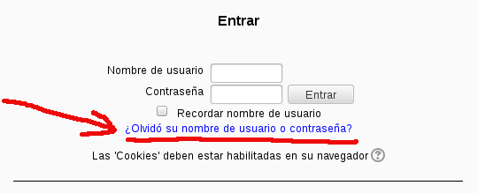

#Preguntas frecuentes sobre Moodle2.6

#1. Curso
##1.1 Cambiar el nombre de un curso
* Entro al curso en Moodle2.6
* En el lado izquierdo -> Administración -> Editar Ajustes
* Modifico los campos *Nombre completo del curso* y *Nombre corto del curso*.
* Guardar cambios

> Para cambiar el nombre del curso debo tener permisos de profesor sobre dicho curso.
>
> Recordar que el nombre debe comenzar por "[15/16] ...." cuando estemos en el curso 2015-2016.
>
> Cada nuevo curso debemos realizar este renombrado para saber que siguen en uso.

##1.2 Automatrícula
Para permitir que los alumnos se puedan automatricular en nuestro curso:
* Entrar en nuestro curso de Moodle.
* En el lado izquierdo -> Administración -> Usuarios -> Método de matriculación
* Activamos la opción *Automatriculación (Estudiante)* (Picar en el icono del ojo para activar y desactivar)

#2. Usuarios
##2.1 Cambiar el perfil de mi usuario
* Entrar en Moodle.
* En el lado izquierdo -> Administración -> Ajustes de mi perfil -> Editar perfil

> En ciudad debemos poner el grupo en el que estemos, o bien PROFESOR si somos docentes.
>
> El correo debe ser una cuenta de email válida y que estemos usando.
>
 
##2.2 Cambiar la clave de acceso
* Entrar en Moodle
* En el lado izquierdo -> Administración -> Ajustes de mi perfil -> Cambiar contraseña

##2.3 Olvidé mi clave

