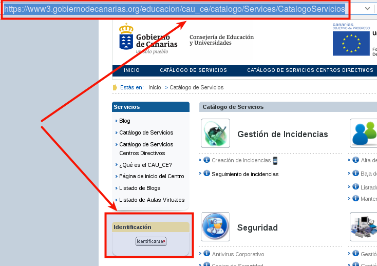
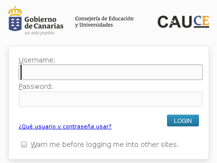
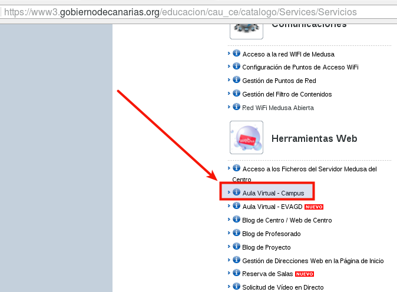
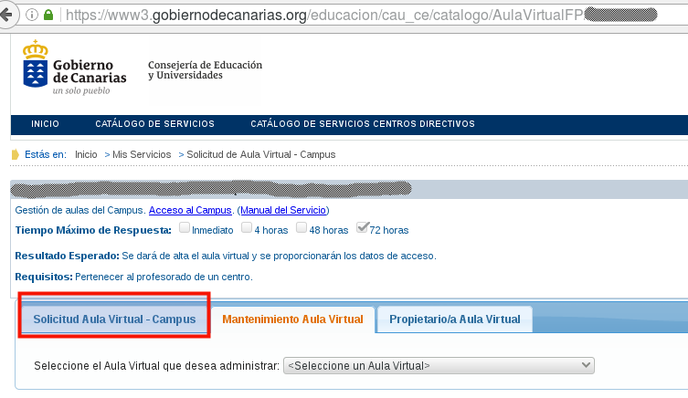

#Campus Virtual

El servidor Moodle del Gobierno de Canarias se llama Campus Virtual.

* Ir al [Catágolo de Servicios CAUCE](https://www3.gobiernodecanarias.org/educacion/cau_ce/catalogo/Services/CatalogoServicios).

* Identificarse con Usuario/Clave Medusa

* Se nos activan más funciones. Entre ellas `Aula Virtual - Campus`

* A continuación entramos en la `consola` o panel de administración del Campus.
Desde aquí podemos gestionar nuestros cursos Moodle: creando cursos nuevos,
borrándolos, etc.

