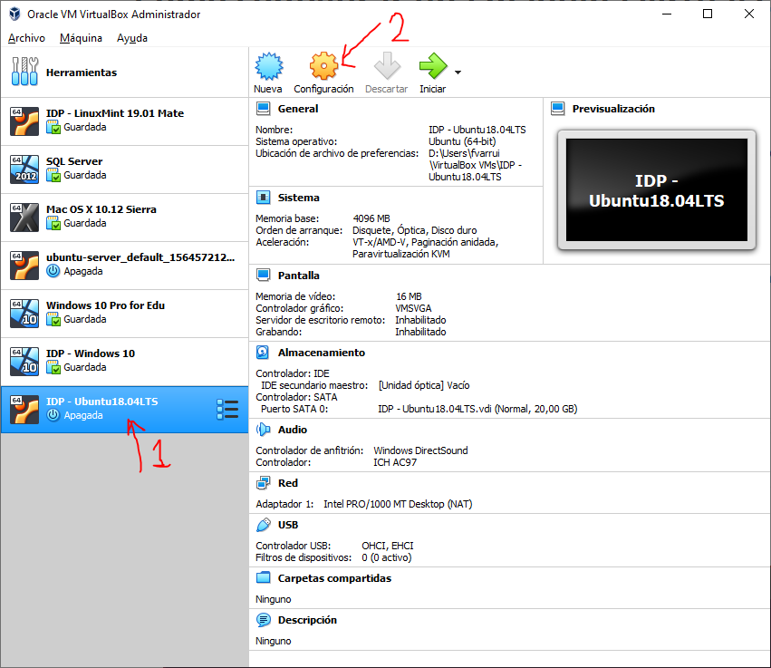
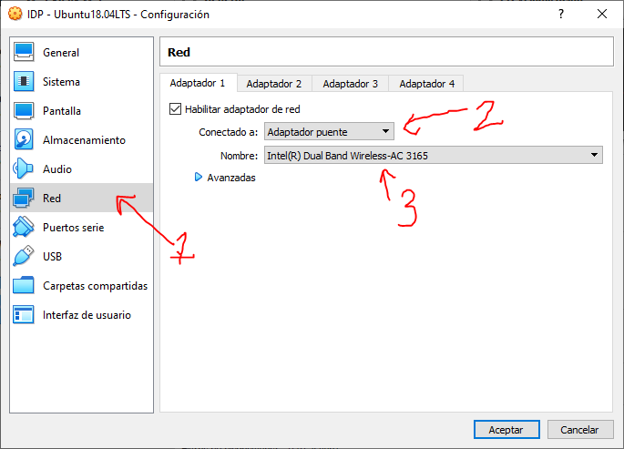

# Configurar una interfaz de red en *Adaptador puente* en VBox

1. Abrir la configuración de la máquina virtual en VirtualBox:

	

2. Seleccionar la opción **Red** de la lista de la izquierda, seleccionar la pestaña del adaptador de red que queremos configurar (en este caso se ha utilizado el "Adaptador 1"), establecer **Adaptador puente** en el desplegable **Conectado a**, y pulsar **Aceptar**.

	

> Si disponemos de más de una interfaz de red física (como puede ocurrir en un portátil, que tenemos wifi y cable), en el desplegable **Nombre** podemos elegir a través de qué interfaz de red física se conectará nuestra máquina virtual a la red física.

Con esto ya estaría la máquina virtual conectada a la misma red física que la máquina real.
