# Cómo crear una máquina virtual en VBox

A continuación se explica el proceso para crear una máquina virtual (invitado o **guest** en inglés; en adelante MV) en VirtualBox e instalarle un sistema operativo (en adelante SO):

## Crear la MV

1. Iniciamos *VBox*, pulsamos el botón para crear una MV **Nueva** y se abrirá el asistente que nos guiará en el proceso de creación de la misma:

	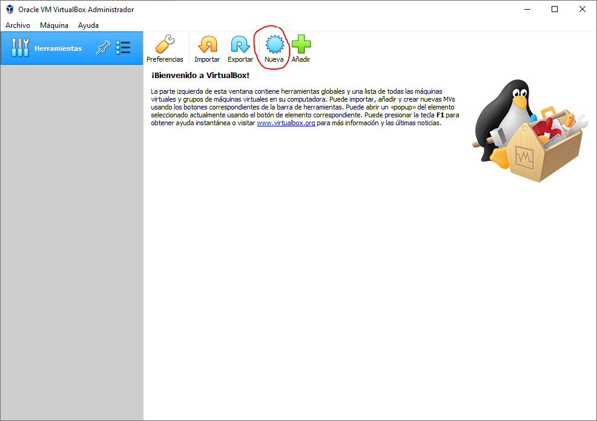

2. Introducimos el nombre de la MV y seleccionamos el tipo de SO que vamos a instalar (esto último establecerá los requisitos de hardware mínimos necesarios para dicho sistema):

	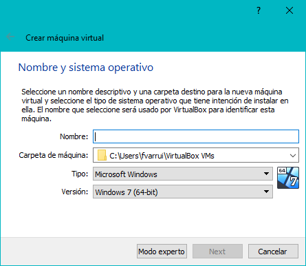

3. Indicamos la cantidad de memoria RAM asignada a la máquina virtual (esta memoria será la máxima consumida por la MV, es importante que no sea más de la mitad de la memoria RAM disponible en el sistema anfitrión o **host**):

	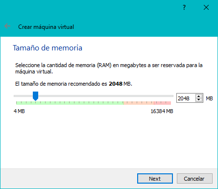

4. Indicamos que queremos crear un disco duro virtual nuevo para nuestra MV:

	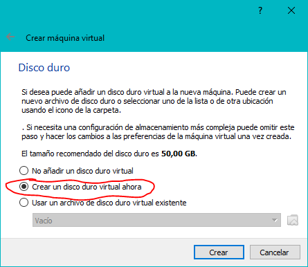

5. Indicamos el formato del disco duro virtual (**VDI** es el formato nativo de VirtualBox):

	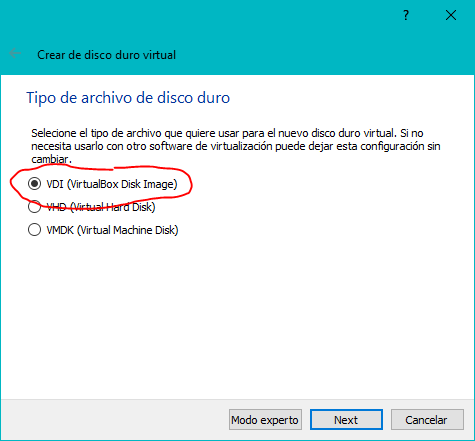

6. Indicamos que queremos que el archivo del disco duro virtual crezca de forma dinámica según sea necesario (es algo más lento, pero nos ahorrará espacio en el disco duro del host - *en la ventana del asistente se explican perfectamente las opciones disponibles*):

	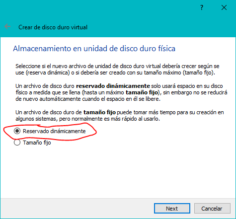

7. Indicamos la capacidad del disco duro virtual:

	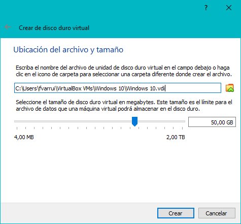

8. Tras este último paso ya estaría creada nuestra MV, ahora falta instalarle el SO para poder usarla. En la siguiente captura podemos observar las características de la MV que acabamos de crear.

	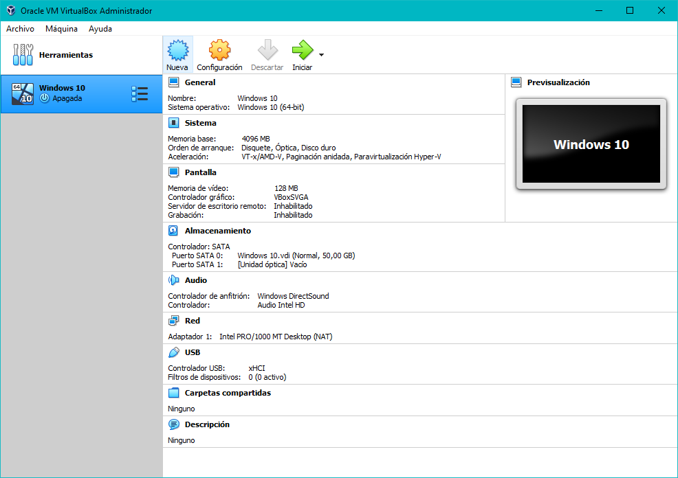

## Instalación del SO

1. Pulsamos sobre la **Unidad óptica**  (la MV dispone de una unidad óptica virtual, es decir, una unidad de CD/DVD/BluRay), y luego sobre **Seleccionar un archivo de disco...**.

	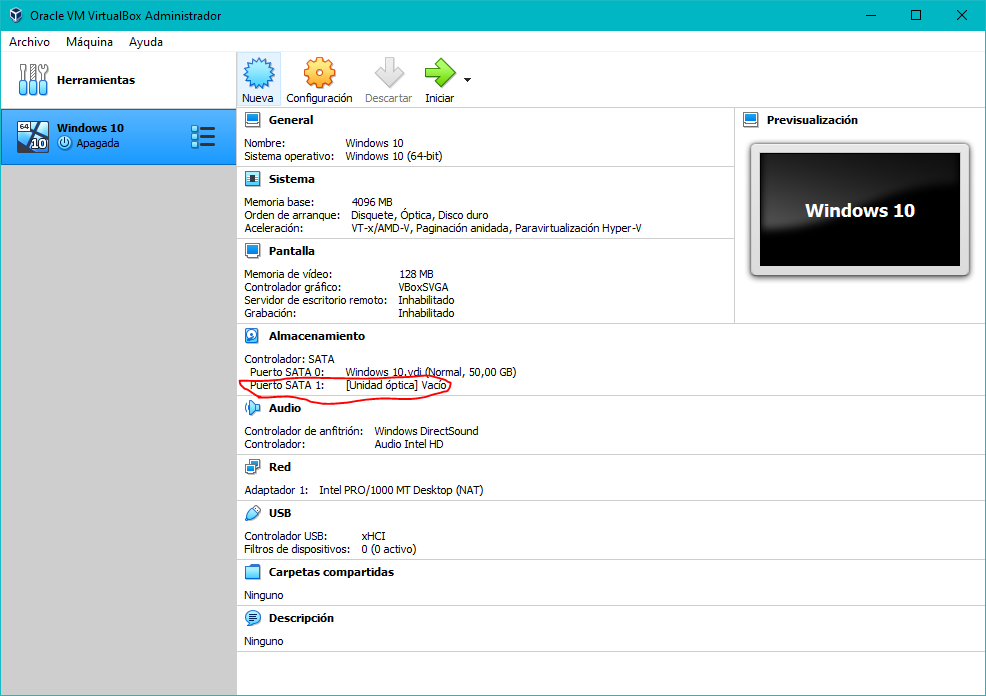

2. En el cuadro de diálogo localizamos la imagen ISO del CD/DVD de instalación del SO (fichero con extensión `.iso`):

	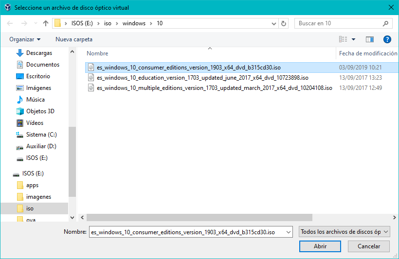

3. Iniciamos la MV y ésta arrancará desde la unidad óptica que contiene la ISO:

	

4. A continuación seguiríamos los pasos del asistente de instalación del SO (en este caso se ha utilizado *Windows 10*, pero podría ser cualquier otro compatible con nuestro host):

	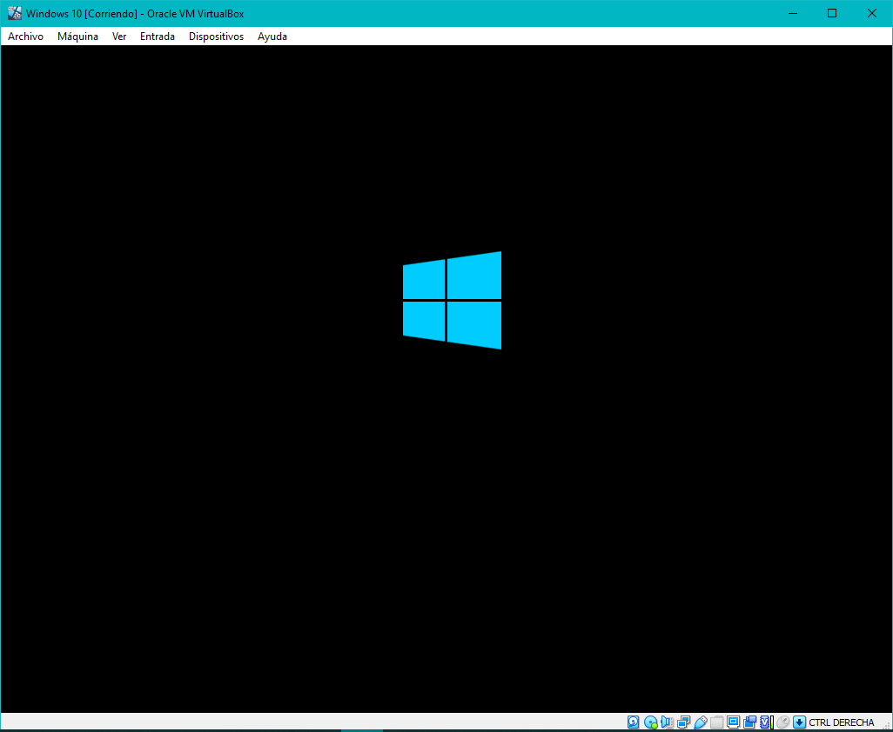

