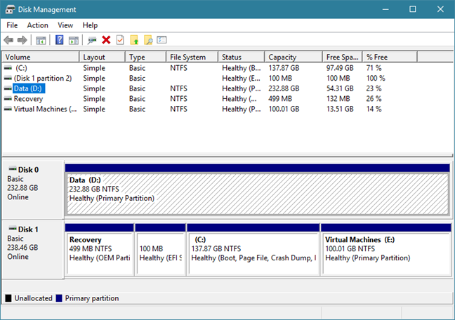
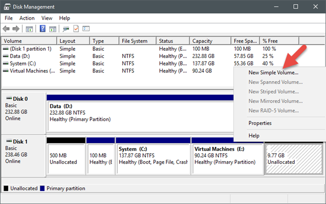
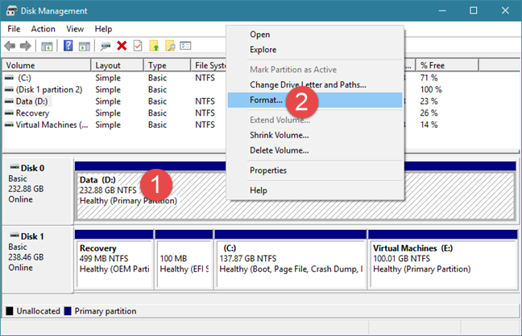
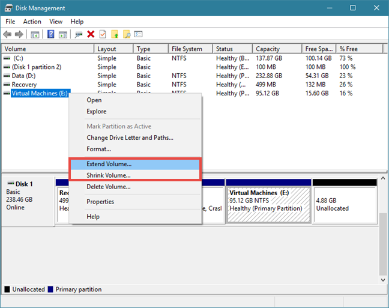
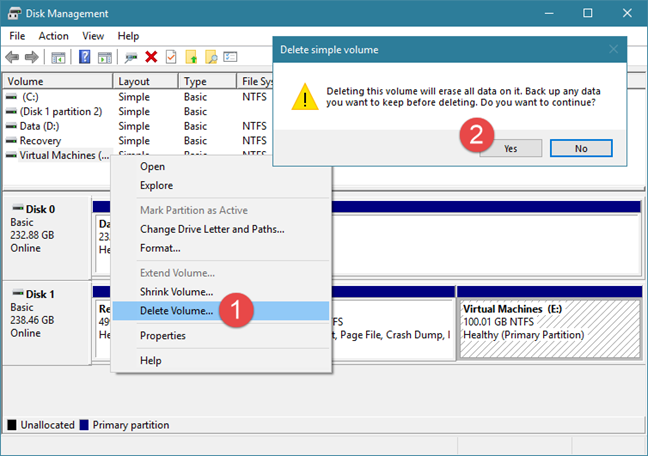
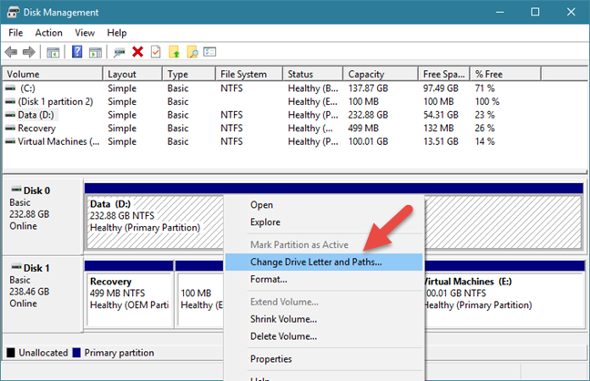
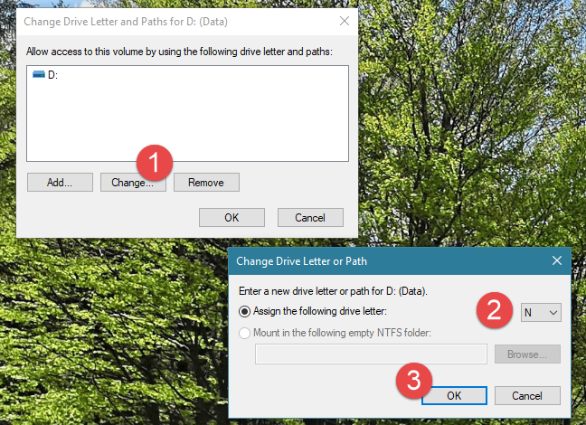
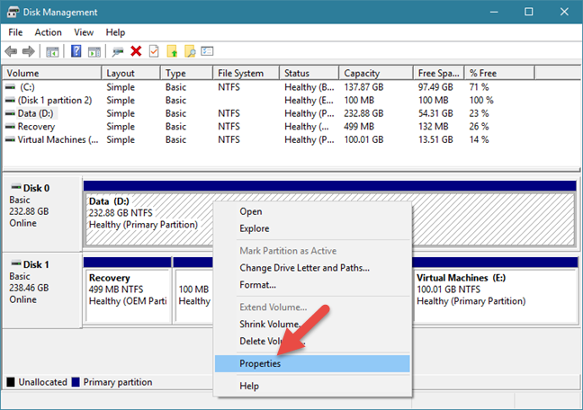
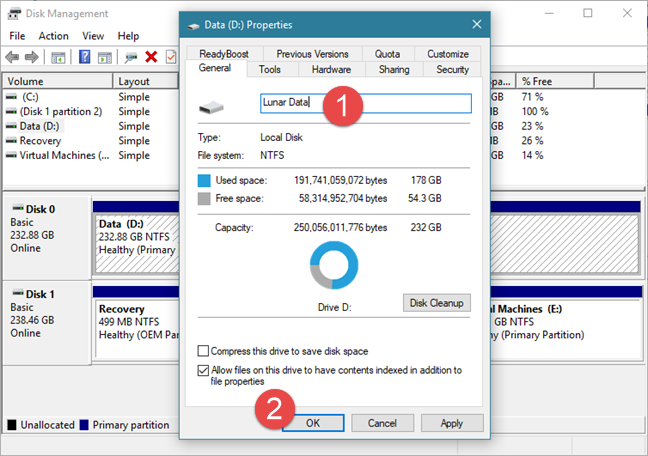

# **7 cosas que puedes hacer con el Administrador de discos en Windows**

Las versiones modernas de Windows vienen con une herramienta de administración de discos muy útil que permite crear, redimensionar y borrar particiones sin tener que iniciar ninguna utilidad de disco desde arranque o comprar. La herramienta integrada de Windows de la que hablamos se llama ***Disk Manager*** (administrador de discos en español),  y es bastante fácil de usar. Si quiere hacer cambios relacionados con el disco o las particiones siga leyendo:

**NOTA**: Este artículo cubre Windows 10, Windows 7 y Windows 8.1. Antes de leerlo, debería saber que empezamos por la suposición de que sabe iniciar el ***Disk Manager***. Si no sabe cómo, lea la siguiente guía_

- [9 formas de abrir la herramienta ***Disk Manager*** en Windows (todas las versiones).](https://www.digitalcitizen.life/open-disk-management-windows/)

## 1. Ver información sobre sus discos y particiones

Abra la herramienta ***Disk Manager*** y, en el área superior, podrá ver información sobre los discos. Se muestra el nombre, tamaño y tipo de cada partición creada en los discos encontrados en su sistema. Se muestran las particiones que están formateadas pero también las que no lo están. También cualquier disco oculto o sin espacio asignado encontrados en tus discos.

Tenga en cuenta, que el Administrador de Discos solo puede manejar sistemas de ficheros compatibles con sistemas operativos Windows, como [NTFS](https://www.digitalcitizen.life/what-is-ntfs-why-useful/), [exFAT](https://www.digitalcitizen.life/what-is-exfat-why-useful/) o [FAT32](https://www.digitalcitizen.life/what-is-fat32-why-useful/). A pesar de poder ver otro tipo de particiones, como las creadas y formateadas por Linux, solo puede borrarlas, no gestionarlas.

## 2. Crear particiones en sus discos

Si tiene espacio libre en su disco duro, puede usarlo para crear una o más nuevas particiones. El espacio sin particionar está destacado y etiquetado como ***Unallocated*** o ***Free Space*** (espacio libre o disponible en español). La manera más rápida y sencilla de crear una partición usando todo o algo del espacio libre disponible es haciendo clic derecho o presionando y manteniendo el espacio disponible y seleccionando ***New Simple Volume*** (nuevo volumen simple en español). Luego, seguir los pasos del ***New Simple Volume Wizard*** (asistente de nuevo volumen simple en español).

Si necesita guía detallada en cómo crear una partición en Windows, lea el siguiente tutorial:

- [2 maneras de crear una partición, en Windows (todas las versiones).](https://www.digitalcitizen.life/ways-create-partition-windows/)

## 3. Formatear particiones encontradas en sus discos

Si acaba de crear una partición en uno de sus discos, el asistente de particiones ya le habrá ofrecido la opción de formatearlo. Sin embargo, puede formatear también una partición que ya esté creada y presente en un disco. Si esta es la manera que quiere, tenga en cuenta que formatear particiones significa que todos los datos en ella serán eliminados, así que asegúrese de hacer una copia de seguridad de cualquier fichero importante en ella antes de seguir.

para formatear una partición existente, dele clic derecho o pulse y mantenga, en la ventana del administrador de discos y luego seleccione la opción ***Formatear***. Establezca la etiqueta, tipo de sistema de ficheros y tamaño de la unidad. Tenga en cuenta que para este último, mantener el tamaño de la unidad predeterminado debería ser la elección correcta para la mayoría de los usuarios.

Luego, Windows debería empezar a formatear la partición. Este proceso solo debería tardar unos pocos segundos, pero depende del tamaño de la partición y de la velocidad de su disco. Si quiere más detalles en cómo formatear discos, fijas o portátiles, puede estar interesado en el siguiente tutorial:

- [2 maneras de formatear un tarjeta SD, una memoria USB o una partición de disco, en Windows.](https://www.digitalcitizen.life/how-format-sd-card-usb-memory-stick-or-partition-windows/)

## 4. Redimensionar las particiones encontradas en su disco.

También puede reducir o expandir particiones en sus discos, tanto como espacio libre (sin particionar) haya disponible inmediatamente antes o después de la partición que esté intentando modificar. Ni expandir ni reducir particiones requiere formatear.

Para hacer una partición más grande o pequeña, pulse clic derecho o pulse y mantenga en esa partición y seleccione ***Extend Volume*** (extender volumen en español) o ***Shrink Volume*** (reducir volumen en español) dependiendo de lo que quiera. Luego, siga los pasos del asistente de extensión de volumen si elogió hacerlo más grande o elija cuán pequeño lo quiere hacer en la ventana de diálogo de reducir.

Si quiere una guía paso a paso en cómo redimensionar particiones en Windows, mire este tutorial:

- [2 maneras de redimensionar una partición en Windows (todas las versiones).](https://www.digitalcitizen.life/resize-partition-windows/)

## Eliminar particiones de sus discos

Si hay alguna partición que no necesite más y quiere liberar el espacio en disco que ocupan, puede eliminarlas usando la misma herramienta de administración de discos. Tenga en cuenta que, antes de borrar una partición, debe asegurarse siempre de que no hay archivos importantes en ella, ya que todo en ella se perderá.

Para borrar una partición con el ***Disk Manager***, haga clic derecho o presione y mantenga en la partición y luego seleccione ***Delete Volume*** (eliminar volumen en español). En el mensaje "Eliminar el volumen simple" que se muestra, confirme que realmente quiere hacerlo y la partición será eliminada.

Si quiere más detalles sobre el proceso de borrado, tenemos una guía separada paso a paso:

- [2 formas de eliminar una partición, en Windows, sin aplicaciones de terceros.](https://www.digitalcitizen.life/delete-partition-windows/)

## 6. Cambiar las letras de sus particiones

El administrador de discos también ofrece la opción de cambiar la letra de los discos. Son aquellas letras que todo el mundo ve mostradas en sus discos en ***Windows Explorer*** (explorador de Windows o explorador de archivos). La letra más común en Windows es "C" porque es la letra por defecto usada por el sistema operativo para marcar el disco de instalación de Windows. Esta es también la razón por la que no puede cambiar la letra de un disco por "C", al menos no usando métodos convencionales.

Para cambiar la letra de un disco asociado a una partición, haga clic derecho o presione y mantenga en dicha partición y seleccione ***Change Drive Letter and Paths*** (cambiar letra de disco y rutas).

Una nueva ventana debería aparecer, listando la letra del disco de la partición. Haga clic o presione Change y, en la siguiente ventana, seleccione la nueva letra de disco que desee asignarle. Luego, haga clic en OK.

Para una explicación más detallada de todo el proceso, puede leer la siguiente guía separada que hemos publicado:

- [Cómo cambiar la letra de cualquier disco o partición, en Windows.](https://www.digitalcitizen.life/change-letter-drive-partition-windows/)

## Cambiar las etiquetas de sus particiones

Similarmente a cambiar las letras de los discos, también puede usar la herramienta "Administración de Discos" para cambiar las etiquetas. La etiqueta del volumen de una partición se muestra al lado de la letra del disco cuando se están viendo las particiones en el explorador de archivos o ***Windows Explorer*** y también es requerido si planea compartir particiones con otras sistemas operativos. Para cambiar la etiqueta de una partición, haga clic derecho o presione y mantenga en la partición y selecciones ***Properties*** (propiedades en español). en el menú contextual.

En la pestaña General de la ventana Propiedades de la partición, escriba la nueva etiqueta en la pestaña al lado del icono del disco.

Haga clic en OK y la etiqueta de la partición será modificada automáticamente. en caso de que quiera aprender más formas de establecer para sus particiones, mire también esta guía:

- [4 formas de etiquetar y renombrar cualquier disco en Windows.](https://www.digitalcitizen.life/4-ways-label-and-rename-any-drive-windows/)

## Guía Original

- https://www.digitalcitizen.life/how-manage-your-disks-using-disk-management-utility/