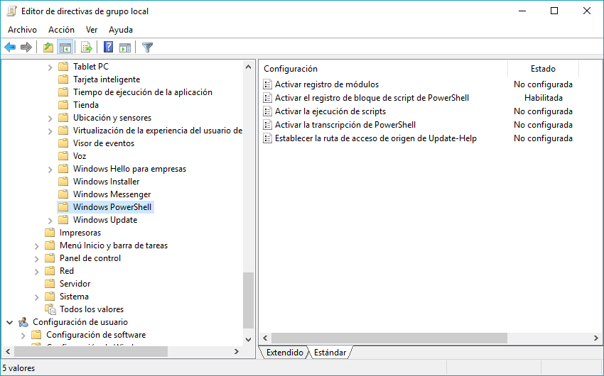
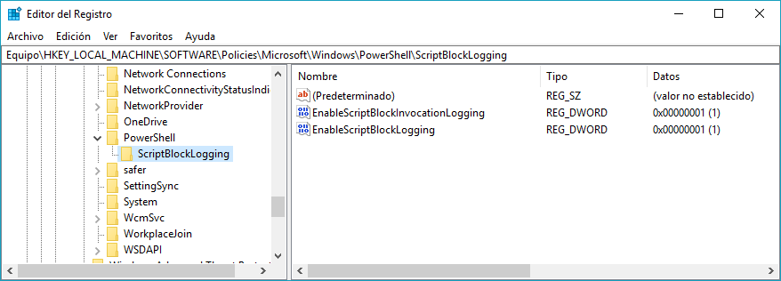
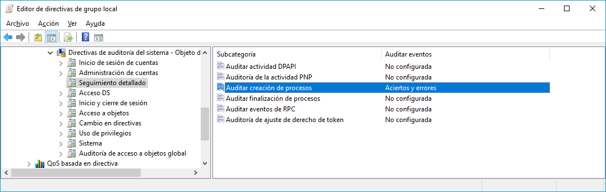
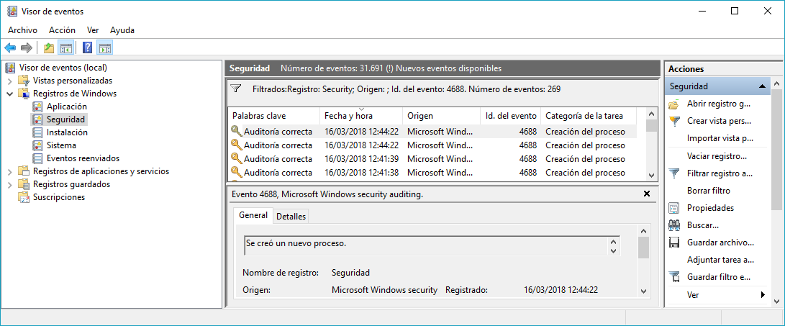
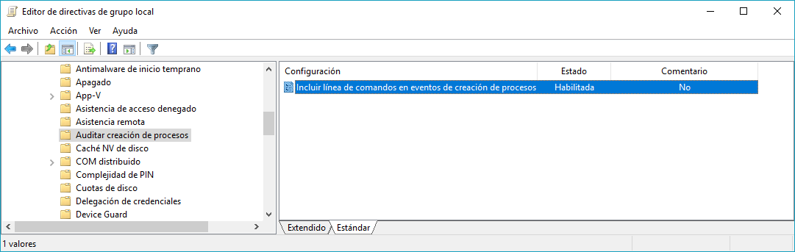

# Auditar la ejecución de comandos en Windows

## PowerShell

Para registrar un evento por cada comando ejecutado en PowerShell, que luego podremos consultar en el "Visor de eventos" en `Microsoft-Windows-PowerShell/Operational`:

1. Abrir el editor de directivas de grupo:  `gpedit.msc`
2. Ir a **Configuración del equipo > Plantillas administrativas > Componentes de Windows > Windows PowerShell**
3. "Habilitar" la directiva **Activar el registro de bloque de script de PowerShell** para que se registre eventos por cada cmdlet ejecutado.



Opcional, para transcribir en ficheros todos los comandos ejecutados y los resultados ofrecidos:

* "Habilitar" la directiva **Activar la transcripción de Powershell** e indicar el **Directorio de salida de la transcripción** (directorio donde se guardan las transcripciones).

Cambios en el registro de Windows tras habilitar la directiva anterior:



## Creación de procesos

Para registrar un evento cada vez que se inicia un proceso debemos activar la directiva "Auditar creación de procesos":

1. Abrir el editor de directivas de grupo: `gpedit.msc`
2. Ir a **Configuración del equipo > Configuración de Windows > Configuración de seguridad > Configuración de directiva de auditoría avanzada > Directivas de auditoría del sistema – Objeto de directiva de grupo local > Seguimiento detallado**
3. Habilitar "Aciertos" y "Errores" en la directiva **Auditar creación de procesos** para que se registre eventos por cada cmdlet ejecutado.



Configuración de esta directiva en el Registro de Windows:

Los eventos de creación de procesos tienen el ID 4688 y se guardan en el registro "Seguridad".



Para registrar también la línea de comandos que se usó para iniciar el proceso, es necesario habilitar la siguiente directiva (desde Windows Server 2012 R2, Windows 8.1 o superior):

1. Abrir el editor de directivas de grupo: `gpedit.msc`
2. Ir a **Configuración del equipo > Plantillas administrativas > Sistema > Auditar creación de procesos**
3. "Habilitar" la directiva **Incluir línea de comandos en eventos de creación de procesos** para que se incluya la línea de comando en los eventos de tipo 4688.



Configuración de esta directiva desde el Registro de Windows:

| **Clave** | HKLM\SOFTWARE\Microsoft\Windows\CurrentVersion\Policies\System\Audit |
| --- | --- |
| **Valor** | ProcessCreationIncludeCmdLine\_Enabled |
| **Tipo** | REG\_DWORD |
| **Habilitado** | 1 |
| **Deshabilitado** | 0 |

Un ejemplo del XML correspondiente a uno de estos eventos donde se ha registrado el inicio del "Bloc de notas" (`notepad.exe`)  desde el diálogo "Ejecutar" (explorer.exe):

```xml
<Event xmlns="http://schemas.microsoft.com/win/2004/08/events/event">
    <System>
        <Provider Name="Microsoft-Windows-Security-Auditing" Guid="{54849625-5478-4994-A5BA-3E3B0328C30D}" />
        <EventID>4688</EventID>
        <Version>2</Version>
        <Level>0</Level>
        <Task>13312</Task>
        <Opcode>0</Opcode>
        <Keywords>0x8020000000000000</Keywords>
        <TimeCreated SystemTime="2018-03-16T12:44:22.835108200Z" />
        <EventRecordID>37281</EventRecordID>
        <Correlation />
        <Execution ProcessID="4" ThreadID="7972" />
        <Channel>Security</Channel>
        <Computer>CENTOLLO</Computer>
        <Security />
    </System>
    <EventData>
        <Data Name="SubjectUserSid">S-1-5-21-98100758-2920532898-2568853359-1001</Data>
        <Data Name="SubjectUserName">Fran</Data>
        <Data Name="SubjectDomainName">CENTOLLO</Data>
        <Data Name="SubjectLogonId">0x3496a</Data>
        <Data Name="NewProcessId">0x3ea8</Data>
        <Data Name="NewProcessName">C:\Windows\System32\notepad.exe</Data>
        <Data Name="TokenElevationType">%%1938</Data>
        <Data Name="ProcessId">0x1c18</Data>
        <Data Name="CommandLine">"C:\WINDOWS\system32\notepad.exe"</Data>
        <Data Name="TargetUserSid">S-1-0-0</Data>
        <Data Name="TargetUserName">-</Data>
        <Data Name="TargetDomainName">-</Data>
        <Data Name="TargetLogonId">0x0</Data>
        <Data Name="ParentProcessName">C:\Windows\explorer.exe</Data>
		<Data Name="MandatoryLabel">S-1-16-8192</Data>
	</EventData>
</Event>
```

## Referencias

- [Practical PowerShell Security: Enable Auditing and Logging with DSC](https://blogs.technet.microsoft.com/ashleymcglone/2017/03/29/practical-powershell-security-enable-auditing-and-logging-with-dsc/)

- [Command line process auditing](https://docs.microsoft.com/en-us/windows-server/identity/ad-ds/manage/component-updates/command-line-process-auditing)

- [4688: A new process have been created](https://docs.microsoft.com/en-us/windows/security/threat-protection/auditing/event-4688)

- [Include command line in process creation events](https://getadmx.com/?Category=Windows_10_2016&amp;Policy=Microsoft.Policies.Auditing::IncludeCmdLine)
