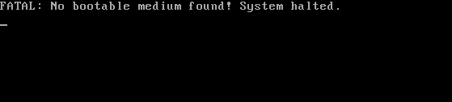

# Restaurar el arranque en Windows 10

El siguiente tutorial explica cómo resolver problemas con el arranque de Windows 10.

Partiendo del supuesto en el que durante el arranque de nuestro equipo nos apareciera un mensaje como el siguiente o similar:



Normalmente este problema se debe a que el **MBR** (sector 0) se ha corrompido, y para restaurarlo podemos seguir los siguientes pasos.

## Recuperar la tabla de particiones

Si se ha **dañado la tabla de particiones** (que es algo que podemos comprobar desde una distrubición Live de GNU/Linux con GParted, por ejemplo), lo primero que debemos hacer es **recuperar la tabla de particiones**. Para esto podemos utilizar la herramienta [**TestDisk**](https://www.cgsecurity.org/wiki/TestDisk) (se encuentra disponible en algunas [distribuciones Live de GNU/Linux](https://www.cgsecurity.org/wiki/TestDisk_Livecd), como por ejemplo [DRBL](https://drbl.org/)). Disponemos de una guía paso a paso para llevar a cabo esta tarea [aquí](https://www.cgsecurity.org/wiki/TestDisk_Step_By_Step).

## Restaurar el cargador de arranque de Windows 10

A continuación debemos **restaurar el cargador de arranque** (código de arranque del MBR) para que arranque nuestro sistema, y seguimos los siguientes pasos:

1. Arrancamos desde el DVD o USB de instalación de Windows 10.

2. En la ventana de bienvenida del instalador (una vez hemos seleccionado el idioma) pulsamos en **Reparar el equipo** (abajo a la izquierda).

3. Elegimos **Solucionar problemas**.

4. Elegimos **Símbolo del sistema** para abrir un terminal.

5. Introducimos la siguiente secuencia de comandos:

   ```
   bootrec /FixMbr 
   bootrec /FixBoot 
   bootrec /ScanOs 
   bootrec /RebuildBcd
   ```

   > No olvides pulsar **Enter** después de cada comando para ejecutarlo.

   >   **ATENCIÓN:** En caso de que falle alguno de los comandos anteriores indicando algo como `Acceso denegado`, debemos ejecutar `chkdsk /f c:` para reparar los problemas que pudiera haber en el sistema de ficheros de Windows.

6. Extrae el DVD/USB de Windows y reinicia el equipo.

7. Y ahora debería arrancar sin problema. ¡¡¡De nada!!!

## Referencias

- [Fix the MBR – Guide for Windows XP, Vista, 7, 8, 8.1, 10](https://neosmart.net/wiki/fix-mbr/#Fix_the_MBR_in_Windows_10)

