# Instalación desatendida de Windows 10

Cuando realizamos una nueva instalación de Windows 10, el instalador nos llevará por una serie de pasos para configurar nuestro sistema: particionado, configuración del teclado, zona horaria, clave de producto, cuenta de usuario, configuración de privacidad, etc. Aunque el proceso es sencillo, debemos perder tiempo en realizar estos pasos durante la instalación.

Si queremos automatizar el proceso de instalación y ahorrarnos tiempo en este proceso, es posible crear un fichero de respuestas con instrucciones para el instalador y que podemos integrar en el mismo medio de instalación. De este modo, el instalador de Windows 10 leerá las respuestas de este fichero sin preguntarnos.

En este tutorial veremos como crear el fichero de respuestas `autounattend.xml`, conteniendo la información básica de configuración de Windows 10, para poder realizar una instalación desatendida.

## Cómo crear un medio de instalación desatendido de Windows 10

A continuación veremos los pasos a seguir para configurar el fichero `.xml` necesario para realizar la instalación desatendida de Windows 10 en un equipo mediante UEFI o BIOS.

El instalador desatendido que crearemos **eliminará todo en la unidad de instalación**, creando y configurando las particiones necesarias e instalando un Windows 10 nuevo con la mayoría de las configuraciones básicas establecidas.

### Instalar Windows System Image Manager

Microsoft ofrece la herramienta **Windows System Image Manager (WSIM)**, disponible en el paquete **Windows Assessment and Deployment Kit (ADK)**, para facilitarnos la creación del fichero de respuestas.

Para instalar WSIM vamos a seguir los siguientes pasos:

1. [Descargar el instalador de **Windows ADK** ](https://go.microsoft.com/fwlink/?linkid=2120254) para Windows 10.

2. Iniciamos el instalador haciendo doble clic en el fichero **adksetup.exe**.

3. Elegimos la opción **Instalar Windows Assessment and Deployment Kit - Windows 10 en este equipos** y pulsamos **Siguiente**.

   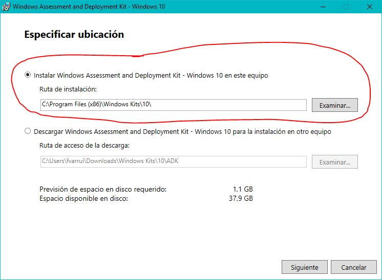

4. Seleccionamos las opciones de privacidad y pulsamos **Siguiente**.

6. Pulsamos **Aceptar** para aceptar la licencia.

6. Desmarcamos todas las opciones dejando sólo **Herramientas de implementación**, para instalar WSIM.

   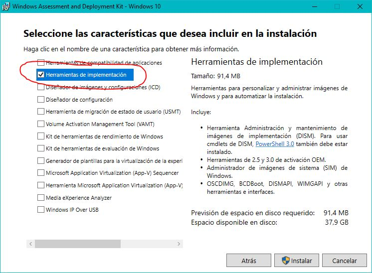

10. Pulsamos **Instalar** y cuando termine **Cerrar**.

### Cómo crear el proyecto para el fichero de respuestas de Windows 10

Después de instalar WSIM, tenemos que importar los ficheros de instalación de Windows a nuestro equipo y configurar el entorno para crear el fichero de respuestas.

#### Importar los ficheros de instalación de Windows 10

Para importar los ficheros de instalación seguimos los siguientes pasos:

1. Abrimos el **Explorador de archivos** (WIN+E).

2. Localizamos la ISO de instalación de Windows 10, hacemos clic derecho sobre la misma y seleccionamos la opción **Montar**.

   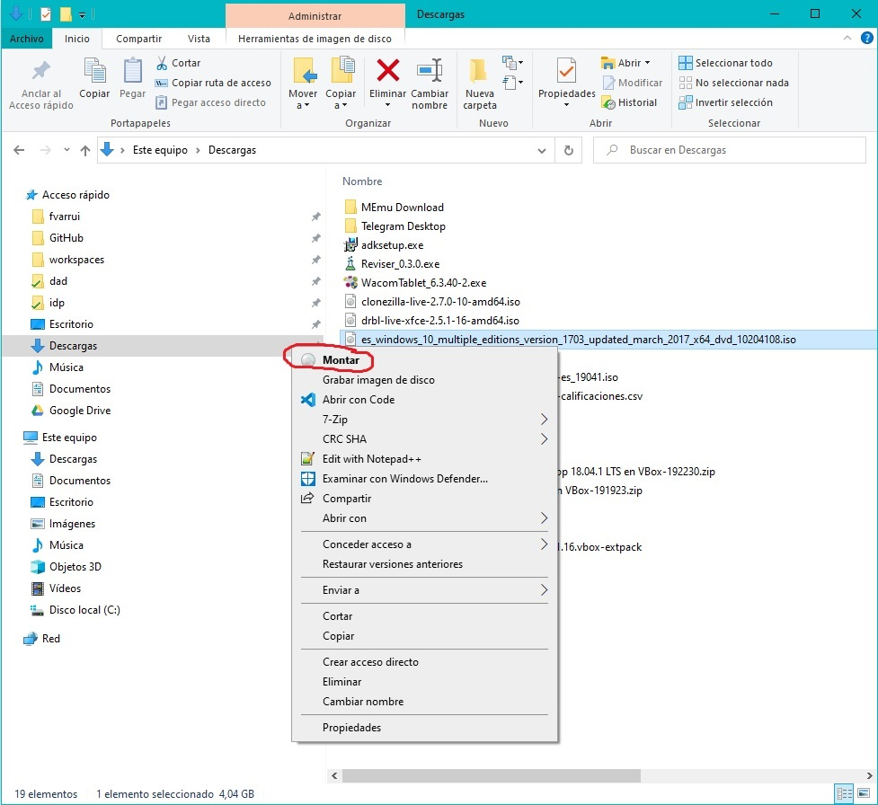

4. Abrimos la unidad montada con los ficheros de instalación de Windows 10.

4. Seleccionamos todos los ficheros y los copiamos.

   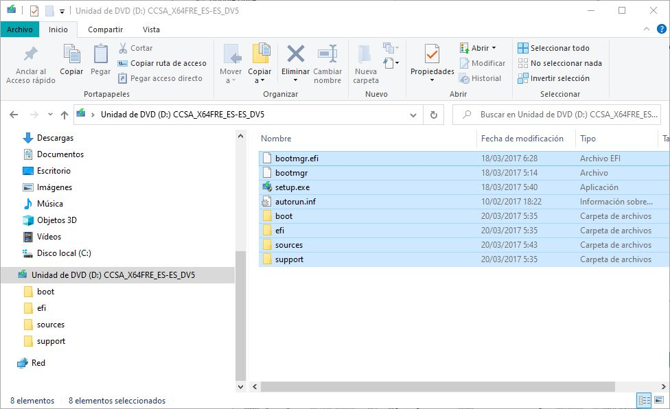

5. Creamos una carpeta nueva (de nombre **Windows10** en el **Escritorio**) y pegamos los ficheros dentro.

   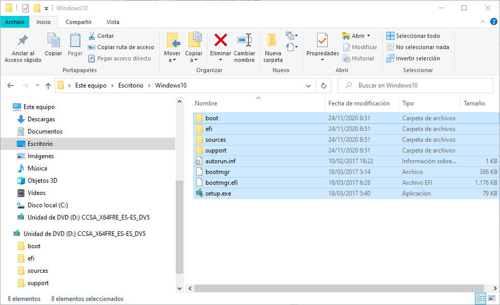

Una vez realizados todos estos pasos tendremos los ficheros de instalación de Windows 10 en nuestro equipo. 

>  :warning: Debemos confirmar que el fichero **install.wim** existe en la carpeta **sources**. Si lo que tenemos es el fichero **install.esd**, no podremos utilizarlo porque está encriptado. Por lo tanto, si no disponemos del fichero **.wim**, podemos descargar la ISO de la última versión de Windows 10 desde [Windows Insider Program](https://www.microsoft.com/en-us/software-download/windowsinsiderpreviewiso) y sacar el fichero **.wim** de dicha ISO.

#### Configurar el entorno para el proyecto del fichero de respuestas

Para prepara el entorno para crear el proyecto del fichero de respuestas seguimos los siguientes pasos:

1. Abrimos el **Administrador de Imágenes de Sistema de Windows (Windows System Image Manager)**.

2. Pulsamos sobre el menú **Archivo** y seleccionamos la opción **Seleccionar imagen de Windows...**.

   

3. Localizamos el fichero **install.wim** en la carpeta **sources** y lo abrimos.

   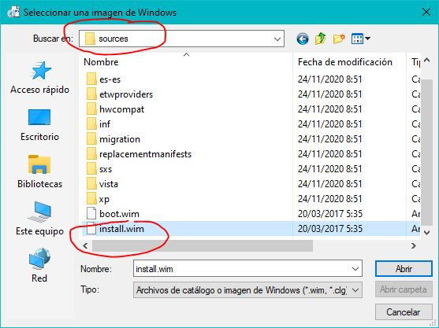

9. Seleccionamos la edición de Windows 10 que queremos utilizar (la que vamos a instalar de forma desatendida) y pulsamos **Aceptar**.

   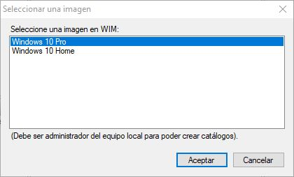

5. Si no tenemos un fichero de catálogo, nos pedirá que lo creemos, por lo que le indicamos **Sí**.

   > Este proceso puede tardar un rato, pero sólo es necesario una vez. El fichero **.clg** se almacenará en la misma ubicación que el fichero  **install.wim**, y podrás reutilizarlo para otros proyectos.

12. En **Recurso compartido de distribución** hacemos clic derecho en **Seleccione un recurso compartido de distribución** y seleccionamos la opción **Crear recurso compartido de distribución...**.

    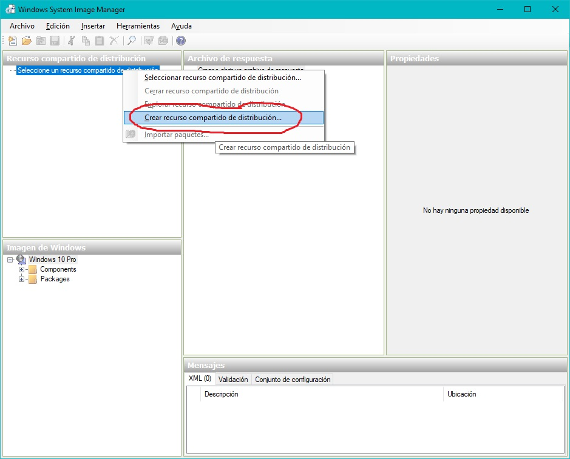

13. Pulsa sobre el botón para **Crear nueva carpeta** desde el mismo cuadro de diálogo y ponle el nombre **distribution**.

8. Pulsa el botón Click the **Open** button.

   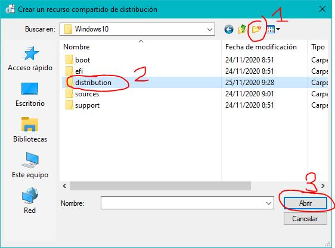

9. Abrimos el menú **Archivo** y pulsamos la opción **Seleccionar recurso compartido de distribución...**.

   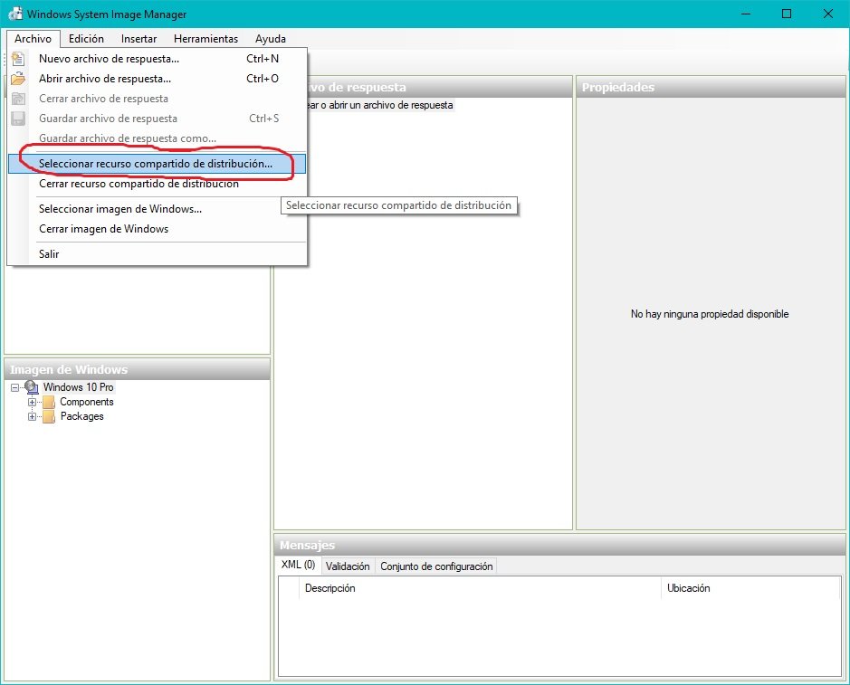

10. Localizamos la carpeta que creamos antes para los archivos distribuidos y pulsamos **Abrir**.

11. Abrimos el menú **Archivo** y seleccionamos **Nuevo archivo de respuesta...**.

    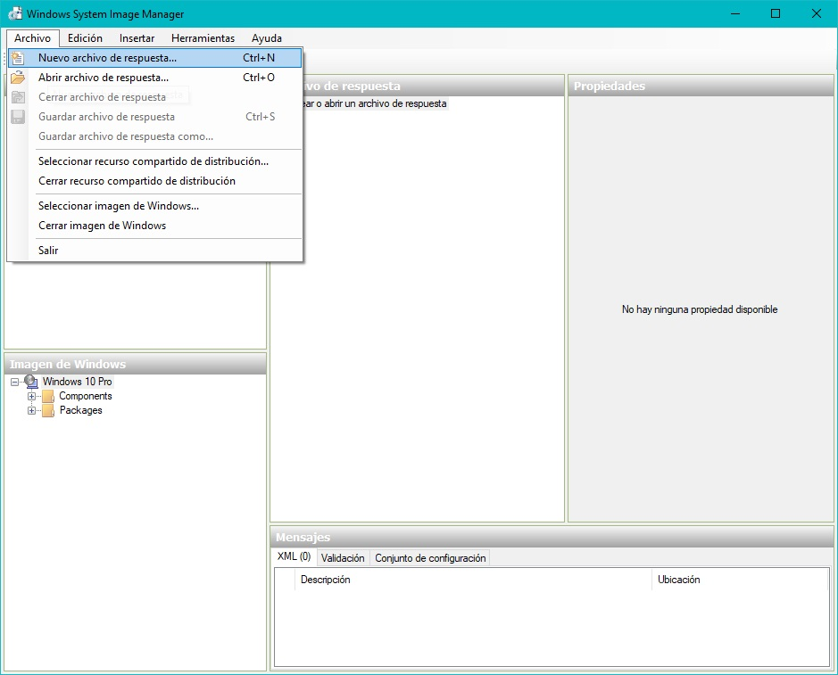

Al terminar este proceso ya tenemos el entorno preparado para configurar el fichero de respuestas.

### Configurar el archivo de respuestas para Windows 10

Un [fichero de respuestas contiene siete ciclos](https://docs.microsoft.com/en-us/windows-hardware/manufacture/desktop/windows-setup-configuration-passes), y los que debemos configurar dependen del tipo de instalación que queremos automatizar.

A continuación configureraremos el fichero de respuestas **autounattend.xml** con los requerimientos mínimos para automatizar una instalación de Windows 10 Pro usando los siguientes ciclos: **1) windowsPE, 4) specialize, y 7) oobeSystem**.

#### 1) windowsPE

Aquí configuramos la región y el idioma, configuración de la unidad, ubicación de la instalación y clave de producto.

> El nombre de los componentes empieza con **amd64_Microsoft-Windows** para la versión de 64-bit y **x86_Microsoft-Windows** para la de 32-bit de Windows 10. En este tutorial utilizaremos **amd64_Microsoft-Windows**.

##### Configurar el idioma y la región

Para configurar el idioma y la región en WSIM seguimos los siguientes pasos:

1. En la sección "Imagen de Windows" expandimos la carpeta **Components**.

2. Expandimos el componente **amd64_Microsoft-Windows-International-Core-WinPE**.

3. Clic derecho en el componente **SetupUILanguage** y seleccionamos and select the **Add Setting to Pass 1 windowsPE** option.

   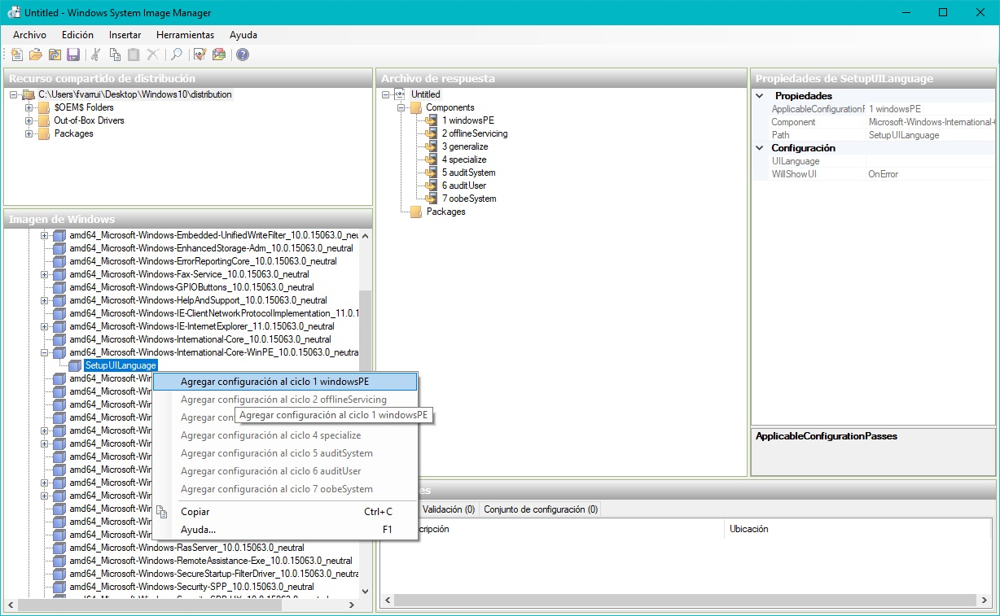

4. En la sección "Archivo de respuesta" selecciona el componente **amd64_Microsoft-Windows-International-Core-WinPE** que acabamos de añadir, y aparecerán sus propiedades en la sección a la derecha de ésta.

5. En la sección "Configuración" , definimos el teclado, la región y el idioma. Por ejemplo, como estamos en España debemos utilizar la siguiente configuración:

   - **InputLocale:** es-ES.
   - **SystemLocale:** es-ES.
   - **UILanguage:** es-ES.
   - **UserLocale:** es-ES.

   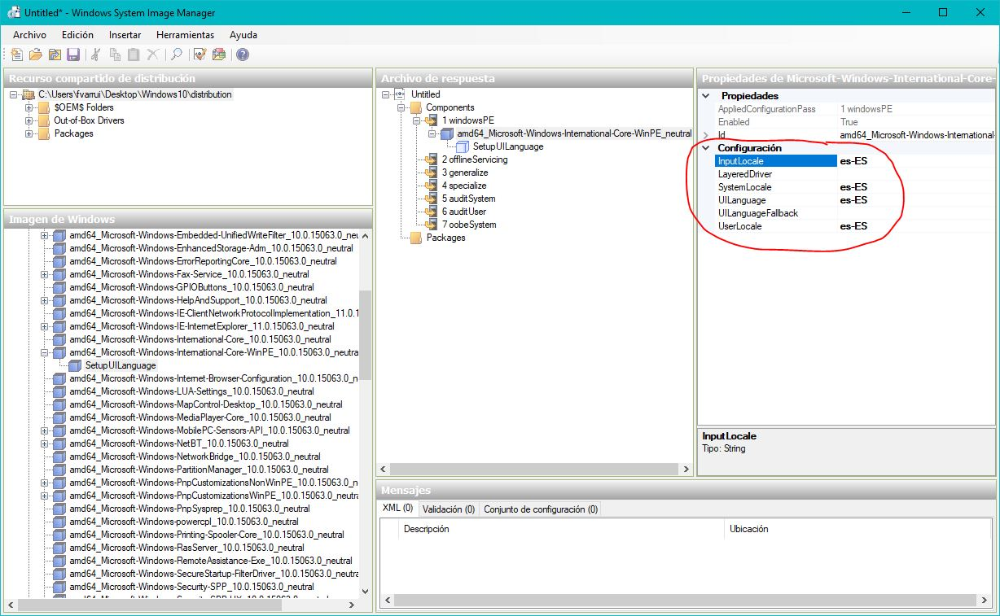

   >  Es recomendable que los usuarios fuera de los Estados Unidos configuren el idioma de respaldo en **UILanguageFallback** usando el valor **en-US**. Podemos consultar el siguiente enlace para otros códigos de idioma: [Microsoft support page](https://docs.microsoft.com/en-us/windows-hardware/manufacture/desktop/default-input-locales-for-windows-language-packs).

6. Selecciona el componente **SetupUILanguage**.

7. En la sección de propiedades del lado derecho, establece en **UILanguage** el lenguaje correcto. Por ejemplo, para poner "Español" indicamos **es-ES**.

   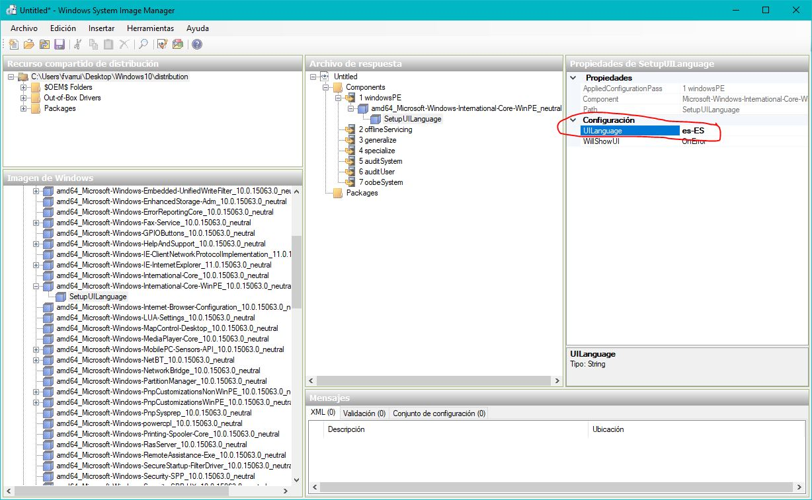

##### Configurar la instalación

En el fichero de respuestas también debemos establecer la configuración adecuada para la unidad donde se va a realizar la instalación.

Seguimos los siguientes pasos para llevarlo a cabo:

1. En la sección "Imagen de Windows" expandimos la carpeta **Components**.

2. Expandimos el componente **amd64_Microsoft-Windows-Setup**.

3. Expandimos el componente **DiskConfiguration**.

4. Clic derecho sobre el componente **Disk**, y seleccionamos la opción **Agregar configuración al ciclo 1 windowsPE**.

   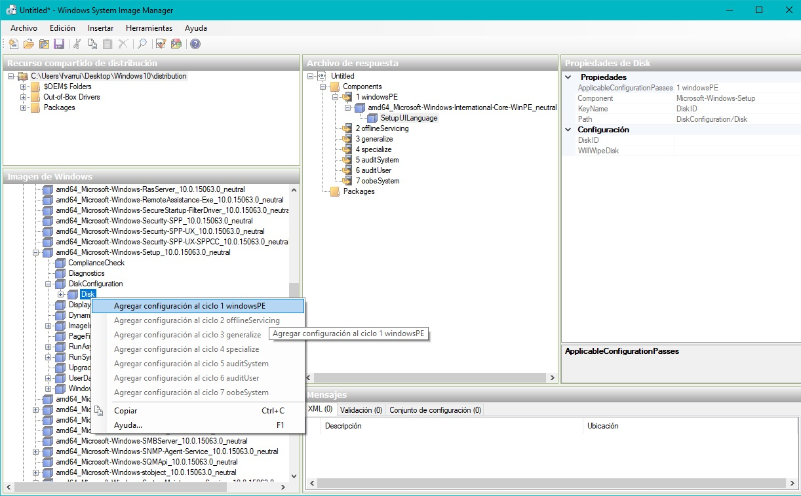

5. En la sección "Archivo de respuesta" seleccionamos el componente **DiskConfiguration**.

6. En la sección de "Propiedades", en el lado derecho, establecemos el valor de **WillShowUI** a **OnError** (si lo dejamos vacío, la instalación se detendrá durante el proceso de configuración del disco duro).

   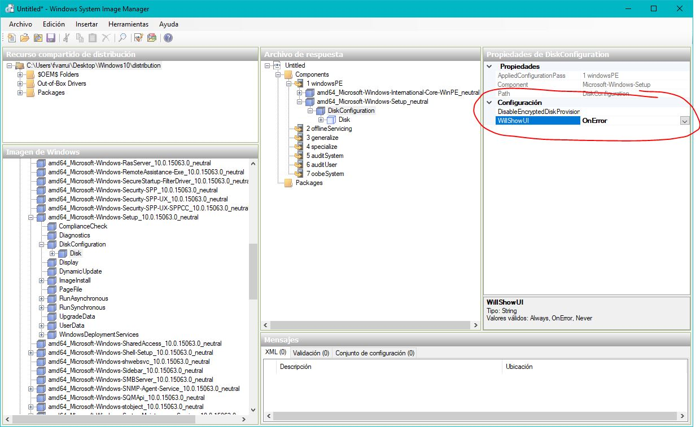

7. Selecciona el componente **Disk**.

8. En la sección de "Propiedades", en el lado derecho, estblece estos valores:

   - **DiskID:** 0
   - **WillWipeDisk:** true

   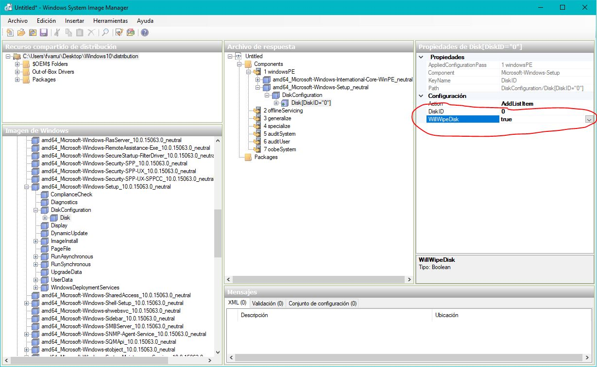

   > Al establecer **WillWipeDik** a **true** nos aseguramos de que se eliminará todo el contenido del primer disco duro (**DiskID = 0**) antes de crear las particiones.

Una vez hayamos completado los pasos para configurar **DiskConfiguration**, tendremos que indicar las particiones que queremos que se creen automáticamente durante la instalación, y esto dependerá de si vamos a utilizar **BIOS** (legacy BIOS) o UEFI.

El motivo es que si usamos un equipo basasdo en BIOS sólo necesitaremos dos particiones (System Reserved y Windows), y en los equipos basados en UEFI necesitaremos hasta cuatro particiones (WinRE, EFI, MSR, y Windows).

###### Sólo BIOS: creación y modificación de las particiones

Si el PC donde quieres instalar el Windows desatendido usa BIOS (legacy BIOS), debemos seguir estos pasos. De lo contrario, nos saltamos esta parte y pasamos a las [instrucciones para el modo UEFI](uefi_partition_setup).

1. En la sección "Archivo de respuesta", expandimos el componente **amd64_Microsoft-Windows-Setup**.

2. Expandimos el componente **DiskConfiguration**.

3. Expandimos el componente **Disk**.

4. Clic derecho sobre el componente **CreatePartitions**, y seleccionamos la opción **Insertar nuevo CreatePartition** para crear la primera partición.

   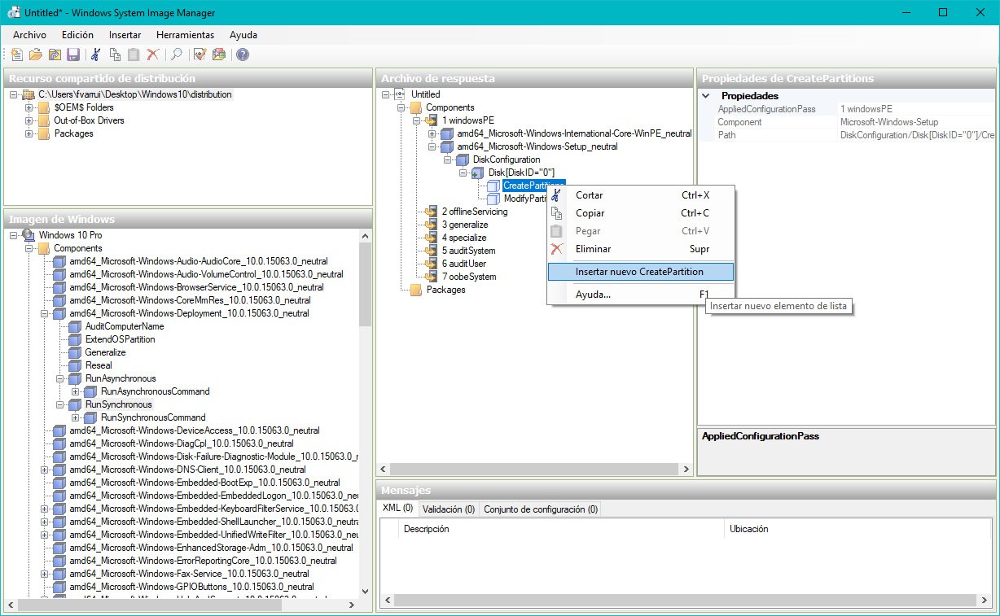

5. Clic derecho otra vez en **CreatePartitions**, y seleccionamos la opción **Insertar nuevo CreatePartition** para crear la segunda partición.

6. Seleccionamos el primer componente **CreatePartition**.

7. En la sección de "Propiedades", en el lado derecho, establecemos los siguientes valores para la nueva partición:

   - **Extend:** false.
   - **Order:** 1.
   - **Size:** 500.
   - **Type:** Primary.

   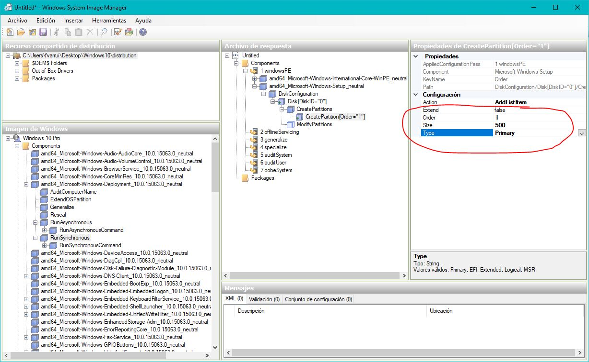

   > Estableciendo esta configuración estamos indicando al instalador que cree una partición reservada para el sistema de 500MB, necesaria para el arranque de Windows.

8. Seleccionamos el segundo componente **CreatePartition**.

9. En la sección de "Propiedades", en el lado derecho, usamos ahora los siguientes valores para crear la partición donde se instalará Windows 10:

   - **Extend:** true.
   - **Order:** 2.
   - **Type:** Primary.

   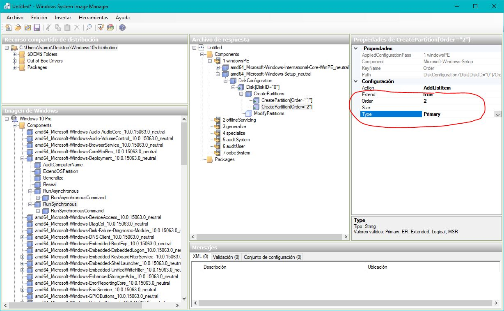

   > Con esta configuración indicamos al instalador la partición donde se instalará Windows 10. Fíjate que el valor **Size** no es necesario especificarlo, pues hemos puesto **Extend** a **true**. Esto es porque queremos que la partición de Windows ocupa todo el espacio disponible del disco.

   > Si queremos crear múltiples particiones, dejaríamos **Extend** a **false**, e indicaríamos el tamaño de la partición en MB en la propiedad **Size**. Luego, en la última partición deberíamos establecer **Extend** a **true** sin indicar el valor de **Size** para que coga todo el espacio restante del disco.

Ahora seguimos los siguientes pasos para especificar el formato y las propiedades de las particiones:

1. En la sección "Archivo de respuesta", expandimos el componente **amd64_Microsoft-Windows-Setup**.

2. Expandimos el componente **DiskConfiguration**.

3. Expandimos el componente **Disk**.

4. Clic derecho en el componente **ModifyPartition**, y seleccionamos la opción **Insertar nuevo ModifyPartition** para modificar la primera partición.

   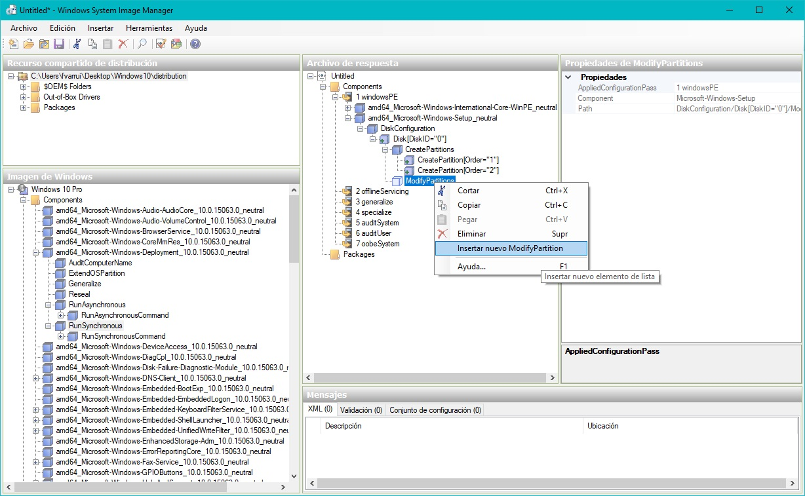

5. Clic derecho otra vez en **Insertar nuevo ModifyPartition** para modificar la segunda partición.

6. Seleccionamos el primer **ModifyPartition**.

7. En la sección de "Propiedades", en el lado derecho, establecemos la siguiente configuración para la partición reservada para el sistema:

   - **Active:** true.
   - **Format:** NTFS.
   - **Label:** System.
   - **Order:** 1.
   - **PartitionID:** 1.

   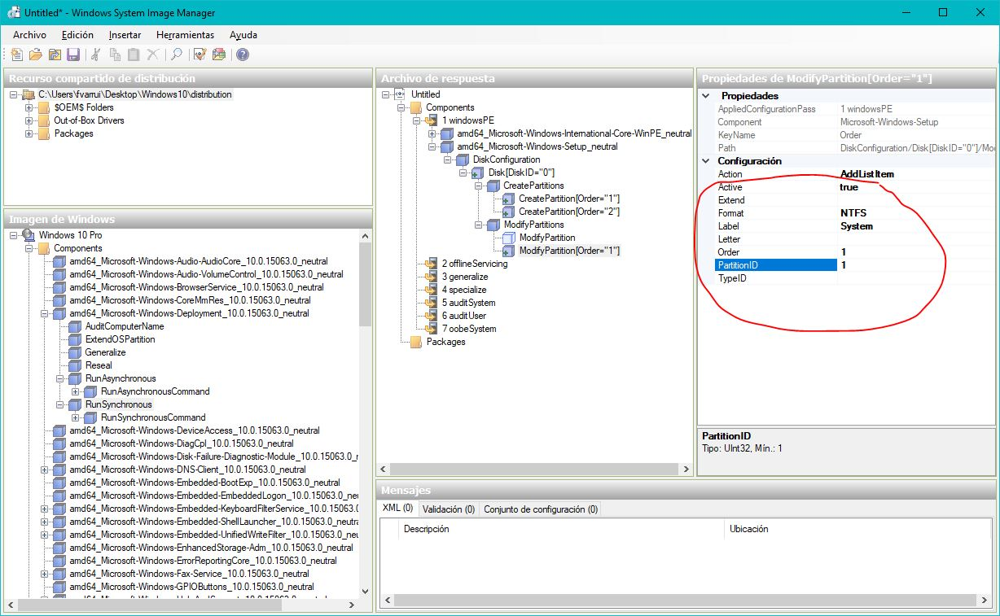

8. Seleccionamos el segundo **ModifyPartition**.

9. En la sección de "Propiedades", en el lado derecho, establecemos la siguiente configuración para la partición de instalación de Windows 10:

   - **Format:** NTFS.
   - **Label:** Windows.
   - **Letter:** C.
   - **Order:** 2.
   - **PartitionD:** 2.

   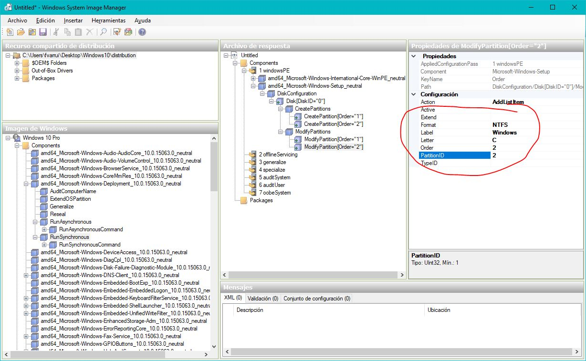

In the steps, using the **Order** and **PartitionID**, you're specifying how the Windows Setup should configure on each of the two raw partitions we created earlier.

You can learn more about the partition layout required for a BIOS system in this [Microsoft support page](https://docs.microsoft.com/en-us/windows-hardware/manufacture/desktop/configure-biosmbr-based-hard-drive-partitions).

As part of this setup, the last task is to indicate the setup where to install Windows 10.

To select the drive to install Windows 10 automatically, use these steps:

1. Under the "Windows Image" section, expand the **Components** folders.

2. Expand the **amd64_Microsoft-Windows-Setup** component.

3. Expand the **ImageInstall** component.

4. Expand the **OSImage**.

5. Right-click the **InstalTo** component, and select the **Add Setting to Pass 1 windowsPE** option.

   [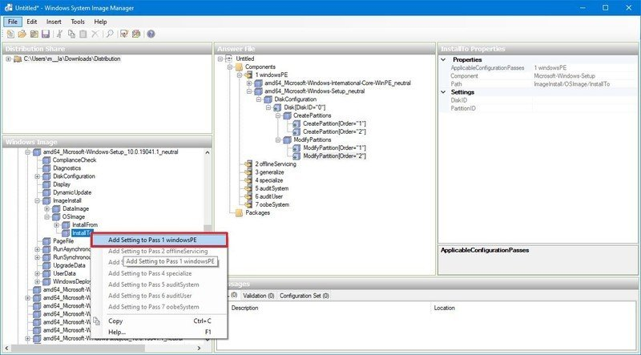](https://www.windowscentral.com/sites/wpcentral.com/files/styles/xlarge/public/field/image/2020/07/installto-pass1-windowspe_bios.jpg)*Source: Windows Central*

6. Under the "Answer File" section, on the right side, select the **InstallTo** component.

7. Under the "Settings" section, on the right side, use these values:

   - **DiskID:** 0.
   - **PartitionID:** 2.

   [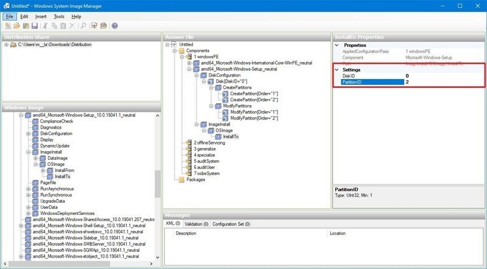](https://www.windowscentral.com/sites/wpcentral.com/files/styles/xlarge/public/field/image/2020/07/bios-installto-settings_windows10.jpg)*Source: Windows Central*

The above settings tell the setup to install Windows 10 automatically on the first drive inside the second partition.

Once you complete the steps, continue with the [Defining the product key](https://www.windowscentral.com/how-create-unattended-media-do-automated-installation-windows-10#definning_productkey) instructions.

###### Sólo UEFI: creación y modificación de particiones

If you have a computer using UEFI, continue with these steps. Otherwise, skip this part, and [follow the BIOS instructions outlined above](https://www.windowscentral.com/how-create-unattended-media-do-automated-installation-windows-10#bios_partition_setup).

1. Under the "Answer File" section, expand the **amd64_Microsoft-Windows-Setup** component.

2. Expand the **DiskConfiguration** component.

3. Expand the **Disk** component.

4. Right-click the **CreatePartitions** component, and select the **Insert New CreatePartition** option to create the first partition.

   [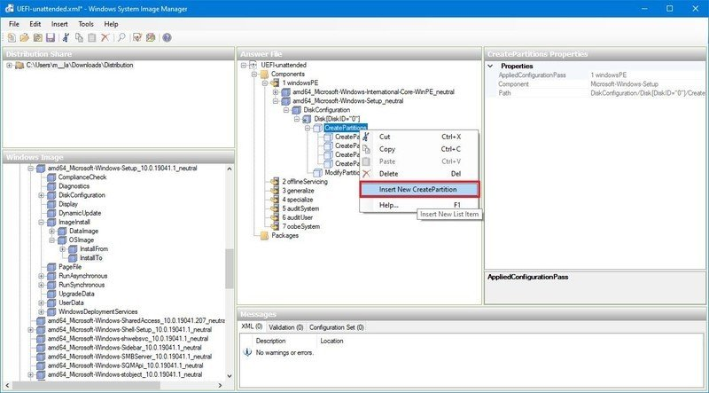](https://www.windowscentral.com/sites/wpcentral.com/files/styles/xlarge/public/field/image/2020/07/uefi-insert-new-createpartition.jpg)*Source: Windows Central*

5. Right-click **CreatePartitions** again, and select the **Insert New CreatePartition** option to create a second partition.

6. Right-click **CreatePartitions** again, and select the **Insert New CreatePartition** option to create a third partition.

7. Right-click **CreatePartitions** again, and select the **Insert New CreatePartition** option to create a fourth partition.

8. Select the first **CreatePartition**.

9. Under the "Settings" section, on the right side, use these values to create the Windows Recovery (WinRE) partition:

   - **Extend:** false.
   - **Order:** 1.
   - **Size:** 500.
   - **Type:** Primary.

   [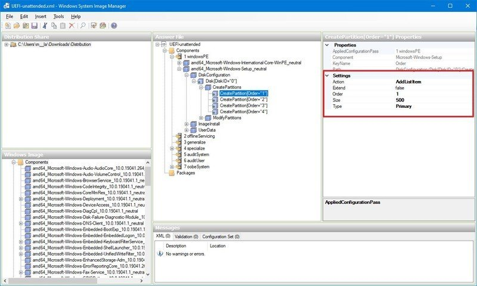](https://www.windowscentral.com/sites/wpcentral.com/files/styles/xlarge/public/field/image/2020/07/uefi-create-partition-one.jpg)*Source: Windows Central*

10. Select the second **CreatePartition**.

11. On the right side, under "Settings," use these values to create an EFI partition:

    - **Extend:** false.
    - **Order:** 2.
    - **Size:** 100.
    - **Type:** EFI.

    [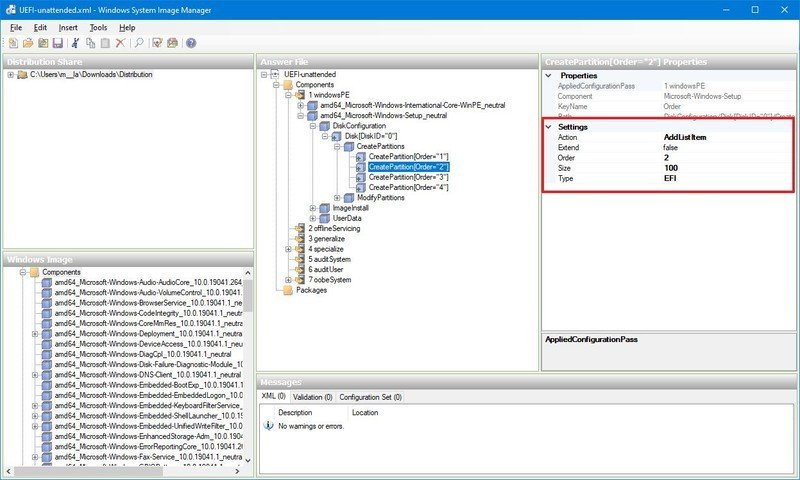](https://www.windowscentral.com/sites/wpcentral.com/files/styles/xlarge/public/field/image/2020/07/uefi-create-partition-two.jpg)*Source: Windows Central*

12. Select the third **CreatePartition**.

13. On the right side, under "Settings," use these values to create a Microsoft reserved partition (MSR) partition:

    - **Extend:** false.
    - **Order:** 3.
    - **Size:** 16.
    - **Type:** MSR.

    [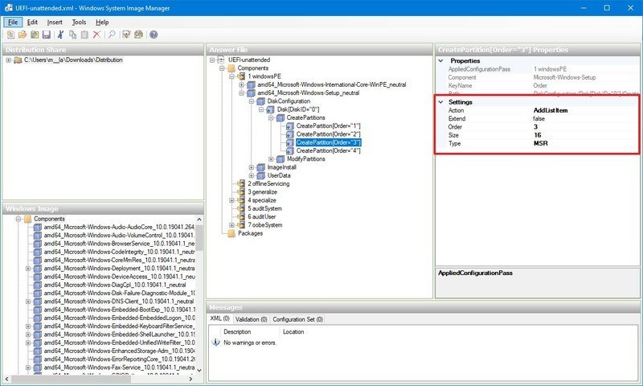](https://www.windowscentral.com/sites/wpcentral.com/files/styles/xlarge/public/field/image/2020/07/uefi-create-partition-three.jpg)*Source: Windows Central*

14. Select the third **CreatePartition**.

15. On the right side, under "Settings," use these values to create the Windows partition:

    - **Extend:** true.
    - **Order:** 4.
    - **Type:** Primary.

    [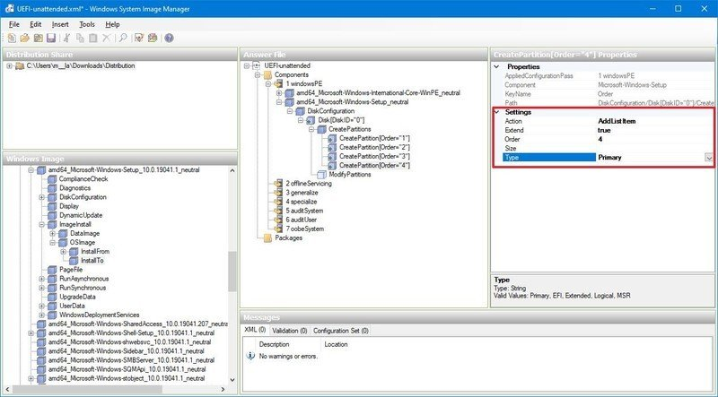](https://www.windowscentral.com/sites/wpcentral.com/files/styles/xlarge/public/field/image/2020/07/uefi-create-partition-four-autounattend-xml.jpg)*Source: Windows Central*

Using the above steps, outlined the steps to carved the partitions. The next steps specify the required file format and partition properties.

To specify the format settings in the answer file, use these steps:

1. Under the "Answer File" section, expand the **amd64_Microsoft-Windows-Setup** component.

2. Expand the **DiskConfiguration** component.

3. Expand the **Disk** component.

4. Right-click the **ModifyPartition** component, and select the **Insert ModifyPartition** option to create the first partition.

   [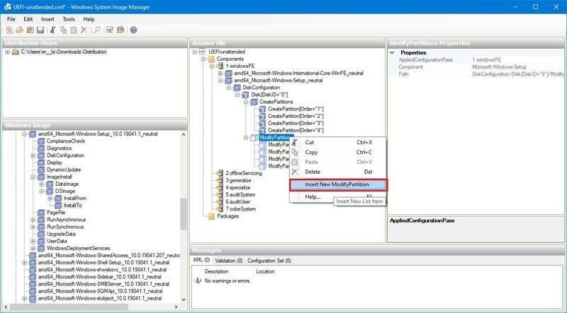](https://www.windowscentral.com/sites/wpcentral.com/files/styles/xlarge/public/field/image/2020/07/insert-new-modifypartition_uefi.jpg)*Source: Windows Central*

5. Right-click **ModifyPartition** again, and select the **Insert ModifyPartition** option to modify the second partition.

6. Right-click **ModifyPartition** again, and select the **Insert ModifyPartition** option to modify the third partition.

7. Right-click **ModifyPartition** again, and select the **Insert ModifyPartition** option to modify the fourth partition.

8. Select the first **ModifyPartition**.

9. On the right side, under "Settings," use these values to configure the Windows Recovery (WinRE) partition:

   - **Format:** NTFS.
   - **Label:** WinRE.
   - **Order:** 1.
   - **PartitionID:** 1.
   - **TypeID:** DE94BBA4-06D1-4D40-A16A-BFD50179D6AC.

   [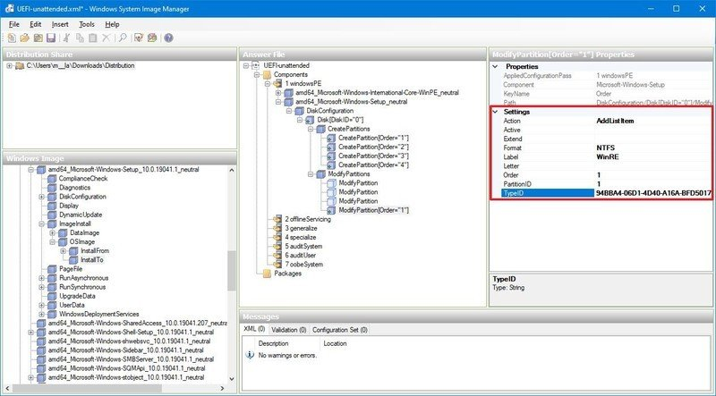](https://www.windowscentral.com/sites/wpcentral.com/files/styles/xlarge/public/field/image/2020/07/uefi-format-partition-one.jpg)*Source: Windows Central*

10. Select the second **ModifyPartition**.

11. On the right side, under "Settings," use these values to configure an EFI partition:

    - **Format:** FAT32.
    - **Label:** System.
    - **Order:** 2.
    - **PartitionID:** 2.

    [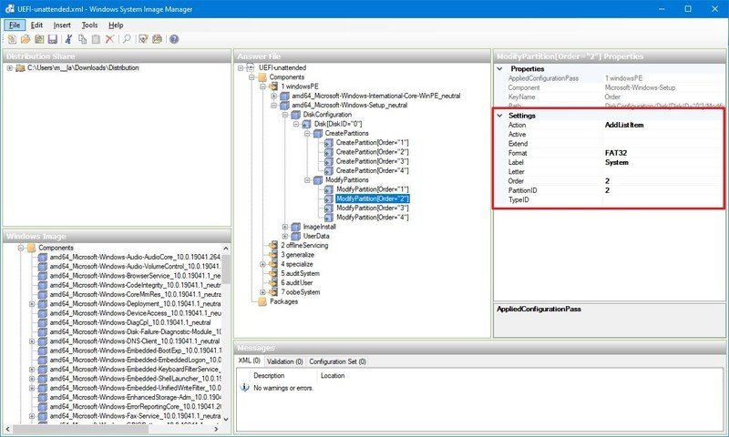](https://www.windowscentral.com/sites/wpcentral.com/files/styles/xlarge/public/field/image/2020/07/uefi-format-partition-two.jpg)*Source: Windows Central*

12. Select the third **ModifyPartition**.

13. On the right side, under "Settings," use only these two values to configure a Microsoft reserved partition (MSR) partition:

    - **Order:** 3.
    - **PartitionID:** 3.

    [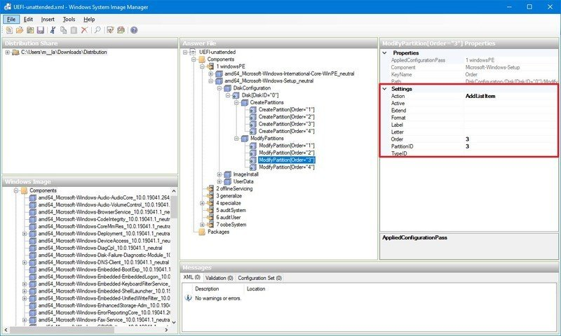](https://www.windowscentral.com/sites/wpcentral.com/files/styles/xlarge/public/field/image/2020/07/uefi-format-partition-three.jpg)*Source: Windows Central*

14. Select the third **ModifyPartition**.

15. On the right side, under "Settings," use these values to configure a partition to install Windows 10:

    - **Format:** NTFS.
    - **Label:** Windows.
    - **Letter:** C.
    - **Order:** 4.
    - **PartitionID:** 4.

    *Source: Windows Central*

In the steps, using the **Order** and **PartitionID**, you're specifying how the setup should configure each of the four raw partitions you have created earlier.

You can learn more about the partition layout required for a UEFI system in this [Microsoft support page](https://docs.microsoft.com/en-us/windows-hardware/manufacture/desktop/configure-uefigpt-based-hard-drive-partitions).

As part of this part of the setup, the last task is to indicate the setup where to install Windows 10.

To select the drive to install Windows 10 automatically, use these steps:

1. Under "Windows Image," expand the **Components** folders.

2. Expand the **amd64_Microsoft-Windows-Setup** component.

3. Expand the **ImageInstall** component.

4. Expand the **OSImage** component.

5. Right-click the **InstalTo** component, and select the **Add Setting to Pass 1 windowsPE** option.

6. Under the "Answer File" section, on the right side, select the **InstallTo** component.

7. Under the "Settings" section, on the right side, use these values:

   - **DiskID:** 0.
   - **PartitionID:** 4.

   [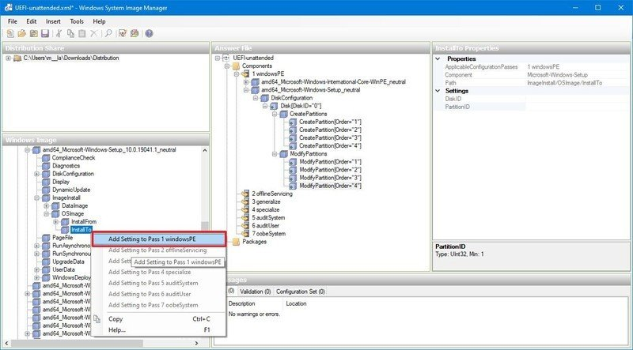](https://www.windowscentral.com/sites/wpcentral.com/files/styles/xlarge/public/field/image/2020/07/uefi-instalto-settings-automunattend-xml.jpg)*Source: Windows Central*

The above settings will indicate for the setup to install Windows 10 on the first drive inside the fourth partition.

Once you complete the steps, continue with the [Defining the product key](https://www.windowscentral.com/how-create-unattended-media-do-automated-installation-windows-10#definning_productkey) instructions below.

##### Defining the product key

In the first pass, you can also specify the product key for Windows 10. If you're creating an answer file that you'll use in multiple devices, you should be using a volume or generic product key.

To specify a product key, use these steps:

1. Under the "Windows Image" component, expand the **Components** folders.

2. Expand the **amd64_Microsoft-Windows-Setup** component.

3. Expand the **UserData** component.

4. Right-click the **ProductKey** component and select the **Add Setting to Pass 1 windowsPE** option.

   [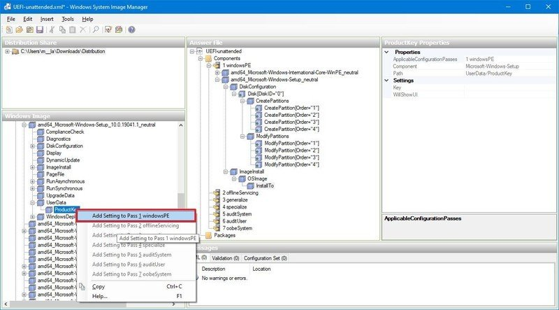](https://www.windowscentral.com/sites/wpcentral.com/files/styles/xlarge/public/field/image/2020/07/productkey-windowspe.jpg)*Source: Windows Central*

5. Under the "Answer File" section, on the right side, select the **UserData** component.

6. Under the "Settings" section, on the right side, use the following settings:

   - **AcceptEula:** true.
   - **Organization:** WC.

   [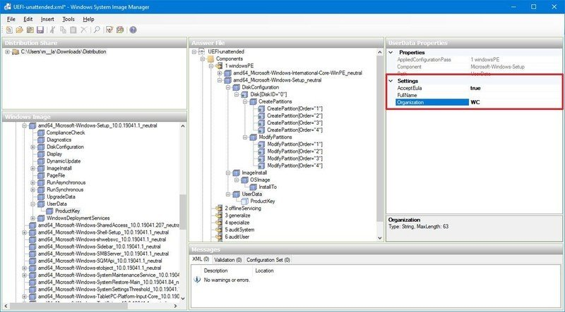](https://www.windowscentral.com/sites/wpcentral.com/files/styles/xlarge/public/field/image/2020/07/accepteula-autounattend-answer-file-windows10.jpg)*Source: Windows Central*

   In the above settings, you can use any name for the **Organization** value. For example, home users could "Family" as the organization name.

7. Expand the **UserData** component.

8. Select the **ProductKey** component.

9. Under the "Settings" section, make sure to update the **Key** value using the product key for the edition of Windows 10 you intend to install.

   [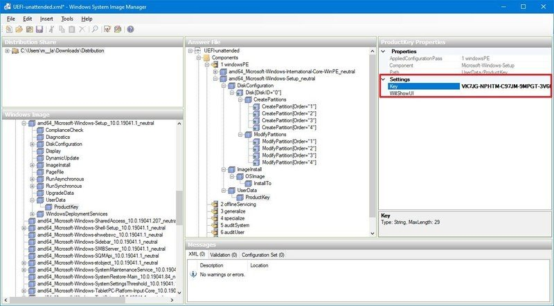](https://www.windowscentral.com/sites/wpcentral.com/files/styles/xlarge/public/field/image/2020/07/windows-10-productkey-answer-file_2020.jpg)*Source: Windows Central*

You can also use a generic product key to create an answer file:

- **Windows 10 Pro:** VK7JG-NPHTM-C97JM-9MPGT-3V66T.
- **Windows 10 Home:** YTMG3-N6DKC-DKB77-7M9GH-8HVX7.
- **Windows 10 Enterprise:** NPPR9-FWDCX-D2C8J-H872K-2YT43.

You can always check this [Microsoft support website](https://docs.microsoft.com/en-us/windows-server/get-started/kmsclientkeys) to find the appropriate generic key for your installation.

#### Pass 4 specialize

If you want to configure additional settings, such as model, manufacturer, computer name, ownership name, timezone, and more during the installation, while in the Windows System Image Manager, use these steps:

1. Under the "Windows Image" section, expand the **Components** folders.

2. Expand the **amd64_Microsoft-Shell-Setup** component.

3. Right-click the **OEMInformation** component and select the **Add Setting to Pass 4 specialize** option.

   *Source: Windows Central*

4. Under the "Answer File" section, on the right-side, select the **amd64_Microsoft-Shell-Setup** component.

5. Under the "Settings" section, on the right side, use the following values (specifying your custom information):

   - **ComputerName:** Workstation.

   - **CopyProfile:** true.

   - **RegisteredOrganization:** Windows Central.

   - **RegisteredOwner:** WC.

   - **TimeZone:** Eastern Standard Time.

     *Source: Windows Central*

   If you don't configure the **TimeZone** setting, Windows 10 will set the zone based on the language you're installing. You can check the [Microsoft support website](https://support.microsoft.com/en-us/help/973627/microsoft-time-zone-index-values) to find out the exact name for your time zone.

6. Expand the **amd64_Microsoft-Shell-Setup** component.

7. Select the **OEMInformation** component.

8. (Optional) Under the "Settings" section, on the right side, specify some computer specific properties:

   - **Manufacturer:** Dell.
   - **Model:** XPS.

   *Source: Windows Central*

Once you complete the steps, during the installation, the setup will read the autounattend.xml file and configure the settings you specified.

#### Pass 7 oobeSystem

Using an answer file, you can also automate the configuration of the out-of-box experience (OOBE), including additional language settings, accept the licensing agreement, create a user account, and more.

To configure the out-of-box experience, while in the Windows System Image Manager, use these steps:

1. Under "Windows Image," expand the **Components** folders.

2. Right-click the **amd64_Microsoft-Windows-International-Core** component, and select the **Add Setting to Pass 7 oobeSystem** option.

   *Source: Windows Central*

3. Under the "Windows Image" section, expand the **amd64_Microsoft-Shell-Setup** component.

4. Right-click the **OOBE** component, and select the **Add Setting to Pass 7 oobeSystem** option.

   *Source: Windows Central*

5. Expand the **UserAccounts** component.

6. Expand the **LocalAccounts** component.

7. Right-click the **LocalAccounts** component, and select the **Add Setting to Pass 7 oobeSystem** option.

   *Source: Windows Central*

8. Under the "Answer File" section, select the **amd64_Microsoft-Windows-International-Core** component.

9. Under the "Settings" section, on the right-side, specify the language settings:

   - **InputLocale:** en-US.
   - **SystemLocale:** en-US.
   - **UILanguage:** en-US.
   - **UserLocale:** en-US.

   *Source: Windows Central*

   Only users outside the United States should configure **ULLanguageFallback** using the **en-US** value as the fallback language.

   To identify the correct input profile name, you can check out this [Microsoft support page](https://docs.microsoft.com/en-gb/windows-hardware/manufacture/desktop/default-input-locales-for-windows-language-packs).

10. Under the "Answer File" section, expand the **amd64_Microsoft-Shell-Setup** component.

11. Select the **OOBE** component.

12. Under the "Settings" section, on the right size, use the following values:

- **HideEULAPage:** true.*

- **HideOEMRegistrationScreen:** true.

- **HideOnlineAccountScreens:** true.

- **HideWirelessSetupinOOBE:** true.

- **ProtectYourPC:** 1.

  *Source: Windows Central*

  While most settings are self-explanatory, you'll notice that the **ProtectYourPC** setting is also configured to define how the [express settings](https://docs.microsoft.com/en-us/windows-hardware/customize/desktop/unattend/microsoft-windows-shell-setup-oobe-protectyourpc) should be handled. Using the value of **1**, you're telling the setup to enable the express settings using the default preferences.

  1. Expand the **UserAccounts** component.
  2. Right-click the **LocalAccounts** component and select the **Insert New LocalAccount** option.
  3. Under the "Settings" section, on the right side, use the following configuration to create a primary local account:

  - **Description:** My primary local account.
  - **DisplayName:** admin.
  - **Group:** Administrators.
  - **Name:** John.

  *Source: Windows Central*

  Using the above settings, you'll be creating an account called "admin" for user "John," and we're adding the account to the "Administrators" group that gives the user unrestricted access to the device. Of course, you can always define your custom preferences, including for "Description," "DisplayName," "Group," and "Name."

  1. Expand the **LocalAccount** component.
  2. Select the **Password** component.
  3. Under the "Settings" section, on the right-side, type a password in the **Value** field.

  *Source: Windows Central*

While you'll see the password in plain text, after saving the autounattend.xml file, the value will be encrypted.

### How to save Windows 10 answer file project

Once you complete setting up all the configurations to install Windows 10 automatically, you need to remove all the unmodified components, validate the answer file, and save changes as an autounattend.xml file.

#### Remove unmodified components

To remove unnecessary components, use these steps:

1. Under the "Answer File" section, expand all the components you added from the "Windows Image" section.

2. Select the component that you didn't configure. (These are those with light purple color.)

3. Right-click the components, and select the **Delete** option.

   *Source: Windows Central*

4. Repeat **steps No. 2** and **3** until you remove all the components that you didn't modify.

After you complete the steps, you need to validate the answer file.

#### Validating answer files

To validate the answer file, use these steps:

1. Click the **Tools** menu.

2. Select the **Validate** option.

3. Under the "Messages" section, at the bottom, check the **Validation** tab. If you don't see any warnings, the file is good to go.

   *Source: Windows Central*

Once you complete the steps, it's time to save the file and imported to the installation media.

#### Saving the answer file

To save the answer file, use these steps:

1. Click the **File** menu.

2. Select the **Save Answer File As** option.

3. Navigate to the folder you want to save the file.

4. Under "File name," use the **autounattend.xml** file name.

   *Source: Windows Central*

5. Click the **Save** button.

If you're configuring multiple answer files, it'll be best to save the file on a different folder with a descriptive name.

#### Import answer file to USB media

To include an autounattend.xml file on a Windows 10 bootable media, use these steps:

1. Open **File Explorer**.

2. Navigate to the **autounattend.xml** file location.

3. Right-click the file, and select the **Copy** option.

   *Source: Windows Central*

4. Open the USB media with the Windows 10 installation files.

5. In the root of the drive, right-click the **Paste** to copy the **autounattend.xml** to the Windows 10 installation media.

   *Source: Windows Central*

   **Quick tip:** When placing the "autounattend.xml" file on the installation media, make sure you're using a bootable media that only includes one architecture (in this case, Windows 10 64-bit). If you created an installation media for both 32-bit and 64-bit, the process would pause at the beginning until you select the architecture to install.

In the case that you don't have a Windows 10 USB installation media, you can create one using the [Media Creation Tool](https://www.windowscentral.com/e?link=https%3A%2F%2Fclick.linksynergy.com%2Fdeeplink%3Fid%3DkXQk6%2AivFEQ%26mid%3D24542%26u1%3DUUwpUdUnU56409YYwYwm5xwe2lfojxg6zdfmnqw4ylsnfqxgltpojtq%26murl%3Dhttps%3A%2F%2Fwww.microsoft.com%2Fen-us%2Fsoftware-download%2Fwindows10&token=0Qz-nzAw) or using a [third-party tool, such as Rufus](https://www.windowscentral.com/how-create-windows-10-usb-bootable-media-uefi-support).

### How to install Windows 10 using answer file

Once you have the USB bootable media with the answer file incorporated, you can perform an unattended installation of Windows 10 with these steps:

**Warning:** This process will delete everything on your computer and install Windows 10 without any prompts. Make sure to connect the USB flash drive to the correct device. Otherwise, you may end up wiping out the incorrect device.

1. Turn off the computer you want to install Windows 10.
2. Connect the USB flash bootable media with the **autounattend.xml** file.
3. Power on the computer and then Windows 10 should install automatically.

If the Windows Setup doesn't start, it's likely because you don't have the device configured to boot from the USB installation media. If this is the case, you'll need to access the BIOS or UEFI firmware on your motherboard to change the boot order.

This process typically requires hitting one of the function keys (F1, F2, F3, F10, or F12), the ESC, or Delete key as soon as you start your device. However, these settings will be different per manufacturer, and even per device model. Make sure to check your computer manufacturer's support website for more specific instructions.

After getting access to the firmware interface, find the **Boot** settings and change the boot order to start with the USB drive that includes the installation files, and save the settings (usually using the **F10** key).

*Source: Windows Central*

If your computer is based on UEFI, then the steps to change the boot order will be different.

On a Windows 10 device using UEFI, you'll need to access to **Settings** > **Update & Security** > **Recovery**, and under "Advanced Startup," click the **Restart now** button.

Then click on **Troubleshoot** > **Advanced options** > **UEFI Firmware Settings**, and click the **Restart** button.

Once you're in the UEFI firmware interface, find the **Boot** settings and change the boot order to start with the USB drive that includes the installation files, and then save the settings.

*Source: Windows Central*

If the drive doesn't have an OS already installed, check your manufacturer support website for details to access the UEFI firmware.

### How to troubleshoot Windows 10 answer file

Although an answer file can make the process of installing Windows 10 easier, one small mistake can halt the setup and cause unwanted errors.

When validating the answer file, if you come across any problems, you should always re-check the settings for each component you selected and remove any additional element that was not modified.

If you made a mistake configuring a property value for a component, don't empty the field, instead right-click the property and select the **Revert Change** option.

At the time to begin the Windows 10 installation, disconnect the computer from the network, because sometimes you may come across problems while the setup is trying to download updates. You can always reconnect to the network after the installation.

An answer file explicitly crafted for a computer using a legacy BIOS will not work on a UEFI-based device. Always make sure to use the correct settings for the hardware you're trying to automate the installation process.

In the rare case that the answer file you created using Windows System Image Manager isn't working, then you should open the "autounattend.xml" file with any text editor and correct any error manually.

Anyone can use this automation process, but this method has been designed for organizations. This means that you won't find an option to perform an installation using a Microsoft account. However, you can always create an installation with a Windows 10 local account and then link it to your Microsoft account. You can perform this task from **Settings** > **Accounts** > **Your info**, and clicking the **Sign in with your Microsoft account instead** link.

You can check out this [Microsoft support website](https://docs.microsoft.com/en-us/windows-hardware/customize/desktop/unattend/components-b-unattend) to learn more about each setting, which you can configure to create an answer file to perform an automated installation of Windows 10.

## Referencias

